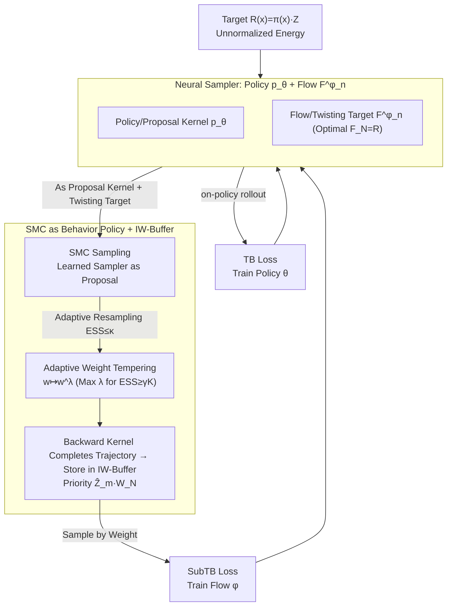

# Reinforced Sequential Monte Carlo for Amortised Sampling

**Conference**: ICML 2026  
**arXiv**: [2510.11711](https://arxiv.org/abs/2510.11711)  
**Code**: https://github.com/hyeok9855/ReinforcedSMC (Available)  
**Area**: Reinforcement Learning / Probabilistic Inference / Diffusion Models / Neural Samplers  
**Keywords**: Amortised Sampling, SMC, MaxEnt RL, GFlowNet, Importance Weighted Replay  

## TL;DR
This work unifies hierarchical variational inference (HVI), MaxEnt RL, and Sequential Monte Carlo (SMC)/Annealed Importance Sampling (AIS) into a single framework. The learned policy and flow function serve simultaneously as the proposal kernel and twisting target for SMC. Conversely, near-target samples produced by SMC are used as an off-policy behavior policy to train the neural sampler. Coupled with adaptive weight tempering and importance-weighted experience replay, this approach improves both mode coverage and training stability on multi-modal targets and the alanine dipeptide Boltzmann distribution.

## Background & Motivation

**Background**: Sampling from a target distribution defined by an unnormalized energy function $R(x)=\pi(x)\cdot Z$ is fundamental to Bayesian inference and molecular conformation sampling. One mainstream approach is classical Monte Carlo—MCMC (HMC, Langevin), Adaptive Importance Sampling, and SMC—which possess "anytime" properties: more particles lead to a closer approximation of the true distribution. Another approach uses neural networks (autoregressive models, diffusion models) for "amortised sampling," where the energy function is fitted into the network during training, and samples are generated via a single forward pass during inference.

**Limitations of Prior Work**: Amortised samplers are often trained with a reverse-KL objective, which exhibits a severe mode-seeking tendency and leads to mode collapse on multi-modal targets. If trained on on-policy data, they may never learn modes they have not encountered. While classical SMC can "unbiasedly" approach the target, it is slow during inference, and the particle degeneracy problem (where a few particles consume most of the weight) causes the effective sample size $\widehat{\mathrm{ESS}}$ to decay rapidly. These two categories of methods have complementary strengths and weaknesses but lack a unified interface to leverage each other.

**Key Challenge**: Amortised samplers cannot learn unobserved modes but can provide good proposals for known regions; SMC can explore new regions but requires high-quality proposal kernels to be efficient. Simply stacking them (training a sampler then refining with MCMC) does not form a training loop—learning still occurs only on the sampler's own trajectories.

**Goal**: (i) Mathematically unify HVI, MaxEnt RL, and SMC/AIS under a single set of notations, where the neural sampler's policy $\overrightarrow p_\theta$ and flow function $F^\phi_n$ naturally correspond to the SMC proposal kernel and intermediate targets; (ii) design a complementary cycle where SMC uses the learned sampler for proposals, and SMC's weighted samples serve as an off-policy behavior policy to train the sampler; (iii) address the variance and stability issues of joint training.

**Key Insight**: The trajectory balance (TB) or subtrajectory balance (SubTB) loss in GFlowNets allows training from any full-support behavior policy without requiring importance correction, providing the critical interface to use "SMC output as training data."

**Core Idea**: By writing out the TB/SubTB loss, it becomes evident that it is exactly equal to the second moment of the AIS log-weights. At optimality, the policy equals the proposal kernel and the flow equals the intermediate target, satisfying detailed balance. This transforms "training the sampler" and "performing SMC" into two sides of the same coin.

## Method

### Overall Architecture
Sampling from target $\pi(x)=R(x)/Z$ is formulated as an $N$-step hierarchical model $\overrightarrow p_\theta(x_{0:N})=\overrightarrow p_0(x_0)\prod_{n}\overrightarrow p_\theta(x_{n+1}\mid x_n)$ with a fixed backward kernel $\overleftarrow p(x_n\mid x_{n+1})$. This is treated as a deterministic MDP: state $(n,x_n)$, action as the next variable value, reward $r((n,x_n),x_{n+1})=\log \overleftarrow p(x_n\mid x_{n+1})$, and terminal reward $\log R(x)$. The MaxEnt objective minimizes $\mathrm{KL}(\overrightarrow p_\theta(x_{0:N})\|\pi(x)\overleftarrow p(x_{0:N-1}\mid x))$.

The training loop (Fig. 1) consists of four components and two data streams:

1.  **Policy/Proposal** $\overrightarrow p_\theta$ and **Flow/Twisting Target** $F^\phi_n$, where $F^\phi_N(x)=R(x)$ at optimality.
2.  **On-policy stream**: Trajectories are rolled out directly from $\overrightarrow p_\theta$ to train the policy via TB.
3.  **Off-policy stream**: SMC is run using the current $\overrightarrow p_\theta$ and $F^\phi_n$ to obtain $(x_N, w_N)$, followed by backward kernel sampling $\overleftarrow p(\cdot\mid x_N)$ to reconstruct full trajectories for the IW-Buffer. The flow is then trained via SubTB.
4.  **Importance Weighted Experience Replay**: Samples from multiple SMC batches are combined and weighted by the product of batch-level normalization constant estimates $\widehat Z_m$ and within-batch self-normalized weights $W^{m,k}_N$.

### Key Designs

**1. TB/SubTB Loss = Second Moment of AIS Log-weights: Unifying Sampler Training and SMC**

The core finding is that the trajectory balance loss $\mathcal L^{\theta,\phi}_{\mathrm{TB}}(x_{0:N})=\big[\log\frac{F^\phi_0(x_0)\prod_n \overrightarrow p_\theta(x_{n+1}\mid x_n)}{R(x_N)\prod_n \overleftarrow p(x_n\mid x_{n+1})}\big]^2$ has an inner term equal to the AIS log-importance weight minus $\log Z_\theta$. Subtrajectory balance applies this to any segment $[m,n]$. When SubTB reaches zero on length-1 segments, detailed balance $\pi_n(x_n)\overrightarrow p(x_{n+1}\mid x_n)=\pi_{n+1}(x_{n+1})\overleftarrow p(x_n\mid x_{n+1})$ is satisfied, meaning SMC weights remain uniform and resampling is unnecessary. The authors empirically find that the most stable division of labor is "policy $\theta$ trained only by TB, flow $\phi$ trained only by SubTB."

**2. SMC as Behavior Policy + Importance Weighted Experience Replay (IW-Buffer)**

To feed SMC outputs back into training without bias from differing proposal distributions, the behavior policy mixes on-policy rollouts and off-policy SMC samples. For the $m$-th historical batch, each sample is assigned weight $\widehat Z_m\cdot W^{m,k}_N$. The batch-level weight $\widehat Z_m$ is the particle estimate of the normalization constant $Z$. During replay, $x_N$ is sampled according to $\widehat Z_m W^{m,k}_N$, and the full trajectory is reconstructed using $\overleftarrow p(x_{1:N-1}\mid x_N)$. This serves as a statistically principled prioritization where the buffer weakly converges to the target as $MK\to\infty$.

**3. Adaptive Weight Tempering**

In early training, the variance of importance weights can explode. Instead of hard clipping, the authors apply $w\mapsto w^\lambda$ ($\lambda\in[0,1]$), where $\lambda$ is adaptively chosen as the maximum value that maintains $\widehat{\mathrm{ESS}}$ above a threshold:
$$\lambda^\ast=\max\{\lambda\in[0,1]:\widehat{\mathrm{ESS}}(w^\lambda_{1:K})\ge\gamma K\},\quad \widehat{\mathrm{ESS}}=\frac{(\sum_k w^k)^2}{\sum_k (w^k)^2}.$$
This allows $\lambda$ to transition from 0 to 1 as the sampler improves, automatically balancing bias and variance.

### Loss & Training
The policy utilizes only TB (Eq. 8), while the flow utilizes only SubTB (Eq. 7). Diffusion samplers use Langevin parameterization with temperature annealing. Each training step involves: (a) on-policy trajectory generation for TB; (b) off-policy trajectory reconstruction from IW-Buffer for TB+SubTB; (c) an optional SMC run to update the buffer.

## Key Experimental Results

### Main Results

| Target | Metric | TB (on-policy baseline) | + IW-Buf | TB/SubTB + SMC | + SMC + IW-Buf |
|------|------|----------------------|----------|----------------|----------------|
| GMM40 ($d=2$) | EUBO ↓ | 273.10 | 0.88 | 1.06 | **0.89** |
| GMM40 ($d=2$) | Sinkhorn ↓ | 607.31 | 6.50 | 39.99 | **6.46** |
| GMM40 ($d=5$) | EUBO ↓ | 3156.7 | 1183.3 | 30.1 | **2.3** |
| GMM40 ($d=50$) | Sinkhorn ↓ | 3903.95 | 4284.49 | × | **3579.17** |
| ManyWell ($d=64$) | MMD ↓ | 0.243 | 0.058 | 0.138 | **0.043** |

### Ablation Study

| Configuration | Performance on Multi-modal Targets | Note |
|------|--------------------|------|
| TB only (on-policy) | Sinkhorn $607$, EUBO $273$ (GMM40 d=2) | Reverse-KL mode-seeking; severe mode collapse |
| + IW-Buf | Sinkhorn $6.50$, EUBO $0.88$ | Replay helps recover missed modes |
| TB/SubTB + SMC (no buffer) | Sinkhorn $39.99$ | Strong exploration but samples are wasted |
| + SMC + IW-Buf | Sinkhorn $6.46$ | Combines SMC exploration with replay reuse |
| Policy SubTB / Flow TB | Unstable or worse | Validates the specific loss assignment is optimal |
| Adaptive $\lambda^\ast$ | Lower variance than fixed $\lambda$ | Automatically balances bias and variance |

### Key Findings
- **Synergy of SMC and IW-Buffer**: SMC exploration without a buffer can sometimes destabilize training due to high variance; adding the IW-Buffer achieves optimal performance across almost all metrics.
- **On-policy failure**: Pure on-policy methods (DDS, TB) suffer from significant mode collapse on GMM40, consistent with mode-seeking theoretical predictions.
- **Gradient-free utility**: The method remains effective for targets where only $\log R(x)$ is queryable, outperforming methods that rely on target gradients.
- **Scalability**: The advantages of these methods over baselines increase with dimensionality, as seen in the ManyWell-$d=64$ and GMM40-$d=50$ results.

## Highlights & Insights
- **Theoretical Unification**: Unifying HVI, MaxEnt RL, and SMC allows TB loss to be interpreted as the second moment of AIS log-weights, ensuring the optimal solution satisfies detailed balance.
- **Statistical Prioritization**: Using normalization constant estimates $\widehat Z_m$ for buffer priority is a principled upgrade over traditional TD-error-based prioritization.
- **Bias-Variance Balancing**: Adaptive tempering allows the sampler to learn from high-bias, low-variance signals early on, transitioning to unbiased AIS as training converges.

## Limitations & Future Work
- **Training Cost**: The combination of SMC, buffer sampling, and on-policy rollouts increases wall-clock training time by 2–3x compared to pure TB.
- **Discrete Spaces**: While promising in the appendix, the evaluation on discrete targets (e.g., NLP) is less extensive than on continuous diffusion models.
- **Hyperparameter Sensitivity**: Thresholds for $\gamma$ and $\kappa$ are manually set; future work could explore hyperparameter optimization for these values.

## Related Work & Insights
- **Compared to SCLD (Chen et al. 2025)**: SCLD combines Langevin with controlled sampling but does not utilize SMC outputs for off-policy training. This work provides a tighter integration via the TB/AIS equivalence.
- **Compared to Sendera et al. 2024**: While Sendera et al. use Langevin for off-policy data, this work uses SMC, which is applicable in gradient-free settings and utilizes the learned flow for twisting.
- **Compared to Pure On-policy (DDS/PIS/LV)**: These methods fail on multi-modal targets where this work succeeds, demonstrating the necessity of the proposed SMC + IW-Buf cycle.

## Rating
- Novelty: ⭐⭐⭐⭐⭐ 
- Experimental Thoroughness: ⭐⭐⭐⭐ 
- Writing Quality: ⭐⭐⭐⭐ 
- Value: ⭐⭐⭐⭐⭐ 

<!-- RELATED:START -->

## Related Papers

- [\[NeurIPS 2025\] Sequential Monte Carlo for Policy Optimization in Continuous POMDPs](../../NeurIPS2025/reinforcement_learning/sequential_monte_carlo_for_policy_optimization_in_continuous_pomdps.md)
- [\[ICLR 2026\] RuleReasoner: Reinforced Rule-based Reasoning via Domain-aware Dynamic Sampling](../../ICLR2026/reinforcement_learning/rulereasoner_reinforced_rule-based_reasoning_via_domain-aware_dynamic_sampling.md)
- [\[NeurIPS 2025\] Feel-Good Thompson Sampling for Contextual Bandits: a Markov Chain Monte Carlo Showdown](../../NeurIPS2025/reinforcement_learning/feel-good_thompson_sampling_for_contextual_bandits_a_markov_chain_monte_carlo_sh.md)
- [\[ICML 2026\] Multi-Agent Decision-Focused Learning via Value-Aware Sequential Communication](multi-agent_decision-focused_learning_via_value-aware_sequential_communication.md)
- [\[ICLR 2026\] BA-MCTS: Bayes Adaptive Monte Carlo Tree Search for Offline Model-based RL](../../ICLR2026/reinforcement_learning/bayes_adaptive_monte_carlo_tree_search_for_offline_model-based_reinforcement_lea.md)

<!-- RELATED:END -->
