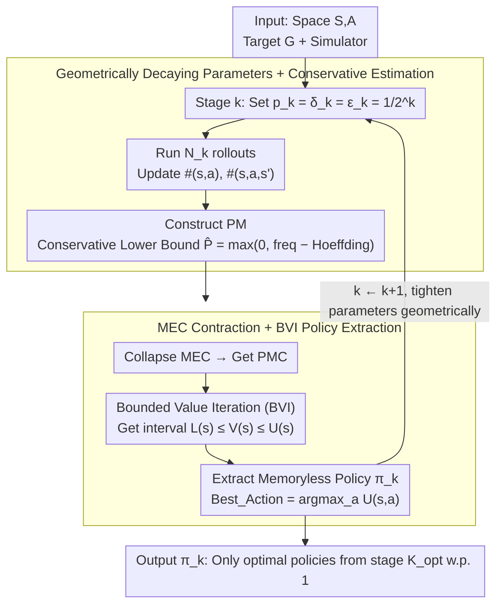

# Reinforcement Learning for Reachability: Guaranteeing Asymptotic Optimality

**Conference**: ICML 2026  
**arXiv**: [2605.24740](https://arxiv.org/abs/2605.24740)  
**Code**: https://github.com/amoghp214/asymptotic-ltl-reachability (Available)  
**Area**: Reinforcement Learning / Formal Methods / PAC Learning / Temporal Logic  
**Keywords**: Reachability Specifications, PAC Learning, Asymptotic Optimality, Bounded Value Iteration

## TL;DR
This paper addresses the problem of learning reachability specifications on unknown MDPs by proposing a direct learning algorithm that refines PAC parameters in stages. It proves the existence of a finite stage $K_{\mathsf{opt}}$ with probability 1, after which only the optimal policy is output. This stage is explicitly characterized using internal MDP parameters, and empirical results on quantitative verification benchmarks confirm that the optimal policy emerges in very few stages (median $k=2$).

## Background & Motivation

**Background**: Classical RL has a complete theory for reward-based discounted return objectives (asymptotic convergence of Q-learning, PAC bounds for $E^3$/RMAX). In recent years, many works have extended objectives from rewards to LTL/$\omega$-regular formal specifications to express complex temporal behaviors like safety and liveness. Reachability is the core primitive for this class of specifications, as all $\omega$-regular specifications can be reduced to reachability problems.

**Limitations of Prior Work**: For general LTL specifications, PAC learning has been proven infeasible (Yang 2022; Alur 2022) unless internal MDP parameters (minimum transition probability $p_{\min}$, mixing time, expected distance, etc.) are introduced; however, these quantities are unknown in the RL setting. Conversely, work on asymptotic convergence is largely limited to Le et al. 2024, which converts LTL into limit-average rewards and solves using a sequence of discount factors $\gamma\to 1$. Their convergence is characterized only by "external parameters" (discount factors), decoupled from the original MDP structure, thus failing to answer practical questions like "when will the optimal policy emerge."

**Key Challenge**: Either using PAC requires prior knowledge of parameters like $p_{\min}$ (unrealistic), or asymptotic convergence is merely a byproduct of reward reduction, lacking insight into convergence dynamics. Neither approach can directly characterize "when the optimal policy phase begins" using the original MDP parameters.

**Goal**: To provide a learning algorithm directly targeting reachability specifications without reward transformation, where the convergence stage can be explicitly expressed by internal MDP quantities, and to demonstrate that this stage genuinely occurs early on standard benchmarks.

**Key Insight**: The authors observe a crucial fact—although $p_{\min}$ is unknown, it can be "guessed and refined stage by stage." By letting the PAC parameters ($p_k, \delta_k, \varepsilon_k$) for each stage decay geometrically as $1/2^k$, there exists a $K_{\mathsf{PAC}}$ such that $p_k \le p_{\min}$ holds forever. Combined with the summable $\sum \delta_k < \infty$ and the Borel–Cantelli lemma, this upgrades "staged PAC" to "asymptotic optimality with probability 1."

**Core Idea**: Use staged refinement of PAC subroutines to approach an unknown $p_{\min}$, allowing the approximation tolerance $\varepsilon_k$ to eventually fall below the value difference $\varepsilon_{\mathsf{diff}}$ between optimal and sub-optimal policies, thereby automatically upgrading $\varepsilon_k$-optimality to "strict optimality."

## Method

### Overall Architecture
The algorithm, Asymptotic (Algorithm 1), runs in stages $k=1, 2, 3, \dots$. At each stage $k$, three parameters are set: $p_k = \delta_k = \varepsilon_k = 1/2^k$ (guessed minimum transition probability, confidence error, approximation tolerance), and then:

1. Use a simulator to perform $N_k$ rollouts, updating transition counts $\#(s, a)$ and $\#(s, a, s')$ to construct a Partial Model $PM$;
2. Detect and collapse Maximal End Components (MECs) on the $PM$ to obtain a $PMC$;
3. Run Bounded Value Iteration (BVI) on the $PMC$ to obtain lower bounds $L(s)$ and upper bounds $U(s)$ of the values;
4. Extract a memoryless deterministic policy $\pi_k$ from $L$ and $U$ as the output for that stage.

The inputs are only the MDP state/action spaces $S, A$ and the target set $G$, plus a simulator; $p_{\min}$, $K_{\mathsf{opt}}$, and $K_{\mathsf{PAC}}$ are not inputs but are used only for theoretical analysis.

### Key Designs

**1. Geometrically Decaying Parameters + Conservative Transition Estimation: Absorbing unknown $p_{\min}$ using a monotonic sequence**

PAC formulas strictly require the minimum transition probability $p_{\min}$, which is completely unknown in RL. Instead of seeking a PAC bound that does not require $p_{\min}$, this work acknowledges its necessity and refines the approximation stage-by-stage: in stage $k$, $p_k, \delta_k, \varepsilon_k$ are tightened geometrically. Transition estimates use a conservative lower bound—the frequency $\frac{\#(s,a,s')}{\#(s,a)}$ is reduced by a Hoeffding deviation $c=\sqrt{\frac{\ln(\delta_P/2)}{-2\cdot\#(s,a)}}$, yielding $\hat P(s,a,s')=\max\{0,\frac{\#(s,a,s')}{\#(s,a)}-c\}$. The three types of errors $\delta_{TP}+\delta_{EC}+\delta_{N_k}=\delta_k$ are distributed across each stage. The monotonic descent of $1/2^k$ will eventually fall below the true $p_{\min}$ in finite steps, and since $\sum_k 1/2^k$ is summable, it fits the Borel–Cantelli lemma to upgrade "high probability correctness" to "almost sure correctness."

**2. Optimal Policy Extraction via MEC Contraction + BVI: Trusted value intervals on partial models**

To provably extract a policy using only a partial model and conservative $\hat P$, BVI is employed. The update rules $L(s,a)=\sum_{s'}\hat P(s,a,s')L(s')$ and $U(s,a)=\sum_{s'}\hat P(s,a,s')U(s')+(1-\sum_{s'}\hat P(s,a,s'))$ place all "unobserved probability mass" into $U$, ensuring $L(s)\le V(s)\le U(s)$. MECs are collapsed into super-states (where $L=U=0$ if no targets are present, and $L=U=1$ if targets are included) to prevent BVI from oscillating in end components. Policies are extracted via $\mathsf{Best\_Action}(s)=\arg\max_a U(s,a)$, and $\mathsf{Best\_Exit\_Action}$ is used recursively within MECs. Simple Q-learning is insufficient here because discounting confuses "reaching the target at step $k$" with the true reachability probability (as proven by Alur 2022). BVI with MEC contraction is a provably convergent algorithm for reachability probabilities, and the intervals provided by conservative $\hat P$ serve as the foundation for the proofs.

**3. Three-Stage Proof Link: Upgrading "Stage PAC" to "Almost Sure Optimal Policy Output"**

Per-stage PAC is not enough; the goal is almost sure optimality. The proof proceeds in three steps: Theorem 3.1 uses the PAC lemma from Ashok 2019 to prove $\Pr[\pi_k\in \Pi_{\mathsf{opt}}^{\varepsilon_k}] \ge 1-\delta_k$ from $K_{\mathsf{PAC}}$ onwards. Theorem 3.2 notes that there are only finitely many memoryless deterministic policies, meaning the difference between optimal and sub-optimal values $\varepsilon_{\mathsf{diff}} > 0$. When $\varepsilon_k \le \varepsilon_{\mathsf{diff}}$, $\varepsilon_k$-optimality becomes strict optimality at stage $K_{\mathsf{opt}}$. Theorem 3.3 applies Borel–Cantelli since $\sum_k \delta_k < \infty$, concluding that the non-optimal event occurs only finitely many times with probability 1. Theorem 4.1 explicitly bounds $\varepsilon_{\mathsf{diff}}$ using transition complexity $D$ (the least common multiple of all probability denominators) as $(2D)^{-2|A||S|} \cdot 2^{-2|S|}$, proving $K_{\mathsf{opt}}$ depends solely on the internal MDP structure. This distinguishes this work from Le et al. 2024—while they prove value convergence $J(\pi_n) \to J^*$, this work proves that the "policy itself is optimal with probability 1 from some point," which is a stronger guarantee with stages expressed entirely through MDP quantities.

### Loss & Training
There is no explicit loss function (non-gradient method). Each stage runs $2^k \cdot |S|$ BVI updates as a convergence budget. During simulation, the optimal policy from the previous stage is used with probability $1-\mu$, and random exploration occurs with probability $\mu \in (0, 1]$. End component detection uses a $\delta_C$-confident strategy requiring that "state-action pairs remaining in the EC" be sampled $n \ge \ln \delta_C / \ln (1-p_k)$ times to avoid missing low-probability edges.

## Key Experimental Results

The implementation is public on GitHub, tested on 9 standard MDPs from the Quantitative Verification Benchmark Set, with 10 independent runs per benchmark on a single-core CPU, 1 GB RAM, 2.4 GHz, and a 36-hour limit.

### Main Results

| Metric | Conv. Stage (Median $k$) | Conv. Stage (Mean $k$) | Remarks |
|------|------|------|------|
| Policy Accuracy ($\Pi_{\mathsf{opt}}$ appears) | 2 | 2.3 | Average across 9 benchmarks |
| Value Upper Bound $U(s_0)$ to 1.0 | $\sim 16$ | — | Dining Philosophers |
| Value Lower Bound $L(s_0)$ to 1.0 | $\sim 16$ | — | Dining Philosophers |
| Inter-trial Std Dev | Low | — | Convergence is robust to randomness |

### Ablation Study

| Configuration | Key Phenomenon | Explanation |
|------|---------|------|
| Full Algorithm | Policy $k=2$ conv., Value bounds $k \sim 16$ conv. | Theory $K_{\mathsf{opt}}$ matches empirical policy emergence |
| Value bounds only (no policy) | Significantly lags behind policy convergence | Indicates actual $\varepsilon_{\mathsf{diff}}$ is much larger than worst-case |
| Theoretical $N_k$ vs. Empirical $N_k$ | Similar convergence profiles | Truncation and pruning in implementation do not destroy asymptotic properties |
| Zero-reachability targets (e.g., Zeroconf) | Policy accuracy 0 | Correct behavior: optimal reachability is indeed 0 |

### Key Findings
- **Policies converge much earlier than value bounds**: Theoretically, $K_{\mathsf{opt}}$ is determined by the worst-case $\varepsilon_{\mathsf{diff}}$, but the effective "policy value gap" in actual MDPs is much looser than a worst-case bound like $(2D)^{-2|A||S|}$. Thus, the optimal policy stabilizes at stage $k=2$, while value bounds continue to tighten slowly. This implies that if one only cares about finding the optimal policy rather than getting tight value estimates, the actual cost is much lower than suggested by theoretical analysis.
- **Robustness of geometric decay**: The simple geometric sequence $p_k = 1/2^k$ quickly passes the true $p_{\min}$ on all benchmarks without requiring problem-specific tuning. Compared to finer parameterizations like mixing time or $L_1$ distance, it has a much lower engineering threshold.
- **Reachability $\Rightarrow$ LTL**: Since the reduction from LTL to reachability (Sickert 2016; Baier–Katoen 2008) is well-established, any asymptotic algorithm for reachability immediately lifts to LTL. This work provides the foundational structure for all $\omega$-regular learning.

## Highlights & Insights
- **Turning "Unknown Parameters" into "Refined Parameters"**: This is the core trick to bypass PAC infeasibility. Instead of seeking a PAC bound that doesn't need $p_{\min}$, the authors acknowledge it is needed but absorb the "unknown" nature using a monotonic descent sequence + geometrically decaying failure probabilities + Borel–Cantelli. This approach can be ported to any setting where a theoretical parameter is needed but can be conservatively approached.
- **Convergence Guarantees Stronger than Asymptotic**: Traditional asymptotic convergence says $J(\pi_n) \to J^*$, which allows for infinitely many outputs of sub-optimal policies. This paper provides a "finite non-optimal event" guarantee, stating that after a finite stage, policies are almost surely optimal. This has direct significance for safety-critical applications like online robot learning.
- **Algebraic Characterization of $\varepsilon_{\mathsf{diff}}$**: By using transition complexity $D$ and the integrality of $\det F(\mathrm{Id}-\mathbf A)$, a lower bound of $\varepsilon_{\mathsf{diff}} \ge (2D)^{-2|A||S|} \cdot 2^{-2|S|}$ is provided. This proof paradigm, using Cramer's rule to link policy value differences to the integer structure of MDP probability denominators, is applicable to any setting with finite policy spaces and rational transitions.

## Limitations & Future Work
- The algorithm is **model-based**: It explicitly maintains a partial model $PM$ and counters $\#(s, a, s')$, which consumes memory as the state space grows. The authors list "model-free extensions" as a key path for future work.
- It only proves **memoryless deterministic policies**: While these are the optimal class for general reachability, extending this to non-Markovian rewards or policies with memory (certain LTL extensions) would require re-proving the finiteness of $\varepsilon_{\mathsf{diff}} > 0$.
- The theoretical upper bound for $K_{\mathsf{opt}}$ is $(2D)^{-2|A||S|} \cdot 2^{-2|S|}$, which is massive compared to the empirical $k=2.3$. This suggests the proof is still conservative; finding tighter $\varepsilon_{\mathsf{diff}}$ using problem-specific structures is a valuable future direction.
- Evaluation is limited to 9 quantitative verification benchmarks with relatively small state spaces; scalability on large-scale industrial MDPs has not been tested.

## Related Work & Insights
- **vs. Le et al. 2024 (LTL $\to$ limit-average reward)**: They convert LTL to limit-average rewards and approximate with a sequence of discount factors, proving $J(\pi_n) \to J^*$. Their convergence depends on the discount sequence, is decoupled from the MDP structure, and lacks implementation. Ours avoids reward conversion, focuses directly on reachability, and ties convergence to internal quantities like $\varepsilon_{\mathsf{diff}}$.
- **vs. Ashok et al. 2019 (PAC with known $p_{\min}$)**: The staged subroutines here utilize their PAC lemma; the difference is that this work handles unknown $p_{\min}$ via staged refinement.
- **vs. Alur et al. 2022 (Inseparability Theorem)**: Alur proved reachability cannot be optimally reduced to discounted rewards, explaining why standard RL cannot be directly applied. This work provides a direct learning path that bypasses this impossibility.
- **vs. Majumdar et al. 2025 (regret-free LTL)**: Regret-free is a weaker guarantee than asymptotic (even zero failure allows infinitely many non-optimal policies). Ours, stating non-optimal output occurs only finitely many times, is strictly stronger.

## Rating
- Novelty: ⭐⭐⭐⭐⭐ First to provide a finite-stage characterization of "almost sure optimal policy output" in reachability RL, with stages explicitly expressed by internal MDP parameters.
- Experimental Thoroughness: ⭐⭐⭐ Validated on 9 standard benchmarks; lacks large-scale or continuous MDP validation.
- Writing Quality: ⭐⭐⭐⭐ Theorem links (3.1→3.2→3.3→4.1) progress logically, separating intuition from formalization clearly.
- Value: ⭐⭐⭐⭐ Provides a usable foundation for LTL/$\omega$-regular RL; the paradigm of staged refinement for unknown parameters is highly reusable.

## Related Papers

- [\[NeurIPS 2025\] On the Global Optimality of Policy Gradient Methods in General Utility Reinforcement Learning](../../NeurIPS2025/reinforcement_learning/on_the_global_optimality_of_policy_gradient_methods_in_general_utility_reinforce.md)
- [\[NeurIPS 2025\] Learning in Stackelberg Mean Field Games: A Non-Asymptotic Analysis](../../NeurIPS2025/reinforcement_learning/learning_in_stackelberg_mean_field_games_a_non-asymptotic_analysis.md)
- [\[ICML 2025\] Action-Dependent Optimality-Preserving Reward Shaping (ADOPS)](../../ICML2025/reinforcement_learning/action-dependent_optimality-preserving_reward_shaping.md)
- [\[ICML 2026\] Safe In-Context Reinforcement Learning](safe_in-context_reinforcement_learning.md)
- [\[NeurIPS 2025\] Greedy Algorithm for Structured Bandits: A Sharp Characterization of Asymptotic Success / Failure](../../NeurIPS2025/reinforcement_learning/greedy_algorithm_for_structured_bandits_a_sharp_characterization_of_asymptotic_s.md)

<!-- RELATED:END -->

<!-- RELATED:START -->

## Related Papers

- [\[ICML 2026\] Distributional Inverse Reinforcement Learning](distributional_inverse_reinforcement_learning.md)
- [\[ICML 2026\] The Surprising Difficulty of Search in Model-Based Reinforcement Learning](the_surprising_difficulty_of_search_in_model-based_reinforcement_learning.md)
- [\[ICML 2026\] Dr. Tulu: Reinforcement Learning with Evolving Rubrics for Deep Research](dr_tulu_reinforcement_learning_with_evolving_rubrics_for_deep_research.md)
- [\[ICML 2026\] Latent Representation Alignment for Offline Goal-Conditioned Reinforcement Learning](latent_representation_alignment_for_offline_goal-conditioned_reinforcement_learn.md)
- [\[ICML 2026\] Compositional Transduction with Latent Analogies for Offline Goal-Conditioned Reinforcement Learning](compositional_transduction_with_latent_analogies_for_offline_goal-conditioned_re.md)

<!-- RELATED:END -->
