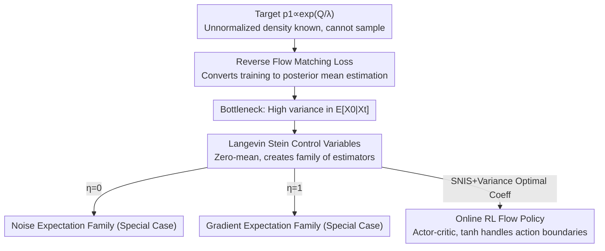

# Reverse Flow Matching: A Unified Framework for Online Reinforcement Learning with Diffusion and Flow Policies

**Conference**: ICML 2026  
**arXiv**: [2601.08136](https://arxiv.org/abs/2601.08136)  
**Code**: See paper (Appendix E provides pseudocode)  
**Area**: Reinforcement Learning / Diffusion Models / Flow Matching  
**Keywords**: Reverse Flow Matching, Boltzmann Distribution, Posterior Mean Estimation, Langevin Stein Operator, Control Variables

## TL;DR
Addressing the core challenge that "no direct target policy samples exist in online RL," this paper proposes Reverse Flow Matching (RFM). By transforming the training of diffusion/flow policies to fit Boltzmann distributions into a "posterior mean estimation given intermediate noise" problem, it uses Langevin Stein operators to construct zero-mean control variables. This unifies existing "noise expectation" and "gradient expectation" methods into a single family of estimators. Consequently, it enables flow policies (not just diffusion policies) to sample Boltzmann distributions for the first time, achieving more stable and superior performance on continuous control benchmarks compared to diffusion baselines.

## Background & Motivation

**Background**: Diffusion and flow models possess high expressivity and can characterize multi-modal behaviors. They have demonstrated significant success in imitation learning and **offline** RL because expert demonstrations or pre-collected datasets are readily available for direct training.

**Limitations of Prior Work**: Application to **online** RL is hindered. Under the maximum entropy RL framework, the improved policy is a Boltzmann distribution $\pi_{\text{new}}(a\mid s)\propto\exp(\frac{1}{\lambda}Q(s,a))$, which is **unnormalized and generally impossible to sample directly**. Flow matching training, however, requires the ability to "sample from the target distribution." This presents a sharp contrast to standard generative modeling, where training data is easily accessible, while here, not even a single target sample can be obtained.

**Key Challenge**: Existing methods attempting to bypass this barrier are divided into two seemingly unrelated families: the **noise expectation family** (using the exponential of Q-values as weights for Self-Normalized Importance Sampling, SNIS, on noise) and the **gradient expectation family** (performing SNIS on the gradient of the Q-function). However, the mathematical relationship between these objectives remains unclear, as does the possibility of a general formulation. Furthermore, their derivations are often tied to specific noise schedules (VP/VE), obscuring underlying principles. Worse, **both families only support training diffusion policies; how flow policies can sample Boltzmann distributions has remained an open question**.

**Goal**: (1) Provide a mathematically rigorous training objective that does not require target samples; (2) Unify the noise and gradient expectation families within a single framework; (3) Extend "Boltzmann distribution sampling" capabilities from diffusion to flow; (4) Instantiate and validate this in online RL.

**Key Insight**: Adoption of a "reverse inference" perspective. Standard flow matching is a forward construction—first sampling $X_0\sim p_0, X_1\sim p_1$, then synthesizing the intermediate state $X_t=\alpha_t X_1+\beta_t X_0$. When $p_1$ has only an unnormalized density and cannot be sampled, the forward pipeline breaks. The authors instead treat $X_t$ as "observed evidence" and $X_0$ (or $X_1$) as a "latent variable" explaining its origin. Since interpolation is a hard constraint, given $x_t$ and a candidate noise $x_0$, the target endpoint is uniquely determined. The training objective thus becomes "estimating the posterior mean given $X_t$."

**Core Idea**: Use "reverse posterior mean estimation" instead of "forward sampling" to train flow/diffusion models; then use Langevin Stein operators to create zero-mean control variables, unifying existing methods into a family of estimators with adjustable variance.

## Method

### Overall Architecture
RFM addresses the problem where the "target distribution $p_1$ is known (up to a normalization constant) but cannot be sampled." The approach consists of three layers: the **first layer** flips flow matching from forward construction to reverse inference, yielding a trainable loss $\mathcal{L}_{\text{RFM}}$ dependent only on the posterior mean. The **second layer** identifies that the real bottleneck is the variance in estimating the posterior mean $\mathbb{E}[X_0\mid X_t]$, thus introducing Langevin Stein operators to construct zero-mean control variables, resulting in a family of estimators with "identical expectation but adjustable variance." It proves that the noise/gradient expectation families are special cases where $\eta=0$ and $\eta=1$. The **third layer** instantiates this in online RL, using an actor-critic framework to train a flow policy to fit the Boltzmann distribution.

### Key Designs

**1. Reverse Flow Matching Loss: Turning "Sampling Target" into "Estimating Posterior Mean"**

Forward flow matching requires sampling $(X_0, X_1)$. Since $p_1$ is unsampleable, the authors use Bayes' rule to derive the noise posterior: $q^*_{0\mid t}(x_0\mid x_t)\propto p_0(x_0)\,p_1\!\big(\frac{1}{\alpha_t}x_t-\frac{\beta_t}{\alpha_t}x_0\big)$. A candidate noise $x_0$ is plausible based on its prior $p_0$ and the likelihood of its implied target endpoint $x_1(x_0,x_t)=\frac{1}{\alpha_t}x_t-\frac{\beta_t}{\alpha_t}x_0$ under $p_1$. Symmetrically, a data posterior $q^*_{1\mid t}$ exists. The flow matching loss replaces "unavailable forward samples" with "samples from the posterior," pushing the expectation inside the square norm to obtain the noise posterior form:

$$\mathcal{L}_{\text{RFM-N}}(\theta) = \mathbb{E}_{t,X_t\sim\hat{p}_t}\Big[\big\|v^\theta_t(X_t) - \big(\tfrac{\dot\alpha_t}{\alpha_t}X_t + \tfrac{\alpha_t\dot\beta_t-\dot\alpha_t\beta_t}{\alpha_t}\mathbb{E}_{X_0\sim q^*_{0\mid t}}[X_0]\big)\big\|_2^2\Big]$$

Here, $\hat{p}_t$ is an arbitrary proposal distribution. The paper proves (Prop. 4.1 / Thm. 4.2) that RFM-N, RFM-D, and conditional flow matching **share the same global optimum** under sufficiently expressive function classes, though optimization dynamics vary by $\hat p_t$. This step completely transforms the "sampling impossibility" into "posterior mean estimation $\mathbb{E}[X_0\mid X_t]$ given $X_t$"—a pure estimation problem. The framework accommodates various parameterizations (velocity/data/noise/score prediction) and standard diffusion schedules like VE.

**2. Langevin Stein Control Variables: Reducing Variance via Zero-Mean Correction**

The posterior mean $\mathbb{E}_{X_0\sim q^*_{0\mid t}}[X_0]$ must be estimated via SNIS, which suffers from high variance and instability given a fixed computational budget $K$. The authors introduce the Langevin Stein operator $(\mathcal{T}_p\phi)(x)=\nabla\cdot\phi(x)+\phi(x)\cdot\nabla\log p(x)$, which has the property of **zero expectation under $p$** (Lemma 4.5). Thus, it serves as a control variable that alters variance without changing expectation. To adapt to vector-valued posterior means, the authors extend it to matrix-valued test functions $\Phi$ (Def. 4.6 / Prop. 4.7). For a constant diagonal test function $\Phi_t=\text{diag}(\Lambda)$, the control variable simplifies to $g_{\Phi_t}(x_0,x_t)=\text{diag}(\Lambda)\,s^*_{0\mid t}(x_0,x_t)$, where $s^*$ is the posterior score:

$$\mathbb{E}_{q^*_{0\mid t}}[X_0] = \mathbb{E}_{q^*_{0\mid t}}\big[X_0 + \text{diag}(\Lambda)\,s^*_{0\mid t}(X_0,x_t)\big]$$

The SNIS estimator with control variables is denoted $\hat\mu_{\text{SNIS-CV}}[X_0\mid t,x_t;\Lambda]$. Furthermore, the authors provide a closed-form solution for the **asymptotically variance-optimal** coefficients (Prop. 4.9 for component-wise $\Lambda^*_j$, Prop. 4.10 for isotropic $\eta^*$). Intuitively, while simple importance weighting on noise yields high variance, adding a "zero-mean correction proportional to the score" pulls the estimate toward the true value, providing a more stable supervision signal for training.

**3. Unifying Two Families + Flow Policy RL: Connecting Noise/Gradient via η, Handling Boundaries with Tanh**

Applying control variables to the Boltzmann target $p_1\propto\exp(\frac{1}{\lambda}Q)$ (Thm. 4.14), the posterior mean estimator becomes a family regulated by $\Lambda, \eta$. Under the isotropic $\eta$, it is exactly a linear combination of two terms: $\mu_{0\mid t}=(1-\eta)\,\mathbb{E}[X_0] + \eta\,\mathbb{E}\big[-\frac{1}{\lambda}\frac{\beta_t}{\alpha_t}\nabla_{x_1}Q\big]$. Thus, **noise expectation = $\eta=0$ and gradient expectation = $\eta=1$**. These two seemingly disparate families are proven to be endpoints of the same formula. The intermediate $\eta$ allows for a **principled mixing** of Q-value and Q-gradient information to create a lower-variance estimator, which is the source of improved training efficiency and stability.

Instantiated in online RL, the method uses actor-critic with twin Q-networks. A key engineering point is **action boundaries**: in continuous control, actions are typically constrained to $[-1,1]^d$. Previous methods used heuristics like truncated Gaussians, which break probability paths. Ours learns flows in an unconstrained latent space $u\in\mathbb{R}^d$, mapped to actions via $a=\tanh(u)$, while **explicitly including the Jacobian factor** $\prod_j\text{sech}^2(u_{1,j})$. This strictly maintains the correct Boltzmann distribution in the action space. The flow policy parameterizes the latent space velocity field as $v^\theta_t(u_t,s)$, and the actor loss is the squared error regression to the RFM velocity target $\hat v_t=\dot\alpha_t\bar u_1+\dot\beta_t\bar u_0$.

### Loss & Training
The critic uses standard twin Q TD targets $\hat Q=r+\gamma\min\{Q_{\bar\omega_1},Q_{\bar\omega_2}\}$. The actor loss is $\mathcal{L}_\pi(\theta)=\mathbb{E}_{t,u_t,s}[\|v^\theta_t(u_t,s)-\hat v_t(u_t,s)\|_2^2]$, where the posterior mean is estimated by SNIS-CV, and $\bar u_1=(u_t-\beta_t\bar u_0)/\alpha_t$. During sampling, $u_t$ is sampled via a policy-induced proposal, and $M$ action candidates are generated to select the one with the highest Q-value.

## Key Experimental Results

### Main Results

| Task | Method | Inference Steps | Conclusion |
|------|------|----------|------|
| 2D Two-Moon Sampling | RFM | 20 steps | Lowest SWD / MMD² / Sinkhorn distances |
| 2D Two-Moon Sampling | iDEM (Gradient Exp) | 100 steps | All distances inferior to RFM |
| 2D Two-Moon Sampling | QNE (Noise Exp) | 100 steps | All distances inferior to RFM |
| DMC Control (8 Envs) | RFM (Flow Policy) | 10 steps | Only method consistently performing well across all 8 envs |
| DMC Control | SAC/QSM/MaxEntDP/DQS/QVPO | 20 steps | Various methods significantly degrade on specific tasks |

In toy experiments, using the **same posterior estimation budget (equivalent training compute)**, RFM achieves lower distribution divergence with 1/5 of the inference steps, indicating that the reverse perspective + control variables provide higher quality at the same compute level.

### Ablation Study
The main paper presents stability comparisons via training curves (Fig. 2, min–max range over 5 seeds). Detailed ablations and sensitivity analyses are in Appendix G.

| Configuration | Key Observation | Explanation |
|------|---------|------|
| RFM (Full) | Stable convergence in 8/8 envs | Cross-task consistency is its primary strength. |
| Diffusion Baselines | Failures in subset of tasks | Lack of cross-environment stability. |
| Flow vs. Diffusion | 10 steps < 20 steps | Flow models yield higher rewards with fewer integration steps. |
| η=0 / η=1 | Degrades to prior families | Intermediate η mixing Q-values and Q-gradients yields lower variance. |

### Key Findings
- **Cross-task stability is a core advantage**: Across eight DMC environments, RFM is the only method that performs well consistently, whereas every baseline fails significantly on certain tasks. Variance across five seeds is also notably smaller.
- **Fewer inference steps, higher returns**: Flow policies at 10 steps outperform diffusion baselines at 20 steps, truly unleashing the advantage of flow models (shorter integration paths).
- **Higher quality under fixed compute**: In toy tasks with identical posterior estimation budgets, RFM reaches lower divergence in 1/5th the steps; variance reduction from control variables translates directly to sample quality.
- **Unified perspective provides adjustable knobs**: $\eta$ connects noise and gradient families. Mixing both forms of information results in a lower-variance supervision signal.

## Highlights & Insights
- **The "Reverse Inference" perspective is compelling**: Converting the "impossible to sample target distribution" obstacle into a standard posterior mean estimation problem is elegant and enables a suite of variance reduction tools.
- **Clever use of Stein operators for control variables**: The essence is that the expectation is zero under the target density. Adding it reduces variance without shifting the expectation, and the optimal coefficient is analytically solvable—turning variance reduction from a "heuristic" into a "principled solution."
- **High theoretical value of unification**: Proving that noise and gradient expectations are two ends ($\eta=0,1$) of one formula clarifies literature confusion and naturally introduces the "mixed" option for superior estimation.
- **First capability for flow policies to sample Boltzmann distributions**: Flow models allow for non-Gaussian source distributions and are more flexible than diffusion. This expansion is a significant capability gain.
- **Tanh + Jacobian for action boundaries**: Handling boundaries via variable substitution and explicit Jacobian factors maintains a rigorous Boltzmann distribution in action space, which is cleaner than heuristic truncations.

## Limitations & Future Work
- **Reliance on SNIS and proposal distributions**: Posterior mean estimation still depends on importance sampling; if the proposal is poor, variance reduction is less effective. Optimal coefficients must be estimated online, adding computation.
- **Strong theoretical assumptions**: The zero-variance condition is generally unsolvable; practice requires approximate variance minimization within parameter families. Results rely on regularity conditions like differentiability and vanishing boundaries.
- **Academic experimental scale**: Validated on DMC and 2D toy tasks; performance in high-dimensional pixel inputs or real-world robotics is yet to be observed.
- **Limited disclosure on hyperparameter sensitivity**: Discussion on $\lambda$, flow steps, and control variable parameterization is primarily relegated to the appendix.

## Related Work & Insights
- **vs. Noise Expectation Family (QNE / MaxEntDP)**: These use Q-weighted SNIS on noise; Ours shows this is an $\eta=0$ special case and further reduces variance via control variables without being bound to specific schedules.
- **vs. Gradient Expectation Family (iDEM / DQS)**: These use SNIS on Q-gradients, corresponding to $\eta=1$; Ours unifies them and allows mixing Q-values/gradients for better estimators.
- **vs. Differentiable Sampling / Langevin Methods (e.g., QSM)**: QSM matches gradients via score models for Langevin sampling; Ours uses flow matching regression, which requires fewer inference steps and is more stable across environments.
- **vs. Iterative Weighted Regression (QVPO)**: QVPO uses Q-weighted regression; Ours provides a principled posterior mean estimation from a Boltzmann target, theoretically aligning more closely with evaluation objectives.

## Rating
- Novelty: ⭐⭐⭐⭐⭐ Reverse inference perspective + Stein control variables unify two families and extend Boltzmann sampling to flow policies.
- Experimental Thoroughness: ⭐⭐⭐⭐ Eight DMC environments + toy tasks prove stability/efficiency, though lacks high-dim/real-world scenarios.
- Writing Quality: ⭐⭐⭐⭐ Logical progression with clear motivation; high formula density requires effort from readers.
- Value: ⭐⭐⭐⭐ Provides a unified framework and variance reduction tools for diffusion/flow policy training in online RL.

<!-- RELATED:START -->

## Related Papers

- [\[ICML 2026\] MoMa QL: Accelerating Diffusion/Flow Matching Policies for Offline and Offline-to-Online RL via Moment Matching](moment_matching_q-learning.md)
- [\[ICLR 2026\] Flow Matching Policy Gradients](../../ICLR2026/reinforcement_learning/flow_matching_policy_gradients.md)
- [\[ICLR 2026\] Bridging Successor Measure and Online Policy Learning with Flow Matching-Based Representations](../../ICLR2026/reinforcement_learning/bridging_successor_measure_and_online_policy_learning_with_flow_matching-based_r.md)
- [\[ICML 2026\] Perceptual Flow Network for Visually Grounded Reasoning](perceptual_flow_network_for_visually_grounded_reasoning.md)
- [\[ICML 2026\] Plug-and-Play Benchmarking of Reinforcement Learning Algorithms for Large-Scale Flow Control](plug-and-play_benchmarking_of_reinforcement_learning_algorithms_for_large-scale_.md)

<!-- RELATED:END -->
