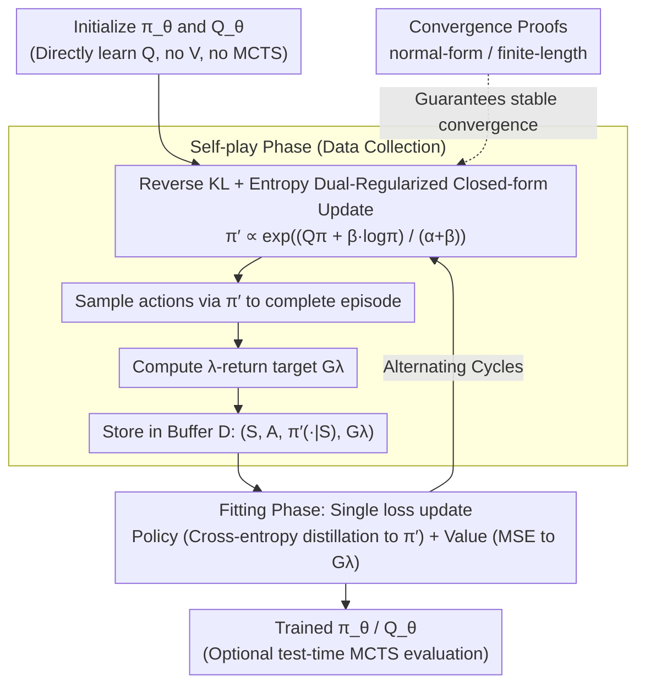

# Revisiting Regularized Policy Optimization for Stable and Efficient Reinforcement Learning in Two-Player Games

**Conference**: ICML 2026  
**arXiv**: [2602.10894](https://arxiv.org/abs/2602.10894)  
**Code**: To be confirmed  
**Area**: Reinforcement Learning / Self-Play / Board Games  
**Keywords**: Regularized Policy Optimization, Reverse KL, Entropy Regularization, $\lambda$-return, Search-free AlphaZero  

## TL;DR
KLENT recombines three established components—reverse-KL regularization (controlling policy update magnitude), entropy regularization (maintaining exploration), and $\lambda$-return (balancing bias and variance)—into a model-free self-play RL framework. It achieves 4x training efficiency compared to Gumbel AlphaZero across 5 board games and provides convergence proofs for both normal-form and finite-length scenarios.

## Background & Motivation
**Background**: Two-player zero-sum board games are predominantly dominated by the AlphaZero paradigm (AlphaZero / MuZero / Gumbel AlphaZero / TRPO-AlphaZero), which uses "network + MCTS." These methods rely on look-ahead search to generate strong policy targets; however, the training cost is extremely high, with AlphaZero requiring over 10 GPU-years to converge, making reproduction difficult.

**Limitations of Prior Work**: Methods like Muesli and Gumbel AlphaZero only "shorten/shallow MCTS," but search—the most expensive component—remains. Conversely, pure model-free methods (PPO, DQN) have long been considered "unstable" in self-play, and few studies have systematically compared them against search-based methods in board games.

**Key Challenge**: Search provides stability but is very expensive; removing search leads to instability. This instability stems from the non-stationary nature of self-play (the opponent is changing) and test-time distribution shift. Excessive policy updates lead to collapse, while insufficient exploration leads to overfitting to self-play trajectories.

**Goal**: (i) Design a model-free self-play algorithm that does not rely on MCTS at all; (ii) provide provable stability guarantees to explain why "reverse-KL + entropy" works; (iii) experimentally demonstrate higher efficiency than search-based methods across various board games.

**Key Insight**: The authors leverage the insight from Grill et al. (2020) that AlphaZero essentially solves an implicit KL-regularized policy optimization problem. They reverse this equivalence: if KL regularization is the essence of AlphaZero's stability, then explicitly performing KL-regularized policy optimization (with added entropy regularization to handle distribution shift) can eliminate the expensive MCTS "approximate solver."

**Core Idea**: The framework treats "self-play = a closed-form policy improvement with reverse-KL + entropy regularization" as its foundation. Neural networks are used to fit the policy and $Q$-function, while $\lambda$-return controls variance in value learning, resulting in KLENT—a stable, search-free self-play model-free algorithm.

## Method

### Overall Architecture
KLENT simultaneously parameterizes the policy $\pi_\theta(a|s)$ and the action-value function $Q_\theta(s,a)$ (in contrast to AlphaZero, which only learns $V(s)$ and relies on MCTS for $Q$). Training cycles between two phases: (i) **Self-play Phase**: The network calculates a closed-form regularized optimal policy $\pi'$ (see Equation 3 below). Actions are sampled according to $\pi'$ to complete episodes, $\lambda$-returns are computed as value targets for each step, and tuples $(S_t, A_t, \{\pi'(a|S_t)\}_a, G_t^\lambda)$ are stored in a buffer $\mathcal{D}$. (ii) **Fitting Phase**: A single loss function minimizes cross-entropy distillation from $\pi'$ to the policy network and MSE fitting of $G^\lambda$ to the value function. **MCTS is entirely absent** during training and is only optionally used at test-time for evaluation. The stability of this two-stage update is guaranteed by convergence proofs for two scenarios.

### Key Designs

**1. Reverse KL + Entropy Dual-Regularized Closed-form Policy Update: Tackling "Non-stationarity" and "Distribution Shift"**

Self-play instability arises from shifting opponents (non-stationarity) and test-time distribution shifts. KLENT addresses these with two regularization terms. At each state $s$, it solves $\max_{\pi'} \mathbb{E}_{A\sim\pi'}[Q^\pi(s,A)] - \beta D_{\text{KL}}(\pi'(\cdot|s)\|\pi(\cdot|s)) + \alpha H(\pi'(\cdot|s))$. The reverse-KL anchors $\pi'$ near the current $\pi$ for gradual updates (countering non-stationarity), while entropy regularization spreads probability mass (countering test-time distribution shift). Due to the finite action space, the analytical solution is $\pi'(a|s)=\frac{1}{Z(s)}\exp\big(\frac{Q^\pi(s,a)+\beta\log\pi(a|s)}{\alpha+\beta}\big)$, where $Z(s)$ is the normalization constant. The policy network distills towards this via cross-entropy $-\sum_a \pi'(a|s)\log\pi_\theta(a|s)$. Reverse-KL is chosen for its mode-seeking property (versus the mean-seeking nature of forward-KL), which is better for finding the "best response." Entropy regularization prevents $\pi'$ from collapsing into a deterministic policy, avoiding cycles or overfitting in self-play.

**2. $\lambda$-return as the $Q$-learning Target: Balancing Bias and Variance in Sparse Terminal Rewards**

In self-play, trajectories are long and rewards are sparse (±1 at terminal). The Monte Carlo return ($\lambda=1$) used in AlphaZero has high variance, while TD(0) ($\lambda=0$) suffers from bias due to bootstrapping and policy drift. KLENT uses $\lambda$-return $G^\lambda$ as the target for $Q_\theta$. Experiments on 9x9 Go confirm that an intermediate $\lambda$ minimizes the sum of squared bias and variance. The final loss is $L(\theta)=\mathbb{E}_{\mathcal{D}}\big[-\sum_a \pi'(a|S)\log\pi_\theta(a|S) + (Q_\theta(S,A)-G^\lambda)^2\big]$, with $\lambda=e^{-1/8}$ used across all 5 games. Although $\lambda$-return is a classical solution, it has been marginalized in the AlphaZero era; the authors demonstrate it is a critical component for efficiency.

**3. Dual-Scenario Convergence Proofs: Theoretical Justification for Stability**

The authors state that the primary contribution is not the newness of the components, but the novel theoretical characterization in two-player zero-sum games. First, for normal-form games, they prove that the update converges locally and linearly to a unique fixed point when $\alpha(\alpha+2\beta) > \|R\|_2^2/4$. This covers a wider range of $(\alpha, \beta)$ than the condition $\alpha\beta > \|R\|_2^2$ in Sokota et al. 2022. Second, for finite-length games, they prove that KLENT converges to the entropy-regularized optimal policy $\pi(a|s)=\frac{1}{Z(s)}\exp(Q^\pi(s,a)/\alpha)$ via backward induction, which approaches the Nash Equilibrium as $\alpha \to 0$.

### Loss & Training
Hyperparameters $(\alpha,\beta,\lambda)=(0.03, 0.1, e^{-1/8})$ were shared across 5 games. A 6-block ResNet was used (20-block for 19x19 Go). Results are plotted against "simulator evaluations" for fair comparison of efficiency under equal simulation budgets. Evaluation used reactive policies (no MCTS) to isolate the algorithm's performance.

## Key Experimental Results

### Main Results
Baselines: AlphaZero (AZ), TRPO-AlphaZero, Gumbel AlphaZero (Gumbel AZ), DQN, PPO. Games: Animal Shogi, Gardner Chess, 9x9 Go, Hex, Othello. Table 2 shows win rates against a baseline after 800M simulator evaluations, using 800-rollout MCTS at test-time:

| Game | AZ | Gumbel AZ | **KLENT** |
|------|----|-----------|-----------|
| Animal Shogi | 31±2% | 67±5% | 63±4% |
| Gardner Chess | 64±3% | 70±1% | **81±1%** |
| 9x9 Go | 7±2% | 37±2% | **89±1%** |
| Hex | 8±5% | 47±5% | **98±1%** |
| Othello | 51±2% | 47±3% | **55±6%** |
| **Average** | 32.2% | 53.6% | **77.2%** |

In terms of efficiency, KLENT reaches a 50% win rate on average with ~75M evaluations, whereas Gumbel AlphaZero requires ~300M—representing a **4x training efficiency gain**. KLENT's advantage is most pronounced in games with high branching factors (9x9 Go: 42.3, Hex: 90.6) and comparable to search baselines in smaller games (Animal Shogi, Gardner Chess).

### Ablation Study
| Variant | Modification | Result |
|------|------|------|
| **KLENT (full)** | All components enabled | Consistent performance across all 5 games |
| KL Only ($\alpha=0$) | No entropy regularization | Win rate peaks then **drops** in Animal Shogi; policy entropy hits zero; exploration lost |
| ENT Only ($\beta=0$) | No KL regularization | $D_{\text{KL}}(\pi'\|\pi)$ spikes; policy becomes erratic; significant drop in 9x9 Go |
| 1-Step KLENT ($\lambda=0$) | TD(0) | Performance drop in 9x9 Go / Hex |
| Monte Carlo KLENT ($\lambda=1$) | MC return | Performance drop in 9x9 Go / Hex |

### Key Findings
- Without entropy regularization, the policy entropy in Animal Shogi drops to zero, and the training curve collapses after an initial rise, refuting the common belief that self-play doesn't require explicit exploration.
- Without KL regularization, $D_{\text{KL}}(\pi'\|\pi)$ becomes uncontrolled, verifying that reverse-KL is essential for gradual updates in non-stationary self-play.
- The failure of both $\lambda=0$ and $\lambda=1$ proves that $\lambda$-return is a necessary component for efficient self-play model-free learning rather than just an optional trick.
- Efficiency gains are highly correlated with the branching factor—KLENT excels when MCTS budgets are stretched thin across many possible actions.

## Highlights & Insights
- While the insight that "AlphaZero essentially performs KL-regularized policy optimization" was noted by Grill et al. (2020), KLENT is the first to operationalize this by explicitly using KL regularization to eliminate MCTS, turning theoretical insight into an engineering success.
- The authors admit the components are not new, but elevating these "old tools" into an ICML contribution via rigorous convergence proofs (covering wider parameter regimes in normal-form and backward induction in finite-length games) serves as a benchmark for additive technical synthesis.
- Learning $\pi$ and $Q$ simultaneously with distillation resembles the two-player game version of MPO; for the robotics community, KLENT demonstrates that MPO-style frameworks are highly effective in discrete strategy games.

## Limitations & Future Work
- The experiments focus on "efficiency" rather than absolute asymptotic performance; whether AlphaZero remains stronger given infinite compute is an open question.
- Convergence proofs are scenario-specific: normal-form is local, and finite-length assumes acyclic state graphs. Stability in games with potentially infinite cycles requires further study.
- The boundary between perfect and imperfect information was not explored; KLENT was tested only on full-information games.
- While the same hyperparams $(\alpha,\beta,\lambda)$ worked for 5 games, long-horizon games like 19x19 Go might require more specific tuning.

## Related Work & Insights
- **vs AlphaZero / Gumbel AlphaZero**: These treat MCTS as an approximate policy improvement operator. KLENT replaces it with a closed-form $\pi'$, which is equivalent to making AlphaZero's implicit KL regularization explicit.
- **vs MPO (Abdolmaleki 2018)**: MPO also uses reverse-KL for regularized PO. KLENT is a two-player zero-sum variant of MPO, with the key addition of entropy regularization and game-theoretic convergence proofs.
- **vs SAC / Soft Q-Learning**: These utilize only entropy regularization ($\beta=0$). While sufficient for single-agent RL, KLENT’s ablations show that self-play requires KL regularization for stability.
- **vs Muesli / TRPO-AlphaZero**: While these aim to "reduce search," KLENT represents the logical conclusion of that trajectory: "zero search."

## Rating
- Novelty: ⭐⭐⭐ Existing components, but the combination, zero-search implementation, and dual-scenario proofs are novel in this context.
- Experimental Thoroughness: ⭐⭐⭐⭐⭐ 5 games + 19x19 Go, comprehensive ablations, fair MCTS comparisons, and linkage between theory and empirical results.
- Writing Quality: ⭐⭐⭐⭐⭐ Transparent about contributions, clear categorization of regularizers and failure modes, and easy to follow.
- Value: ⭐⭐⭐⭐ Demystifies the "necessity" of MCTS in self-play board games; highly practical for resource-constrained research.

<!-- RELATED:START -->

## Related Papers

- [\[ICML 2026\] Global Policy-Space Response Oracles for Two-Player Zero-Sum Games](global_policy-space_response_oracles_for_two-player_zero-sum_games.md)
- [\[ICML 2026\] Convergence of Two-Timescale Markovian Stochastic Approximations with Applications in Reinforcement Learning](convergence_of_two-timescale_markovian_stochastic_approximations_with_applicatio.md)
- [\[ICML 2026\] Learning to Route Languages for Multilingual Policy Optimization](learning_to_route_languages_for_multilingual_policy_optimization.md)
- [\[ICML 2026\] CPMöbius: Iterative Coach–Player Reasoning for Data-Free Reinforcement Learning](cpmobius_iterative_coach-player_reasoning_for_data-free_reinforcement_learning.md)
- [\[ICML 2026\] Metis: Learning to Jailbreak LLMs via Self-Evolving Metacognitive Policy Optimization](metis_learning_to_jailbreak_llms_via_self-evolving_metacognitive_policy_optimiza.md)

<!-- RELATED:END -->
