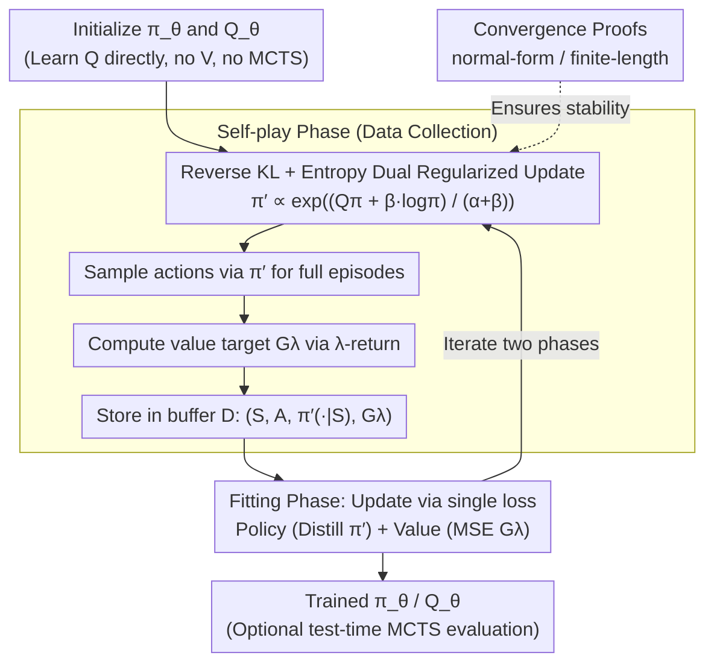

# Revisiting Regularized Policy Optimization for Stable and Efficient Reinforcement Learning in Two-Player Games

**Conference**: ICML 2026  
**arXiv**: [2602.10894](https://arxiv.org/abs/2602.10894)  
**Code**: TBD  
**Area**: Reinforcement Learning / Self-Play / Board Games  
**Keywords**: Regularized Policy Optimization, Reverse KL, Entropy Regularization, λ-return, Searchless AlphaZero  

## TL;DR
KLENT recombines three mature components—reverse-KL regularization (to control policy update scale), entropy regularization (to maintain exploration), and λ-return (to balance bias and variance)—into model-free self-play RL. It achieves 4x the training efficiency of Gumbel AlphaZero across five board games and provides convergence proofs for both normal-form and finite-length scenarios.

## Background & Motivation
**Background**: Two-player zero-sum board games are predominantly dominated by the AlphaZero paradigm (AlphaZero / MuZero / Gumbel AlphaZero / TRPO-AlphaZero, etc.), which uses "Neural Network + MCTS." While look-ahead search generates strong policy targets, the training cost is extremely high (e.g., AlphaZero requires 10+ GPU-years to converge), making reproduction difficult.

**Limitations of Prior Work**: Methods like Muesli and Gumbel AlphaZero merely shorten or shallow the MCTS, but the expensive search component remains. Conversely, pure model-free methods (e.g., PPO, DQN) have historically been deemed unstable in self-play, with few systematic comparisons in board game settings.

**Key Challenge**: Search provides stability but is expensive; removing it leads to instability. This instability stems from the non-stationary nature of self-play (changing opponents) and test-time distribution shift. Excessive policy updates lead to collapse, while insufficient exploration causes overfitting to the self.

**Goal**: (i) Design a model-free self-play algorithm that does not rely on MCTS; (ii) Provide provable stability guarantees explaining why "reverse-KL + entropy" works; (iii) Empirically demonstrate higher efficiency compared to search-based methods.

**Key Insight**: The authors leverage the insight from Grill et al. (2020) that AlphaZero implicitly solves a KL-regularized policy optimization problem. They invert this equivalence: if KL regularization is the essence of AlphaZero's stability, then explicit KL-regularized policy optimization (with entropy regularization to handle distribution shift) can eliminate the need for the expensive MCTS "approximate solver."

**Core Idea**: Treat "self-play = a closed-form policy improvement with reverse-KL and entropy regularization" as the foundation. Neural networks fit the policy and $Q$-function, combined with λ-return to control value learning variance, resulting in KLENT—a stable, searchless self-play model-free algorithm.

## Method

### Overall Architecture
KLENT simultaneously parameterizes the policy $\pi_\theta(a|s)$ and the action-value function $Q_\theta(s,a)$ (in contrast to AlphaZero, which learns $V(s)$ and estimates $Q$ via MCTS). Training cycles between two phases: (i) **Self-play phase**: The closed-form regularized optimal policy $\pi'$ (see Equation 3) is calculated using the network. Actions are sampled according to $\pi'$ to complete episodes. The λ-return for each step is computed as the value target, and $(S_t, A_t, \{\pi'(a|S_t)\}_a, G_t^\lambda)$ is stored in the buffer $\mathcal{D}$. (ii) **Fitting phase**: A single loss on $\mathcal{D}$ updates both the policy (cross-entropy distillation towards $\pi'$) and the value function (MSE fitting $G^\lambda$). **MCTS is entirely absent during training**; it is only optionally used for evaluation at test-time. Stability is guaranteed by convergence proofs for two scenarios.

### Key Designs

**1. Closed-form Policy Update with Reverse KL + Entropy: Managing "Non-stationarity" and "Distribution Shift"**

KLENT addresses the changing opponent and test-time distribution shift using two regularizers. At each state $s$, it solves $\max_{\pi'} \mathbb{E}_{A\sim\pi'}[Q^\pi(s,A)] - \beta D_{\text{KL}}(\pi'(\cdot|s)\|\pi(\cdot|s)) + \alpha H(\pi'(\cdot|s))$. The reverse-KL keeps $\pi'$ near the current $\pi$ for gradual updates (countering the non-stationary opponent), while entropy regularization spreads probability mass (countering unseen test-time opponents). Given finite action spaces, the analytical solution is $\pi'(a|s)=\frac{1}{Z(s)}\exp\big(\frac{Q^\pi(s,a)+\beta\log\pi(a|s)}{\alpha+\beta}\big)$. The policy network distills this via cross-entropy. Reverse-KL is chosen for its mode-seeking property, suitable for finding the best response, while entropy ensures $\pi'$ does not collapse to a deterministic state.

**2. λ-return for $Q$-learning: Balancing Bias and Variance in Sparse Reward Settings**

In self-play, trajectories are long and rewards are usually sparse ($\pm 1$). Monte Carlo returns ($\lambda=1$) suffer from high variance, while TD(0) ($\lambda=0$) introduces high bias due to bootstrapping and policy drift. KLENT uses $G^\lambda$ as the fitting target for $Q_\theta$. Experiments on 9x9 Go confirm an optimal intermediate $\lambda$ that minimizes the sum of squared bias and variance. The total loss is $L(\theta)=\mathbb{E}_{\mathcal{D}}\big[-\sum_a \pi'(a|S)\log\pi_\theta(a|S) + (Q_\theta(S,A)-G^\lambda)^2\big]$, with $\lambda=e^{-1/8}$ used across all five games.

**3. Convergence Proofs for Dual Scenarios: Theoretical Foundation of Stability**

The primary contribution lies in the theoretical characterization of this combination in zero-sum games. First, for normal-form zero-sum games, the update converges locally and linearly to a unique fixed point if $\alpha(\alpha+2\beta) > \|R\|_2^2/4$. This covers a broader $(\alpha,\beta)$ region than prior work (e.g., Sokota et al. 2022). Second, for finite-length games, KLENT converges to the entropy-regularized optimal policy $\pi(a|s)=\frac{1}{Z(s)}\exp(Q^\pi(s,a)/\alpha)$. As $\alpha\to 0$, this equilibrium approximates the Nash equilibrium of the original game.

### Loss & Training
Hyperparameters $(\alpha, \beta, \lambda) = (0.03, 0.1, e^{-1/8})$ were shared across games. A 6-block ResNet was used (20-block for 19x19 Go). Evaluation used "simulator evaluations" for fair budget comparison. Test-time evaluation used the reactive policy (no MCTS) to isolate algorithmic performance.

## Key Experimental Results

### Main Results
Baselines: AlphaZero (AZ), TRPO-AlphaZero, Gumbel AlphaZero (Gumbel AZ), DQN, PPO. Table 2 shows win rates against an anchored baseline after 800M simulator evaluations, with 800-rollout MCTS used at test-time:

| Game | AZ | Gumbel AZ | **KLENT** |
|------|----|-----------|-----------|
| Animal Shogi | 31±2% | 67±5% | 63±4% |
| Gardner Chess | 64±3% | 70±1% | **81±1%** |
| 9x9 Go | 7±2% | 37±2% | **89±1%** |
| Hex | 8±5% | 47±5% | **98±1%** |
| Othello | 51±2% | 47±3% | **55±6%** |
| **Average** | 32.2% | 53.6% | **77.2%** |

On average, KLENT reaches 50% win rate in ~75M evaluations, compared to ~300M for Gumbel AlphaZero—a **4x efficiency gain**. The advantage is most pronounced in games with high branching factors (9x9 Go, Hex).

### Ablation Study

| Variant | Change | Result |
|------|------|------|
| **KLENT (full)** | All components | Consistently optimal |
| KL Only ($\alpha=0$) | No entropy | Win rate drops after initial rise; entropy hits zero (no exploration) |
| ENT Only ($\beta=0$) | No KL | Large $D_{\text{KL}}$ and sudden policy shifts; significant drop in 9x9 Go |
| 1-Step KLENT ($\lambda=0$) | TD(0) | Significant performance drop in 9x9 Go and Hex |
| Monte Carlo KLENT ($\lambda=1$) | MC return | Performance drop due to high variance |

### Key Findings
- Removing entropy caused the policy to collapse in Animal Shogi, contradicting the common assumption that self-play does not require explicit exploration.
- Removing KL regularization led to uncontrolled $D_{\text{KL}}(\pi'\|\pi)$, validating its role in maintaining gradual updates in non-stationary settings.
- The necessity of λ-return confirms that balancing bias and variance is essential for model-free self-play efficiency.
- Efficiency gains correlate with branching factor; as branching increases, MCTS budgets per step are diluted, favoring the searchless KLENT.

## Highlights & Insights
- While the observation that "AlphaZero is KL-regularized optimization" is known, KLENT translates this into an engineering win by explicitly using the regularization to eliminate MCTS.
- The use of backward induction to prove stability in finite-length games elevates the recycling of existing techniques to a formal contribution.
- The concurrent learning of $\pi$ and $Q$ via distillation is effectively a two-player zero-sum version of MPO, suggesting that MPO-style paths are highly viable for board games.

## Limitations & Future Work
- The study focuses on efficiency rather than asymptotic peak performance; whether AlphaZero remains stronger given infinite compute is an open question.
- Convergence proofs for finite-length games assume a bounded game length and a DAG structure; applicability to games with repeated states (loops) needs further study.
- The study focuses on perfect-information games; extensions to imperfect-information (e.g., Poker) may require adaptive regularization weights.

## Related Work & Insights
- **vs AlphaZero / Gumbel AlphaZero**: These use MCTS as an approximate policy operator; KLENT uses a closed-form solution, effectively making the implicit KL regularization in AlphaZero explicit.
- **vs MPO**: KLENT is a two-player variant of MPO, adding entropy regularization and game-theoretic convergence analysis.
- **vs SAC**: SAC only uses entropy regularization ($\beta=0$); ablations show self-play requires KL regularization for stability.
- **vs Muesli / TRPO-AlphaZero**: While these reduce search, KLENT represents the logical limit of "zero search."

## Rating
- Novelty: ⭐⭐⭐ Existing components, but a novel combination and theoretical grounding for zero-sum games.
- Experimental Thoroughness: ⭐⭐⭐⭐⭐ Comprehensive across 5+ games, with thorough ablations and fair benchmarks.
- Writing Quality: ⭐⭐⭐⭐⭐ Clearly articulated contributions and transparent methodology.
- Value: ⭐⭐⭐⭐ Demystifies the necessity of MCTS in self-play board games; highly practical for resource-constrained research.

<!-- RELATED:START -->

## Related Papers

- [\[ICML 2026\] Global Policy-Space Response Oracles for Two-Player Zero-Sum Games](global_policy-space_response_oracles_for_two-player_zero-sum_games.md)
- [\[ICML 2026\] Convergence of Two-Timescale Markovian Stochastic Approximations with Applications in Reinforcement Learning](convergence_of_two-timescale_markovian_stochastic_approximations_with_applicatio.md)
- [\[ICML 2026\] Learning to Route Languages for Multilingual Policy Optimization](learning_to_route_languages_for_multilingual_policy_optimization.md)
- [\[ICML 2026\] CPMöbius: Iterative Coach–Player Reasoning for Data-Free Reinforcement Learning](cpmobius_iterative_coach-player_reasoning_for_data-free_reinforcement_learning.md)
- [\[ICML 2026\] Metis: Learning to Jailbreak LLMs via Self-Evolving Metacognitive Policy Optimization](metis_learning_to_jailbreak_llms_via_self-evolving_metacognitive_policy_optimiza.md)

<!-- RELATED:END -->
