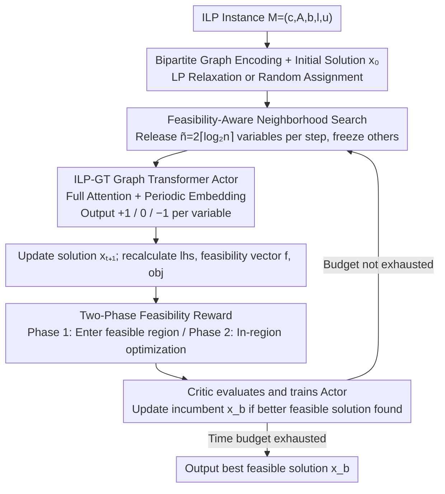

# RL-SPH: Learning to Achieve Feasible Solutions for Integer Linear Programs

**Conference**: ICML 2026  
**arXiv**: [2411.19517](https://arxiv.org/abs/2411.19517)  
**Code**: Repository address not directly provided in the paper  
**Area**: Reinforcement Learning / Combinatorial Optimization  
**Keywords**: Integer Linear Programming, Start Primal Heuristic, Reinforcement Learning, Graph Transformer, Feasibility Reward

## TL;DR
This paper proposes RL-SPH — an end-to-end reinforcement learning heuristic that is independent of external ILP solvers and can independently produce 100% feasible solutions. By using "feasibility reward + two-phase strategy + feasibility-aware neighborhood search," the Graph Transformer agent reduces the average primal gap by 28.6x on ILPs containing non-binary integer variables.

## Background & Motivation
**Background**: When solving NP-hard Integer Linear Programming (ILP), primal heuristics are used to quickly find feasible solutions. Recent end-to-end learning-based primal heuristics (E2EPH) use GNNs to learn commonalities across multiple ILP instances, directly predict variable values, and then rely on solvers like Gurobi/SCIP to repair them into feasible solutions.

**Limitations of Prior Work**: The feasibility of existing E2EPH methods almost entirely depends on external ILP solvers because imprecise ML predictions violate constraints. A few works attempting to produce feasible solutions independently (DDIM, DiffILO) still struggle with stable convergence, with feasibility rates far below 100%. Furthermore, most methods target only 0/1 binary variables; the probability of violating constraints increases exponentially when encountering Non-Binary Integer (NBI) variables with larger ranges.

**Key Challenge**: There is a fundamental misalignment between the "global one-time output" of ML end-to-end prediction and the "element-wise hard satisfaction" of ILP constraints. End-to-end supervised learning trained using MSE/CE lacks an explicit feedback channel for feasibility signals.

**Goal**: To train a start primal heuristic that is independent of solvers and can self-consistently produce feasible solutions (including non-binary integers), and to verify feasibility rates and solution quality across various binary/non-binary CO benchmarks.

**Key Insight**: The authors view searching for feasible solutions as a sequential decision process — where "increment by 1 / no change / decrement by 1" for each variable is the action, constraint violation is the negative reward, and achieving feasibility itself is a large reward. This directly embeds non-differentiable feasibility constraints into the RL reward.

**Core Idea**: Use "two-phase reward + feasibility-aware neighborhood selection + ILP-GT Graph Transformer" to allow the agent to first cross into the feasible region quickly and then gradually optimize within it, without requiring any external solver.

## Method

### Overall Architecture
The input is an arbitrary ILP instance $M=(\mathbf{c},\mathbf{A},\mathbf{b},l,u)$. RL-SPH encodes it as a "variable-constraint" bipartite graph and obtains an initial solution $\mathbf{x}_0$ through LP relaxation or random assignment. At each step $t$, feasibility-aware selection picks $\tilde n = 2\lceil\log_2 n\rceil$ changeable variables (freezing the others), which are fed into the ILP-GT actor to predict the action set $\mathcal{A}_t$ (each variable chooses from $\{+1,0,-1\}$). The solution is updated to $\mathbf{x}_{t+1}$, and the left-hand side $\mathbf{lhs}_{t+1}=\mathbf{Ax}_{t+1}$, feasibility vector $\mathbf{f}_{t+1}=\mathbf{b}-\mathbf{lhs}_{t+1}$, and objective value $obj_{t+1}$ are recomputed. Critic values are used for actor training; $\mathbf{x}_b, obj_b$ are updated whenever a feasible solution better than the incumbent is found. This continues until the external time budget is exhausted or all baselines complete their searches.

### Key Designs

**1. Two-Phase Reward: Decoupling "reaching feasibility" from "optimization within the feasible region"**

End-to-end supervised methods trained with MSE/CE lack an explicit feasibility feedback channel, leading to constraint violations if ML predictions are imprecise. RL-SPH embeds non-differentiable feasibility constraints directly into the reward, driven by two distinct sub-objectives. The Phase 1 main reward is $\mathcal R_{t, \text{F}}=\mathcal R_{t, \text{bound}}+\frac{1}{\sqrt{\tilde n}}\mathcal R_{t, \text{const}}$: where $\mathcal R_{t, \text{bound}}=-\sum_i\mathbb I(x_{t+1, i}\notin[l_i,u_i])$ penalizes out-of-bounds variables, and $\mathcal R_{t, \text{const}}=\sum_j\min(f_{t+1, j}, 0)-\min(f_{t, j}, 0)$ rewards "improvement" in each violated constraint. Only when variables are within bounds and constraints improve is $\Delta obj$ included. After entering the feasible region, it switches to Phase 2 $\mathcal R_{t, \text{p2}}$: providing positive $\Delta obj$ rewards for feasible solutions and negative $\mathcal R_{t, \text{F}}$ rewards for infeasible ones. A toward-optimal bias $\alpha=2$ encourages exploration toward regions better than the incumbent, while staying in place results in a heavy penalty of $-100$. This reward scheme is supported by Proposition 1, proving that if $\mathcal R_{t, \text{const}}>0$ and $\mathcal R_{t, \text{bound}}=0$ hold consistently, the agent will eventually reach the feasible region, transforming hard constraints into a reward-feasibility alignment guarantee.

**2. ILP-GT (ILP Graph Transformer): Capturing cross-constraint dependencies with full attention and resolving integer unboundedness with Periodic Embedding**

Traditional GCNs only aggregate first-order neighborhoods, failing to model long-range correlations between variables in ILPs. RL-SPH encodes the $\tilde n$ selected variables, their corresponding objective coefficients and constraint rows $(\mathbf c^\top|\mathbf A)$, and "reward context tokens" (phase, obj, feasibility vector) into a Transformer encoder — full attention naturally captures cross-constraint dependencies. Two engineering features handle the difficulties of feeding ILP into a Transformer: equilibration scaling normalizes $(\mathbf c^\top|\mathbf A)$ to $[-1,1]$ for stable training. Continuous variable values are encoded using Periodic Embedding $\operatorname{PE}(z)=\oplus(\sin(\tilde z),\cos(\tilde z))$ where $\tilde z=[2\pi w_1 z,\dots,2\pi w_k z]$, paired with a `bnd_lim` binary bit to indicate if a boundary is reached. This dual-track encoding of "continuous value + discrete boundary flag" resolves the issue of embedding unbounded integer values. The reward context includes phase identifiers, PE-transformed $obj$, and $\mathbf f_t$ normalized by $\sqrt{|\mathbf b|+|\mathbf b-\mathbf{lhs}_t|}$. Finally, phase-separated actor/critic heads with a shared backbone form an input sequence of length $\tilde n+3$.

**3. Feasibility-Aware Search Strategy: Releasing only $\Theta(\log n)$ most promising variables per step**

Single-variable local search is too slow, and naive LNS requires a feasible initial solution. RL-SPH combines "sub-problem repair" from RENS and "large neighborhood" ideas from LNS into a solver-independent RL framework, releasing $\tilde n=p+q$ variables per step while freezing others. In Phase 1, it weighted-randomly selects $p$ seed variables based on "frequency in violated constraints" and then selects $q$ neighbors that co-occur most frequently in the same violated constraints. In Phase 2, it prioritizes seeds with ample slack. $p=q=\lceil\log_2 n\rceil$ limits the Transformer input scale, allowing the method to scale to ILPs with tens of thousands of variables. Rollback rules also differ by phase: Phase 1 rolls back only when variables go out of bounds; Phase 2 rolls back whenever the new solution does not strictly improve the incumbent, ensuring monotonic progress.

### Loss & Training
Actor-Critic is employed: the actor encourages actions where $\mathcal{R}_{t,\text{total}}>V_\theta$ and suppresses low-reward actions; the critic uses regression loss to approximate true returns. Each instance stays in Phase 1 for a preset number of steps to ensure sufficient training before switching. Training requires only 1,000 instances, with an average training time of 30 minutes per instance, which is 14.7x faster than E2EPH baselines.

## Key Experimental Results

### Main Results
RL-SPH was compared across 5 NP-hard ILP benchmarks (MVC, IS, SC, CA, NBI) against 4 types of SPHs (FP / RENS / DHF / RHF) and 3 E2EPHs (PAS / DDIM / DiffILO), with a standardized 1000-second wall-clock budget.

| Dimension | RL-SPH | Existing SPH/E2EPH Baselines | Improvement |
|----------|--------|------------------------|------|
| Feasibility Rate (FR) | 100% (5/5 benchmarks) | Most <100%, some timeout failures | Only one fully feasible |
| Average Primal Gap | 1× | 28.6× | 28.6× better |
| Average Primal Integral | 1× | 2.6× | 2.6× better |
| Training Time | ~30 min | E2EPH average 7+ h | ~14.7× speedup |

### Ablation Study

| Configuration | Key Observation | Description |
|------|---------|------|
| Full RL-SPH | 100% FR + Lowest gap | Baseline |
| W/o phase-separated head | Significant gap increase | Two-phase reward requires dedicated network heads |
| $\alpha=1$ (No toward-optimal bias) | Phase 2 exploration stalls | Exploration bias is indispensable |
| Naive GNN instead of ILP-GT | Performance drops on large instances | Long-range dependencies require Transformer |
| Single-variable actions | Severe convergence degradation | Large neighborhood simultaneous updates are key |

### Key Findings
- Two-phase reward is the fundamental guarantee for the 100% feasibility rate: Proposition 1 strictly links "reward > 0" to "eventually entering the feasible region"; empirically, Phase 1 usually reaches feasibility within dozens of steps.
- RL-SPH shows the most significant advantage on non-binary integer benchmarks (NBI) — existing E2EPH violation rates spike as variable ranges widen, while the $\{+1,0,-1\}$ incremental action of RL is naturally suited for integer search.
- RL-SPH can serve as a warm-start for LNS or local branching, significantly reducing subsequent solving time; it maintains feasibility advantages on real MIPLIB instances.

## Highlights & Insights
- "Translates" feasibility constraints into reward signals with a theoretical Proposition proving reward-feasibility alignment — a rare formal feasibility guarantee in ML for CO work.
- The two-phase design cleverly resolves the conflict between "achieving feasibility" and "achieving optimality," preventing RL from getting stuck under sparse rewards.
- The dual-track encoding of Periodic Embedding + `bnd_lim` can be migrated to any scenario needing to feed unbounded integers into a Transformer (e.g., scheduling, layout).
- Adaptive neighborhood size $\tilde n=2\lceil\log_2 n\rceil$ allows the method to scale to ILPs with tens of thousands of variables.

## Limitations & Future Work
- The authors acknowledge that RL-SPH lacks an internal termination condition, relying on baseline completion time or external budgets; automatically determining "local optimality reached" remains an open problem.
- The integer action magnitude is fixed at $\pm 1$ (discussed in Appendix I.7); for ILPs with very large ranges (e.g., transport volumes of $10^4$), hierarchical actions or adaptive step sizes might be needed.
- The initial solution depends on LP relaxation or random assignment; future work could combine supervised warm-starts to further reduce Phase 1 steps.
- There is no explicit modeling of optimality proof; it only "obtains high-quality feasible solutions," leaving a gap between this and the exact guarantees of branch-and-bound.

## Related Work & Insights
- **vs PAS / Predict-and-Search (Han et al. 2023)**: PAS still requires SCIP for repair after trust region prediction; RL-SPH skips the solver entirely and applies to non-binary integers.
- **vs DiffILO (Geng et al. 2025)**: DiffILO uses diffusion models to sample solutions, but feasibility rates are unstable; RL-SPH achieves 100% FR through reward alignment.
- **vs Classic RENS / LNS**: RL-SPH borrows ideas from RENS ("fixing variables to solve sub-problems") and LNS ("large neighborhood search") but replaces solvers and heuristic rules with RL.
- Insight: In other learning tasks where "output must satisfy hard constraints" (e.g., circuit routing, VRP), using constraint improvement as a reward combined with a two-phase strategy may be equally applicable.

## Rating
- Novelty: ⭐⭐⭐⭐ First E2EPH with theoretical feasibility alignment guarantee and native support for non-binary integers.
- Experimental Thoroughness: ⭐⭐⭐⭐⭐ 5 benchmarks + 7 baselines + MIPLIB + solver integration + hyperparameter analysis.
- Writing Quality: ⭐⭐⭐⭐ Method diagrams and Algorithm 1 are clear; reward formulas involve many cases and require careful reading.
- Value: ⭐⭐⭐⭐ Provides a deployable route for "ML independently solving ILP" and can be reused for LNS warm-starts.

<!-- RELATED:START -->

## Related Papers

- [\[AAAI 2026\] DeepProofLog: Efficient Proving in Deep Stochastic Logic Programs](../../AAAI2026/reinforcement_learning/deepprooflog_efficient_proving_in_deep_stochastic_logic_programs.md)
- [\[ACL 2026\] A Survey of Reinforcement Learning for Large Language Models under Data Scarcity: Challenges and Solutions](../../ACL2026/reinforcement_learning/a_survey_of_reinforcement_learning_for_large_language_models_under_data_scarcity.md)
- [\[ICML 2026\] MoMa QL: 用矩匹配加速扩散/流匹配策略的离线 + 离线-在线 RL](moment_matching_q-learning.md)
- [\[ICML 2025\] Actor-Critics Can Achieve Optimal Sample Efficiency](../../ICML2025/reinforcement_learning/actor-critics_can_achieve_optimal_sample_efficiency.md)
- [\[ICML 2026\] RL4RLA: Teaching ML to Discover Randomized Linear Algebra Algorithms Through Curriculum Design and Graph-Based Search](rl4rla_teaching_ml_to_discover_randomized_linear_algebra_algorithms_through_curr.md)

<!-- RELATED:END -->
