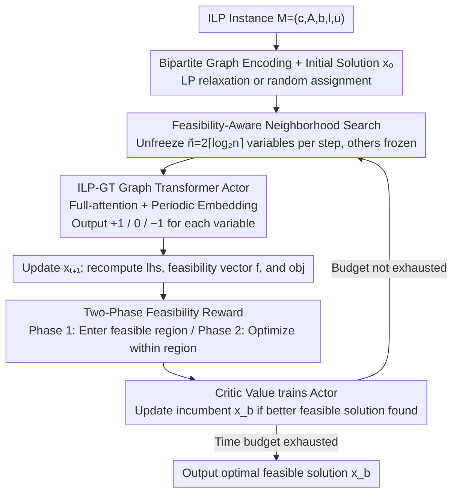

# RL-SPH: Learning to Achieve Feasible Solutions for Integer Linear Programs

**Conference**: ICML 2026  
**arXiv**: [2411.19517](https://arxiv.org/abs/2411.19517)  
**Code**: Repository address not directly provided in the paper  
**Area**: Reinforcement Learning / Combinatorial Optimization  
**Keywords**: Integer Linear Programming, Start Primal Heuristic, Reinforcement Learning, Graph Transformer, Feasibility Reward

## TL;DR
This paper proposes RL-SPH — an end-to-end Reinforcement Learning (RL) heuristic that does not rely on external ILP solvers and independently produces 100% feasible solutions. By utilizing "feasibility rewards + two-phase strategy + feasibility-aware neighborhood search," the Graph Transformer agent reduces the average primal gap by 28.6x on ILPs containing non-binary integer variables.

## Background & Motivation
**Background**: When solving NP-hard Integer Linear Programs (ILP), primal heuristics are used to quickly find feasible solutions. Recent end-to-end learning-based primal heuristics (E2EPH) use GNNs to learn commonalities across multiple ILP instances, directly predicting variable values, and then delegating to solvers like Gurobi/SCIP for repair into feasible solutions.

**Limitations of Prior Work**: The feasibility of existing E2EPH almost entirely depends on external ILP solvers because imprecise ML predictions violate constraints. A few works attempting to independently produce feasible solutions (e.g., DDIM, DiffILO) still struggle with stable convergence, with feasibility rates far below 100%. Furthermore, most methods target 0/1 binary variables; the probability of violating constraints increases exponentially when encountering Non-Binary Integer (NBI) variables with larger ranges.

**Key Challenge**: There is a fundamental mismatch between the "global one-time output" of ML end-to-end prediction and the "element-wise hard satisfaction" of ILP constraints. End-to-end supervised learning trained with MSE/CE lacks an explicit feedback channel for feasibility signals.

**Goal**: To train a start primal heuristic that does not rely on solvers and can self-consistently produce feasible solutions (including non-binary integers), while verifying feasibility rates and solution quality across binary/non-binary CO benchmarks.

**Key Insight**: The authors view finding a feasible solution as a sequential decision process — where actions are "increment 1 / stay / decrement 1" for each variable, constraint violations are negative rewards, and achieving feasibility itself is a large positive reward. This embeds non-differentiable feasibility constraints directly into RL rewards.

**Core Idea**: Use a "two-phase reward + feasibility-aware neighborhood selection + ILP-GT Graph Transformer" to allow the agent to quickly enter the feasible region and then incrementally optimize within it, without requiring any external solver throughout the process.

## Method

### Overall Architecture
The input is an arbitrary ILP instance $M=(\mathbf{c},\mathbf{A},\mathbf{b},l,u)$. RL-SPH first encodes it into a "variable-constraint" bipartite graph and obtains an initial solution $\mathbf{x}_0$ via LP relaxation or random assignment. At each step $t$, feasibility-aware selection picks $\tilde n = 2\lceil\log_2 n\rceil$ changeable variables (the rest are frozen) and feeds them into the ILP-GT actor to predict action sets $\mathcal{A}_t$ (choosing from $\{+1,0,-1\}$ for each variable). The solution is updated to $\mathbf{x}_{t+1}$, and the left-hand side $\mathbf{lhs}_{t+1}=\mathbf{Ax}_{t+1}$, feasibility vector $\mathbf{f}_{t+1}=\mathbf{b}-\mathbf{lhs}_{t+1}$, and objective value $obj_{t+1}$ are recomputed. Critic values are used for actor training; whenever a feasible solution better than the incumbent is found, $\mathbf{x}_b, obj_b$ are updated. This continues until the external time budget is exhausted or all baselines complete their search.

### Key Designs

**1. Two-Phase Reward: Decoupling "Achieving Feasibility" and "In-Region Optimization"**

End-to-end supervised methods trained with MSE/CE lack an explicit feasibility feedback channel. RL-SPH embeds non-differentiable feasibility constraints into rewards, driven by two distinct sub-objectives. The main reward for Phase 1 is $\mathcal R_{t,\text{F}}=\mathcal R_{t,\text{bound}}+\frac{1}{\sqrt{\tilde n}}\mathcal R_{t,\text{const}}$: where $\mathcal R_{t,\text{bound}}=-\sum_i\mathbb I(x_{t+1,i}\notin[l_i,u_i])$ penalizes bound violations, and $\mathcal R_{t,\text{const}}=\sum_j\min(f_{t+1,j},0)-\min(f_{t,j},0)$ rewards the "improvement" of each violated constraint. Objective changes $\Delta obj$ are only included if all variables are within bounds and constraints improve. Upon entering the feasible region, it switches to Phase 2 reward $\mathcal R_{t,\text{p2}}$: giving positive $\Delta obj$ rewards only for feasible solutions and negative $\mathcal R_{t,\text{F}}$ rewards for infeasible ones. A toward-optimal bias $\alpha=2$ encourages exploration towards regions better than the incumbent, while a heavy penalty of $-100$ for staying in place prevents stagnation. This reward system is backed by theory — Proposition 1 proves that as long as $\mathcal R_{t,\text{const}}>0$ and $\mathcal R_{t,\text{bound}}=0$ hold continuously, the agent will eventually enter the feasible region.

**2. ILP-Specific Graph Transformer (ILP-GT): Capturing Cross-Constraint Dependencies and Handling Unbounded Integers**

Traditional GCNs only aggregate first-order neighborhoods, offering insufficient modeling of long-range correlations between variables in ILPs. RL-SPH encodes the $\tilde n$ selected variables at each step, their corresponding objective coefficients, and constraint rows $(\mathbf c^\top|\mathbf A)$, along with "reward context tokens" (phase/obj/feasibility vector) into a Transformer encoder. Engineering highlights include: using equilibration scaling to normalize $(\mathbf c^\top|\mathbf A)$ to $[-1,1]$ for stable training; encoding continuous variable values via Periodic Embedding $\operatorname{PE}(z)=\oplus(\sin(\tilde z),\cos(\tilde z))$ where $\tilde z=[2\pi w_1 z,\dots,2\pi w_k z]$, paired with a `bnd_lim` binary indicator for boundary contact. This "continuous value + discrete boundary flag" dual-track encoding solves the embedding difficulty of unbounded integers.

**3. Feasibility-Aware Search Strategy: Unfreezing only $\Theta(\log n)$ Most Promising Variables**

Single-variable local search is too slow, and naive LNS requires a feasible initial solution. RL-SPH combines the "sub-problem repair" of RENS with the "large neighborhood" concept of LNS into a solver-free RL framework. In each step, it unfreezes $\tilde n=p+q$ variables most likely to improve feasibility. In Phase 1, $p$ seed variables are randomly sampled weighted by their "frequency in violated constraints," followed by $q$ neighbors that co-occur most frequently with the seeds in violated constraints. Phase 2 prioritizes seeds with ample slack. $p=q=\lceil\log_2 n\rceil$ limits the Transformer input scale, allowing the method to scale to ILPs with tens of thousands of variables. Rollback rules also differ: Phase 1 only rolls back on bound violations, while Phase 2 rolls back unless the new solution strictly improves the incumbent.

### Loss & Training
The framework utilizes Actor-Critic: the actor encourages actions where $\mathcal{R}_{t,\text{total}}>V_\theta$ and suppresses low-reward actions; the critic uses regression loss to approximate true returns. Each instance stays in Phase 1 for a preset number of steps to ensure sufficient training before switching. Training requires only 1,000 instances, with an average training time of 30 minutes per instance, roughly 14.7x faster than E2EPH baselines.

## Key Experimental Results

### Main Results
RL-SPH was compared against 4 types of SPH (FP / RENS / DHF / RHF) and 3 E2EPH (PAS / DDIM / DiffILO) on 5 NP-hard ILP benchmarks (MVC, IS, SC, CA, NBI), under a uniform 1000s wall-clock budget.

| Metric | RL-SPH | Existing SPH/E2EPH baselines | Gain |
|----------|--------|------------------------------|------|
| Feasibility Rate (FR) | 100% (5/5 benchmarks) | Most <100%, some timeout failures | Only one fully feasible |
| Average primal gap | 1× | 28.6× | 28.6× Better |
| Average primal integral | 1× | 2.6× | 2.6× Better |
| Training time | ~30 min | E2EPH avg 7+ h | ~14.7× Speedup |

### Ablation Study

| Configuration | Key Observation | Explanation |
|------|---------|------|
| Full RL-SPH | 100% FR + lowest gap | Baseline |
| W/o phase-separated head | Gap increases significantly | Two-phase rewards require matching network heads |
| $\alpha=1$ (No toward-optimal bias) | Phase 2 exploration stalls | Exploration bias is indispensable |
| Naive GNN replacing ILP-GT | Performance drops on large instances | Long-range dependencies require Transformer |
| Single-variable actions | Convergence speed severely degrades | Large neighborhood simultaneous updates are key |

### Key Findings
- The two-phase reward is the fundamental guarantee for 100% feasibility: Proposition 1 strictly links "reward > 0" to "eventually entering the feasible region"; empirically, Phase 1 usually reaches feasibility within dozens of steps.
- RL-SPH shows the most significant advantage on the Non-Binary Integer (NBI) benchmark — existing E2EPH constraint violation rates spike as variable ranges widen, while RL's $\{+1,0,-1\}$ incremental actions are naturally suited for integer search.
- RL-SPH can serve as a warm-start for LNS or local branching, significantly reducing subsequent solving time; it maintains feasibility advantages on real-world MIPLIB instances.

## Highlights & Insights
- "Translates" feasibility constraints into reward signals with a theoretical Proposition proof for reward-feasibility alignment — a rare formal feasibility guarantee in ML for CO.
- The two-phase design cleverly resolves the conflict between "achieving feasibility" and "achieving optimality," preventing RL from getting stuck under sparse rewards.
- The "continuous value + discrete boundary flag" dual-track encoding (Periodic Embedding + `bnd_lim`) is transferable to any scenario feeding unbounded integers to Transformers (e.g., scheduling, layout).
- The adaptive neighborhood size $\tilde n=2\lceil\log_2 n\rceil$ ensures scalability to large-scale ILPs.

## Limitations & Future Work
- Authors admit RL-SPH lacks an internal termination condition, relying on baseline completion times or external budgets; automatically determining "local optimality" remains an open problem.
- Integer action magnitude is fixed at $\pm 1$; for ILPs with massive ranges (e.g., transport volumes $10^4$), hierarchical actions or adaptive step sizes may be needed.
- Initial solutions rely on LP relaxation or random assignment; future work could combine supervised warm-starts to further reduce Phase 1 steps.
- There is no explicit modeling of optimality proofs; it only "gets high-quality feasible solutions," leaving a gap between this and the exact guarantees of branch-and-bound.

## Related Work & Insights
- **vs PAS / Predict-and-Search (Han et al. 2023)**: PAS requires SCIP for repair after prediction; RL-SPH skips the solver entirely and applies to non-binary integers.
- **vs DiffILO (Geng et al. 2025)**: DiffILO uses diffusion models to sample solutions, but feasibility is unstable; RL-SPH achieves 100% FR through reward alignment.
- **vs Classic RENS / LNS**: RL-SPH borrows the "sub-problem fixing" and "large neighborhood" ideas from RENS/LNS but replaces solvers and heuristics with RL.
- Insight: In other tasks requiring "outputs satisfying hard constraints" (e.g., circuit routing, VRP), treating constraint improvement as rewards paired with a two-phase strategy might be equally applicable.

## Rating
- Novelty: ⭐⭐⭐⭐ (First E2EPH with theoretical feasibility alignment and NBI support)
- Experimental Thoroughness: ⭐⭐⭐⭐⭐ (5 benchmarks + 7 baselines + MIPLIB + solver integration + hyperparameter analysis)
- Writing Quality: ⭐⭐⭐⭐ (Architecture and Algorithm 1 are clear; rewards require careful reading)
- Value: ⭐⭐⭐⭐ (Provides an engineering path for "ML solving ILP independently")

<!-- RELATED:START -->

## Related Papers

- [\[AAAI 2026\] DeepProofLog: Efficient Proving in Deep Stochastic Logic Programs](../../AAAI2026/reinforcement_learning/deepprooflog_efficient_proving_in_deep_stochastic_logic_programs.md)
- [\[ACL 2026\] A Survey of Reinforcement Learning for Large Language Models under Data Scarcity: Challenges and Solutions](../../ACL2026/reinforcement_learning/a_survey_of_reinforcement_learning_for_large_language_models_under_data_scarcity.md)
- [\[ICML 2026\] MoMa QL: 用矩匹配加速扩散/流匹配策略的离线 + 离线-在线 RL](moment_matching_q-learning.md)
- [\[ICLR 2026\] Breaking Safety Paradox with Feasible Dual Policy Iteration](../../ICLR2026/reinforcement_learning/breaking_safety_paradox_with_feasible_dual_policy_iteration.md)
- [\[ICML 2025\] Actor-Critics Can Achieve Optimal Sample Efficiency](../../ICML2025/reinforcement_learning/actor-critics_can_achieve_optimal_sample_efficiency.md)

<!-- RELATED:END -->
