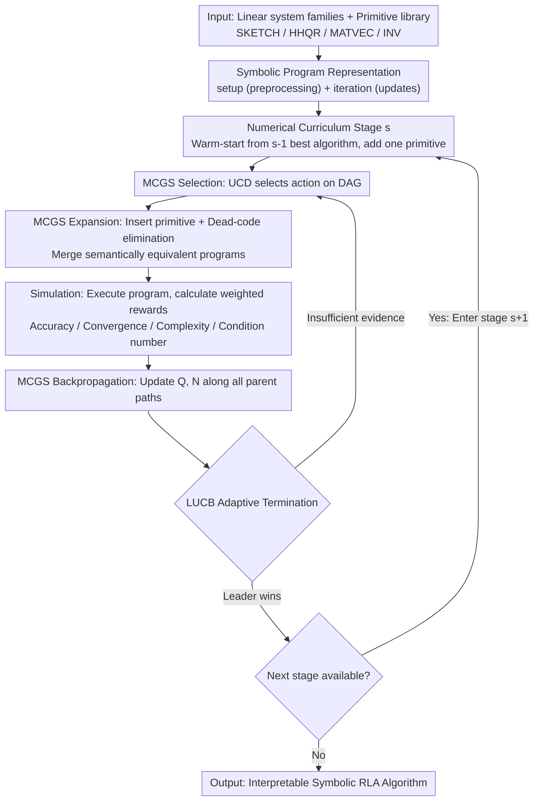

# RL4RLA: Teaching ML to Discover Randomized Linear Algebra Algorithms Through Curriculum Design and Graph-Based Search

**Conference**: ICML 2026  
**arXiv**: [2605.18004](https://arxiv.org/abs/2605.18004)  
**Code**: https://github.com/Tim-Xiong/RL4RLA  
**Area**: Reinforcement Learning / Algorithm Discovery / Randomized Numerical Linear Algebra  
**Keywords**: Curriculum Learning, Monte Carlo Graph Search, Symbolic Program Synthesis, Sketching Algorithms, Preconditioners  

## TL;DR
RL4RLA utilizes a "numerical curriculum of increasing difficulty + Monte Carlo Graph Search (MCGS)" to drive an RL agent to compose interpretable Randomized Numerical Linear Algebra (RLA) algorithms from linear algebra primitives, successfully reproducing classic methods such as Sketch-and-Precondition, Randomized Kaczmarz, and Newton Sketch.

## Background & Motivation
**Background**: Approaches like AlphaTensor, AlphaDev, FunSearch, and AlphaEvolve have pushed "algorithm discovery via search" into domains such as matrix multiplication, sorting, and mathematical theorems. However, Randomized Numerical Linear Algebra (RLA, e.g., sketching, leverage-score sampling, stochastic Krylov), which underpins large-scale scientific computing, has long relied on manual design by numerical analysis experts, lacking a general automated discovery framework.

**Limitations of Prior Work**: LLM-driven methods (FunSearch / AlphaEvolve / AlgoTune) rely heavily on pre-trained distributions and excel at "local optimization of existing implementations" (e.g., library swapping or JIT addition) rather than assembling new structures from scratch. Meanwhile, RLA algorithms are inherently multi-step with sparse rewards: a solution like Blendenpik requires sequential composition of 5–7 primitives (sketch → QR → construct preconditioner → iterative refinement), making it nearly impossible for vanilla RL to capture signals in an exponential program space.

**Key Challenge**: The "compositional depth" of high-performance RLA algorithms is positively correlated with the "reward sparsity" of RL search—the most valuable algorithms to discover often lack intermediate rewards to assist search convergence.

**Goal**: (i) Ensure search results are interpretable symbolic programs rather than black boxes; (ii) decompose the discovery of multi-step compositional algorithms into steps with sufficient local signals; (iii) create a reusable search engine for RLA primitives like sketching, preconditioning, and importance sampling.

**Key Insight**: The authors leverage the "compositional patterns" of RLA—most high-performance RLA algorithms can be expressed as a two-part structure: setup (sketch, factorize) + iteration (preconditioned update). Furthermore, a natural "difficulty ladder" exists among classic algorithms: Landweber → GD → Preconditioned GD → Sketched Preconditioned GD → Subsampling → Leverage-Score Sampling, where each step adds a single primitive to resolve a numerical failure mode exposed by the previous step.

**Core Idea**: "Algorithm discovery" is modeled as sequential decision-making by MCGS on a symbolic program DAG. A curriculum progressing through "numerical failure modes" teaches the agent to add new primitives step-by-step, compressing the exponential search space into several shallow local problems.

## Method

### Overall Architecture
RL4RLA represents each candidate algorithm as an explicit symbolic program $\mathcal{A}=(\mathcal{P}_{\text{setup}},\mathcal{P}_{\text{iteration}})$. The setup segment performs one-time preprocessing (sketching, factorization), while the iteration segment defines iterative updates. Programs are constructed by sequentially inserting primitives of the form "`target ← operator(operand_1, operand_2)`". The primitive library includes SKETCH, HHQR, MATVEC, INV, etc. A type system ensures every insertion produces an executable program, followed by automatic dead-code elimination. The curriculum divides the global search into $S$ stages $(\mathcal{C}_s)_{s=1}^{S}$, where each stage $\mathcal{C}_s=(A_s,b_s,\mathbf{w}_s)$ specifies a family of linear systems and a set of reward weights. Search in stage $s$ is warm-started from the best algorithm found in stage $s-1$, learning only one new primitive. Each candidate algorithm undergoes MCGS selection → expansion → simulation → backpropagation: during simulation, the symbolic program is executed on sampled random problem instances, and rewards are calculated based on residual, monotonic convergence, complexity, and condition numbers. LUCB adaptive termination determines when a stage is complete.

### Key Designs

**1. Numerical Curriculum: Converting sparse reward deep composition into shallow search**

Algorithms like Blendenpik involve 5–7 steps where rewards are only settled at the end. Vanilla RL finds almost no signal in the exponential program space. RL4RLA's countermeasure is to manually construct a ladder of problem instances, where each level introduces **exactly one** numerical failure mode, forcing the agent to supplement the previous stage's optimal algorithm with one primitive. Starting from a $5\times 5$ well-conditioned system (where Landweber converges), it expands to $m\times n$ rectangular matrices (forcing normal equations), then to $10000\times 50$ ill-conditioned matrices (forcing a preconditioner $M=R$ such that $\kappa(AR^{-1})\approx 1$), increases complexity penalties (forcing sketched QR $SA=QR^{-1}$ to recover Blendenpik), requires subsampling, and finally forces leverage-score sampling for heavy-tailed distributions. This injects the inductive bias of numerical analysis into the RL environment, slicing a globally sparse space into locally dense problems.

**2. Monte Carlo Graph Search (MCGS) + UCD: Merging semantically equivalent programs**

In RLA, the same algorithm can often be constructed via different action sequences. Standard MCTS repeatedly expands these algebraically equivalent paths, wasting expensive execution budgets. MCGS upgrades the search structure from a tree to a DAG $\mathcal{G}=(\mathcal{S},\mathcal{E})$. When expanding a node, if a normalized program (after dead-code elimination) already exists, a parent edge is connected to the existing node. During backpropagation, the reward $R$ from a rollout is synchronized along all paths leading to that state using $N(s,a)\leftarrow N(s,a)+1$ and $\hat{Q}(s,a)\leftarrow \hat{Q}(s,a)+(R-\hat{Q}(s,a))/N(s,a)$. Action selection uses UCD calibrated for DAGs: $a'=\arg\max_a[\hat{Q}(s,a)+c\sqrt{\log N(s)/N(s')}]$, where normalization uses child node visits $N(s')$ instead of edge visits, preventing UCT from giving "free" exploration rewards to nodes with multiple parents.

**3. LUCB Adaptive Termination + Multi-objective Reward: Removing manual budget bias**

Fixed playout budgets introduce human bias and prevent fair comparisons. RL4RLA uses Lower/Upper Confidence Bounds at each decision point to find the leader $a_{\text{leader}}$ and the challenger $a_{\text{challenger}}$. When $\hat{Q}(a_{\text{leader}})-U(a_{\text{leader}})>\hat{Q}(a_{\text{challenger}})+U(a_{\text{challenger}})$, the root node advances. The reward is defined as $R(\mathcal{A})=\sum_{k\in\{\text{acc},\text{decay},\text{comp},\text{cond}\}} w_k R_k$, accounting for relative residual ($R_{\text{acc}}$), worst-case contraction ratio ($R_{\text{decay}}$), computational cost ($R_{\text{comp}}$), and condition number ($R_{\text{cond}}$). Adjusting weights $w_k$ guides the curriculum toward specific primitives (e.g., increasing $w_{\text{cond}}$ to force preconditioning).

### Loss & Training
No neural networks are trained; "learning" occurs via the $(\hat{Q},N)$ statistics of MCGS. A complete pass through the curriculum constitutes one "training run." For each target algorithm, 20 runs are conducted to evaluate success rate and playouts-to-success. The primitive library typically scales from 17 to 25.

## Key Experimental Results

### Main Results
Evaluated across 5 curricula: 4 linear systems (Preconditioned Weighted SGD, Block Randomized Kaczmarz, Subsampled Least Square GD, Sketched Preconditioned GD) + Newton Sketch for logistic regression.

| Target Algorithm | Method | Playouts ↓ | Time (s) / Success Rate |
|--------|------|------|----------|
| Preconditioned Weighted SGD | MCTS | 34902 | 380.7 / 75% |
| | MCGS+UCT | 13037 | 193.2 / 80% |
| | **MCGS+UCD** | **10721** | **191.1 / 80%** |
| Block Randomized Kaczmarz | MCTS | 66468 | 468.0 / 75% |
| | **MCGS+UCD** | **25158** | **205.0 / 75%** |
| Subsampled Least Square GD | MCTS | 15847 | 10.4 / 75% |
| | **MCGS+UCD** | **5061** | 8.9 / 80% |
| Sketched Preconditioned GD | MCTS | 17655 | 142.9 / 75% |
| | **MCGS+UCD** | **6034** | 58.4 / 75% |
| Newton Sketch | MCTS | 2557 | 5949.6 / 100% |
| | **MCGS+UCD** | **1416** | **4480.9 / 100%** |

Across all curricula, MCGS reduces playouts by 2–3x compared to MCTS. The more compositional the target (deeper, sparser rewards), the more UCD outperforms UCT—specifically, UCD requires 35% fewer playouts than UCT for Block Randomized Kaczmarz.

### Ablation Study

| Configuration | Key Finding | Description |
|------|---------|------|
| Full Curriculum + MCGS+UCD | Newton Sketch 100% success | Complete proposal |
| Skipping any curriculum stage | Newton Sketch **0%** success | Curriculum is a prerequisite for reachability |
| MCGS Merging Rate (len=8/10/12) | revisit ratio 0.578 / 0.530 / 0.520 | Merging benefits decay slowly as programs lengthen |
| MCGS Primitive Library 17→25 | revisit ratio 0.578→0.533 | Merging remains effective as library size increases |
| Generalization to PSD Eigenproblems | 3-stage curriculum 100% success | Only required adding `VEC_NORMALIZE` and Rayleigh quotient reward |

### Key Findings
- The 0% vs. 100% success rate for Newton Sketch demonstrates that the curriculum is a "reachability tool" rather than just an accelerator—certain algorithms are unreachable for RL within reasonable budgets without stage-wise guidance.
- MCGS advantages increase monotonically with compositional depth.
- The gap between UCD and UCT is most pronounced in the sparsest reward tasks, confirming theoretical analysis regarding MCTS exploration rewards on multi-parent nodes.

## Highlights & Insights
- "Lining up numerical failure modes as a ladder" is an elegant inductive bias engineering approach. It translates numerical analysis domain knowledge into an RL curriculum, providing search direction while allowing the agent to discover novel combinations.
- MCGS + UCD is a significant, often overlooked improvement for "Program Synthesis + MCTS" workflows: when the search target allows for canonicalization (e.g., algebraic equivalence in linear algebra, SQL normalization), DAG search provides 2–3x acceleration with minimal changes.
- LUCB early stopping + multi-objective rewards provide a reusable template for discovery tasks where "algorithm quality" is aweighted sum of several numerical metrics.

## Limitations & Future Work
- The experiments focus on "rediscovering" classic algorithms rather than discovering entirely new ones; discovering novel algorithms may require larger budgets and systematic formal analysis.
- The curriculum is still manually designed—the agent lacks the ability to automatically identify the "next failure mode."
- Evaluations are performed on synthetic systems; it remains to be seen if discovered algorithms remain Pareto optimal on real-world scientific computing workloads.
- The primitive library is currently limited to numerical linear algebra; expansion to Krylov subspaces or PDE operators requires redesigning the type system.

## Related Work & Insights
- **vs FunSearch / AlphaEvolve**: These use LLMs as mutation operators, biasing search toward the pre-training distribution. RL4RLA does not rely on pre-training and searches on explicitly typed symbolic programs for better control and interpretability.
- **vs AlgoTune**: AlgoTune optimizes existing implementations at the parameter/implementation level; RL4RLA synthesizes algorithmic structures.
- **vs AlphaTensor / AlphaDev**: While sharing MCTS roots, these operate on tensor decomposition or assembly spaces. This work switches the domain to "symbolic linear algebra programs" and addresses reward sparsity via curricula.
- **vs Learned Sketching**: These neuralize single components (outputting parameters); RL4RLA outputs readable symbolic programs for verification by numerical analysts.

## Rating
- Novelty: ⭐⭐⭐⭐⭐ 
- Experimental Thoroughness: ⭐⭐⭐⭐ 
- Writing Quality: ⭐⭐⭐⭐⭐ 
- Value: ⭐⭐⭐⭐ 

<!-- RELATED:START -->

## Related Papers

- [\[ICML 2026\] Provable Benefit of Curriculum in Transformer Tree-Reasoning Post-Training](provable_benefit_of_curriculum_in_transformer_tree-reasoning_post-training.md)
- [\[ICML 2026\] Adaptive Bandit Algorithms for Contextual Matching Markets](adaptive_bandit_algorithms_for_contextual_matching_markets.md)
- [\[ICML 2026\] The Surprising Difficulty of Search in Model-Based Reinforcement Learning](the_surprising_difficulty_of_search_in_model-based_reinforcement_learning.md)
- [\[ICML 2026\] Learning to Search and Searching to Learn for Generalization in Planning](learning_to_search_and_searching_to_learn_for_generalization_in_planning.md)
- [\[ICML 2026\] Learning to Approximate Uniform Facility Location via Graph Neural Networks](learning_to_approximate_uniform_facility_location_via_graph_neural_networks.md)

<!-- RELATED:END -->
