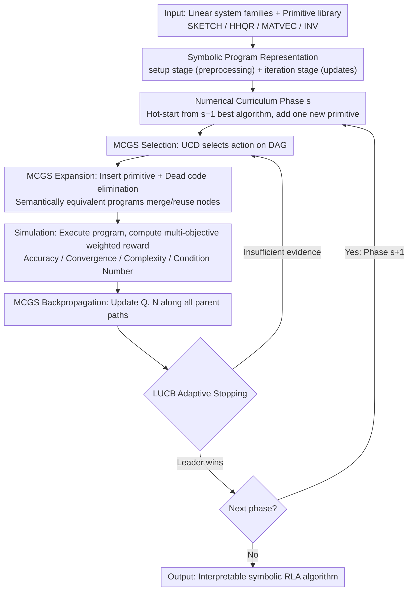

# RL4RLA: Teaching ML to Discover Randomized Linear Algebra Algorithms Through Curriculum Design and Graph-Based Search

**Conference**: ICML 2026  
**arXiv**: [2605.18004](https://arxiv.org/abs/2605.18004)  
**Code**: https://github.com/Tim-Xiong/RL4RLA  
**Area**: Reinforcement Learning / Algorithm Discovery / Randomized Numerical Linear Algebra  
**Keywords**: Curriculum Learning, Monte Carlo Graph Search, Symbolic Program Synthesis, Sketching Algorithms, Preconditioners  

## TL;DR
RL4RLA uses a "numerical curriculum of increasing difficulty + Monte Carlo Graph Search (MCGS)" to drive an RL agent to compose interpretable Randomized Numerical Linear Algebra (RLA) algorithms from linear algebra primitives, successfully reproducing classic methods such as Sketch-and-Precondition, Randomized Kaczmarz, and Newton Sketch.

## Background & Motivation
**Background**: AlphaTensor, AlphaDev, FunSearch, and AlphaEvolve have advanced "algorithm discovery through search" in multiple domains such as matrix multiplication, sorting, and mathematical theorems. However, Randomized Numerical Linear Algebra (RLA, e.g., sketching, leverage-score sampling, stochastic Krylov), which underpins large-scale scientific computing, has long relied on manual design by numerical analysis experts, with almost no general framework for automated discovery.

**Limitations of Prior Work**: LLM-driven methods (FunSearch / AlphaEvolve / AlgoTune) rely heavily on pre-training distributions and excel at "local optimization of existing implementations" (library replacement, adding JIT) rather than assembling new structures from scratch. Meanwhile, RLA algorithms are inherently multi-step with sparse rewards: a solution like Blendenpik requires sequentially combining 5–7 primitives (sketch → QR → construct preconditioner → iterative refinement), making it nearly impossible for vanilla RL to capture signals in an exponential program space.

**Key Challenge**: The "compositional depth" of high-performance RLA algorithms is positively correlated with the "reward sparsity" of RL search—the more valuable the algorithm is to discover, the fewer intermediate rewards exist to aid search convergence.

**Goal**: (i) Ensure search results are interpretable symbolic programs rather than black boxes; (ii) Decompose the discovery of multi-step compositional algorithms into steps with sufficient local signals; (iii) Build a reusable search engine for RLA primitives such as sketch, precondition, and importance sampling.

**Key Insight**: The authors identify the "compositional patterns" of RLA—most high-performance RLA algorithms can be written in a two-stage structure: setup (sketch, factorize) + iteration (preconditioned update). Furthermore, a natural "difficulty ladder" exists among classic algorithms: Landweber → GD → Preconditioned GD → Sketched Preconditioned GD → Subsampling → Leverage-Score Sampling, where each step adds only one primitive to resolve a numerical failure mode exposed by the previous step.

**Core Idea**: Modeling "algorithm discovery" as sequential decision-making for MCGS on a symbolic program DAG, and using a curriculum that progresses through "numerical failure modes" to teach the agent to add new primitives step-by-step, compressing the exponential search space into several shallow local problems.

## Method

### Overall Architecture
RL4RLA represents each candidate algorithm as an explicit symbolic program $\mathcal{A}=(\mathcal{P}_{\text{setup}},\mathcal{P}_{\text{iteration}})$: the setup stage performs one-time preprocessing (sketching, factorization), and the iteration stage defines iterative updates. Programs are constructed by sequentially inserting primitive instructions of the form "`target ← operator(operand_1, operand_2)`". The primitive library includes SKETCH, HHQR, MATVEC, INV, etc. The type system ensures that each insertion produces an executable program, followed by automatic dead code elimination. The curriculum splits the global search into $S$ phases $(\mathcal{C}_s)_{s=1}^{S}$, where each phase $\mathcal{C}_s=(A_s,b_s,\mathbf{w}_s)$ specifies a family of linear systems and a set of reward weights. Search in phase $s$ is hot-started from the best algorithm found in phase $s-1$, learning only one new primitive. For each candidate algorithm, MCGS performs selection → expansion → simulation → backpropagation: during simulation, the symbolic program is executed on sampled random problem instances, and rewards are weighted based on residual / monotonic convergence / complexity / condition number. Finally, LUCB adaptive stopping determines phase completion.

### Key Designs

**1. Numerical Curriculum: Decomposing deep compositional discovery into shallow steps**

For a 5–7 step compositional algorithm like Blendenpik, rewards are only settled at the end, making signals nearly invisible to vanilla RL. RL4RLA’s strategy is to manually pave a difficulty ladder of problem instances, introducing only **one** numerical failure mode at each level. This forces the agent to add exactly one primitive to the previous phase's optimal algorithm: starting from $5\times 5$ well-conditioned systems, moving to $m\times n$ rectangular matrices, then to $10000\times 50$ ill-conditioned matrices (forcing a preconditioner $M=R$ s.t. $\kappa(AR^{-1})\approx 1$), then increasing complexity penalties (forcing a switch from QR to sketched QR $SA=QR^{-1}$), and finally requiring subsampling and leverage-score sampling. Correspondingly, reward weights $\mathbf{w}_s$ amplify failing signals from the previous stage. This injects the inductive bias of "how numerical analysts designed Blendenpik" into the RL environment.

**2. Monte Carlo Graph Search (MCGS) + UCD: Merging semantically equivalent programs**

Standard MCTS treats paths as a tree, repeatedly expanding algebraically equivalent paths and wasting execution budget. MCGS upgrades the search structure to a DAG $\mathcal{G}=(\mathcal{S},\mathcal{E})$: if a normalized program (after dead code elimination) already exists, a new parent edge is linked to reuse the old node. During backpropagation, the reward $R$ from a rollout is synchronized along all paths to that state by updating $N(s,a)$ and $\hat{Q}(s,a)$. Action selection utilizes UCD calibrated for DAGs: $a'=\arg\max_a[\hat{Q}(s,a)+c\sqrt{\log N(s)/N(s')}]$, using child node visit counts $N(s')$ for normalization to avoid "phantom" exploration bonuses in multi-parent scenarios.

**3. LUCB Adaptive Stopping + Multi-objective Reward: Removing budget bias**

Fixed playout budgets introduce human bias and hinder fair comparison. RL4RLA uses Lower/Upper Confidence Bounds at each decision point to find the current $a_{\text{leader}}$ and $a_{\text{challenger}}$. Execution proceeds when the leader's lower bound exceeds the challenger's upper bound. Rewards are defined as $R(\mathcal{A})=\sum_{k\in\{\text{acc},\text{decay},\text{comp},\text{cond}\}} w_k R_k$, balancing relative residual, contraction ratio, computational cost, and condition number. Adaptive stopping enables fair comparison, while weighted rewards serve as the primary lever for the curriculum.

## Key Experimental Results

### Main Results
Evaluation across 5 curricula: 4 linear systems + 1 Newton Sketch for logistic regression. Each transition was run 20 times with LUCB early stopping.

| Target Algorithm | Method | Playouts ↓ | Time (s) / Success Rate |
|--------|------|------|----------|
| Preconditioned Weighted SGD | MCTS | 34902 | 380.7 / 75% |
| | MCGS+UCT | 13037 | 193.2 / 80% |
| | **MCGS+UCD** | **10721** | **191.1 / 80%** |
| Block Randomized Kaczmarz | MCTS | 66468 | 468.0 / 75% |
| | **MCGS+UCD** | **25158** | **205.0 / 75%** |
| Subsampled Least Square GD | MCTS | 15847 | 10.4 / 75% |
| | **MCGS+UCD** | **5061** | 8.9 / 80% |
| Sketched Preconditioned GD | MCTS | 17655 | 142.9 / 75% |
| | **MCGS+UCD** | **6034** | 58.4 / 75% |
| Newton Sketch | MCTS | 2557 | 5949.6 / 100% |
| | **MCGS+UCD** | **1416** | **4480.9 / 100%** |

Across all curricula, MCGS reduced playouts by 2–3× compared to MCTS. UCD outperformed UCT as compositional depth and reward sparsity increased.

### Ablation Study
| Configuration | Key Phenomenon | Explanation |
|------|---------|------|
| Full Curriculum + MCGS+UCD | Newton Sketch 100% success | Complete framework |
| Skip any curriculum stage | Newton Sketch **0%** success | Curriculum is a prerequisite for reachability, not just acceleration |
| MCGS Node Merging Rate (len=8/10/12) | Revisit ratio 0.578 / 0.530 / 0.520 | Benefit of merging persists as programs lengthen |
| Primitives 17 → 25 | Revisit ratio 0.578 → 0.533 | Merging remains effective as library size grows |
| Generalization to PSD Eigenproblems | 3-stage curriculum 100% success | Only requires adding `VEC_NORMALIZE` and Rayleigh quotient reward |

### Key Findings
- The 0% vs 100% success rate on Newton Sketch demonstrates that the curriculum is a "reachability tool": some algorithms can never be found within a reasonable budget without stage-wise guidance.
- MCGS advantages increase monotonically with compositional depth.
- The framework's domain adaptation only requires a thin interface (primitive set + constraints + reward), making it feasible for other numerical algorithm discovery tasks.

## Highlights & Insights
- "Ladders of numerical failure modes" are an elegant form of inductive bias engineering, translating domain knowledge into RL curricula while leaving room for the agent to compose novel solutions.
- MCGS + UCD is an undervalued combination in program synthesis: when search targets can be deduplicated via normalization (e.g., algebraic equivalence), DAG search yields 2–3× speedups with minimal changes.
- Adaptive stopping via LUCB allows for fair comparisons by removing manual budget tuning.

## Limitations & Future Work
- The experiments focus on "re-discovering" classic algorithms rather than "discovering entirely new" ones.
- Curricula are still manually designed; automating the discovery of the "next failure mode" remains an open problem.
- Evaluation is performed on synthetic systems; verification on real-world scientific computing workloads is needed.
- The primitive library must be expanded for higher-level operations like Krylov subspaces or PDE operators.

## Related Work & Insights
- **vs FunSearch / AlphaEvolve**: These use LLMs as mutation operators, biasing search toward the pre-training distribution. RL4RLA relies on no such priors and searches in an explicitly typed symbolic space, offering better control and interpretability.
- **vs AlgoTune**: AlgoTune performs parameter/implementation-level tuning on existing code. RL4RLA performs algorithm-level structural synthesis.
- **vs AlphaTensor / AlphaDev**: While also using MCTS-style discovery, RL4RLA operates in the "symbolic linear algebra program" space and specifically addresses reward sparsity via curricula.

## Rating
- Novelty: ⭐⭐⭐⭐⭐ 
- Experimental Thoroughness: ⭐⭐⭐⭐ 
- Writing Quality: ⭐⭐⭐⭐⭐ 
- Value: ⭐⭐⭐⭐ 

<!-- RELATED:START -->

## Related Papers

- [\[ICML 2026\] Provable Benefit of Curriculum in Transformer Tree-Reasoning Post-Training](provable_benefit_of_curriculum_in_transformer_tree-reasoning_post-training.md)
- [\[ICML 2026\] Adaptive Bandit Algorithms for Contextual Matching Markets](adaptive_bandit_algorithms_for_contextual_matching_markets.md)
- [\[ICML 2026\] The Surprising Difficulty of Search in Model-Based Reinforcement Learning](the_surprising_difficulty_of_search_in_model-based_reinforcement_learning.md)
- [\[ICML 2026\] Learning to Search and Searching to Learn for Generalization in Planning](learning_to_search_and_searching_to_learn_for_generalization_in_planning.md)
- [\[ICML 2026\] Learning to Approximate Uniform Facility Location via Graph Neural Networks](learning_to_approximate_uniform_facility_location_via_graph_neural_networks.md)

<!-- RELATED:END -->
