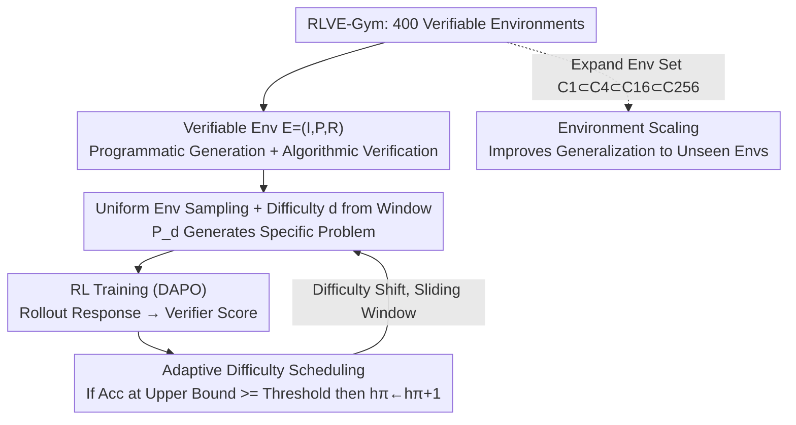

# RLVE: Scaling Up Reinforcement Learning for Language Models with Adaptive Verifiable Environments

**Conference**: ICML2026  
**arXiv**: [2511.07317](https://arxiv.org/abs/2511.07317)  
**Code**: https://github.com/Zhiyuan-Zeng/RLVE  
**Area**: Reinforcement Learning  
**Keywords**: RLVR, Verifiable Environments, Adaptive Difficulty, Reasoning Ability, Environment Scaling

## TL;DR
RLVE transforms language model RL training from "static problem sets" into 400 **programmable verifiable environments** where problems are algorithmically generated and rewards are verified via code. By adaptively increasing problem difficulty as the policy model improves, the training signal is kept at the frontier of model capability; on a strong 1.5B model already saturated by standard RLVR, RLVE achieves a $3.37\%$ average gain across six reasoning benchmarks using only 1/3 of the compute (compared to a $0.49\%$ gain from continued standard RL).

## Background & Motivation
**Background**: Scaling RL, particularly RL with verifiable rewards (RLVR), has been proven to consistently improve LMs. However, models often hit **saturation** on finite training datasets, making further training ineffective.

**Limitations of Prior Work**: Two major hurdles exist in scaling RL data. First, **Cost**: Verifiable rewards typically require "problem + ground-truth answer" pairs, which are extremely expensive to collect at scale (e.g., DeepMath-103K cost approximately $138,000 and 127,000 GPU hours). Second, **Stalling**: When problems are **too easy** for the current policy, there is no learning signal; when they are **too hard**, the model consistently receives low rewards, choking gradient updates. In typical LM RL training, problem distributions are **fixed beforehand and remain static**, failing to evolve with the policy—a sorting task that is "challenging" at the start of training becomes trivial as the model improves, while tasks that were initially too difficult remain out of reach even when the model has matured enough to learn them.

**Key Challenge**: There is a fundamental mismatch between static data distributions and the "dynamic increase in policy capability"—leading either to premature saturation (low difficulty ceiling) or inefficient learning because only a small subset of problems fall within the appropriate difficulty range.

**Goal**: Enable training data that (1) can be infinitely and programmatically generated to bypass collection costs, (2) provides algorithmically verifiable rewards, and (3) adaptively increases in difficulty to consistently supply problems that are "neither too easy nor too hard."

**Key Insight**: The authors abstract the data source from "problem sets" into "**verifiable environments**"—triplets capable of generating infinite problems based on difficulty parameters and verifying outputs via code. A sliding difficulty window is then applied to each environment based on model performance.

**Core Idea**: Replace static problem sets with verifiable environments, allowing the difficulty distribution to "chase the model's capability," and treat the environment collection itself as a new scaling dimension.

## Method

### Overall Architecture
RLVE training data originates from a set of **verifiable environments** rather than a fixed bank. To generate a training problem: one environment $E^{(i)}$ is sampled uniformly from $n$ environments; a difficulty $d$ is sampled uniformly from the environment's current difficulty window $[\ell_\pi^{(i)},h_\pi^{(i)}]$; specific problems are programmatically created by the generator $\mathcal{P}_d$; and the model's response is scored algorithmically by the environment's verifier $R$. Each environment independently maintains its difficulty window and statistics $(a^{(i)},b^{(i)})$ (correct/total rollouts at the upper difficulty bound). When accuracy at the upper bound reaches a threshold, $h_\pi$ is increased and the window shifts right. This mechanism can be integrated with any RL algorithm using "environment-provided rewards" (this paper uses DAPO). RLVE-Gym consists of 400 such environments created through "environment engineering," following principles of instructional utility, verification via environmental advantage, and configurable difficulty.

### Key Designs

**1. Verifiable Environments: Abstracting Data Sources into Programmable Triplets**

Addressing the "collection cost" bottleneck, RLVE defines training data as a triplet $E=(I,\mathcal{P},R)$, where $I$ is an input template, $\mathcal{P}$ is a problem generator, and $R$ is a verifier (reward function). Both $\mathcal{P}$ and $R$ are **programs**. Each environment includes an integer difficulty $d\in[0,+\infty)$ that controls reasoning complexity (e.g., array length in a sorting environment). A concrete problem $E_p=(I_p,R_p)$ is instantiated via parameters $p\sim\mathcal{P}_d$, and the verifier computes a scalar reward $R_p(o)\in\mathbb{R}$. This offers two key advantages: first, the generator can provide **infinite problems**, bypassing the non-scalable nature of manual annotation; second, it leverages the **asymmetry between environment and LM capabilities**—the environment can execute code (e.g., using an actual solver to verify the LM's manual calculation) and only needs to "verify" rather than "solve." Many tasks are **easier to verify than to solve** (e.g., Sudoku rules are easy to check but hard to solve; NP-complete problems like SAT or Hamiltonian path possess this inherent asymmetry). This allows supervision signals to cover complex tasks that are difficult even for humans to solve.

**2. Adaptive Difficulty Scheduling: Anchoring Signals to the Model’s Frontier**

Addressing the "no signal when easy, gradient stall when hard" bottleneck, RLVE maintains a difficulty window $[\ell_\pi, h_\pi]$ for each environment. Initially, $\ell_\pi=h_\pi=0$ (starting with the simplest problems). For problem generation, $d$ is sampled uniformly from $[\ell_\pi, h_\pi]$. The system tracks the number of correct rollouts $a$ and total rollouts $b$ at the upper difficulty bound $\mathcal{P}_{h_\pi}$. When $b$ exceeds a minimum sample threshold $\tau_{\text{num}}$, the accuracy $a/b$ is compared to a threshold $\tau_{\text{acc}}$ (e.g., $90\%$): if $a/b \geq \tau_{\text{acc}}$, the model is considered proficient at that level, $h_\pi$ is incremented ($h_\pi \leftarrow h_\pi+1$) to introduce harder problems, and $(a,b)$ are reset. There is **no predefined limit** for $h_\pi$—it climbs as long as the model succeeds. To prevent the window from becoming excessively wide (which dilutes exposure to hard problems), a hyperparameter $d_\Delta > 1$ caps the window width: if $h_\pi - \ell_\pi + 1 > d_\Delta$ after an update, $\ell_\pi$ is adjusted to $h_\pi - d_\Delta + 1$, creating a **sliding window**. Intuitively, the model performs well on $\mathcal{P}_{h_\pi-1}$ but has not yet mastered $\mathcal{P}_{h_\pi}$, ensuring problems consistently fall in the "Goldilocks zone." Crucially, each environment maintains its statistics independently, as the definition of "difficulty levels" varies across tasks.

**3. Configurable Difficulty + Environment Scaling: Monotonic Control and New Scaling Dimensions**

To ensure that $d$ monotonically represents "increased difficulty," the authors ensure that **problems at lower difficulty levels can be reduced to sub-problems of higher levels** (e.g., the ability to sort $N+1$ elements implies the ability to sort $N$; the ability to integrate a function with $N+1$ nodes implies integration of $N$ nodes). Consequently, increasing $d$ corresponds to longer arrays or larger expression trees. Furthermore, the **environment set itself** is treated as a scaling dimension. By constructing nested sets $\mathcal{C}_1 \subset \mathcal{C}_4 \subset \mathcal{C}_{16} \subset \mathcal{C}_{256}$, experiments show that across 50 held-out environments, larger training sets lead to better generalization to **environments unseen during training**. This suggests that simply increasing data volume from one environment is insufficient; generalization is driven by scaling the number of environments—echoing findings in classic RL and SFT where task variety is more critical than raw sample size.

### Loss & Training
The RL algorithm used is **DAPO** (a variant of GRPO), though any RLVR-compatible algorithm works. Following DAPO's **dynamic sampling**, each rollout step uses a larger prompt batch than the training batch, discarding prompts where all outputs receive the same reward (no gradient contribution). The paper defines the **Effective Prompt Ratio** (the percentage of prompts with non-identical rewards not discarded by dynamic sampling) as a proxy for learning efficiency—a higher ratio indicates more problems are at the appropriate difficulty, reducing wasted rollout compute (the typical bottleneck in LM RL).

## Key Experimental Results

Evaluation uses six reasoning benchmarks: Math (AIME 2024/2025, OMEGA-500, OlympiadBench), Code (LiveCodeBench), and Logic (BBEH).

### Main Results
Two scaling scenarios:

| Scenario | Starting Model | Method | Avg. Gain | Compute |
| :--- | :--- | :--- | :--- | :--- |
| Data Saturated | ProRL-1.5B-v2 (Saturated by RLVR) | **RLVE (400 Envs)** | **+3.37%** | ~1,100 H100 hrs |
| Data Saturated | Same as above | Continued RLVR | +0.49% | 3,600 H100 hrs (>3×) |
| Compute Limited | OpenThinker3-1.5B (Strong SFT, no RL) | **RLVE** | ~2% above DeepMath | Same setup |
| Compute Limited | Same as above | RLVR on DeepMath-103K | Baseline | Data cost ~$138K |

On a saturated strong model, RLVE achieves a $7\times$ larger improvement (3.37% vs 0.49%) with 1/3 the compute. In compute-limited scenarios, RLVE—which is not targeted at specific benchmark domains—outperforms DeepMath-103K (specifically designed for math) on non-math benchmarks (LiveCodeBench, BBEH) and most math benchmarks, with much lower environment creation costs.

### Ablation Study

| Configuration | Key Metric | Description |
| :--- | :--- | :--- |
| Adaptive Difficulty (RLVE) | Highest effective prompt ratio | Consistently maintains "just right" difficulty problems |
| Static $d \sim [0,1]$ (Low ceiling) | Effective prompt ratio → 0 | Saturated after mastering easy problems; learning stalls |
| Static $d \sim [0,100]$ (High ceiling) | Non-zero but much lower ratio | Only a small fraction of problems have appropriate difficulty |
| Static $d \sim [0,20]$ (Oracle overlap) | Matches or loses to RLVE | Even with an oracle advantage, it does not outperform RLVE |
| Env Set $\mathcal{C}_1 \to \mathcal{C}_4 \to \mathcal{C}_{256}$ | Unseen env accuracy increases | Environment scaling is the key driver of generalization |

### Key Findings
- **Adaptive difficulty cures two ailments**: It prevents saturation-induced stalling (too easy) and avoids inefficient learning (too hard). Even when a static distribution $[0,20]$ is given an "oracle" advantage by covering the exact difficulty range of ID evaluations, RLVE matches or exceeds its performance.
- **Static difficulty fails in multi-environment settings**: Training on all $\mathcal{C}_{256}$ environments with a single static range $[0,20]$ is consistently outperformed by RLVE. Because different environments define "difficulty" differently, each must be individually matched to the policy.
- **Environment Quantity > Data Quantity**: A single environment can generate infinite data, but scaling data volume alone does not improve generalization; scaling the environment dimension consistently improves performance on unseen tasks.

## Highlights & Insights
- **"Environment Engineering" as a New Paradigm**: The authors advocate for environment engineering to become infrastructure for LM development, similar to feature or prompt engineering. Transforming data from "static assets" into "dynamic systems" that supply signals at the capability frontier is a more sustainable approach than simply building datasets.
- **Leveraging Solving-Verification Asymmetry**: Systematically incorporating tasks where verification is easier than solving (e.g., NP-complete problems, integration verified by differentiation) allows providing signals for tasks that are difficult even for humans.
- **Engineering Difficulty Reduction**: By ensuring low-difficulty problems are sub-sets of high-difficulty ones, global "configurable difficulty" is given a clean, verifiable definition, applicable to any programmatic task.
- **Complementarity of Adaptation and Post-filtering**: While DAPO filters non-gradient prompts **after** the rollout, RLVE adjusts difficulty **before** prompts enter the inference engine; the two are orthogonal and stackable.

## Limitations & Future Work
- **Scope Limited to Verifiable Environments**: Rewards for non-verifiable environments (e.g., creative writing, deep research) lack clear structure and controllable difficulty, remaining an open problem.
- **Heavy Reliance on Manual Engineering**: Creating 400 environments required manual expert work. Automated environment creation via LMs remains immature due to ambiguities in templates and reliability issues in generators/verifiers.
- **Model Scale**: Main results focus on 1.5B models; effectiveness on much larger models across broader domains requires further validation (though Qwen2.5-7B-Base was used for analysis).
- **Hyperparameter Sensitivity**: The robustness of $\tau_{\text{acc}}$, $\tau_{\text{num}}$, and $d_\Delta$ across different environments and models has not been deeply explored.

## Related Work & Insights
- **vs. RL on Programmatic Data (e.g., Li et al.)**: These use **static** difficulty distributions, leading to saturation or inefficiency; they often do not guarantee testing on completely unseen environments.
- **vs. Single-Environment Adaptive Difficulty (e.g., Liu et al. for SAT)**: While they evolve difficulty, a single environment is insufficient for generalizable reasoning; RLVE scales this to a diverse environment gym.
- **vs. Curriculum Learning**: Classic curriculum learning re-ranks existing problems in a **finite dataset**; RLVE defines difficulty stages within an **infinite set** and advances through them.
- **vs. Self-Play Environment Evolution**: These allow LMs to evolve environments; RLVE anchors adaptation in **controllable human-designed** structures to avoid "hallucinated" problems or broken verifiers.

## Rating
- Novelty: ⭐⭐⭐⭐⭐ Restructuring RL data from static sets into "adaptive verifiable environments" and introducing environment scaling is a strong shift in paradigm.
- Experimental Thoroughness: ⭐⭐⭐⭐ Extensive scenarios (saturated/limited compute) and thorough ablations, though model size is largely concentrated on 1.5B.
- Writing Quality: ⭐⭐⭐⭐⭐ Clear progression from motivation to method and verification; concepts like the asymmetry of verification are well-explained.
- Value: ⭐⭐⭐⭐⭐ Breaking saturation points with 1/3 compute at a lower cost than dataset creation; the release of RLVE-Gym and code provides a practical boost to RL data scaling.

<!-- RELATED:START -->

## Related Papers

- [\[NeurIPS 2025\] Reasoning Gym: Reasoning Environments for Reinforcement Learning with Verifiable Rewards](../../NeurIPS2025/reinforcement_learning/reasoning_gym_reasoning_environments_for_reinforcement_learning_with_verifiable_.md)
- [\[ICLR 2026\] Adaptive Scaling of Policy Constraints for Offline Reinforcement Learning](../../ICLR2026/reinforcement_learning/adaptive_scaling_of_policy_constraints_for_offline_reinforcement_learning.md)
- [\[ICML 2026\] Can Large Language Models Generalize Procedures Across Representations?](can_large_language_models_generalize_procedures_across_representations.md)
- [\[ICML 2026\] Learning Unmasking Policies for Diffusion Language Models](learning_unmasking_policies_for_diffusion_language_models.md)
- [\[ICML 2026\] Flow-Equivariant World Models: Memory for Partially Observed Dynamic Environments](flow_equivariant_world_models_memory_for_partially_observed_dynamic_environments.md)

<!-- RELATED:END -->
