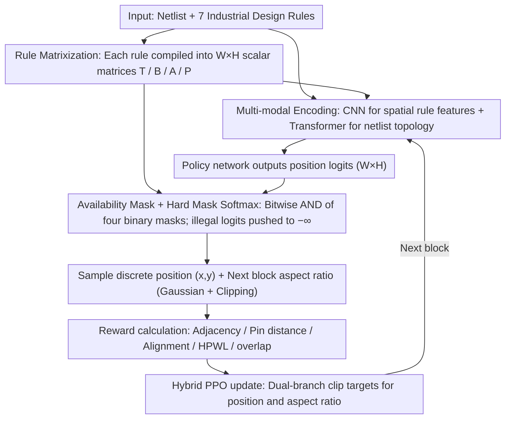

# RulePlanner: All-in-One Reinforcement Learner for Unifying Design Rules in 3D Floorplanning

**Conference**: ICML 2026  
**arXiv**: [2601.22476](https://arxiv.org/abs/2601.22476)  
**Code**: https://github.com/Thinklab-SJTU/EDA-AI  
**Area**: Reinforcement Learning / Chip Design / Combinatorial Optimization  
**Keywords**: 3D Floorplanning, Design Rules, Action Space Constraints, Masked RL, Hybrid PPO  

## TL;DR
This paper integrates seven categories of industrial design rules for 3D chip floorplanning into a unified actor-critic RL framework. The core mechanism compiles each rule into a $W\times H$ "adjacency matrix mask" to proactively block illegal positions using large negative values before policy softmax. Combined with a hybrid action space (discrete position + continuous aspect ratio) and Transformer-encoded netlist features, it is the first single agent capable of simultaneously satisfying seven rules—including boundary, grouping, multi-layer alignment, and non-overlap—while demonstrating zero-shot transferability to unseen circuits.

## Background & Motivation

**Background**: At advanced process nodes (e.g., 5 nm), floorplanning is no longer just "placing blocks." It requires determining coordinates $(x_i, y_i)$, layer $z_i$, and dimensions $(w_i, h_i)$ for each functional module while satisfying a long list of hardware design rules: boundary constraints (certain blocks must be adjacent to specific pins), grouping constraints (blocks must be physically adjacent to form voltage islands), cross-layer alignment, pre-placed blocks, non-overlap, outline, and shape. Existing solutions fall into three categories: analytical methods (gradient descent like NTUplace or DREAMPlace), heuristics (B*-tree, SA), and RL methods (GraphPlace, MaskPlace, FlexPlanner).

**Limitations of Prior Work**: The authors compare representative methods in Table 1 and find that no existing category "checks all boxes." Analytical methods rely on differentiable objectives, but rule violations are inherently non-differentiable. Heuristics depend on manually designed cost terms, which fail under complex rules. Most RL methods add penalty terms to the reward, treating hard constraints as soft ones, ultimately requiring engineers to manually fix violations, which is labor-intensive.

**Key Challenge**: Incorporating rules into the reward is "post-hoc punishment" rather than "prior prohibition." In a $W\times H$ discrete position space, the vast majority of sampled actions are illegal, making it difficult for RL to converge based solely on reward signals. Worse, rules may conflict (e.g., boundary vs. grouping, alignment vs. non-overlap), making it nearly impossible for a single reward weight to drive all violations to zero simultaneously.

**Goal**: Enable the RL agent to only "see" legal positions at the moment of action sampling, ensured by a "filtering" mechanism that is extensible to an arbitrary number of rules.

**Key Insight**: The authors observe that all spatial design rules can be rewritten as "outputting a scalar for every candidate position $(x, y)$." For instance, a boundary rule is the distance from a block at $(x, y)$ to a specified pin; a grouping rule is the contact edge length with group members when a block is at $(x, y)$. This naturally forms a $W\times H$ matrix that can be computed in parallel, thresholded, and combined via boolean AND operations.

**Core Idea**: Compile each rule into a matrix mask $\rightarrow$ obtain a cumulative "availability mask" $\bm M$ via bitwise AND $\rightarrow$ apply a hard mask softmax by adding $(\bm M-1)\odot 10^8$ to policy logits. This "pushes" hard constraints into the action space itself while optimizing soft goals (distance, alignment scores) via the reward.

## Method

### Overall Architecture

RulePlanner models 3D floorplanning as an episodic MDP. At each step, it selects a block $b_t$ to place. The state $s_t$ contains several $W\times H$ rule matrices, a canvas image, and a netlist graph $(\bm G, \bm E)$. The action $a_t=(x_t, y_t, \mathrm{AR}_{t+1})$ is hybrid—discrete 2D coordinates plus a continuous aspect ratio for the **next block** (deciding the next block's shape is necessary because the next state requires $(w_{t+1}, h_{t+1})$ to recompute rule matrices). The workflow is: rule matrices + netlist graph $\rightarrow$ CNN/Transformer encoding $\rightarrow$ policy network outputting logits $\rightarrow$ illegal positions blocked by the availability mask $\rightarrow$ position sampling $\rightarrow$ aspect ratio sampled from a Gaussian and clipped to $[\mathrm{AR}_\min, \mathrm{AR}_\max]$ $\rightarrow$ reward calculation $\rightarrow$ Hybrid PPO update.

### Key Designs

**1. Matrix Representation of Design Rules: Modular assembly of $W\times H$ scalar matrices**

Previous methods required code changes for every new rule or relied on soft rewards. RulePlanner defines a quantifiable "position $\to$ scalar" metric for every spatial rule. Boundary rules use the Manhattan distance $d(b_i, t_j)=\min_{seg\in Segs(b_i)} d_m(seg, t_j)$ to form a pin adjacency matrix $\bm T_{xy}=d(b,t)$. Grouping rules use shared edge length $l(b_i, b_j)$ to form a block adjacency matrix $\bm B_{xy}=l(b_i, b_j)$. Cross-layer alignment uses alignment scores $\bm A$. Non-overlap/out-of-bounds are encoded as a position mask $\bm P \in \{0,1\}^{W\times H}$. Rules are combined via operators: $\max$ for "must satisfy all" and $\min$ for "satisfy at least one." Matrices are computed in parallel via GPU meshgrids.

**2. Availability Mask + Hard Mask Softmax: Eliminating violations before sampling**

Legal positions often occupy less than 1% of the $W\times H$ space. To avoid inefficient RL exploration, RulePlanner binarizes matrices via thresholds—$\bar{\bm T}_{xy}=\mathbb{1}[\bm T_{xy}\le \bar t]$, $\bar{\bm B}_{xy}=\mathbb{1}[\bm B_{xy}\ge \bar b]$, etc.—and calculates a total mask $\bm M = \bar{\bm T} \odot \bar{\bm B} \odot \bar{\bm A} \odot \bar{\bm P}$. The masked distribution $\bar p_\theta = \mathrm{softmax}(p_\theta + (\bm M-1) \odot 10^8)$ ensures zero probability for illegal positions. Continuous aspect ratios are handled similarly via affine transformation and clipping, ensuring shape rules are always met.

**3. Multi-modal State Encoding + Hybrid PPO: Joint optimization for heterogeneous inputs and actions**

The netlist topology and rule matrices represent different modalities. RulePlanner concatenates rule matrices, canvas images, and wire masks into channels for a CNN to extract spatial features $\bm y_v$. The netlist $(\bm G, \bm E)$ is processed by a Transformer, with node features $\bm g_j$ including placement order $\bm o$ via sinusoidal encoding. Attention masks are derived from $1-\bm E$ to restrict message passing to topological neighbors. Hybrid PPO calculates independent clip targets $L(\theta)=\sum_{k=1}^2 \lambda_k \hat{\mathbb{E}}_t[\min(r_t^{(k)}\hat A_t, \bar r_t^{(k)}\hat A_t)]$ for position and aspect ratio branches to prevent continuous gradients from destabilizing the discrete policy.

### Loss & Training

The policy objective is a weighted sum of the position and aspect ratio branches using PPO clipping. The critic learns GAE-based $G_t$. Rewards utilize adaptive normalization to scale geometric metrics (adjacency length, pin distance, etc.) and HPWL/overlap, ensuring both hard constraints (enforced by masks) and soft objectives are optimized.

## Key Experimental Results

### Main Results

On public 3D floorplanning benchmarks, RulePlanner was compared against analytical methods (NTUplace), heuristics (B*-3D-SA, WireMask-BBO), and four RL baselines (GraphPlace, DeepPlace, MaskPlace, FlexPlanner). RulePlanner is the **only** method to satisfy all seven rules (a-g).

| Method | Type | (a)Bound. | (b)Group. | (c)Align. | (d)Pre-p. | (e)Overl. | (f)Outl. | (g)Shape |
|--------|------|-----------|-----------|-----------|-----------|-----------|----------|----------|
| Analytical (Huang 2023) | Analytical | ✗ | ✗ | ✗ | ✓ | ✗ | ✓ | ✓ |
| B*-3D-SA | Heuristic | ✗ | ✗ | ✗ | ✗ | ✓ | ✗ | ✗ |
| WireMask-BBO | Heuristic | ✗ | ✗ | ✗ | ✓ | ✓ | ✓ | ✗ |
| GraphPlace | RL | ✗ | ✗ | ✗ | ✓ | ✗ | ✓ | ✗ |
| MaskPlace | RL | ✗ | ✗ | ✗ | ✓ | ✓ | ✓ | ✗ |
| FlexPlanner | RL | ✗ | ✗ | ✓ | ✓ | ✓ | ✓ | ✓ |
| **RulePlanner (Ours)** | RL | **✓** | **✓** | **✓** | **✓** | **✓** | **✓** | **✓** |

RulePlanner also outperformed the strongest RL baseline, FlexPlanner, in HPWL, violation rates, and runtime, demonstrating zero-shot transfer capability on unseen circuits.

### Ablation Study

| Configuration | Rule Satisfaction | HPWL / Overlap | Description |
|---------------|-------------------|----------------|-------------|
| Full RulePlanner | All Satisfied | Lowest | Full mask + Hybrid PPO + Transformer |
| w/o Adjacency Mask | Frequent Violations | Significantly Worse | Degrades to MaskPlace style (soft constraints) |
| w/o Netlist Transformer | Satisfied | Higher HPWL | Lack of topological signals causes scattered blocks |
| w/o AR Clipping | Shape Violations | Unstable | Soft penalties fail to enforce shape boundaries |

### Key Findings

- **Masking > Reward Penalty**: Removing the adjacency mask led the policy to sample illegal positions, necessitating manual post-processing.
- **Topology Impacts Wirelength**: Removing the Transformer maintained rule satisfaction (due to masking) but significantly worsened HPWL, proving that topological adjacency is key to learning module proximity.
- **Zero-shot Transferability**: Hard constraints are guaranteed on unseen circuits because masks are computed dynamically, maintaining high competitiveness on soft objectives.

## Highlights & Insights
- Abstracting spatial hard constraints into "$W\times H$ matrices + thresholding + bitwise AND" provides a clean interface. New rules can be added by simply writing a "position $\to$ scalar" function without altering the training loop.
- The "hard mask softmax" trick is engineer-friendly. Compared to IPO or Lagrangian methods, it requires no hyperparameters and guarantees zero violations—a critical requirement for industrial EDA.
- Deciding the "next block's aspect ratio" as part of the current action is a subtle but vital detail, as the next state's rule matrices depend on the dimensions of the block being considered.

## Limitations & Future Work
- The framework assumes rules can be mapped to $W\times H$ spatial scalars. Non-spatial constraints (e.g., timing, thermal distribution) require specialized encoding.
- Thresholds $\bar t, \bar b, \bar a$ are manual hyperparameters that may require tuning for different process nodes.
- Sequential placement for large circuits (thousands of blocks) leads to long episodes, increasing training costs compared to analytical methods.
- Choosing the correct combination operators ($\sum$, $\max$, $\min$) for complex grouping remains a manual process.

## Related Work & Insights
- **vs. MaskPlace (Lai et al., 2022)**: MaskPlace pioneered illegal position masking but only for non-overlap/outline. RulePlanner generalizes this to seven industrial rules with netlist Transformer encoding.
- **vs. FlexPlanner (Zhong et al., 2024)**: FlexPlanner handled alignment and shape, but boundary/grouping were soft rewards. RulePlanner integrates these into the mask system to achieve "seven ticks."
- **vs. Analytical Methods**: Analytical methods are fast but struggle with non-differentiable rules. RulePlanner is complementary, offering exact rule satisfaction at the cost of the speed found in gradient-based optimization.

## Rating
- Novelty: ⭐⭐⭐⭐ 
- Experimental Thoroughness: ⭐⭐⭐⭐ 
- Writing Quality: ⭐⭐⭐⭐ 
- Value: ⭐⭐⭐⭐ 

<!-- RELATED:START -->

## Related Papers

- [\[ICLR 2026\] One Model for All Tasks: Leveraging Efficient World Models in Multi-Task Planning](../../ICLR2026/reinforcement_learning/one_model_for_all_tasks_leveraging_efficient_world_models_in_multi-task_planning.md)
- [\[NeurIPS 2025\] CORE: Constraint-Aware One-Step Reinforcement Learning for Simulation-Guided Neural Network Accelerator Design](../../NeurIPS2025/reinforcement_learning/core_constraint-aware_one-step_reinforcement_learning_for_simulation-guided_neur.md)
- [\[CVPR 2026\] PanoEnv: Exploring 3D Spatial Intelligence in Panoramic Environments with Reinforcement Learning](../../CVPR2026/reinforcement_learning/panoenv_exploring_3d_spatial_intelligence_in_panoramic_environments_with_reinfor.md)
- [\[ICML 2026\] One Bias After Another: Mechanistic Reward Shaping and Persistent Biases in Language Reward Models](one_bias_after_another_mechanistic_reward_shaping_and_persistent_biases_in_langu.md)
- [\[ICML 2026\] RL4RLA: Teaching ML to Discover Randomized Linear Algebra Algorithms Through Curriculum Design and Graph-Based Search](rl4rla_teaching_ml_to_discover_randomized_linear_algebra_algorithms_through_curr.md)

<!-- RELATED:END -->
