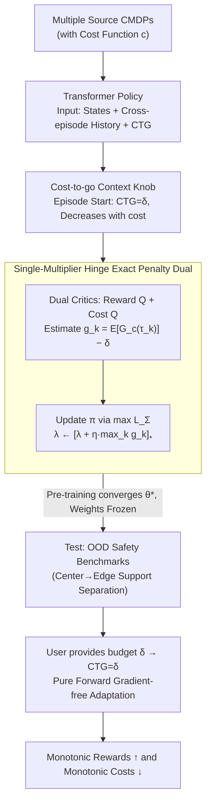

# Safe In-Context Reinforcement Learning

**Conference**: ICML 2026  
**arXiv**: [2509.25582](https://arxiv.org/abs/2509.25582)  
**Code**: Not yet released  
**Area**: Reinforcement Learning / Safe RL / In-context Learning  
**Keywords**: Safe RL, In-context RL, CMDP, exact penalty, cost-to-go  

## TL;DR
This paper introduces safety constraints to in-context reinforcement learning (ICRL) for the first time, proposing SCARED. During pre-training, it utilizes an **exact-penalty Lagrangian with a single multiplier and a hinge function** to enable a Transformer policy to adapt to CMDPs at test-time **without any parameter updates**. By conditioning on cost-to-go context, the policy achieves monotonically increasing rewards and decreasing costs on OOD Grid / MuJoCo / Velocity benchmarks, allowing smooth switching between conservative and aggressive behaviors based on a user-provided budget $\delta$.

## Background & Motivation
**Background**: In-context RL (ICRL) is a new paradigm inspired by GPT-style sequence models. It concatenates interaction trajectories from multiple tasks into a long context for Transformer/SSM pre-training. At test-time, the model performs **inference only (no backpropagation)**, relying on the growing history to "implicitly run an RL algorithm in the forward pass." Representative works like AD, DPT, AMAGO, and Headless-AD have shown impressive zero-shot adaptation in DarkRoom and MuJoCo.

**Limitations of Prior Work**: All existing ICRL works focus solely on reward maximization, **completely ignoring cost and safety**. However, real-world scenarios for ICRL (embodied AI, robotics, autonomous driving) require satisfying hard safety constraints—not just after training, but **throughout the entire learning and exploration process at test-time**. This is significantly more challenging for ICRL than standard RL.

**Key Challenge**: Current approaches lack a suitable solution: (1) Standard ICRL lacks a cost channel. (2) Safe meta-RL (MAML+penalty, SafeMeta) relies on test-time gradient updates, losing the "pure forward adaptation" advantage of ICRL and failing to capture fine-grained per-episode cost signals. (3) Directly applying standard dual methods for CMDP with a Lagrange multiplier $\lambda_k$ for each episode would require fixing the number of test episodes $K$ during pre-training, leading to unstable optimization as $\lambda_k$ update frequencies diminish over time.

**Goal**: (i) Formalize the safe ICRL problem: satisfy cost constraints for each test episode in a CMDP framework without updating parameters; (ii) Design a **stable single-multiplier** dual algorithm; (iii) Construct genuine OOD safety benchmarks (distinguished from interpolation) to prove extrapolation capabilities.

**Key Insight**: (1) Feed the cost-to-go $G_{c,t}(\tau)\!=\!\sum_{i=t+1}^{T} C_i$ as an **explicit context input**, allowing the policy to automatically adjust its aggressiveness/conservatism at test-time by conditioning on this scalar—an extension of decision-transformer tricks (RTG/CTG) to safe RL. (2) Collapse "per-episode penalties" into a "worst-case episode penalty" using a hinge surrogate $L_\Sigma$ and **exact-penalty** theory, ensuring that when $\lambda \ge \|\lambda^\star\|_\infty$, the fixed point matches the original optimal solution.

**Core Idea**: Integrate CMDP safety constraints into ICRL pre-training via **exact-penalty dual + single-multiplier hinge penalty + CTG-conditioned Transformer**. This allows the policy to slide between different safety budgets at test-time simply by varying the input CTG value without altering weights.

## Method

### Overall Architecture
SCARED follows the reinforcement pre-training route (optimizing $\pi_\theta$ with standard online RL loss at each step, similar to AMAGO/DDPG-style ICRL) while adding three components:
1. **CMDP-based Environment Sampling**: Each source MDP includes a cost function $c$. In addition to states and history $H_t^k$, the policy takes a scalar cost-to-go $G_{c,t}(\tau_k)$ as input, initialized to budget $\delta$ at the start of each episode and decreasing as costs are incurred.
2. **Actor-Critic with Dual Critics**: A reward Q-function $Q_{\theta_v}$ and a cost Q-function $Q_{\theta_c}^c$ are trained via TD-targets. The actor maximizes $Q_{\theta_v}$ while being penalized by the cost Q-function when episodes exceed the budget.
3. **Single-Multiplier Exact-Penalty Dual Iteration**: A surrogate $L_\Sigma(\pi,\lambda)=\mathbb{E}_\pi[\sum_k G(\tau_k)] - \lambda \sum_k [g_k(\pi)]_+$ is used, where $g_k(\pi)=\mathbb{E}_\pi[G_c(\tau_k)] - \delta$. The iteration follows $\pi_{t+1}\in\arg\max L_\Sigma(\pi,\lambda_t)$ and $\lambda_{t+1}=[\lambda_t+\eta\max_k g_k(\pi_{t+1})]_+$.

At test-time, the model is deployed in a new CMDP (with OOD goal/obstacle distributions). With a user-specified budget $\delta$, the policy initializes CTG to $\delta$ each episode and runs **without any gradient updates**. The Transformer performs "in-context safe RL" based on the sequence of (state, action, reward, cost, CTG).

### Key Designs

**1. Cost-to-go as a Controllable Context Scalar: Turning "User Budget $\delta$" into a Test-time Knob**  
Unlike SafeAD, which requires both RTG and CTG to control tradeoffs (where incorrect RTG leads to infeasibility), SCARED defines the policy as $\pi_\theta(\cdot|S_t^k,H_t^k,G_{c,t}(\tau_k))$. By explicitly feeding the remaining budget as a scalar—initialized at $G_{c,0}=\delta$ and updated by costs—the network learns to map CTG values to varying levels of conservatism. During pre-training, $\delta$ is sampled uniformly (e.g., $[1,10]$ for SafeDarkRoom). This single knob is naturally monotonic: high CTG encourages risk-taking, while low CTG enforces caution. This compresses "safety budget negotiation" into a single scalar that allows smooth switching at test-time without weight updates.

**2. Single-Multiplier + Hinge Surrogate Lagrangian: Managing All Episodes Without Over-penalizing**  
Standard CMDP dual methods $\max_\pi \min_\lambda L(\pi,\lambda)=\mathbb{E}_\pi[\sum_k G(\tau_k)] - \sum_k \lambda_k(\mathbb{E}_\pi[G_c(\tau_k)] - \delta)$ assign a multiplier $\lambda_k$ to each episode, requiring a fixed $K$ and suffering from unstable updates. The authors collapse per-episode penalties into a worst-case penalty:

$$L_\Sigma(\pi,\lambda)=\mathbb{E}_\pi\Big[\sum_k G(\tau_k)\Big] - \lambda\sum_k [g_k(\pi)]_+,\quad g_k(\pi)=\mathbb{E}_\pi[G_c(\tau_k)]-\delta,$$

The hinge function $[x]_+=\max(x,0)$ only penalizes episodes exceeding the budget, and the multiplier $\lambda$ tracks the worst-case episode. Theorem 1 proves that when $\lambda\ge\|\lambda^\star\|_\infty$, the fixed point of this iteration is equivalent to the original CMDP optimal policy set (exact penalty). This design avoids pre-fixing $K$, prevents over-penalization, and ensures strict alignment with the primal optimal.

**3. Genuinely Extrapolating OOD Safety Benchmarks (Center→Edge Distribution Shift)**  
Previous DarkRoom OOD setups often used "grid interpolation," which fails to prove true in-context safety adaptation. The authors propose a support-separation protocol: during training, obstacles/goals are clustered around the map center $c$ via $P_{\text{train}}((i,j))\propto e^{-\alpha d((i,j),c)}$. At test-time, the distribution shifts to the edges via $P_{\text{test}}((i,j))\propto e^{+\alpha d((i,j),c)}$. Proposition 1 shows that as $\alpha\to\infty$, the total variation distance $d_{TV} \to 1$, meaning the supports of the two distributions are nearly disjoint. Combined with SafeVelocity (unseen velocity ranges), this covers both structural OOD and unseen ID generalizations. Achieving cost reduction in such disjoint settings represents true in-context safe adaptation.

### Loss & Training
- **Base RL Loss**: Follows DDPG-style ICRL (Grigsby et al., 2024a) with reward and cost critics trained via TD-targets.
- **Actor Gradient**: Derived from $L_\Sigma$ as $\nabla_\theta \mathbb{E}_\pi[\sum_k G(\tau_k)] - \lambda \nabla_\theta \sum_k [g_k(\pi)]_+$, with the cost critic estimating $g_k$.
- **Multiplier Update**: $\lambda_{t+1}=[\lambda_t+\eta \max_k g_k(\pi_{t+1})]_+$ with a small learning rate $\eta$.
- **Training**: Budget $\delta$ is sampled uniformly; a long Transformer encodes full cross-episode history.

## Key Experimental Results

### Main Results: Adaptation Across 5 Safe Environments

| Environment | Type | SCARED Return ↑ | SCARED Cost ↓ | Safe AD | SafeMeta | MAML+penalty |
|------|------|---|---|---|---|---|
| SafeDarkRoom (9×9, 25 obstacles) | OOD Grid | ~0.6 within 50 eps | Drops to ~1 | Slow gain, weak cost red. | No cost red. | Failure |
| SafetyPoint (SafeDarkMujoco) | OOD Continuous | ~0.6 | Drops to ~2 | Reward ↑ but Cost **Fixed** | No red. | Failure |
| SafetyCar (SafeDarkMujoco) | OOD Continuous | ~0.8–1.0 | Decreases | Adaptation failure | No red. | Failure |
| SafetyHalfCheetah (Velocity) | Unseen ID | ~200 | Constantly low | Reward ↓, Cost ↑ | Reward ↑, Cost fixed | Failure |
| SafetyAnt (Velocity) | Unseen ID | ~200 | Constantly low | Reward ↓, Cost ↑ | Reward ↑, Cost fixed | Failure |

> X-axis is episode index $k$. No parameter updates (except for Meta-RL benchmarks). SCARED is the only method showing monotonic reward increases alongside monotonic cost decreases.

### Ablation Study

| Configuration | Behavior | Description |
|------|------|------|
| Full SCARED | Reward ↑ Cost ↓, Cost ≤ $\delta$ | Stable convergence via single multiplier + exact penalty. |
| Multi-multiplier (One $\lambda_k$ per ep) | Optimization oscillations | Low update frequency for late $\lambda_k$ causes instability (Fig 5c). |
| Safe AD (Noise variant) | Fails OOD adaptation | Injecting noise only on optimal trajectories lacks behavioral diversity. |
| CTG Tuning (Test-time $\delta$) | $\delta$ ↑: aggressive, return ↑; $\delta$ ↓: cautious, return ↓ | Pure forward trade-off capability. |

### Key Findings
- **Safe AD fails in complex environments**: While it works in simple grids, costs do not decrease in SafeDarkMujoco/SafetyAnt, showing that treating cost as conditioning alone (without safety training objectives) has a performance ceiling.
- **Gradient dependence**: SafeMeta/MAML+penalty fail to reduce costs even with test-time backpropagation, proving that only cross-episode in-context history is sufficient for agile online safety regulation.
- **CTG as a Knob**: Using the same weights, changing $\delta$ from 1 to 10 results in significantly different, monotonic behaviors, making it highly deployment-friendly.

## Highlights & Insights
- **First Safety-Augmented ICRL**: Completes the missing cost channel in ICRL. The "single-multiplier hinge" approach is theoretically an exact penalty, making it more elegant than squared penalties or multi-multiplier setups.
- **Single-Knob CTG**: Simplifies user interaction to a one-dimensional scalar budget $\delta$, preventing the infeasibility issues found in dual RTG/CTG conditioning.
- **Center→Edge OOD Protocol**: Provides a robust benchmark for in-context safety/generalization that goes beyond simple interpolation.
- **Transferable Design**: The single-multiplier exact-penalty dual can be integrated into any actor-critic safe RL algorithm beyond ICRL.

## Limitations & Future Work
- **Lack of Hard Safety Guarantees**: Adaptation is statistical (cost decreases over episodes); it is not "anytime safe" during the first few steps.
- **High Pre-training Cost**: Online reinforcement pre-training across various source CMDPs is computationally expensive compared to offline distillation.
- **Single Scalar Cost**: Real-world robotics involves multiple constraints (collision, tipping, energy). Extending to multi-cost scenarios requires further derivation.
- **Low-dimensional Benchmarks**: Evaluated on 9x9 grids and simplified MuJoCo tasks; high-dimensional vision-based sim2real validation is needed.

## Related Work & Insights
- **Ours vs. AD / AMAGO / Headless-AD**: They focus on reward-only ICRL; SCARED introduces cost channels and CTG inputs via online RL pre-training.
- **Ours vs. SafeAD**: SafeAD relies on distillation from PPO-Lagrangian (limited by the teacher). SCARED uses online pre-training, enabling it to reduce costs in complex tasks where SafeAD fails.
- **Ours vs. SafeMeta**: SCARED is purely gradient-free at test-time, making it more deployment-friendly and effective in vision-limited scenarios like SafeDarkMujoco.
- **Insight**: Explicitly treating the "safety budget" as a scalar input is an undervalued interface. Compressing safety negotiation into a single inference pass is ideal for SDK-style safety interfaces for embodied agents.

## Rating
- Novelty: ⭐⭐⭐⭐⭐ First work to formalize and solve safe ICRL with a clean theory.
- Experimental Thoroughness: ⭐⭐⭐⭐ Broad coverage across 5 environments, but lacks real-world robotics/vision.
- Writing Quality: ⭐⭐⭐⭐ Clear motivation and rigorous dual derivation.
- Value: ⭐⭐⭐⭐⭐ Provides a crucial missing piece for deploying ICRL in safety-critical applications.

<!-- RELATED:START -->

## Related Papers

- [\[ICML 2026\] Safe Reinforcement Learning with Preference-Based Constraint Inference](safe_reinforcement_learning_with_preference-based_constraint_inference.md)
- [\[ICLR 2026\] LongRLVR: Long-Context Reinforcement Learning Requires Verifiable Context Rewards](../../ICLR2026/reinforcement_learning/longrlvr_long-context_reinforcement_learning_requires_verifiable_context_rewards.md)
- [\[ICML 2026\] Safety Generalization Under Distribution Shift in Safe Reinforcement Learning: A Diabetes Testbed](safety_generalization_under_distribution_shift_in_safe_reinforcement_learning_a_.md)
- [\[NeurIPS 2025\] Towards Provable Emergence of In-Context Reinforcement Learning](../../NeurIPS2025/reinforcement_learning/towards_provable_emergence_of_in-context_reinforcement_learning.md)
- [\[ICLR 2026\] Scalable In-Context Q-Learning](../../ICLR2026/reinforcement_learning/scalable_in-context_q-learning.md)

<!-- RELATED:END -->
