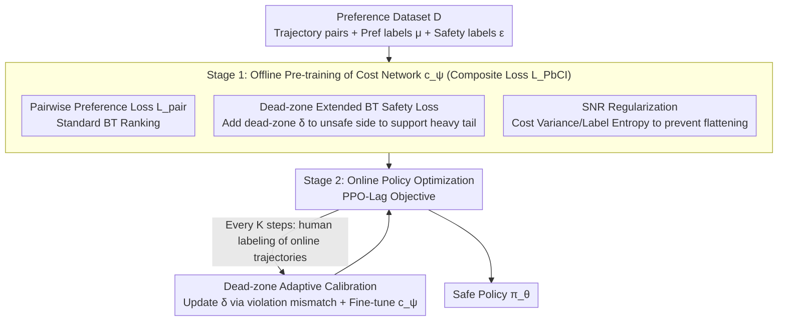

# Safe Reinforcement Learning with Preference-Based Constraint Inference

**Conference**: ICML 2026  
**arXiv**: [2603.23565](https://arxiv.org/abs/2603.23565)  
**Code**: None  
**Area**: Reinforcement Learning / Safe RL / Preference Learning  
**Keywords**: Safe RL, Preference Learning, Bradley-Terry, Dead-zone loss, SNR Regularization  

## TL;DR
This paper proposes PbCRL, which utilizes an extended Bradley-Terry preference model with a "dead-zone" to learn safety constraints from trajectory comparisons. By incorporating a signal-to-noise ratio (SNR) regularization to prevent the cost function from flattening and employing a two-stage training pipeline (offline pre-training + online sparse-label fine-tuning), the method significantly reduces costs while maintaining rewards across Safety Gymnasium, autonomous driving, and language model alignment tasks.

## Background & Motivation

**Background**: Safe RL is typically formulated as a Constrained MDP (CMDP), aiming to maximize cumulative reward $\mathcal{J}^R(\pi)$ while ensuring the expected cumulative cost $\mathcal{J}^C(\pi)=\mathbb{E}_\pi[\sum_t \gamma^t c(s_t,a_t)]$ does not exceed a threshold $d$. However, real-world safety constraints are complex, subjective, and often lack explicit formulas (e.g., determining what constitutes a "dangerous lane change" often requires human judgment), necessitating the **inference** of constraints from data.

**Limitations of Prior Work**: Inferring constraints from expert demonstrations (IRL / CBF / robust optimization) requires large amounts of dense, high-quality data, which is extremely costly. Using cheaper **preference data** (binary comparisons of two trajectories) is promising, but existing preference-based methods often directly apply the Bradley-Terry (BT) model, simplifying constraint inference into a ranking problem of "which trajectory is safer."

**Key Challenge**: The authors identify two subtle flaws in the BT model for Safe RL. First, BT learns **relative rankings**, making it ineffective for absolute values and distribution shapes—while real-world cost distributions are naturally **heavy-tailed** (one collision often triggers a chain of events, leading to a long-tailed $C(\tau)$). The approximately symmetric distribution inferred by BT **systematically underestimates** expected costs, misclassifying unsafe policies as safe. Second, most existing works focus only on the prediction accuracy of the cost model, ignoring whether it "flattens" the cost terrain, which hinders subsequent policy learning.

**Goal**: To patch preference-driven constraint inference by ensuring the inferred cost distribution matches the true heavy-tailed nature while preserving sufficient cost variance for policy gradients.

**Key Insight**: By adding a **dead-zone** $\delta>0$ to the "unsafe" side of the BT safety loss, gradients can continually push predicted costs of unsafe trajectories further away, **theoretically guaranteeing** a heavier right tail in the learned distribution. Additionally, using the ratio of "cost variance to preference label entropy" as an SNR term in the loss explicitly encourages discriminative cost outputs.

**Core Idea**: Combine "dead-zone + SNR" dual regularization with the standard BT safety loss, supplemented by a two-stage training strategy (offline pre-training + online fine-tuning of the dead-zone $\delta$). This ensures constraint inference aligns with real safety semantics and provides informative cost gradients for policy optimization.

## Method

### Overall Architecture

PbCRL learns the unknown cost function $c(s,a)$ and threshold $d$ simultaneously, shifting the threshold to 0 such that the constraint is $\mathcal{J}^{\hat C}(\pi)=\mathbb{E}_\pi[\sum_t\gamma^t\hat c(s_t,a_t)]\le 0$. The training consists of two stages:

1.  **Offline Pre-training Stage**: Use a pre-collected preference dataset $\mathcal{D}=\{(\tau_1,\tau_2,\mu_1,\mu_2,\epsilon_1,\epsilon_2)\}$ (where $\mu$ are pairwise preference labels and $\epsilon$ are binary safety labels) to train the cost network $c_\psi(s,a)$ using the loss $\mathcal{L}_{PbCI}=\mathcal{L}_{pair}+\mathcal{L}_{safe}^{DZ}+\mathcal{L}_{SNR}$.
2.  **Online Policy Optimization Stage**: Use the learned $c_\psi$ as the cost function for the CMDP and perform PPO-Lag style updates. Every $K$ steps, collect a small amount of online trajectories for human labeling to fine-tune the cost network and adaptively update the dead-zone parameter $\delta$.

### Key Designs

**1. Dead-zone Extended BT Safety Loss: Ensuring a heavy-tailed distribution**

Pure preference loss only learns relative rankings and cannot transform a symmetric distribution into a heavy-tailed one, leading to systematic underestimation of expected costs. PbCRL treats safety as a pairwise comparison against a virtual threshold trajectory $\tau_{th}$ (where true cost equals $d$ and estimated cost equals 0), i.e., $\hat{\mathbb{P}}(\tau\succ\tau_{th})=\sigma(-\hat C(\tau))$. While standard loss only requires $\hat C(\tau)>0$ for unsafe trajectories, the dead-zone version requires $\hat C(\tau)>\delta$, formulated as $\mathcal{L}_{safe}^{DZ}=-\mathbb{E}_\mathcal{D}\big[\epsilon\log\sigma(-\hat C(\tau))+(1-\epsilon)\log\sigma(\hat C(\tau)-\delta)\big]$. The authors provide a three-step proof: Lemma 3.1 shows the gradient for unsafe trajectories is strictly more negative ($\nabla_{\hat C}\mathcal{L}_{safe}^{DZ}<\nabla_{\hat C}\mathcal{L}_{safe}<0$); Theorem 3.2 uses induction to extend this to multi-step advantages, obtaining $\hat C_t^{DZ}(\tau)>\hat C_t(\tau)$; Corollary 3.3 translates instance-level shifts into distributional tail dominance $\mathbb{P}(\hat C^{DZ}\ge z)>\mathbb{P}(\hat C\ge z)$.

**2. SNR Regularization: Preserving cost terrain variance**

Policy gradients are sensitive to cost "height differences." If the cost network fits values into a narrow interval, the flattened terrain provides no signal for the policy. PbCRL treats "cost variance" as the signal and "preference label entropy" as noise per batch, defined as $\mathcal{L}_{SNR}=-\zeta\,\mathrm{Var}(\hat C(\tau))/\mathcal{H}(p(\mu))$. Minimizing this encourages larger $\mathrm{Var}(\hat C(\tau))$ while automatically relaxing constraints when tags are noisy (high entropy).

**3. Two-stage Training + Adaptive Dead-zone Calibration**

Purely online labeling is prohibitively expensive, while purely offline learning suffers from distribution shifts. Stage 1 of PbCRL runs $\mathcal{L}_{PbCI}$ on the full dataset $\mathcal{D}$ with a fixed $\delta$. Stage 2 follows the PPO-Lag objective $\mathcal{L}(\psi,\theta,\lambda)=-[\mathcal{J}^R(\pi_\theta)-\lambda\mathcal{J}^{C_\psi}(\pi_\theta)]$. Every $K$ steps, a small batch $\mathcal{B}$ of online trajectories is labeled to update $\delta$ via gradient descent on the violation rate mismatch $\mathcal{L}_\delta=\|\hat{\mathbb{P}}_{vio}-\mathbb{P}_{vio}\|^2$. This effectively compresses the "distribution shift" problem into a single scalar parameter $\delta$.

### Loss & Training
Total loss: $\mathcal{L}_{PbCI}=\mathcal{L}_{pair}+\mathcal{L}_{safe}^{DZ}+\mathcal{L}_{SNR}$, where $\mathcal{L}_{pair}$ is the standard BT cross-entropy. For policy optimization, PPO-Lag is used with learning rates satisfying the three-timescale separation condition $lr_\lambda=o(lr_\theta)=o(lr_\psi)$ to ensure convergence.

## Key Experimental Results

### Main Results

Evaluated on Safety Gymnasium against PPO-Lag (Oracle with ground truth cost) and preference-based baselines RLSF and PPO-BT. PbCRL maintains rewards near the oracle while keeping costs within thresholds.

| Task (Threshold) | Metric | PPO-Lag (Oracle) | PbCRL (Ours) | RLSF | PPO-BT |
|--------------|------|------------------|--------------|------|--------|
| HalfCheetah (5) | Return | $2619\pm124$ | $\mathbf{2367\pm138}$ | $2084\pm126$ | $2494\pm195$ |
| HalfCheetah (5) | Cost | $4.82\pm0.91$ | $\mathbf{4.66\pm1.03}$ | $3.26\pm0.78$ | (Violation) |

### Ablation Study

| Configuration | Cost Constraint Met | Reward Level | Description |
|------|--------------|----------|------|
| Full PbCRL | Yes | Near Oracle | Dead-zone + SNR + Two-stage calibration |
| w/o Dead-zone | Systematic Violation | High | Standard BT; expected cost is underestimated |
| w/o SNR | Yes | Significantly Lower | Cost terrain flattened; weak gradient signal |
| w/o Online Calibration | Intermittent Violation | Moderate | Offline $\delta$ mismatch with online distribution |

### Key Findings
- **Dead-zone impacts Safety, SNR impacts Performance**: Removing the dead-zone leads to significant cost violations, while removing SNR causes the largest drop in rewards.
- **Two-stage training saves labels**: Compared to purely online baselines, PbCRL moves most labeling offline, requiring only a small online batch for $\delta$ calibration.
- **Cross-domain Transferability**: Gains were also observed in autonomous driving and LLM alignment.

## Highlights & Insights
- **Rigorous Proof**: The paper strictly proves that the BT model cannot infer heavy tails (Lemma → Theorem → Corollary), providing theoretical backing for the dead-zone modification.
- **SNR Perspective**: Modelling "cost variance / label entropy" explicitly incorporates the cost network's impact on policy learning into the loss.
- **Adaptive Calibration**: Using violation rate mismatch as a proxy signal to adjust $\delta$ is a lightweight design that effectively handles distribution shifts.

## Limitations & Future Work
- The optimal $\delta$ value is heavily dependent on the true cost distribution's tail. In systems with sparse violations, proxy signals may have high variance.
- The method assumes access to binary safety labels $\epsilon$; it may not be applicable to preference datasets that only provide relative comparisons.
- Convergence proofs rely on specific multi-timescale stochastic approximation assumptions which may be difficult to satisfy strictly with deep non-linear networks.

## Related Work & Insights
- **vs RLSF (Reddy Chirra et al., 2024)**: RLSF uses standard BT for binary costs. This paper proves such a setup inevitably underestimates expected costs, whereas PbCRL uses the dead-zone to stretch the distribution.
- **vs Safe RLHF (Dai et al., 2024)**: Safe RLHF applies BT for constraint learning in LLMs but remains at the ranking level. PbCRL supplements the BT framework with safety and SNR losses to fix distribution shape and signal strength.
- **vs PPO-Lag (Ray et al., 2019)**: PbCRL's performance on HalfCheetah narrows the gap with this ground-truth oracle to within a few percentage points.

## Rating
- Novelty: ⭐⭐⭐⭐
- Experimental Thoroughness: ⭐⭐⭐⭐
- Writing Quality: ⭐⭐⭐⭐
- Value: ⭐⭐⭐⭐

<!-- RELATED:START -->

## Related Papers

- [\[ICML 2026\] CSPO: Constraint-Sensitive Policy Optimization for Safe Reinforcement Learning](cspo_constraint-sensitive_policy_optimization_for_safe_reinforcement_learning.md)
- [\[ICML 2026\] Safe In-Context Reinforcement Learning](safe_in-context_reinforcement_learning.md)
- [\[ICML 2026\] From Reward-Free Representations to Preferences: Rethinking Offline Preference-Based Reinforcement Learning](from_reward-free_representations_to_preferences_rethinking_offline_preference-ba.md)
- [\[ICML 2026\] Video-Based Optimal Transport for Feedback-Efficient Offline Preference-Based Reinforcement Learning](video-based_optimal_transport_for_feedback-efficient_offline_preference-based_re.md)
- [\[ICLR 2026\] Learning What Matters Now: Dynamic Preference Inference under Contextual Shifts](../../ICLR2026/reinforcement_learning/learning_what_matters_now_dynamic_preference_inference_under_contextual_shifts.md)

<!-- RELATED:END -->
