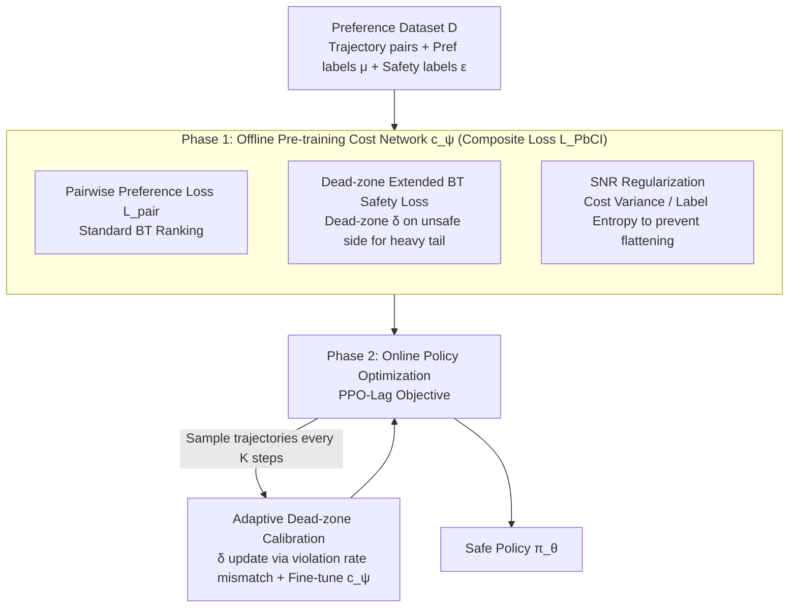

# Safe Reinforcement Learning with Preference-Based Constraint Inference

**Conference**: ICML 2026  
**arXiv**: [2603.23565](https://arxiv.org/abs/2603.23565)  
**Code**: None  
**Area**: Reinforcement Learning / Safe RL / Preference Learning  
**Keywords**: Safe RL, Preference Learning, Bradley-Terry, Dead-zone Loss, Signal-to-Noise Ratio Regularization  

## TL;DR
This paper proposes PbCRL, which utilizes an extended Bradley-Terry preference model with a "dead-zone" to learn safety constraints from trajectory comparisons. It incorporates a signal-to-noise ratio (SNR) regularization to prevent cost function flattening and implements a two-stage training pipeline (offline pre-training + online fine-tuning with sparse annotation). The method achieves significant cost reduction while maintaining reward performance across Safety Gymnasium, autonomous driving, and language model alignment tasks.

## Background & Motivation

**Background**: Safe RL is typically formulated as a Constrained MDP (CMDP), aiming to maximize cumulative reward $\mathcal{J}^R(\pi)$ while ensuring that the expected cumulative cost $\mathcal{J}^C(\pi)=\mathbb{E}_\pi[\sum_t \gamma^t c(s_t,a_t)]$ does not exceed a threshold $d$. However, real-world safety constraints are often complex, subjective, and lack explicit formulas (e.g., "what constitutes a dangerous lane change" often requires human judgment), necessitating the **inference** of constraints from data.

**Limitations of Prior Work**: Inferring constraints from expert demonstrations (IRL / CBF / Robust Optimization) requires high-quality, dense demonstrations, which are expensive to obtain. Using cheaper **preference data** (human binary comparisons of trajectories) is promising, but existing preference-based methods mostly adopt the standard Bradley-Terry (BT) model, simplifying constraint inference into a relative ranking problem of "which trajectory is safer."

**Key Challenge**: The authors point out two subtle flaws in applying the BT model to Safe RL. First, BT learns **relative rankings** and cannot capture absolute values or distribution shapes. Since real-world cost distributions are naturally **heavy-tailed** (a single collision leads to a cascade of consequences, resulting in a long-tail for $C(\tau)$), the approximately symmetric distribution inferred by BT **systematically underestimates** expected costs, leading to unsafe policies being misclassified as safe. Second, most existing works focus solely on the prediction accuracy of the cost model, ignoring whether it "flattens" the cost landscape, which hinders subsequent policy learning.

**Goal**: To patch preference-driven constraint inference by ensuring the inferred cost distribution aligns with real heavy-tailed characteristics while preserving sufficient cost variance for policy gradients.

**Key Insight**: The authors observe that introducing a **dead-zone** $\delta>0$ to the "unsafe" side of the BT safety loss allows gradients to consistently push the predicted costs of unsafe trajectories further. This **theoretically** guarantees a heavier right tail in the learned distribution. Concurrently, incorporating the "cost variance / preference label entropy" as a signal-to-noise ratio in the loss explicitly encourages discriminative cost outputs.

**Core Idea**: Adding a "dead-zone + SNR" dual regularization to the standard BT safety loss, combined with a two-stage training process (offline pre-training + online fine-tuning of the dead-zone $\delta$), ensures that constraint inference aligns with real safety semantics and provides informative cost gradients for policy optimization.

## Method

### Overall Architecture

PbCRL learns the unknown cost function $c(s,a)$ and threshold $d$ simultaneously, shifting the threshold to 0: constraints are written as $\mathcal{J}^{\hat C}(\pi)=\mathbb{E}_\pi[\sum_t\gamma^t\hat c(s_t,a_t)]\le 0$. The training consists of two phases:

1.  **Offline Pre-training Phase**: A pre-collected preference dataset $\mathcal{D}=\{(\tau_1,\tau_2,\mu_1,\mu_2,\epsilon_1,\epsilon_2)\}$ (where $\mu$ are pairwise preference labels and $\epsilon$ are binary safety labels) is used to train the cost network $c_\psi(s,a)$. The loss is $\mathcal{L}_{PbCI}=\mathcal{L}_{pair}+\mathcal{L}_{safe}^{DZ}+\mathcal{L}_{SNR}$.
2.  **Online Policy Optimization Phase**: The learned $c_\psi$ is treated as the cost function for the CMDP, and the policy is updated using PPO-Lag style Lagrangian multipliers. Every $K$ steps, a few online trajectories are sampled for human annotation to fine-tune the cost network and adaptively update the dead-zone parameter $\delta$.

### Key Designs

**1. Dead-zone Extended BT Safety Loss: Ensuring heavy right tails by adding a minimal thrust to the "unsafe" side**

Pure preference loss only learns relative rankings and cannot learn a heavy-tailed distribution from symmetric assumptions, leading to systematic underestimation of expected costs. PbCRL treats "whether a trajectory is safe" as a pairwise comparison with a virtual threshold trajectory $\tau_{th}$ (where real cost equals $d$ and estimated cost equals 0), denoted as $\hat{\mathbb{P}}(\tau\succ\tau_{th})=\sigma(-\hat C(\tau))$. While the standard safety loss only requires $\hat C(\tau)>0$ for unsafe trajectories, the dead-zone version requires $\hat C(\tau)>\delta$, formulated as $\mathcal{L}_{safe}^{DZ}=-\mathbb{E}_\mathcal{D}\big[\epsilon\log\sigma(-\hat C(\tau))+(1-\epsilon)\log\sigma(\hat C(\tau)-\delta)\big]$. The authors provide a three-step chain of proof: Lemma 3.1 shows the gradient of the dead-zone loss is strictly more negative for unsafe trajectories ($\nabla_{\hat C}\mathcal{L}_{safe}^{DZ}<\nabla_{\hat C}\mathcal{L}_{safe}<0$); Theorem 3.2 extends this microscopic gradient advantage to multiple steps, yielding $\hat C_t^{DZ}(\tau)>\hat C_t(\tau)$; Corollary 3.3 translates this instance-level shift into distribution-level tail dominance $\mathbb{P}(\hat C^{DZ}\ge z)>\mathbb{P}(\hat C\ge z)$. This effectively encodes "distribution shape" into the loss.

**2. Signal-to-Noise Ratio (SNR) Regularization: Preserving cost network variance**

Policy gradients are sensitive to cost "landscapes." If a cost network fits all costs into a narrow range, the flattened landscape fails to drive the policy. PbCRL uses the "cost variance" as the signal and "preference label entropy" as the noise, defined as $\mathcal{L}_{SNR}=-\zeta\,\mathrm{Var}(\hat C(\tau))/\mathcal{H}(p(\mu))$. Minimizing this encourages larger $\mathrm{Var}(\hat C(\tau))$ while automatically relaxing the constraint on batches with high label entropy (noisy/low information). This adaptive regularization is more stable than a simple variance penalty.

**3. Two-stage Training + Adaptive Dead-zone Calibration: Mitigating distribution shift**

Complete online annotation is prohibitively expensive, while purely offline training suffers from distribution shift between offline data and the current policy. Phase one of PbCRL runs $\mathcal{L}_{PbCI}$ on the dataset $\mathcal{D}$ with a fixed $\delta$. Phase two uses a PPO-Lag objective $\mathcal{L}(\psi,\theta,\lambda)=-[\mathcal{J}^R(\pi_\theta)-\lambda\mathcal{J}^{C_\psi}(\pi_\theta)]$. Every $K$ steps, a small batch of online trajectories $\mathcal{B}$ is annotated to perform gradient descent on $\delta$ using the violation rate mismatch $\mathcal{L}_\delta=\|\hat{\mathbb{P}}_{vio}-\mathbb{P}_{vio}\|^2$. If the predicted violation rate is higher than the empirical rate, $\delta$ is decreased, and vice versa. Theorem 5.2 establishes convergence of $(\psi,\theta,\lambda)$ to a local optimum under multi-timescale stochastic approximation.

### Loss & Training

The total loss is $\mathcal{L}_{PbCI}=\mathcal{L}_{pair}+\mathcal{L}_{safe}^{DZ}+\mathcal{L}_{SNR}$, where $\mathcal{L}_{pair}$ is the standard BT pairwise cross-entropy. For the policy, PPO-Lag optimizes the Lagrangian objective. The learning rates satisfy the three-timescale separation condition $lr_\lambda=o(lr_\theta)=o(lr_\psi)$ to ensure convergence.

## Key Experimental Results

### Main Results

In Safety Gymnasium, compared against PPO-Lag (oracle upper bound with ground-truth costs) and preference-based baselines RLSF and PPO-BT, PbCRL maintains returns close to the oracle while keeping costs near the threshold.

| Task (Threshold) | Metric | PPO-Lag (Oracle) | PbCRL (Ours) | RLSF | PPO-BT |
|--------------|------|------------------|--------------|------|--------|
| HalfCheetah (5) | Return | $2619\pm124$ | $\mathbf{2367\pm138}$ | $2084\pm126$ | $2494\pm195$ |
| HalfCheetah (5) | Cost | $4.82\pm0.91$ | $\mathbf{4.66\pm1.03}$ | $3.26\pm0.78$ | (Violation) |

### Ablation Study

Disabling the dead-zone and SNR components reveals their respective contributions to "safety" and "performance."

| Configuration | Cost Budget Met | Return Level | Explanation |
|------|--------------|----------|------|
| Full PbCRL | Yes | Near Oracle | All components active |
| w/o Dead-zone | Systematic Violation | High | Reverts to BT; expected cost underestimated; aggressive policy |
| w/o SNR | Yes | Significant Drop | Flattened cost landscape; weak gradient signal; slow convergence |
| w/o Online Calibration | Intermittent Violation | Medium | Offline $\delta$ mismatches online trajectory distribution |

### Key Findings

- **Dead-zone manages "Safety," while SNR manages "Performance"**: Removing the dead-zone leads to significant cost violations (validating the theoretical analysis of BT underestimation), while removing SNR causes the largest drop in rewards (validating that flat cost landscapes harm policy learning).
- **Two-stage training maximizes annotation efficiency**: Compared to fully online preference baselines, PbCRL moves most of the annotation to the offline phase, requiring only a small batch of trajectories for online $\delta$ calibration.
- **Cross-domain transferability**: Beyond robotics control, the authors report similar gains in autonomous driving and language model alignment scenarios.

## Highlights & Insights
- Formally proves that standard BT models cannot infer heavy-tailed distributions (Lemma → Theorem → Corollary), providing a theoretical foundation for the dead-zone modification.
- Introduces an SNR perspective to explicitly model the cost network's impact on policy gradients, offering a more stable alternative to simple variance penalties.
- Uses violation rate mismatch as a ground-truth-independent proxy signal to adaptively calibrate the dead-zone parameter $\delta$, a lightweight design that effectively handles distribution shift.

## Limitations & Future Work
- The "ideal" value of the dead-zone parameter $\delta$ depends on the tail of the real cost distribution; calibration via violation rates might be unstable in industrial systems with sparse violations.
- The paper assumes access to binary safety labels $\epsilon$; many preference datasets only provide relative comparisons, making $\mathcal{L}_{safe}^{DZ}$ and its targets unavailable.
- Convergence proofs rely on standard multi-timescale assumptions and Lipschitz conditions, which may not strictly hold for deep non-linear networks in practice.

## Related Work & Insights
- **vs RLSF (Reddy Chirra et al., 2024)**: RLSF uses BT to learn binary costs with segment-level feedback. This paper proves such settings inevitably underestimate expected costs; RLSF's overly low cost in HalfCheetah suggests its "safety" is an artifact of cost model underestimation.
- **vs Safe RLHF / PPO-BT (Dai et al., 2024)**: These apply BT to constraint learning but remain at the ranking level. PbCRL complements the BT framework by addressing distribution shape and signal intensity issues with minimal architecture changes.
- **Inspiration**: Designing losses that treat "distribution shape" as a first-class citizen and evaluating cost models by their impact on policy gradients are insights applicable to RLHF, reward modeling, and risk-sensitive RL.

## Rating
- Novelty: ⭐⭐⭐⭐ Clarifies theoretical flaws of BT in Safe RL with a non-invasive fix.
- Experimental Thoroughness: ⭐⭐⭐⭐ Covers various tasks with comprehensive ablations.
- Writing Quality: ⭐⭐⭐⭐ Clear logical chain and alignment between theorems and algorithms.
- Value: ⭐⭐⭐⭐ Provides a transferable loss template and convergence guarantees for preference-based constraint learning.

<!-- RELATED:START -->

## Related Papers

- [\[ICML 2026\] Safe In-Context Reinforcement Learning](safe_in-context_reinforcement_learning.md)
- [\[ICML 2026\] From Reward-Free Representations to Preferences: Rethinking Offline Preference-Based Reinforcement Learning](from_reward-free_representations_to_preferences_rethinking_offline_preference-ba.md)
- [\[ICML 2026\] Safety Generalization Under Distribution Shift in Safe Reinforcement Learning: A Diabetes Testbed](safety_generalization_under_distribution_shift_in_safe_reinforcement_learning_a_.md)
- [\[ICLR 2026\] Chain-of-Context Learning: Dynamic Constraint Understanding for Multi-Task VRPs](../../ICLR2026/reinforcement_learning/chain-of-context_learning_dynamic_constraint_understanding_for_multi-task_vrps.md)
- [\[ICLR 2026\] Safe Continuous-time Multi-Agent Reinforcement Learning via Epigraph Form](../../ICLR2026/reinforcement_learning/safe_continuous-time_multi-agent_reinforcement_learning_via_epigraph_form.md)

<!-- RELATED:END -->
