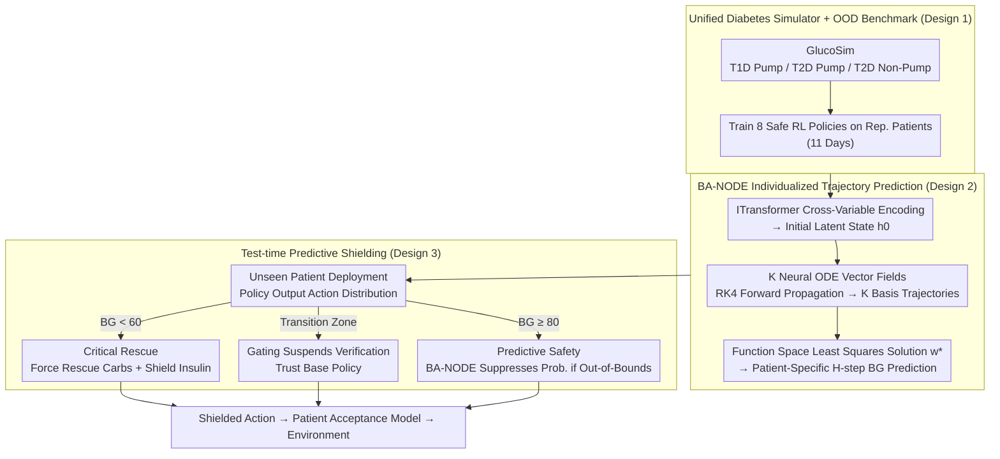

# Safety Generalization Under Distribution Shift in Safe Reinforcement Learning: A Diabetes Testbed

**Conference**: ICML 2026  
**arXiv**: [2601.21094](https://arxiv.org/abs/2601.21094)  
**Code**: GlucoSim + GlucoAlg (GitHub, safe-autonomy-lab)  
**Area**: Reinforcement Learning / Safe RL  
**Keywords**: Safe Reinforcement Learning, Distribution Shift, Test-time Shielding, Neural ODE, Diabetes Decision-making

## TL;DR
Based on the UVA-Padova physical model, the authors developed a unified T1D/T2D diabetes simulator. They discovered that while 8 mainstream Safe RL algorithms satisfy safety constraints on training patients, their Time-in-Range (TIR) drops by 8–13% when deployed to unseen patients. They propose using Basis-Adaptive Neural ODEs to predict blood glucose trajectories and apply predictive shielding to filter dangerous actions at test time, restoring 13–14% TIR for baselines like PPO-Lag and CPO on OOD patients.

## Background & Motivation

**Background**: Safe RL models control problems as CMDPs, using Lagrangian methods, trust regions (CPO), or projections (PCPO) to enforce cumulative cost constraints during training. These algorithms provide "expected safety" guarantees under fixed dynamics. Diabetes management is a recurrently studied safety-critical application.

**Limitations of Prior Work**: All Safe RL guarantees are "distribution-dependent"—the safety boundaries learned during training are tied to the physical parameters encountered. In real-world deployment, insulin sensitivity, absorption rates, and metabolic rates vary across individuals and cannot be exhaustively sampled in training. Existing RL work for diabetes (fox2020deep / zhu2023offline) assumes matched training and test dynamics, focuses mostly on T1D, and lacks systematic evaluation of safety robustness under population diversity.

**Key Challenge**: Under distribution shift, "satisfying constraints" during training and "maintaining safety" during deployment are distinct problems. Especially in healthcare, shifts are often latent and structural (unobserved metabolic parameters) rather than observable geometric parameters as in robotics; ethics also prohibit online trial-and-error retraining.

**Goal**: (i) Quantify the "safety generalization gap" of mainstream Safe RL; (ii) provide an algorithm-agnostic, retraining-free test-time mechanism to bridge this gap; (iii) provide a unified clinical simulator supporting T1D/T2D and pump/non-pump scenarios as a reusable testbed.

**Key Insight**: Traditional shielding methods, which rely on formal logic or known dynamics, are adapted to be driven by "learned dynamics predictors + probability bounds," explicitly decoupling "training-time constraints" from "deployment-time verification."

**Core Idea**: Utilize a continuous-time dynamics predictor capable of function-space adaptation for individual patients (BA-NODE) to predict blood glucose trajectories $H$ steps ahead for candidate actions at each step. Actions predicted to cross boundaries are shielded. The shielding threshold is tighter than the clinical failure threshold, with the margin precisely calibrated to the predictor's error bound.

## Method

### Overall Architecture
This work addresses the OOD safety gap where Safe RL satisfies constraints during training but violates them upon deployment to unseen patients. The system consists of three layers: First, the unified diabetes simulator GlucoSim (extended from UVA-Padova to cover T1D pump, T2D pump, and T2D non-pump scenarios) is used to train standard Safe RL policies. At each step, the agent receives 14-dimensional CGM/IOB/meal history observations and outputs discrete bolus and meal recommendations, filtered by a "patient acceptance model." Second, an individualized dynamics predictor, BA-NODE, learns to predict future $H$-step blood glucose trajectories. Finally, during test time, the action distribution of any pre-trained policy is processed through predictive shielding, suppressing the probabilities of actions predicted to cross boundaries. During training, a single representative patient (Child#01 / Adolescent#01 / Adult#01) is used for 11 days per condition. During deployment, a 77-day zero-shot evaluation is conducted on 9 unseen patients—the distribution shift occurs between training and deployment patients.

### Key Designs

**1. Unified Diabetes Simulator + OOD Safety Benchmark: Enabling the Emergence of "Training Compliance, Deployment Failure"**

Direct continuous basal control is an unrealistic clinical assumption. Prior RL works in diabetes often assumed matched training-test dynamics and focused on T1D, failing to measure safety robustness against population heterogeneity. GlucoSim integrates T1D/T2D and pump/non-pump scenarios into a single MDP interface, characterizing "treatment decision support" rather than "direct continuous control." The physical layer is based on UVA-Padova, with T2D additionally modeled using a hybrid approach of Hovorka secretion dynamics and Dalla Man transport models for insulin resistance. The MDP reward utilizes a two-hour prediction window to calculate risk delta, incorporating delayed effects like insulin stacking and rebound hyperglycemia into immediate rewards. The cost includes a "frequent intervention" penalty to align with clinical practice. Safety is quantified using the Kovatchev asymmetric Risk Index, $r_t = 10\,f(G_t)^2$, where $f(G) = 1.509\,(\ln(G)^{1.084} - 5.381)$. This asymmetric transformation penalizes hypoglycemia more severely than hyperglycemia, reflecting the clinical reality that hypoglycemia is more acutely fatal. Evaluation explicitly splits shifts into parameter generalization (testing on Patients #02–#10) and duration generalization (11 days training vs. 77 days testing).

**2. Basis-Adaptive Neural ODE (BA-NODE): Zero-shot Adaptation to Unseen Patient Latent Variables**

Latent patient variables such as insulin sensitivity and absorption rates are unobservable, yet they determine blood glucose evolution. The predictor must identify "which kind of patient this is" zero-shot using only a small context window. BA-NODE replaces the "static function basis" of traditional Function Encoders with "dynamic basis trajectories," enabling function space adaptation for time series through three modules. First, ITransformer treats each physiological variable as a token for cross-variable self-attention, generating a per-variate summary projected into the initial latent state $h_0$. Next, $K$ parallel neural ODE vector fields $\{f_{\theta_k}\}$ use RK4 forward steps to generate $K$ candidate latent trajectories, synthesized into a single latent trajectory via a shared linear projection $W_{\mathrm{proj}} \in \mathbb{R}^{K \times 1}$ (this ensemble maintains both expressivity and trajectory coherence). Finally, treating these $K$ rollouts as "basis trajectories" $\{G_k(\cdot)\}$, the model collects $N$ context windows for each patient and solves a regularized least squares problem:

$$w^\star = \arg\min_w \|\tilde G w - \tilde y_{\text{ctx}}\|_2^2 + \lambda \|w\|_2^2$$

The patient-specific weights $w^\star$ yield the final prediction: $\hat y_{T+P} = y_T + \sum_{i=1}^{P} (G(x_{\text{pred}}) w^\star)_i$. The elegance lies in adaptation being a simple least-squares solution without requiring online gradient updates on the patient, fitting the "no trial-and-error" clinical constraint.

**3. Predictive Shielding: An Algorithm-Agnostic Runtime Safety Wrapper**

Training constraints inevitably fail under OOD conditions and cannot be retrained; thus, compensation must occur at test time. Shielding reformulates the policy's action distribution:

$$\pi_{\text{shielded}}(a|s) = \mathrm{Softmax}\big(\log \pi_\theta(a|s) + M(s,a)\big),$$

The penalty $M$ reduces the probability of dangerous actions without **zeroing** them (retaining exploration tolerance), controlled by three rules: **Critical Rescue** triggers when $BG_t < G_{\text{rescue}} = 60\,\text{mg/dL}$, forcing 15g rescue carbs and shielding all insulin actions. **Predictive Safety** triggers when $BG_t \geq G_{\text{shield}}^\downarrow = 80\,\text{mg/dL}$, where BA-NODE predicts $H$-step trajectories for top-$k$ bolus candidates across all meal combinations. If the predicted minimum $m(a) < G_{\text{shield}}^\downarrow$ or maximum $M(a) > G_{\text{shield}}^\uparrow$, the action is penalized. The **Gating** zone $[G_{\text{rescue}}, G_{\text{shield}}^\downarrow)$ suspends prediction to avoid oscillating over small noise. This is superior to single-step rules as it looks $H$ steps ahead to prevent delayed risks like insulin stacking. Crucially, a **probabilistic safety bound** is provided: under an $(\varepsilon, \alpha)$-reliable assumption, setting the shielding threshold to $G_{\text{shield}}^\downarrow = G_{\text{fail}}^\downarrow + \varepsilon$ ensures $\Pr(\min_\tau BG_\tau(a) \geq G_{\text{fail}}^\downarrow) \geq 1 - \alpha$. This converts the predictor error $\varepsilon$ into an additive safety margin.

### Example: Shielding During Hyperglycemia
Consider an unseen patient with $BG_t = 180\,\text{mg/dL}$ (above $G_{\text{shield}}^\downarrow=80$), entering the Predictive Safety branch. The base policy intends to give a large bolus to reduce glucose. The shielder takes the top-$k$ bolus candidates and meal combinations, passing them to BA-NODE. BA-NODE uses $w^\star$ solved from the patient's recent $N$ windows to adapt basis trajectories and roll out glucose for the next 24 steps (120 minutes). The large bolus is predicted to hit $m(a)=55 < 80$ in two hours (typical insulin stacking leading to rebound hypoglycemia); thus, its $M$ is penalized and its $\mathrm{Softmax}$ probability collapses. A moderate dose is predicted to stay within range and is preserved. The moderate dose is executed—a single-step rule would have mistakenly encouraged "more insulin" at 180, but predictive shielding avoids the myopic decision by seeing the $H$-step trough.

### Loss & Training
8 Safe RL baselines (PPO-Lag, TRPO-Lag, CPO, RCPO, FOCOPS, PCPO, CRPO, CUP) were trained using original hyperparameters for each cohort/representative patient, with a Rule-Based Shield (RBS) for comparison. BA-NODE was trained on 15 days of pre-trained policy trajectories per cohort, with 5 days for evaluation. The prediction window reached up to 120 minutes (24 steps). Clinical metrics (TIR, CV, Risk Index) were used for evaluation to avoid circular validation with training rewards/costs.

## Key Experimental Results

### Main Results

**Safety Generalization Gap (No Shielding)**: Training patient (ID) vs. Unseen patient (OOD), across 8 algorithms (selected):

| Algorithm | TIR ID (%) ↑ | TIR OOD (%) ↑ | ΔTIR | ΔRisk |
|---|---|---|---|---|
| CPO | 87.28 | 76.73 | -10.55 | +1.62 |
| CUP | 89.36 | 77.70 | -11.66 | +2.61 |
| FOCOPS | 88.08 | 75.42 | -12.66 | +2.77 |
| PPO-Lag | 85.29 | 75.20 | -10.09 | +2.16 |
| TRPO-Lag | 82.79 | 74.43 | -8.37 | +1.79 |

In 7 out of 8 algorithms, TIR dropped by $\geq 8\%$ and Risk Index increased by $\geq 1.6$ on OOD patients, confirming the safety generalization gap is structural.

**BA-NODE Prediction Accuracy (24 steps = 120 minutes)**:

| Model | MAE ↓ | FDE ↓ | RMSE ↓ |
|---|---|---|---|
| ITransformer | 4.11 | 5.39 | 7.25 |
| NODE | 3.18 | 4.11 | 5.10 |
| **BA-NODE** | **2.82** | **3.63** | **4.42** |

BA-NODE reduced both mean and variance across all metrics, proving function space adaptation stabilizes multi-step prediction.

### Ablation Study

**T1D Shielding Impact (Selected)**:

| Algorithm | TIR (%) | ΔTIR | Risk Index | ΔRisk | CV (%) | ΔCV |
|---|---|---|---|---|---|---|
| CPO | 85.50 | +4.70 | 3.44 | -1.51 | 25.40 | -2.56 |
| FOCOPS | 82.63 | +3.07 | 4.53 | -0.97 | 29.63 | -4.26 |
| PPO-Lag | 85.59 | +8.05 | 3.96 | -1.79 | 29.18 | -3.21 |
| RCPO | 86.45 | +6.90 | 3.34 | -2.26 | 26.22 | -3.92 |

**Higher gains in T2D**: CPO achieved ΔTIR +13.54% and ΔCV −6.68%; PPO-Lag achieved ΔTIR +14.15% and ΔCV −5.5%. Across 72 settings (8 algorithms × 3 types × 3 age groups), predictive shielding consistently outperformed RBS, except where the base policy was extremely poor (e.g., PCPO with TIR < 40%)—shielding can only re-weight distributions, not create good actions from zero probability mass.

## Key Findings
- **Training Compliance $\neq$ Deployment Safety**: Policies with Risk Index < 5 and TIR > 80% during training almost all failed on OOD patients, indicating that expected safety guarantees in CMDPs are insufficient under distribution shift.
- **Predictive Shielding > Rule-Based Shielding**: RBS often exacerbated CV due to a positive feedback loop ("high glucose $\rightarrow$ insulin $\rightarrow$ hypoglycemia $\rightarrow$ carbs $\rightarrow$ high glucose"). Predictive shielding avoids this via $H$-step foresight.
- **Base Policy Lower Bound Matters**: Shielding effectiveness is limited by the base policy's probability distribution; if a policy places all mass on dangerous actions, the shield can only select the "least bad" option.
- **$(\varepsilon, \alpha)$ Bound Unifies Theory and Engineering**: Clinicians can select an acceptable $\alpha$, and the model evaluates its $\varepsilon$ error bound to directly calculate the required safety margin.

## Highlights & Insights
- **Converting "prediction accuracy" into a "safety margin"** is a brilliant design: the threshold $G_{\text{shield}}^\downarrow = G_{\text{fail}}^\downarrow + \varepsilon$ allows the error to absorb the safety buffer, providing a $1 - \alpha$ high-probability bound that is interpretable and engineerable.
- **Function Space Adaptation + ODE Ensembles** is more practical than "training one NODE per patient." Solving a single least-squares problem for zero-shot weights requires no online gradient updates, fitting the clinical constraint against trial-and-error.
- **Algorithm-Agnostic Wrapper** is transferable: any high-risk control scenario (dosage adjustment, power grid, low-speed autonomous driving) can adopt this "predict candidate trajectory $\rightarrow$ shield actions" paradigm by training an offline predictor.
- **Coefficient of Variation (CV)** is a vital clinical metric: TIR measures time-in-range but tolerates oscillations; CV measures smoothness. Using both identifies that predictive shielding preserves safety "gentlely."

## Limitations & Future Work
- The patient-specific weight $w^\star$ assumes the context window is "representative"; cold-start robustness for new patients in the first few hours was not systematically verified.
- Test-time shielding only "filters actions" rather than "retraining policies," which may mask inherent policy flaws and lead to behaviors drifting near shielding boundaries over time.
- The error $\varepsilon$ is estimated on an IID calibration set; however, distribution shift increases $\varepsilon$. The "OOD drift of the predictor error" itself is not yet modeled in the probability bound.
- Validated only on diabetes; generalization to areas like autonomous driving or power grids with delayed feedback and irreversible failure remains to be explored.

## Related Work & Insights
- **vs. Traditional Shielding (alshiekh2018safe)**: Rely on formal logic or known dynamics. This work replaces formal verification with a differentiable dynamics predictor and Monte Carlo trajectory prediction for unknown dynamics.
- **vs. Adaptive Conformal Prediction Shielding (sheng2024)**: Provides runtime confidence bands, but formal guarantees don't usually extend to distribution shift as explicitly as the error-to-margin binding here.
- **vs. Safe Meta-RL (khattar2023a / xu2025efficient)**: Meta-RL adapts via fine-tuning on new tasks, which requires interaction and potentially violates safety. This work uses "test-time verification + zero parameter updates," bypassing clinical ethical hurdles.
- **vs. Existing Diabetes RL (fox2020deep / zhu2023offline)**: Previous work assumed matched dynamics and focused on T1D. This work covers T1D/T2D and pump/non-pump heterogeneity under explicit distribution shift.

## Rating
- Novelty: ⭐⭐⭐⭐ Combining function space adaptation with probabilistic shielding for OOD Safe RL is a non-trivial synergy.
- Experimental Thoroughness: ⭐⭐⭐⭐⭐ 72 settings (8 algorithms × 3 types × 3 groups) evaluated.
- Writing Quality: ⭐⭐⭐⭐ Rigorous probability bounds, though BA-NODE module coupling is slightly brief in the main text (requiring appendix).
- Value: ⭐⭐⭐⭐ Establishes a "training compliance + test-time verification" paradigm for safety-critical RL with a reusable OOD benchmark.

<!-- RELATED:START -->

## Related Papers

- [\[AAAI 2026\] Partial Action Replacement: Tackling Distribution Shift in Offline MARL](../../AAAI2026/reinforcement_learning/partial_action_replacement_tackling_distribution_shift_in_offline_marl.md)
- [\[ICLR 2026\] Generalization of RLVR Using Causal Reasoning as a Testbed](../../ICLR2026/reinforcement_learning/generalization_of_rlvr_using_causal_reasoning_as_a_testbed.md)
- [\[ICML 2026\] Safe In-Context Reinforcement Learning](safe_in-context_reinforcement_learning.md)
- [\[ICML 2026\] Safe Reinforcement Learning with Preference-Based Constraint Inference](safe_reinforcement_learning_with_preference-based_constraint_inference.md)
- [\[ICML 2026\] Learning to Search and Searching to Learn for Generalization in Planning](learning_to_search_and_searching_to_learn_for_generalization_in_planning.md)

<!-- RELATED:END -->
