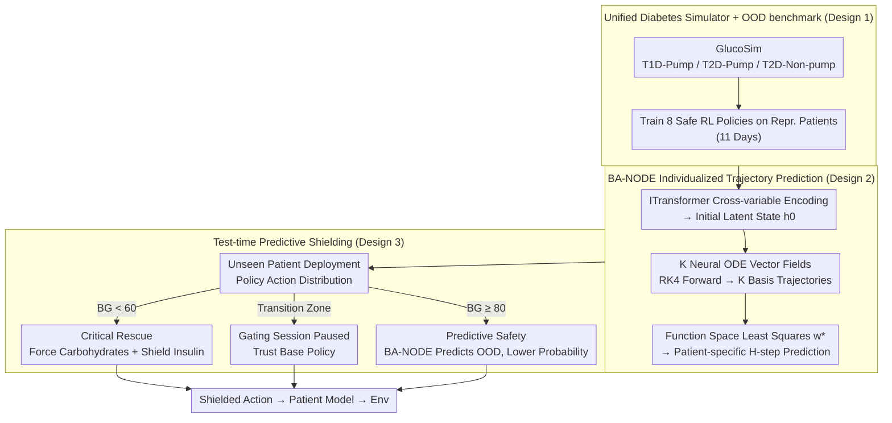

# Safety Generalization Under Distribution Shift in Safe Reinforcement Learning: A Diabetes Testbed

**Conference**: ICML 2026  
**arXiv**: [2601.21094](https://arxiv.org/abs/2601.21094)  
**Code**: GlucoSim + GlucoAlg (GitHub, safe-autonomy-lab)  
**Area**: Reinforcement Learning / Safe RL  
**Keywords**: Safe Reinforcement Learning, Distribution Shift, Test-time Shielding, Neural ODE, Diabetes Decision Making  

## TL;DR
Based on the UVA-Padova physical model, a unified T1D/T2D diabetes simulator was developed. It was observed that while 8 mainstream Safe RL algorithms satisfy safety constraints on training patients, Time-in-Range (TIR) generally drops by 8–13% when deployed to unseen patients. Consequently, a Basis-Adaptive Neural ODE is proposed to predict blood glucose trajectories, combined with predictive shielding at test time to filter hazardous actions. This allows baselines like PPO-Lag and CPO to regain 13–14% TIR on OOD patients.

## Background & Motivation

**Background**: Safe RL models control problems as CMDPs, enforcing cumulative cost constraints during training via Lagrangians, trust regions (CPO), or projections (PCPO). These algorithms provide "expected safety" guarantees under fixed dynamics. Diabetes management is a frequently studied safety-critical application.

**Limitations of Prior Work**: All Safe RL guarantees are "distribution-dependent"—the safety boundaries learned during training are tied to the physical parameters encountered. In real-world deployment, insulin sensitivity, absorption rates, and metabolic rates vary by individual and cannot be exhaustively sampled in training sets. Existing RL diabetes works (fox2020deep / zhu2023offline) assume matching training and testing dynamics and mostly focus on T1D, lacking systematic evaluation of safety robustness under population diversity.

**Key Challenge**: Under distribution shift, "constraint satisfaction" during training and "sustained safety" during deployment are distinct problems. In healthcare, shifts are often latent and structural (unobservable metabolic parameters) rather than observable geometric ones; furthermore, ethical constraints prohibit online trial-and-error retraining.

**Goal**: (i) Quantify the "safety generalization gap" of mainstream Safe RL; (ii) Provide an algorithm-agnostic test-time mechanism to bridge this gap without retraining; (iii) Deliver a unified clinical simulator (T1D/T2D + Pump/Non-pump) as a reusable testbed.

**Key Insight**: Transform traditional shielding—which traditionally relies on formal logic or known dynamics—into a mechanism driven by "learned dynamics predictors + probabilistic bounds," explicitly decoupling "training-time constraints" from "deployment-time verification."

**Core Idea**: Utilize a continuous-time dynamics predictor (BA-NODE) capable of function-space adaptation for individual patients. At each step, it predicts the blood glucose trajectory H-steps ahead for candidate actions and shields those predicted to violate boundaries. The shielding threshold is tighter than the clinical failure threshold, with the margin exactly matching the predictor's error bound.

## Method

### Overall Architecture
This work addresses the OOD safety gap where Safe RL satisfy constraints during training but silently violate them on unseen patients. The system consists of three layers: first, a unified simulator GlucoSim (extended from UVA-Padova to cover T1D-Pump, T2D-Pump, and T2D-Non-pump) is used to train standard Safe RL policies. Each step provides the agent with a 14-dimensional CGM/IOB/meal history observation, and the agent outputs discrete bolus + meal recommendations filtered by a "patient acceptance model." Second, an individualized dynamics predictor, BA-NODE, learns to predict future H-step blood glucose trajectories. Finally, during test-time, the action distribution of any pre-trained policy is processed through predictive shielding, suppressing the probabilities of actions predicted to cause boundary violations. Training involves 11 days of data for representative patients (Child#01 / Adolescent#01 / Adult#01), while zero-shot evaluation is conducted over 77 days for 9 unseen patients.

### Key Designs

**1. Unified Diabetes Simulator + OOD Safety Benchmark: Emerging "Training Compliant, Deployment Failure"**

Direct continuous basal control is an unrealistic clinical assumption. Existing RL diabetes research often assumes training-test dynamics matching and focuses on T1D, failing to measure safety robustness under population heterogeneity. GlucoSim integrates T1D/T2D + Pump/Non-pump into a single MDP interface, focusing on "treatment decision support" rather than "direct continuous control." The physical layer is based on UVA-Padova, with T2D additionally utilizing Hovorka secretion dynamics + Dalla Man transport models. The MDP reward uses a two-hour prediction window to calculate risk delta, incorporating delayed effects like insulin stacking and rebound hyperglycemia into immediate rewards. An additional "frequent intervention" penalty is added to the cost. Safety is quantified using the Kovatchev asymmetric Risk Index, $r_t = 10\,f(G_t)^2$, where $f(G) = 1.509\,(\ln(G)^{1.084} - 5.381)$. This asymmetric transformation penalizes hypoglycemia more heavily than hyperglycemia, aligning with clinical reality where hypoglycemia is more lethal. Evaluation explicitly separates parameter generalization (Patient #02–#10) and duration generalization (11-day training vs. 77-day testing).

**2. Basis-Adaptive Neural ODE (BA-NODE): Zero-shot Adaptation to Individuals via Latent Variables**

Latent patient variables like insulin sensitivity and absorption rates are unobservable but determine blood glucose evolution. The predictor must recognize the patient type zero-shot using a small context window. BA-NODE replaces the "static function basis" of traditional Function Encoders with "dynamic basis trajectories." First, ITransformer treats each physiological variable as a token for cross-variable self-attention, producing a per-variate summary projected into an initial latent state $h_0$. Next, $K$ parallel neural ODE vector fields $\{f_{\theta_k}\}$ use RK4 to push forward, generating $K$ candidate latent trajectories, combined into a single latent trajectory via a shared projection $W_{\mathrm{proj}} \in \mathbb{R}^{K \times 1}$. Finally, using these $K$ rollouts as "basis trajectories" $\{G_k(\cdot)\}$, a regularized least squares problem is solved for $N$ context windows:

$$w^\star = \arg\min_w \|\tilde G w - \tilde y_{\text{ctx}}\|_2^2 + \lambda \|w\|_2^2$$

This yields patient-specific weights $w^\star$, and the final prediction is $\hat y_{T+P} = y_T + \sum_{i=1}^{P} (G(x_{\text{pred}}) w^\star)_i$. Adaptation is merely a least-squares solution, requiring no online gradient updates on the patient.

**3. Test-time Predictive Shielding: Algorithm-Agnostic Runtime Safety Wrapper**

Training constraints inevitably fail under OOD conditions; since retraining is prohibited, test-time remediation is required. The shield reshapes the policy action distribution:

$$\pi_{\text{shielded}}(a|s) = \mathrm{Softmax}\big(\log \pi_\theta(a|s) + M(s,a)\big),$$

The penalty $M$ lowers the probability of dangerous actions without zeroing them (preserving exploration tolerance). Three rules are stacked: **Critical Rescue** is triggered when $BG_t < G_{\text{rescue}} = 60\,\text{mg/dL}$, forcing 15g rescue carbs and shielding all insulin; **Predictive Safety** is triggered when $BG_t \geq G_{\text{shield}}^\downarrow = 80\,\text{mg/dL}$, where BA-NODE predicts H-step trajectories for top-$k$ candidates. Actions with predicted minimum $m(a) < G_{\text{shield}}^\downarrow$ or maximum $M(a) > G_{\text{shield}}^\uparrow$ are penalized. A **Gating** mechanism pauses verification in the transition zone $[G_{\text{rescue}}, G_{\text{shield}}^\downarrow)$ to prevent oscillation. Under an $(\varepsilon, \alpha)$-reliable assumption, setting the threshold to $G_{\text{shield}}^\downarrow = G_{\text{fail}}^\downarrow + \varepsilon$ ensures $\Pr(\min_\tau BG_\tau(a) \geq G_{\text{fail}}^\downarrow) \geq 1 - \alpha$.

## Key Experimental Results

### Main Results

**Safety Generalization Gap (No Shielding)**: Training patients (ID) vs. Unseen patients (OOD) across 8 algorithms:

| Algorithm | TIR ID (%) ↑ | TIR OOD (%) ↑ | ΔTIR | ΔRisk |
|---|---|---|---|---|
| CPO | 87.28 | 76.73 | -10.55 | +1.62 |
| CUP | 89.36 | 77.70 | -11.66 | +2.61 |
| FOCOPS | 88.08 | 75.42 | -12.66 | +2.77 |
| PPO-Lag | 85.29 | 75.20 | -10.09 | +2.16 |
| TRPO-Lag | 82.79 | 74.43 | -8.37 | +1.79 |

7 out of 8 algorithms saw a TIR drop of $\geq 8\%$ and a Risk Index increase of $\geq 1.6$, confirming the structural nature of the safety generalization gap.

**BA-NODE Prediction Accuracy (24 steps = 120 mins)**:

| Model | MAE ↓ | FDE ↓ | RMSE ↓ |
|---|---|---|---|
| ITransformer | 4.11 | 5.39 | 7.25 |
| NODE | 3.18 | 4.11 | 5.10 |
| **BA-NODE** | **2.82** | **3.63** | **4.42** |

### Ablation Study

**T1D with/without Shielding**:

| Algorithm | TIR (%) | Gain (ΔTIR) | Risk Index | ΔRisk | CV (%) | ΔCV |
|---|---|---|---|---|---|---|
| CPO | 85.50 | +4.70 | 3.44 | -1.51 | 25.40 | -2.56 |
| FOCOPS | 82.63 | +3.07 | 4.53 | -0.97 | 29.63 | -4.26 |
| PPO-Lag | 85.59 | +8.05 | 3.96 | -1.79 | 29.18 | -3.21 |
| RCPO | 86.45 | +6.90 | 3.34 | -2.26 | 26.22 | -3.92 |

**T2D Gains**: CPO ΔTIR +13.54%; PPO-Lag ΔTIR +14.15%. Across 72 settings, predictive shielding consistently outperformed the rule-based shield (RBS).

### Key Findings
- **Training Compliance $\neq$ Deployment Safety**: Policies with Risk Index < 5 and TIR > 80% during training almost all failed OOD, showing expected-value safety guarantees are insufficient under distribution shift.
- **Predictive Shielding > Rule-based Shielding**: RBS often exacerbated Coefficient of Variation (CV) due to positive feedback loops (high glucose → insulin → hypoglycemia → carbs). Predictive shielding avoids short-sightedness by looking H-steps ahead.
- **Base Policy Lower Bound**: The effectiveness of shielding is limited by the base policy's distribution; it cannot create good actions if all probability mass is on hazardous ones.

## Highlights & Insights
- **Mapping prediction error to safety margin**: The shield threshold $G_{\text{shield}}^\downarrow = G_{\text{fail}}^\downarrow + \varepsilon$ allows the additive predictor error to be absorbed into the safety margin, providing a $1 - \alpha$ high-probability bound.
- **Zero-parameter update adaptation**: Solving a least-squares problem for patient-specific weights allows zero-shot adaptation without online gradient updates, fitting the "no trial-and-error" clinical constraint.
- **CV indicator for clinical realism**: While TIR measures time in range, CV measures smoothness. Using both identifies that predictive shielding achieves safety "smoothly."

## Limitations & Future Work
- The assumption that the context window is "representative" for new patients' cold-starts requires more verification.
- Shielding only filters actions; long-term it might mask fundamental policy defects, eventually pushing behaviors to the boundaries.
- The $\varepsilon$ bound is estimated on an IID calibration set; the effect of OOD on the error bound itself is not yet modeled.

## Related Work & Insights
- **vs. Traditional Shielding (alshiekh2018safe)**: Replaces formal logic with differentiable dynamics predictors, allowing trajectory prediction to substitute for formal verification in unknown dynamics.
- **vs. Safe Meta-RL (khattar2023a)**: Meta-RL requires task-specific fine-tuning (interaction), which violates safety. This work uses "test-time verification + zero updates," bypassing ethical hurdles.
- **vs. Existing Diabetes RL**: Unlike prior work assuming matching dynamics, this study introduces structural distribution shift across types and ages.

## Rating
- Novelty: ⭐⭐⭐⭐
- Experimental Thoroughness: ⭐⭐⭐⭐⭐
- Writing Quality: ⭐⭐⭐⭐
- Value: ⭐⭐⭐⭐

<!-- RELATED:START -->

## Related Papers

- [\[AAAI 2026\] Partial Action Replacement: Tackling Distribution Shift in Offline MARL](../../AAAI2026/reinforcement_learning/partial_action_replacement_tackling_distribution_shift_in_offline_marl.md)
- [\[ICML 2026\] Safe In-Context Reinforcement Learning](safe_in-context_reinforcement_learning.md)
- [\[ICML 2026\] Safe Reinforcement Learning with Preference-Based Constraint Inference](safe_reinforcement_learning_with_preference-based_constraint_inference.md)
- [\[ICML 2026\] DARTS: Distribution-Aware Active Rollout Trajectory Shaping for Accelerating LLM Reinforcement Learning](darts_distribution-aware_active_rollout_trajectory_shaping_for_accelerating_llm_.md)
- [\[ICML 2026\] Learning to Search and Searching to Learn for Generalization in Planning](learning_to_search_and_searching_to_learn_for_generalization_in_planning.md)

<!-- RELATED:END -->
