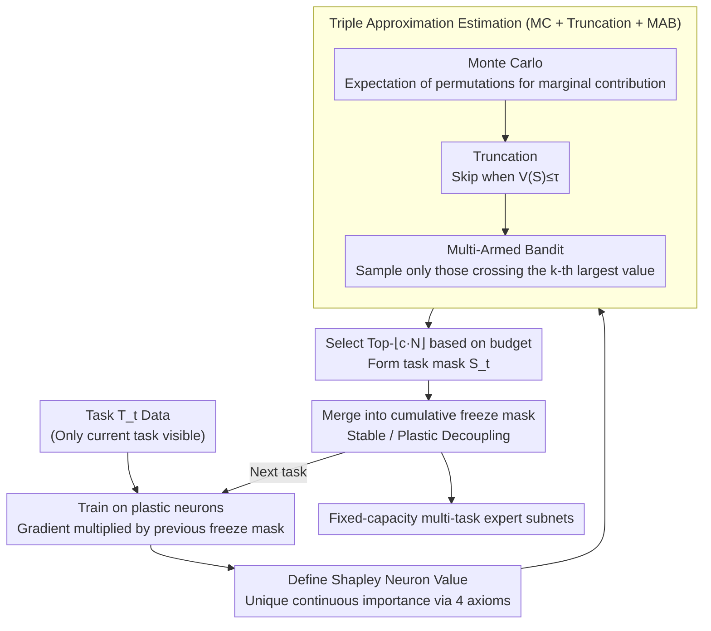

# Shapley Neuron Values for Continual Learning: Which Neurons Matter Most?

**Conference**: ICML 2026  
**arXiv**: [2605.15877](https://arxiv.org/abs/2605.15877)  
**Code**: GitHub (The paper mentions a "GitHub Code" link, URL TBD)  
**Area**: Interpretability / Continual Learning / Shapley Value Neuron Attribution  
**Keywords**: Continual Learning, Shapley Value, Neuron Importance, Catastrophic Forgetting, Buffer-Free

## TL;DR
The authors adapt Shapley values from cooperative game theory to the "filter" level of Convolutional Neural Networks, using a triple approximation of Monte Carlo, truncation, and Multi-Armed Bandits to estimate continuous importance rankings for each neuron. By freezing the Top-$r\%$ "expert" neurons and leaving the rest plastic for further training, they achieve a $+2.88\%$ accuracy gain in Class-Incremental Learning and a $+6.46\%$ gain in Task-Incremental Learning on ImageNet-1k compared to the second-best buffer-free method, without storing samples or expanding the architecture.

## Background & Motivation

**Background**: The Continual Learning (CL) community primarily follows three paradigms: regularization-based (EWC, SI, LwF), replay-based (iCaRL, DER++, PODNet, GEM), and dynamic architecture-based (PNN, DyTox, MEMO). Replay-based methods are the strongest but require storing samples (violating strict "current data only" definitions and GDPR constraints); dynamic architectures suffer from unbounded parameter growth; regularization-based methods are buffer-free but collapse under highly heterogeneous tasks.

**Limitations of Prior Work**: A core flaw of existing buffer-free methods is the **lack of knowledge regarding which neurons are truly important**. Approaches like "Winning Subnetwork" (WSN) use binary $\{0,1\}$ scoring, which fails to distinguish "marginal Top-$k$" from "absolute Top-$k$" under tight capacity budgets. NFL+ merely freezes parameters progressively without a principled importance measure.

**Key Challenge**: The stability-plasticity trade-off becomes a hard selection problem of "which neurons to freeze and which to keep" under fixed capacity. While modern over-parameterized networks have ample capacity, they lack a fair, continuous, and theoretically grounded attribution mechanism.

**Goal**: To construct a principled metric that assigns **continuous real-valued** importance to each neuron without storing samples or expanding architecture, ensuring that Top-$k$ selection remains stable and effective across various sparsity budgets $c$.

**Key Insight**: Shapley values in cooperative games are the **unique** solution satisfying the four axioms: Efficiency, Null Contribution, Symmetry, and Linearity. By mapping "neurons as players" and "model accuracy as payoff," all fairness guarantees are inherited. The remaining challenge is an engineering problem: how to efficiently estimate these values in an exponential subset space.

**Core Idea**: Redefine neuron importance via "Shapley Neuron Values," use MC + Truncation + MAB to reduce exponential complexity to a manageable level, and accumulate task-specific freezing masks to allocate multi-task expert subnets within a fixed capacity.

## Method

### Overall Architecture
Given a network with $L$ layers and $C_l$ filters in the $l$-th layer, the total number of neurons is $N = \sum_{l=1}^L C_l$, represented by the set $\mathcal{M} = \{m_i\}_{i=1}^N$. A sequence of tasks $\{T_t\}_{t=1}^T$ arrives, where only the current task data $\mathcal{D}_t$ is accessible. For each task $t$:

1. Train for several epochs on "plastic" neurons outside the previous cumulative freezing mask $\mathbf{B}_{t-1} = \bigcup_{i<t} S_i$.
2. Estimate the Shapley value $\hat{\phi}_i$ for each neuron using the validation set post-training.
3. Select the Top-$\lfloor c\cdot N\rfloor$ neurons to form the current task binary mask $S_t$ and merge it into the cumulative frozen set $\mathbf{B}_t$.
4. Store the task head $h_t$ and proceed to the next task.

The parameter update rule applies the gradient directly to the freezing mask $\mathbf{M}_{t-1}$:

$$\theta \leftarrow \theta - \eta\Big(\frac{\partial \mathcal{L}}{\partial \theta}\odot \mathbf{M}_{t-1}\Big)$$

where $(\mathbf{M}_{t-1})_j = 0$ if and only if $\theta_j$ belongs to a neuron that has already been frozen.

### Key Designs

**1. Axiomatic Definition of Shapley Neuron Value: Fair continuous importance for each neuron**

Previous buffer-free methods lacked precise importance metrics. WSN-style methods use $\{0,1\}$ binary scores, which cannot distinguish "marginal" from "absolute" importance under small budgets $c$ (e.g., $c=0.03$). The authors leverage the fact that the Shapley value is the unique distribution satisfying Efficiency, Null Contribution, Symmetry, and Linearity. By mapping neurons to players and model accuracy to payoff, they inherit these fairness guarantees. A key implementation detail is that masking a neuron involves replacing its output with its mean response rather than zeroing it out—this blocks information flow while preserving the statistics of inputs to downstream layers, preventing cascading collapses. If $V(\mathcal S)$ is the accuracy when only subset $\mathcal S$ is preserved, then

$$\phi_i = \sum_{\mathcal{S}\subseteq \mathcal{M}\setminus\{i\}} \frac{|\mathcal{S}|!(|\mathcal{M}|-|\mathcal{S}|-1)!}{|\mathcal{M}|!}\bigl[V(\mathcal{S}\cup\{i\}) - V(\mathcal{S})\bigr]$$

represents the unique assignment. This continuous ranking is interpretable across various $c$ and aligns with axioms: Null Contribution removes non-contributing "dead" neurons, while Symmetry ensures identical neurons are treated equally.

**2. Triple Approximation Algorithm (MC + Truncation + MAB): Compressing $O(N!)$ for ResNet-18**

Exact Shapley calculation is exponential and infeasible for ResNet-18 ($N > 1000$). The authors stack three layers of approximation. First, Monte Carlo: rewrite $\phi_i$ as an expectation over permutations $\phi_i=\mathbb{E}_{\pi\sim\Pi}[V(\mathcal S_i^\pi\cup\{i\})-V(\mathcal S_i^\pi)]$. Second, Truncation: when the permutation prefix is too small ($V(\mathcal S_i^\pi)\le\tau$), skip the marginal calculation as the model is effectively non-functional. Third, Multi-Armed Bandit: since the downstream goal is "reliable Top-$k$ identification," they continue sampling only for neurons whose confidence intervals still cross the current $k$-th largest value. Formally, $\delta_i=z_\alpha\cdot\sigma_i/\sqrt{n_i}$; the process converges when the set $\mathcal A\leftarrow\{i:|\hat\phi_i-\phi^{(k)}|<\delta_i\}$ is empty. This clever shift from "estimating all $\phi_i$ accurately" to "finding Top-$k$" perfectly matches the decision goal and can be transferred to any attribution scenario using Top-$k$ results (e.g., SHAP/LIME).

**3. Cumulative Freezing Mask and Stable–Plastic Decoupling: Forcing catastrophic forgetting to "Strict Zero"**

With reliable rankings, the remaining task is multi-task subnet allocation within fixed capacity. The authors maintain a cumulative binary mask $\mathbf B_{t-1}\in\{0,1\}^N$ at the neuron level, expanded to the parameter level $\mathbf M_{t-1}$. During training, gradients are updated via $\theta\leftarrow\theta-\eta(\frac{\partial\mathcal L}{\partial\theta}\odot\mathbf M_{t-1})$. Each task claims Top-$\lfloor c\cdot N\rfloor$ neurons. Unlike WSN's "soft mask + retraining" or regularization-based soft constraints, this hard freezing provides a strong guarantee of zero backward transfer (measured BWT $\approx 0.00$), as weights belonging to previous tasks remain untouched.

### Loss & Training
Standard Cross-Entropy with Adam is used. ResNet-18 with He initialization is trained for 200 epochs on CIFAR-100/Tiny-ImageNet and 100 epochs on ImageNet-1k, all utilizing early stopping. Hyperparameters are grid-searched on the first task's validation set and then **frozen** for all subsequent tasks (GTEP protocol).

## Key Experimental Results

### Main Results

| Dataset | Scenario | Tasks | SNV (ours) | Prev. SOTA (buffer-free) | Gain |
|---------|----------|-------|------------|-------------------------|------|
| ImageNet-1k | CIL | 10 | $\mathbf{41.30\%}$ | NFL+ $38.42\%$ | $+2.88$ |
| ImageNet-1k | CIL | 20 | $\mathbf{34.20\%}$ | NFL+ $31.50\%$ | $+2.70$ |
| ImageNet-1k | CIL | 50 | $\mathbf{25.60\%}$ | NFL+ $22.40\%$ | $+3.20$ |
| ImageNet-1k | TIL | 10 | $\mathbf{57.82\%}$ | NFL+ $51.36\%$ | $+6.46$ |
| ImageNet-1k | TIL | 20 | $\mathbf{50.45\%}$ | NFL+ $45.80\%$ | $+4.65$ |
| ImageNet-1k | TIL | 50 | $\mathbf{40.18\%}$ | NFL+ $37.20\%$ | $+2.98$ |

SNV on CIL/10 even outperforms the memory-based method DyTox ($40.15\%$) which uses 20,000 exemplars, proving that principled neuron selection can compensate for the absence of a replay buffer.

### Ablation Study

| Config (TIL, CIFAR-100, 10 tasks) | ACC | BWT | PS | Note |
|-----------------------------------|-----|-----|-----|------|
| SNV, $c=0.03$ | $71.74$ | $0.00$ | $0.52$ | Outperforms WSN $(59.65)$ even at tight budget |
| SNV, $c=0.05$ | $74.52$ | $0.00$ | $0.54$ | |
| SNV, $c=0.1$ | $76.19$ | $0.00$ | $\mathbf{0.62}$ | Optimal PS |
| SNV, $c=0.3$ | $77.89$ | $0.00$ | $0.58$ | |
| SNV, $c=0.5$ | $\mathbf{79.76}$ | $0.00$ | $0.60$ | Optimal ACC |
| WSN, $c=0.5$ | $64.00$ | $0.00$ | $0.66$ | Binary scoring has clear upper limit |
| NFL+ (no $c$ param) | $70.68$ | $-0.35$ | $\mathbf{0.65}$ | Non-zero BWT |
| EWC | $36.47$ | $-54.13$ | $0.37$ | Regularization collapses on 1000 classes |

### Key Findings
- **Zero backward transfer is a structural result, not a fluke**: All SNV configurations maintain BWT at exactly $0.00$ due to hard freezing; NFL+ and EWC show significantly negative BWT, indicating their "soft" constraints fail over long task sequences.
- **SNV advantage is greatest at small budgets $c$**: At $c=0.03$, SNV beats WSN by $+12\%$ ($71.74$ vs $59.65$), confirming that continuous scoring is better for accurate ranking under tight constraints.
- **Pruning cliffs reveal parameter efficiency**: SNV on CIFAR-100 only collapses after $30\%$ pruning, whereas NFL+ falls off between $20-30\%$. EWC/LwF show a slow, continuous decline, which actually exposes massive post-training parameter redundancy.
- **SNV matches memory-based performance on ImageNet-1k**: While DyTox usually leads buffer-free methods using 20k exemplars, SNV matches or exceeds it without storing samples.

## Highlights & Insights
- **Mean Response substitution**: Replacing neuron outputs with mean activations on the validation set (rather than $0$) avoids distribution collapse, making the marginal difference in $V(\mathcal{S})$ truly informative for MC estimation stability.
- **MAB alignment with decision goals**: Instead of estimating all $\phi_i$, the authors focus on "finding Top-$k$." Reformulating the statistical goal as best-arm identification is a powerful idea applicable to many attribution tasks.
- **GTEP Protocal**: Freezing hyperparameters after the first task prevents the "hidden cheating" often found in CL where hyperparams are grid-searched across the entire sequence.
- **Honesty regarding memory-based vs buffer-free comparisons**: The authors explicitly argue that "fixed buffer size comparisons" are often unfair and suggest treating "small-buffer" and "strict CL" as two separate problems.

## Limitations & Future Work
- Estimation is limited to "Filter" granularity in CNNs: In Transformers/Attention heads, strong coordination between heads might cause marginal contribution noise to spike, requiring a redesign of MAB convergence.
- MC + MAB overhead: Estimating $\phi_i$ requires many forward passes after each task; wall-clock overhead was not explicitly provided.
- Fixed capacity limits: As $T \to \infty$, the budget $c = 1/T \to 0$. Capacity exhaustion will lead to a deadlock before accuracy drops; this was only verified up to 50 tasks.
- Domain coverage: Lacks direct evidence of similar advantages in NLP continual learning (e.g., sequence labeling).

## Related Work & Insights
- **vs WSN**: WSN uses binary selection; SNV uses continuous values. SNV's $12\%$ lead at $c=0.03$ proves current continuous metrics are superior to binary ones.
- **vs NFL+**: NFL+ is a purely heuristic progressive freezing method; SNV provides a unique, axiomatic distribution via the Shapley framework, winning across all ImageNet-1k settings.
- **vs EWC / SI / LwF**: These use rough diagonal Fisher approximations that fail to capture complex parameter couplings in 1000-class scenarios.
- **vs Neuron Shapley (Ghorbani et al.)**: SNV inherits the MC+Truncation framework but adds MAB to pivot from "estimation" to "selection" and is the first to apply this to CL freezing.
- **Insight**: Replacing the value function $V$ with "fairness metrics" or "robustness metrics" would allow the same framework to be used for fairness attribution or locating adversarial vulnerabilities.

## Rating
- Novelty: ⭐⭐⭐⭐ — Shapley + Neuron is known, but "MAB for Top-$k$ selection in a CL freezing pipeline" is a novel combination.
- Experimental Thoroughness: ⭐⭐⭐⭐ — Extensive datasets and benchmarks (CIL/TIL, up to 50 tasks). Analysis covers pruning, PS, and BWT.
- Writing Quality: ⭐⭐⭐⭐ — Clear logic from axioms to algorithms, though some minor notation inconsistencies exist.
- Value: ⭐⭐⭐⭐ — Provides a principled, interpretable, budget-controllable new baseline for buffer-free CL.

<!-- RELATED:START -->

## Related Papers

- [\[ICML 2026\] Position: Deployed Reinforcement Learning should be Continual](position_deployed_reinforcement_learning_should_be_continual.md)
- [\[NeurIPS 2025\] Temporal-Difference Variational Continual Learning](../../NeurIPS2025/reinforcement_learning/temporal-difference_variational_continual_learning.md)
- [\[NeurIPS 2025\] Approximating Shapley Explanations in Reinforcement Learning](../../NeurIPS2025/reinforcement_learning/approximating_shapley_explanations_in_reinforcement_learning.md)
- [\[ACL 2026\] Savoir: Learning Social Savoir-Faire via Shapley-based Reward Attribution](../../ACL2026/reinforcement_learning/savoir_learning_social_savoir-faire_via_shapley-based_reward_attribution.md)
- [\[CVPR 2026\] Resolving the Stability-Plasticity Dilemma in Reinforcement Learning via Complementary Continual Critics](../../CVPR2026/reinforcement_learning/resolving_the_stability-plasticity_dilemma_in_reinforcement_learning_via_complem.md)

<!-- RELATED:END -->
