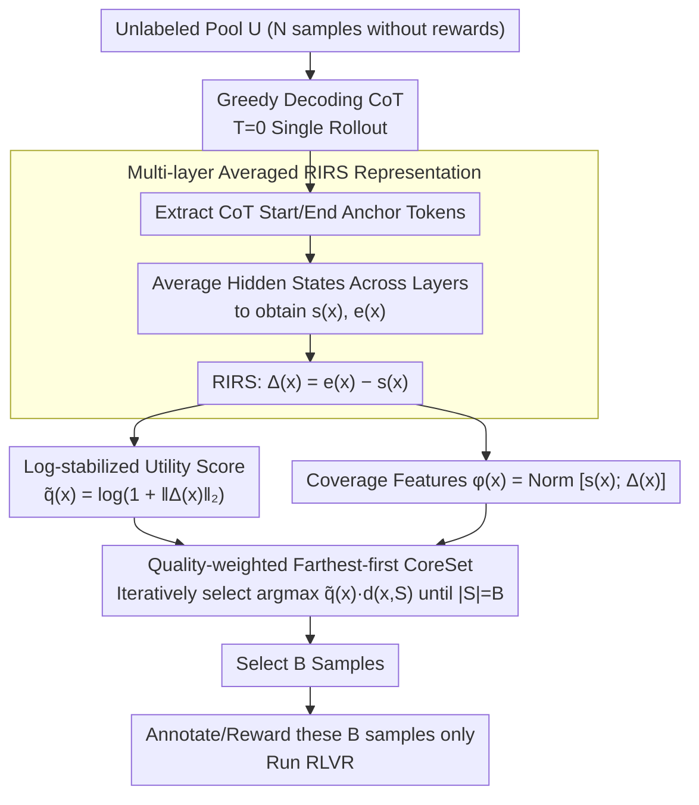

# Single-Rollout Hidden-State Dynamics for Training-Free RLVR Data Selection

**Conference**: ICML 2026  
**arXiv**: [2605.28631](https://arxiv.org/abs/2605.28631)  
**Code**: https://github.com/JianghaoWu/SHIFT  
**Area**: Reinforcement Learning / LLM Reasoning / Data Selection  
**Keywords**: RLVR, Data Selection, Hidden State Dynamics, CoreSet, Training-Free  

## TL;DR
SHIFT utilizes the hidden state difference between the starting and ending tokens under a single greedy decoding rollout, $\Delta(x)=\mathbf{e}(x)-\mathbf{s}(x)$, to serve simultaneously as a utility proxy and a diversity feature for RLVR samples. A quality-weighted farthest-first CoreSet is then employed to select a minimal subset of high-value samples from a large unlabeled pool without requiring training, rewards, or ground-truth answers.

## Background & Motivation

**Background**: Reinforcement Learning with Verifiable Rewards (RLVR) significantly enhances the reasoning capabilities of LLMs with extreme sample efficiency. Literature indicates that a few meticulously selected samples can approximate the performance achieved by RL trained on thousands of samples. Representative methods (e.g., Wang et al. 2025c) identify high-value samples by analyzing the Historical Variance Score (HVS) of each sample during small-scale proxy RL training.

**Limitations of Prior Work**: Selection criteria based on training signals necessitate running (proxy) fine-tuning or RL on a large candidate pool and require verifiable rewards, which is equivalent to requiring ground-truth answers. This is both expensive and infeasible in specialized domains like medical reasoning. Classic active learning criteria such as uncertainty or gradients similarly rely on training feedback, while pre-training proxies like difficulty or Perplexity (PPL) correlate weakly with reward-driven utility in RLVR.

**Key Challenge**: RLVR sample utility is reward-driven, but during the selection phase, neither rewards nor labels are available, and performing preliminary training is undesirable. Existing active learning signals are built upon "having performed training or obtained labels."

**Goal**: Select the $|S|=B$ most promising training samples from a large unlabeled pool in the pre-RL phase without evaluating rewards.

**Key Insight**: From a theoretical perspective, Dherin et al. (2025) equate the context effect of Transformer self-attention + MLP to a rank-1 implicit weight update on the first layer of the MLP, providing the upper bound $\|\Delta W(Y)\|_F \le \frac{\|W\|_2}{\|A(C\setminus Y,x)\|_2}\,\|\Delta A(Y)\|_2$. This suggests that context-induced representation changes can proxy the internal learning volume of the model. Empirically, Liang et al. (2025) confirmed that hidden state differences before and after Chain-of-Thought (CoT) can encode non-trivial structures of the reasoning process.

**Core Idea**: Use the difference between multi-layer averaged hidden states of the start/end anchors in a single deterministic CoT rollout as a sample utility proxy $q(x)=\|\Delta(x)\|_2$, and perform quality-weighted farthest-first selection in the normalized space of $[\mathbf{s}(x);\Delta(x)]$.

## Method

### Overall Architecture
For each sample in the unlabeled pool $\mathcal{U}=\{x_i\}_{i=1}^{N}$: (1) Generate a CoT using a base LLM $f_\theta$ via $T=0$ greedy decoding under a fixed reasoning prompt; (2) Take the start and end tokens of the CoT (or delimiters if the model supports `<think>`/`</think>`) as anchors and average across multiple layers to obtain $\mathbf{s}(x), \mathbf{e}(x)\in\mathbb{R}^D$; (3) Calculate the Residual Induced Reasoning State (RIRS) $\Delta(x)=\mathbf{e}(x)-\mathbf{s}(x)$; (4) Feed $\tilde q(x)$ and $\phi(x)$ into a quality-weighted farthest-first CoreSet to select $B$ samples; (5) Label/calculate rewards only for these $B$ samples and execute RLVR. The entire selection process involves "one inference pass, zero training, and zero labels."

### Key Designs

**1. Multi-layer Averaged RIRS Representation: Encapsulating internal model progression in a single vector**

Since neither rewards nor labels are available during selection, a training-free utility proxy is required. SHIFT extracts hidden states $\mathbf{h}^{(\ell)}_{t_s}(x)$ and $\mathbf{h}^{(\ell)}_{t_e}(x)$ for anchor tokens at each layer $\ell$, averages them across layers to get $\mathbf{s}(x)$ and $\mathbf{e}(x)$, and defines $\Delta(x)=\mathbf{e}(x)-\mathbf{s}(x)$ as the "inference-induced representation drift." Theoretically, leveraging the rank-1 implicit weight perspective from Dherin et al., $\|\Delta(x)\|_2$ is interpreted as a trajectory-level, layer-aggregated observable proxy for accumulated context-induced changes during a rollout. This is significantly cheaper than "R=32 random samplings for self-consistency entropy" or "running RL to observe rewards." Multi-layer averaging provides more stability than single-layer anchors.

**2. Log-stabilized Utility Score: Compressing RIRS norms into a comparable proxy**

The magnitude of $\|\Delta\|_2$ varies significantly across samples of different lengths and domains. SHIFT first calculates $q(x)=\|\Delta(x)\|_2$ and then applies a monotonic log-compression $\tilde q(x)=\log(1+q(x))$. This maintains the ranking while stabilizing the scale, allowing it to be dimensionally comparable with the diversity distance $d(x,S)$ in multiplicative forms. A high $\tilde q$ indicates the sample induces a larger internal state shift, which is assumed to possess higher learning value for RLVR.

**3. Quality-weighted Farthest-first CoreSet: Balancing utility and coverage in a single greedy pass**

Samples with high $\tilde q$ often cluster (e.g., similar difficult problems). A pure top-K approach would waste budget on redundant samples, while a pure farthest-first approach might pick meaningless outliers. SHIFT multiplies the two: it constructs $\ell_2$-normalized coverage features $\phi(x)=[\mathbf{s}(x);\Delta(x)]/\|[\mathbf{s}(x);\Delta(x)]\|_2 \in \mathbb{R}^{2D}$ (containing both CoT starting context and reasoning dynamics), initializes $S\leftarrow\{\arg\max_x \tilde q(x)\}$, and then iteratively selects $x^\star=\arg\max_{x\in\mathcal{U}\setminus S}\, \tilde q(x)\cdot d(x,S)$, where $d(x,S)=\min_{x'\in S}\|\phi(x)-\phi(x')\|_2$. The multiplicative form ensures that a sample is only selected if it satisfies both high utility and high coverage.

### Loss & Training
SHIFT itself does not train any parameters. The selection phase consists only of one greedy inference pass and a CoreSet greedy scan. For the RLVR phase, all methods use the same training budget and hyperparameters, varying only the "sample selection" rule. MedQA uses Qwen3-1.7B, MATH-500 uses Qwen2.5-Math-1.5B, both starting from public checkpoints.

## Key Experimental Results

### Main Results
| Dataset | Selection Budget | Eval | Full RLVR Ref | Random | Best Baseline | SHIFT |
|--------|----------|------|------------------|--------|----------|-------|
| MATH-500 (in-domain) | 2% (7/350) | Pass@1 | 66.00 | 53.73 | (Cluster 44.67 / CoreSet 47.33) | Smallest gap to Full, significantly beats Cluster/CoreSet |
| AMC (OOD Math Transfer) | 2% | Pass@1 | 33.73 | 25.78 | 25.30 (Cluster) | Consistently superior to training-free baselines |
| MedQA | 0.1–0.2% | Post-RLVR Acc | — | — | — | Consistently optimal under multiple ultra-low budgets |

> Reproduction details: MATH-500 splits 500 problems into a 350-sample pool and a 150-test set. MedQA uses a 10.2K training set as the selection pool and evaluates on a 1.27K test set, with cross-set transfer to MedMCQA, PubMedQA, and MedXpertQA(U/R). Baselines include KMeans-Center (Cluster), Farthest-First (CoreSet), Q-PPL (Question Perplexity), SC-Entropy (32-pass random decoding answer entropy), CoT Similarity, and A-PPL (Answer Perplexity).

### Ablation Study
| Configuration | Key Role | Description |
|------|----------|------|
| Full SHIFT | RIRS Quality + RIRS Coverage | Best performing version reported in the paper. |
| Utility Top-K only | Remove coverage term | Prone to selecting homogeneous samples, leading to performance drops. |
| Farthest-first only | Remove $\tilde q$ weight | Degenerates into generic CoreSet, dominated by outliers. |
| Sentence Embedding CoreSet | Use MiniLM-L6-v2 instead of RIRS | Fails to capture test-time compute, significantly weaker than SHIFT. |
| Single vs. Multi-rollout | Selection cost | Single greedy RIRS is sufficient; R=32 random sampling is unnecessary. |

### Key Findings
- The "RIRS norm" is decoupled from surface statistics like input/output length. Correlation analysis confirms that $\tilde q$ gains cannot be explained by simple length factors, supporting it as a genuine proxy for "reasoning-induced internal updates."
- Integrating $\Delta(x)$ as both the utility score and part of the coverage feature $\phi(x)$ is critical. Using it for only one or the other leads to significant performance degradation.
- In domains like MedQA where rewards are scarce, SHIFT compresses annotation and reward evaluation costs strictly to the $B$ selected samples, making RLVR a viable alignment paradigm for low-resource scenarios.
- SHIFT's advantages remain stable across cross-set transfers, indicating that selected samples help RLVR learn transferable reasoning structures rather than just overfitting to the in-domain set.

## Highlights & Insights
- Replacing training-dependent reward/gradient signals with trajectory-level residuals observable from a single inference pass provides a new characterization of sample value from the perspective of in-context implicit weight updates.
- The algorithm is remarkably simple: $O(N)$ inference + $O(NB)$ CoreSet, with no learning rates, no hyperparameter tuning, and no reward models. This "prompt-consistent, anchor-clear, plug-and-play" design is easily transferable to any reasoning model.
- Using a multiplicative form $\tilde q\cdot d$ instead of additive weight for utility and diversity is a notable engineering detail that avoids dimensional weighting issues and ensures that a sample must be strong in both aspects to be considered.

## Limitations & Future Work
- There remains a gap between theory and method: the theoretical upper bound is a statement on a single block at a single query position, whereas $\Delta(x)$ is an aggregation across layers and the entire rollout.
- Evaluation was limited to smaller models (1.5B, 1.7B) and extremely low budgets. Whether the "high norm = high value" hypothesis remains monotonic as pools/models scale or rewards become dense requires further evidence.
- Anchor points depend on CoT delimiters or pre-defined positions. If the model fails to output clear CoT segments or if decoding is unstable, the semantic meaning of $\Delta(x)$ may be diluted by noise.

## Related Work & Insights
- **vs. Wang et al. 2025c (HVS)**: HVS requires running RL to observe training variance (needing rewards/labels). SHIFT replaces this with a pre-RL, zero-label inference pass, serving as a complementary positioning.
- **vs. Classic Active Learning (CoreSet, Cluster, Entropy)**: Traditional uncertainty/distance signals derived from static embeddings or training loss fail to capture test-time compute. SHIFT demonstrates that shifting the feature space to "reasoning dynamics" significantly upgrades the CoreSet framework.
- **vs. Liang et al. 2025 (Hidden State Trajectories)**: While they use similar start-end deltas to analyze reasoning structures, SHIFT transforms this diagnostic signal into a practical selection criterion.

## Rating
- Novelty: ⭐⭐⭐⭐ Innovative bridging of in-context implicit update theory to RLVR data selection.
- Experimental Thoroughness: ⭐⭐⭐ Comprehensive across Math/Medical domains and benchmarks, though model scale and budgets are narrow.
- Writing Quality: ⭐⭐⭐⭐ Clear logical chain from problem setting to theoretical motivation and ablation.
- Value: ⭐⭐⭐⭐ Provides a truly usable zero-label selection recipe for RLVR in low-resource specialized domains.

<!-- RELATED:START -->

## Related Papers

- [\[ICML 2026\] Probing RLVR Training Instability through the Lens of Objective-Level Hacking](probing_rlvr_training_instability_through_the_lens_of_objective-level_hacking.md)
- [\[ICML 2026\] EchoRL: Reinforcement Learning via Rollout Echoing](echorl_reinforcement_learning_via_rollout_echoing.md)
- [\[ACL 2026\] LearnAlign: Data Selection for LLM Reinforcement Learning with Improved Gradient Alignment](../../ACL2026/reinforcement_learning/learnalign_data_selection_for_llm_reinforcement_learning_with_improved_gradient_.md)
- [\[ICML 2026\] CPMöbius: Iterative Coach–Player Reasoning for Data-Free Reinforcement Learning](cpmobius_iterative_coach-player_reasoning_for_data-free_reinforcement_learning.md)
- [\[ICML 2026\] How Reasoning Evolves from Post-Training Data: An Empirical Study Using Chess](how_reasoning_evolves_from_post-training_data_an_empirical_study_using_chess.md)

<!-- RELATED:END -->
