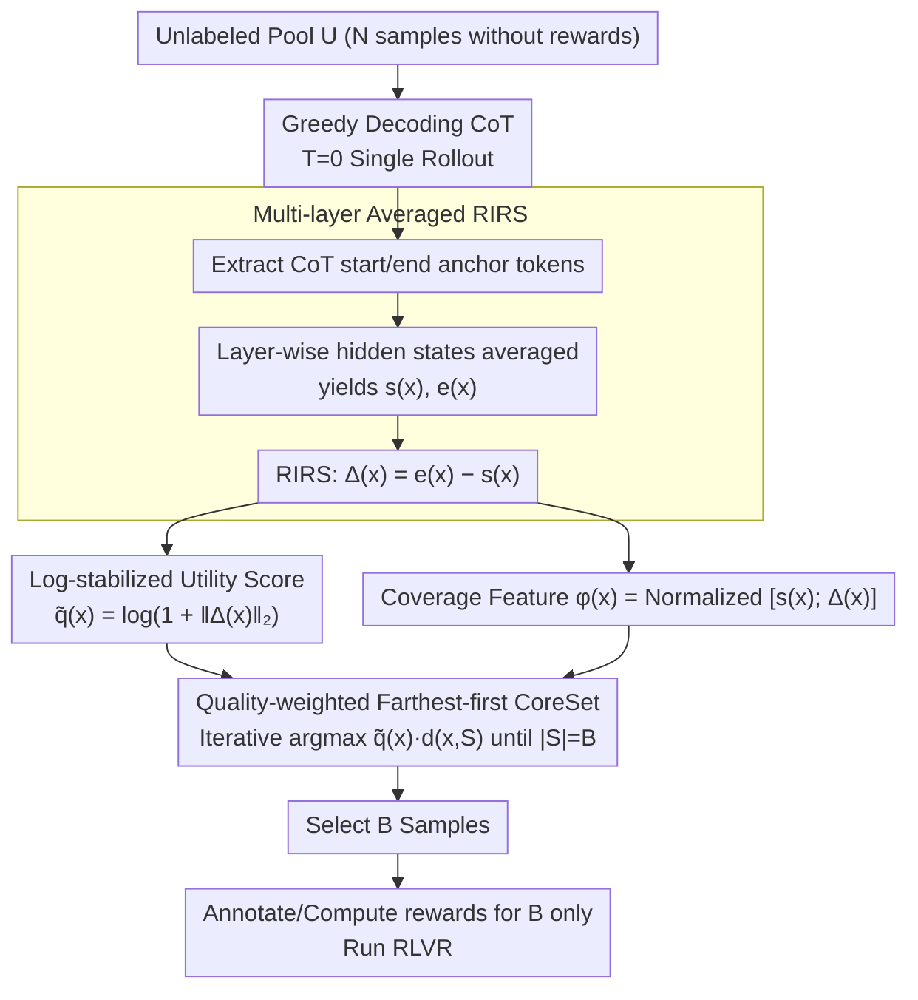

# Single-Rollout Hidden-State Dynamics for Training-Free RLVR Data Selection

**Conference**: ICML 2026  
**arXiv**: [2605.28631](https://arxiv.org/abs/2605.28631)  
**Code**: https://github.com/JianghaoWu/SHIFT  
**Area**: Reinforcement Learning / LLM Reasoning / Data Selection  
**Keywords**: RLVR, Data Selection, Hidden-State Dynamics, CoreSet, Training-Free  

## TL;DR
SHIFT utilizes the "start token → end token" hidden-state difference $\Delta(x)=\mathbf{e}(x)-\mathbf{s}(x)$ from a single greedy decoding rollout as both a utility proxy and a diversity feature for RLVR samples. It then employs a quality-weighted farthest-first CoreSet to select a minimal set of samples from a large unlabeled pool without training, rewards, or ground truth answers.

## Background & Motivation

**Background**: Reinforcement Learning from Verifiable Rewards (RLVR) significantly enhances LLM reasoning capabilities with extreme sample efficiency—literature indicates that a few carefully selected samples can approach the performance of RL on thousands of samples. Representative methods (e.g., Wang et al. 2025c) identify high-value samples using the Historical Variance Score (HVS) obtained during early RL phases.

**Limitations of Prior Work**: Such training-signal-based selection requires expensive (proxy) fine-tuning or RL on a large candidate pool and relies on verifiable rewards, which necessitates ground truth answers. This is costly and often unfeasible in specialized domains like medical reasoning. Classical active learning criteria, such as uncertainty or gradient-based methods, also depend on training feedback, while pre-training proxies like difficulty or PPL correlate weakly with reward-driven utility in RLVR.

**Key Challenge**: RLVR sample utility is reward-driven, but at the selection stage, neither rewards nor labels are available, and training is discouraged. Existing active learning signals are built upon "having performed training or obtained labels."

**Goal**: Select $|S|=B$ most promising training samples in the pre-RL stage from a large unlabeled pool without evaluating rewards.

**Key Insight**: Theoretically, Dherin et al. (2025) equate the context effect of transformer self-attention and MLP to a rank-1 implicit weight update on the first MLP layer, providing an upper bound: $\|\Delta W(Y)\|_F \le \frac{\|W\|_2}{\|A(C\setminus Y,x)\|_2}\,\|\Delta A(Y)\|_2$. This suggests that "context-induced representation change" can proxy internal model learning. Empirically, Liang et al. (2025) have confirmed that the hidden-state difference before and after a CoT can encode non-trivial structures of the reasoning process.

**Core Idea**: Use the difference between multi-layer averaged hidden states of the start/end anchors in a single deterministic CoT rollout as a sample utility proxy $q(x)=\|\Delta(x)\|_2$, and perform quality-weighted farthest-first selection in the normalized space of $[\mathbf{s}(x);\Delta(x)]$.

## Method

### Overall Architecture
For each sample in the unlabeled pool $\mathcal{U}=\{x_i\}_{i=1}^{N}$: (1) Generate a CoT using the base LLM $f_\theta$ with $T=0$ greedy decoding under a fixed reasoning prompt; (2) Take the start and end tokens of the CoT (using delimiters if supported) as anchors and average across multiple layers to obtain $\mathbf{s}(x), \mathbf{e}(x)\in\mathbb{R}^D$; (3) Compute the RIRS $\Delta(x)=\mathbf{e}(x)-\mathbf{s}(x)$; (4) Input $\tilde q(x)$ and $\phi(x)$ into a quality-weighted farthest-first CoreSet to select $B$ samples; (5) Annotate or compute rewards only for these $B$ samples and run RLVR. The entire selection process is "single-inference, zero-training, zero-label."

### Key Designs

**1. Multi-layer Averaged RIRS Representation: Concentrating "Internal Traversal" into one vector**

The selection phase lacks rewards and labels, requiring a training-free utility proxy. SHIFT extracts anchor hidden states $\mathbf{h}^{(\ell)}_{t_s}(x)$ and $\mathbf{h}^{(\ell)}_{t_e}(x)$ for each layer $\ell$, averages across layers to get $\mathbf{s}(x)$ and $\mathbf{e}(x)$, and defines $\Delta(x)=\mathbf{e}(x)-\mathbf{s}(x)$ as the "reasoning-induced representation shift." Theoretically, drawing from Dherin et al.'s rank-1 implicit weight perspective, $\|\Delta(x)\|_2$ is interpreted as a trajectory-level, layer-aggregated observable proxy for accumulated context-induced changes. It is obtained via a single inference pass, making it cheaper than self-consistency entropy or RL-based reward evaluation.

**2. Log-stabilized Utility Score: Compressing RIRS norms into a comparable proxy**

The magnitude of $\|\Delta\|_2$ varies significantly across different lengths and domains. SHIFT calculates $q(x)=\|\Delta(x)\|_2$ and applies a monotonic log compression $\tilde q(x)=\log(1+q(x))$. This maintains the ranking while scaling the values to be comparable with the diversity distance $d(x,S)$ in the subsequent multiplicative selection. A high $\tilde q$ indicates the sample induces a larger internal shift, which is assumed to represent higher learning value for RLVR.

**3. Quality-weighted Farthest-first CoreSet: Balancing utility and coverage in a single greedy pass**

Samples with high $\tilde q$ often cluster (e.g., similar difficult problems); pure top-K selection would waste budget on homogeneous samples, while pure farthest-first selection might pick meaningless outliers. SHIFT multiplies both: it constructs $\ell_2$-normalized coverage features $\phi(x)=[\mathbf{s}(x);\Delta(x)]/\|[\mathbf{s}(x);\Delta(x)]\|_2 \in \mathbb{R}^{2D}$ (containing both context and dynamics), initializes $S\leftarrow\{\arg\max_x \tilde q(x)\}$, and iteratively selects $x^\star=\arg\max_{x\in\mathcal{U}\setminus S}\, \tilde q(x)\cdot d(x,S)$, where $d(x,S)=\min_{x'\in S}\|\phi(x)-\phi(x')\|_2$. This multiplicative form ensures utility and coverage are achieved simultaneously.

### Loss & Training
SHIFT does not train any parameters; the selection phase consists only of one greedy inference pass and a CoreSet greedy scan. During the RLVR phase, all methods use the same training budget and hyperparameters, only varying the sample selection rule. Qwen3-1.7B is used for MedQA, and Qwen2.5-Math-1.5B is used for MATH-500.

## Key Experimental Results

### Main Results

| Dataset | Budget | Evaluation | Full RLVR Ref. | Random | Best Baseline | SHIFT |
|--------|----------|------|------------------|--------|----------|-------|
| MATH-500 (In-domain) | 2% (7/350) | Pass@1 | 66.00 | 53.73 | Cluster 44.67 / CoreSet 47.33 | **Minimal gap to full set; exceeds baselines** |
| AMC (OOD Math) | 2% | Pass@1 | 33.73 | 25.78 | 25.30 (Cluster) | **Stably outperforms baselines** |
| MedQA | 0.1–0.2% | RLVR Acc. | — | — | — | **Optimal across low budgets** |

> Reproduction details: MATH-500 used a 350-sample pool and 150-sample test set. MedQA used a 10.2K pool and 1.27K test set, with transfers to MedMCQA, PubMedQA, and MedXpertQA(U/R). Baselines include KMeans-Center (Cluster), Farthest-First (CoreSet), Q-PPL, SC-Entropy, CoT similarity, and A-PPL.

### Ablation Study

| Configuration | Key Function | Description |
|------|----------|------|
| Full SHIFT | RIRS Quality + Coverage | Best version reported in the paper |
| Utility Top-K only | No farthest-first | Prone to picking homogeneous samples; performance drop |
| Farthest-first only | No $\tilde q$ weight | Degenerates to standard CoreSet; dominated by outliers |
| Sentence Embedding CoreSet | No RIRS | Using MiniLM-L6-v2 fails to capture reasoning computation |
| Single vs Multi rollout | Selection Cost | Single greedy RIRS is sufficient; self-consistency (R=32) not required |

### Key Findings
- **De-correlation from surface statistics**: Analysis confirms $\tilde q$ gains are not explained by simple length factors, supporting it as a true proxy for "reasoning-induced internal updates."
- **Dual use of $\Delta(x)$**: Using $\Delta(x)$ as both a utility weight and a component of the coverage feature $\phi(x)$ is critical; using only one significantly degrades performance.
- **Reward-scarce domains**: In MedQA, SHIFT compresses annotation/reward costs to within $B$ samples, making RLVR accessible in low-resource settings.
- **Cross-set transfer**: Stability on MedMCQA, PubMedQA, and MedXpertQA suggests SHIFT selects samples that help RLVR learn transferable reasoning structures rather than just in-domain overfitting.

## Highlights & Insights
- Characterizing sample value through trajectory-level residuals from a single inference pass provides a novel realization of the "in-context implicit weight update" theory for practical selection problems.
- The algorithm is minimalist: $O(N)$ inference + $O(NB)$ CoreSet, with no learning rates or reward models, making it easily portable to any reasoning model with delimiters.
- Using a multiplicative form $\tilde q\cdot d$ instead of additive terms avoids dimension-weighting issues and ensures both utility and diversity are non-zero for candidates.

## Limitations & Future Work
- There is a gap between theory and method: the theoretical upper bound refers to a single block, whereas $\Delta(x)$ is an aggregation across layers and rollouts.
- Evaluation is limited to smaller models (1.5B, 1.7B) and low budgets. Whether "high norm = high value" remains monotonic in larger models or dense reward scenarios requires further evidence.
- Dependency on anchors: $\Delta(x)$ semantics may be diluted by noise if the model does not output stable CoT segments or clear delimiters.

## Related Work & Insights
- **vs Wang et al. 2025c (HVS)**: HVS requires RL training to obtain accuracy variance, whereas SHIFT uses a single zero-label inference pass in the pre-RL phase.
- **vs Traditional Active Learning**: Classical methods rely on static input embeddings or training losses; SHIFT demonstrates that switching the feature space to "reasoning dynamics" upgrades the CoreSet framework.
- **vs Liang et al. 2025**: While they use start-end deltas to analyze reasoning structures, SHIFT transforms this diagnostic signal into a practical data selection criterion.

## Rating
- Novelty: ⭐⭐⭐⭐ Connects implicit update theory to RLVR data selection.
- Experimental Thoroughness: ⭐⭐⭐ Comprehensive across math/medical tasks, but narrow in model scale.
- Writing Quality: ⭐⭐⭐⭐ Clear logical chain from theory to algorithm.
- Value: ⭐⭐⭐⭐ Provides a zero-label selection recipe for low-resource RLVR.

<!-- RELATED:START -->

## Related Papers

- [\[ICML 2026\] Probing RLVR Training Instability through the Lens of Objective-Level Hacking](probing_rlvr_training_instability_through_the_lens_of_objective-level_hacking.md)
- [\[ICML 2026\] EchoRL: Reinforcement Learning via Rollout Echoing](echorl_reinforcement_learning_via_rollout_echoing.md)
- [\[ACL 2026\] LearnAlign: Data Selection for LLM Reinforcement Learning with Improved Gradient Alignment](../../ACL2026/reinforcement_learning/learnalign_data_selection_for_llm_reinforcement_learning_with_improved_gradient_.md)
- [\[ICML 2026\] CPMöbius: Iterative Coach–Player Reasoning for Data-Free Reinforcement Learning](cpmobius_iterative_coach-player_reasoning_for_data-free_reinforcement_learning.md)
- [\[ICML 2026\] How Reasoning Evolves from Post-Training Data: An Empirical Study Using Chess](how_reasoning_evolves_from_post-training_data_an_empirical_study_using_chess.md)

<!-- RELATED:END -->
