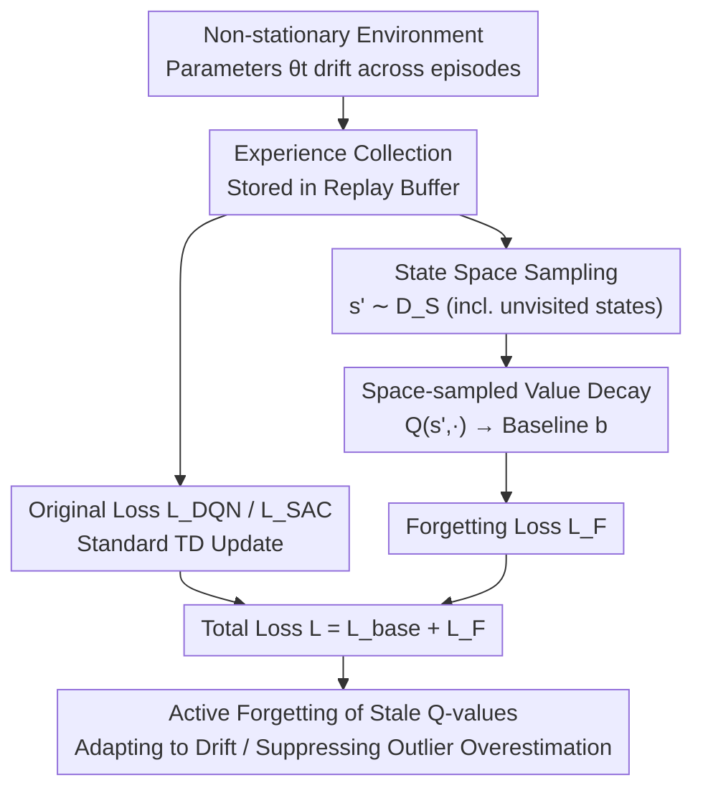

# Space-sampled Value Decay: Forgetting Mechanisms for Non-stationary Deep Reinforcement Learning

**Conference**: ICML2026 (EIML Workshop)  
**arXiv**: [2606.11797](https://arxiv.org/abs/2606.11797)  
**Code**: Not disclosed (based on Stable-Baselines3 + Non-stationary Gym)  
**Area**: Reinforcement Learning / Non-stationary Environments / Continual Learning  
**Keywords**: Non-stationary RL, Forgetting Mechanisms, Value Decay, DQN, SAC  

## TL;DR
For non-stationary reinforcement learning scenarios where the environment silently "drifts" without task IDs or context prompts, this paper proposes **Space-sampled Value Decay (SsVD)**. By sampling from the state space and continuously decaying the Q-values of "unvisited or stale" states toward a baseline, the agent actively forgets outdated knowledge, thereby maintaining high returns in dynamically changing environments.

## Background & Motivation
**Background**: Standard RL (DQN, SAC, etc.) assumes environment stationarity, where transition dynamics $P(s'|s,a)$ and rewards $R(s,a)$ remain constant. When environment parameters vary over time (referred to as **drift**, such as mechanical wear, temperature changes, or material aging), these algorithms lack specific mechanisms to adapt.

**Limitations of Prior Work**: Most works addressing environment changes belong to **Continual RL (CRL) / Life-long RL**, but they often rely on strict assumptions—requiring external "task IDs" or "context" to notify the agent of task shifts. Their goal is to **remember** all previous tasks. Another category assumes drift **resets at the end of each episode** (per-episode drift), which is useful for controlled experiments but fails in real-world scenarios where drift accumulates across episodes without resetting.

**Key Challenge**: This paper focuses on the opposite setting—where drift **(a) is unannounced to the agent, (b) persists across episodes, and (c) renders the current policy sub-optimal** (Assumption 1). In this setting, old knowledge should not be remembered but **must be forgotten**. Stale transition samples in the replay buffer and outdated optimal Q-values encoded in network weights pull the policy toward obsolete behaviors. Furthermore, detecting drift itself is a difficult independent problem in RL due to highly correlated data, making "detect-then-switch" approaches impractical.

**Key Insight**: Inspired by behavioral biology, where rodents adapt to silent environmental parameter changes through **forgetting mechanisms**, the authors note that earlier forgetting versions of Q-Learning (**Non-taken Value Decay, NtVD**) only work in "single-state, discrete-action" toy environments. NtVD decays the Q-values of actions not selected at each step toward a baseline $b$.

**Core Idea**: Generalize this forgetting mechanism to the **large state spaces** of modern deep RL. Instead of just decaying "unselected actions," the method **samples states from the entire state space** and actively pulls the Q-values of states that are unvisited or contain stale information back to a baseline $b$. This is implemented via an auxiliary loss term, **Space-sampled Value Decay (SsVD)**.

## Method

### Overall Architecture
The goal of SsVD is to equip value-based deep RL (DQN, SAC) with an "active forgetting" knob. Its core insight is that agents face two types of uncertainty: **(a) reliance on stale information** (outdated transitions in the buffer/weights) and **(b) lack of information** (arbitrary over/underestimation by neural networks for unvisited states). Unlike NtVD, which only handles single states, SsVD **defines a sampling distribution $\mathcal{D}_{\mathcal{S}}$ over the state space, samples a batch of states during each update, and decays their Q-values toward a baseline $b$** via an additional loss $\mathcal{L}_F$. The original algorithm remains unchanged; an extra forgetting loss is simply added at each gradient step.

### Key Designs

**1. Space-sampled Value Decay: Decaying "Unvisited States" instead of just Unselected Actions**

NtVD updates only apply to unselected actions at the current state: $Q(s_t,a)\leftarrow(1-\eta)Q(s_t,a)+\eta b,\ \forall a\neq a_t$. In large state spaces, "unvisited states" are the primary source of uncertainty. SsVD applies this to the entire state space by defining a distribution $\mathcal{D}_{\mathcal{S}}$ and decaying **all actions** for sampled states $s'\sim\mathcal{D}_{\mathcal{S}}$:

$$Q(s',a)\leftarrow(1-\eta)Q(s',a)+\eta b.$$

A higher decay rate $\eta$ implies more aggressive forgetting, while the baseline $b$ represents the default assumption in the absence of information. This provides two benefits: high Q-values reflecting old dynamics are pulled toward the baseline so the agent does not cling to obsolete policies, and it provides a **reasonable default anchor** for states the network hasn't visited, suppressing extrapolation disasters. Crucially, **SsVD does not depend on rewards for the sampled states**, making implementation highly efficient.

**2. Forgetting Loss for DQN: Using Frozen Target Networks as Decay Anchors**

DQN implements action-values as $Q:\mathcal{S}\to\mathbb{R}^{|\mathcal{A}|}$ and uses a frozen target network $Q^*$ for bootstrapping. SsVD reuses $Q^*$ as the decay anchor. In addition to a mini-batch of size $m$, $p\le m$ states $\hat{s}_1,\dots,\hat{s}_p$ are sampled to compute:

$$\mathcal{L}_F=\frac{1}{p}\sum_{i=1}^{p}\bigl\lVert Q(\hat{s}_i,\cdot)-(1-\eta)Q^*(\hat{s}_i,\cdot)+\eta\mathbf{b}\bigr\rVert^2,$$

where the baseline $\mathbf{b}\in\mathbb{R}^{|\mathcal{A}|}$ is a vector. The total loss $\mathcal{L}=\mathcal{L}_F+\mathcal{L}_{DQN}$ forces the network output for sampled states toward the baseline. The number of samples $p$ is scaled by ratio $\xi$ relative to the original batch size, $p=\max(\lceil\xi m\rceil,1)$. Using $Q^*$ as an anchor prevents the decay target from oscillating violently.

**3. Forgetting Loss for SAC: Simultaneously Sampling States and Actions**

The SAC critic is $Q:\mathcal{S}\times\mathcal{A}\to\mathbb{R}$ for continuous actions, typically using double-Q networks. SsVD samples both states and actions $\hat{s}_1,\dots, \hat{s}_p, \hat{a}_1, \dots, \hat{a}_p$ and calculates the forgetting loss for each critic $Q_j$:

$$\mathcal{L}_F=\frac{1}{p}\sum_{i=1}^{p}\bigl[Q_j(\hat{s}_i,\hat{a}_i)-(1-\eta)Q_j^*(\hat{s}_i,\hat{a}_i)+\eta b\bigr]^2,\quad j=1,\dots,k,$$

where $b$ is a scalar. A significant finding is that this uniform sampling strategy **fails in high-dimensional MuJoCo environments (e.g., Ant) due to the curse of dimensionality**, as uniform sampling rarely covers meaningful states.

### Loss & Training
The total loss is $\mathcal{L}=\mathcal{L}_{\text{base}}+\mathcal{L}_F$. Key hyperparameters include decay rate $\eta$, baseline $b$, and sampling ratio $\xi$. State sampling utilizes the standard gymnasium interface. The implementation is based on Stable-Baselines3, using default hyperparameters from RL Zoo for fair comparison.

## Key Experimental Results

### Setup
Experiments use **Non-stationary Gym** with **probabilistic, monotonically decreasing** parameter drift preserved across episodes. Environments include Classic Control (CartPole, Acrobot, MountainCar) and MuJoCo (InvertedPendulum, Ant).

| Environment | Drift Parameter | Algorithm |
|-------------|-----------------|-----------|
| CartPole-v1 | Force (Decr.) | DQN |
| Acrobot-v1 | Inertia (Decr.) | DQN |
| MountainCar-v0 | Force (Decr.) | DQN |
| MountainCarContinuous-v0 | Power (Decr.) | SAC |
| InvertedPendulum-v5 | Cart Mass (Decr.) | SAC |
| Ant-v5 | Gravity (Decr.) | SAC |

Baselines: Original algorithms (DQN/SAC), SsVD-enhanced versions (DQN_F / SAC_F), and **Limited** versions (stops training after a period while the environment continues to drift).

### Main Results

| Method | Behavioral Performance |
|--------|------------------------|
| Limited DQN/SAC | Performance drops consistently as drift continues (expected). |
| Default DQN | Fails to improve in most envs; on MountainCar, it **drops below Limited**. |
| Default SAC | Adapts roughly on InvertedPendulum but with **frequent failures**. |
| **DQN_F (SsVD)** | **Maintains strong performance** throughout and **learns significantly faster** initially. |
| **SAC_F (SsVD)** | Higher returns and lower variance on InvertedPendulum; stable throughout. |

An interesting finding: when **gSDE exploration is disabled** in MountainCarContinuous, both baselines fail while SAC_F succeeds, suggesting **SsVD also aids exploration**.

### Ablation Study

| Configuration | Conclusion |
|---------------|------------|
| DQN vs DQN (2×/5× grad steps) | Improvements are **not due to extra computation**: DQN_F still outperforms baselines with 2×/5× gradient steps. |
| Stationary Env (No drift) | SsVD is beneficial **even without drift**; default DQN suffers from **catastrophic forgetting** on MountainCar, whereas DQN_F does not. |
| Ant (High-dim) | SsVD performance degrades, showing the curse of dimensionality in high-dimensional state sampling. |

### Key Findings
- SsVD is a primary driver of gains in **non-stationary** environments by actively forgetting stale Q-values.
- SsVD mitigates catastrophic forgetting in **stationary** environments by anchoring unvisited regions, acting as a form of regularization.
- Gains are due to the forgetting mechanism itself rather than extra computation.
- The main weakness is **high-dimensional state spaces**, where uniform sampling fails to cover meaningful regions.

## Highlights & Insights
- **Translating biological forgetting into a plug-and-play loss**: The method only adds $\mathcal{L}_F$ without changing the base algorithm, making it extremely lightweight for engineering.
- **Reward-independent decay signal**: Since SsVD does not require real rewards for sampled states, it bypasses the difficult "drift detection" and "reward re-evaluation" problems in NSRL.
- **A counter-intuitive byproduct**: Forgetting not only handles non-stationarity but also mitigates catastrophic forgetting in stationary environments, functioning as a constraint on value function extrapolation.
- **Transferability**: Any algorithm using neural networks to approximate value/Q functions can benefit from anchoring "uncovered states" to a baseline to suppress overestimation.

## Limitations & Future Work
- **The authors acknowledge**: For extremely rare but strong drifts, restarting training based on reward history might be more reasonable; no single method is optimal for all settings without priors.
- **High-dimensional sampling failure**: Uniform sampling via standard interfaces cannot cover meaningful states in environments like Ant. Designing smarter sampling distributions $\mathcal{D}_{\mathcal{S}}$ is a key open problem.
- **Dependence on "state space samplability"**: In pixel-based environments (e.g., Atari), independently sampling valid states is difficult, limiting applicability.
- **Baseline $b$ selection**: There is no systematic discussion on how to choose an optimal $b$.
- Experiments are focused on Classic Control and limited MuJoCo tasks; larger-scale validation is needed.

## Related Work & Insights
- **vs. Non-taken Value Decay (NtVD)**: NtVD only decays unselected actions in single-state settings; SsVD generalizes this to large spaces and modern architectures (DQN/SAC).
- **vs. Continual / Life-long RL (EWC, CLEAR, etc.)**: Those methods use task IDs to **remember** tasks; SsVD focuses on **actively forgetting** stale knowledge without prompts to maintain current optimality.
- **vs. Per-episode drift**: Unlike works assuming drifts reset every episode, this paper addresses the more realistic setting of cumulative, cross-episode drift.

## Rating
- Novelty: ⭐⭐⭐⭐ Systematic generalization of biological forgetting to non-stationary DR; clear problem setting.
- Experimental Thoroughness: ⭐⭐⭐ Good coverage of classic control and some MuJoCo with proper ablations, but scale is small.
- Writing Quality: ⭐⭐⭐⭐ Clear motivation and well-documented mathematical formulations.
- Value: ⭐⭐⭐⭐ Plug-and-play, reward-independent, and versatile for mitigating catastrophic forgetting.

<!-- RELATED:START -->

## Related Papers

- [\[ICML 2026\] Tracking Drift: Variation-Aware Entropy Scheduling for Non-Stationary Reinforcement Learning](tracking_drift_variation-aware_entropy_scheduling_for_non-stationary_reinforceme.md)
- [\[ICLR 2026\] Wavelet Predictive Representations for Non-Stationary Reinforcement Learning](../../ICLR2026/reinforcement_learning/wavelet_predictive_representations_for_non-stationary_reinforcement_learning.md)
- [\[NeurIPS 2025\] Solving Continuous Mean Field Games: Deep Reinforcement Learning for Non-Stationary Dynamics](../../NeurIPS2025/reinforcement_learning/solving_continuous_mean_field_games_deep_reinforcement_learning_for_non-stationa.md)
- [\[NeurIPS 2025\] Forecasting in Offline Reinforcement Learning for Non-stationary Environments](../../NeurIPS2025/reinforcement_learning/forecasting_in_offline_reinforcement_learning_for_non-stationary_environments.md)
- [\[ICLR 2026\] The Rank and Gradient Lost in Non-stationarity: Sample Weight Decay for Mitigating Plasticity Loss in Reinforcement Learning](../../ICLR2026/reinforcement_learning/the_rank_and_gradient_lost_in_non-stationarity_sample_weight_decay_for_mitigatin.md)

<!-- RELATED:END -->
