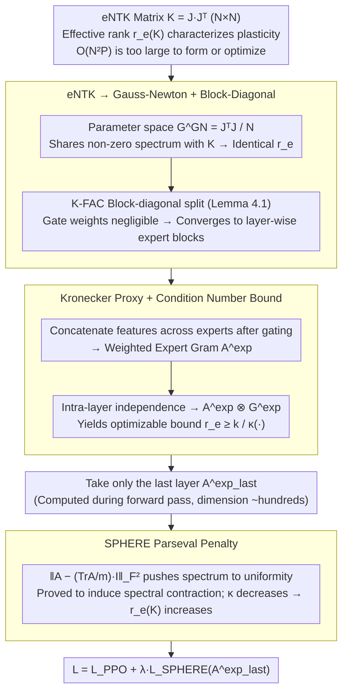

# SPHERE: Mitigating the Loss of Spectral Plasticity in Mixture-of-Experts for Deep Reinforcement Learning

**Conference**: ICML 2026  
**arXiv**: [2605.04712](https://arxiv.org/abs/2605.04712)  
**Code**: Not publicly available  
**Area**: Reinforcement Learning / Mixture-of-Experts / Continual Learning  
**Keywords**: Loss of Plasticity, MoE Policy, NTK Spectrum, Effective Rank, Parseval Regularization

## TL;DR
This paper formalizes the loss of plasticity in Mixture-of-Experts (MoE) policies during continual reinforcement learning (CRL) as the decline of the spectral entropy effective rank of the empirical NTK matrix. It employs Gauss-Newton and Kronecker factorization to reduce this to a computable proxy based on the "expert feature Gram matrix." Finally, a one-line Parseval penalty (SPHERE) is used to increase this proxy, improving task success rates by 133% and 50% in MetaWorld and HumanoidBench CRL settings, respectively.

## Background & Motivation

**Background**: MoE architectures have expanded from LLMs into Deep Reinforcement Learning (DRL)—including multi-task robotic arms, humanoids, quadrupeds, and large-scale online RL—using sparsely routed experts to scale policy capacity (Top-$K$ MoE, Dense-MoE, DS-MoE). Simultaneously, Continual RL (CRL) scenarios, where agents learn multiple tasks sequentially, represent the ideal stage for MoE's capacity advantages.

**Limitations of Prior Work**: Empirically, MoE policies exhibit significant performance degradation in CRL—Willi et al. (2024) reported a "collapse in success rates in later tasks." This is a typical manifestation of plasticity loss: as training progresses, the ability to learn new skills from new data weakens. While explanations exist for dense networks (dormant neurons, representation spectral collapse, Hessian spectral collapse), the specific form of and countermeasures for plasticity loss in sparse, branched structures like MoE remain largely unexplored.

**Key Challenge**: The tool for directly characterizing plasticity—the eNTK matrix $\mathbf{K} = \mathbf{J}\mathbf{J}^\top \in \mathbb{R}^{N \times N}$—is massive in MoE. Forming $\mathbf{K}$ requires $O(N^2 P)$ time and $O(NP + N^2)$ memory, where $P$ includes all expert parameters, making it impossible to monitor or optimize directly. Consequently, plasticity loss is either unobservable or unoptimizable, necessitating a proxy that "reflects MoE plasticity and is differentiable."

**Goal**: (1) Provide a formal definition of plasticity loss in MoE policies; (2) Reduce the intractable effective rank of the full eNTK to a differentiable small-matrix proxy; (3) Design a regularization term for spectral contraction of the proxy; (4) Validate on mainstream CRL benchmarks.

**Key Insight**: Starting from the function space gradient descent formula $\Delta f = -\eta \mathbf{K} \nabla_f L$, the spectrum of $\mathbf{K}$ directly determines "which directions the gradient can move." When the spectrum collapses (a few eigenvalues are much larger than others), $\mathbf{K}$ becomes a strong prior for the gradient, locking updates into a few primary directions—this is the essence of plasticity loss. Therefore, "high plasticity = spectral isotropy," which is naturally quantified using the spectral entropy effective rank $r_e(\mathbf{K}) = \exp(-\sum p_i \log p_i)$ where $p_i = \sigma_i / \sum_j \sigma_j$.

**Core Idea**: The effective rank $r_e(\mathbf{K})$ is reduced to the "expert weighted feature Gram matrix of the last layer $\mathbf{A}^{\mathrm{exp}}_{\mathrm{last}}$" via block-diagonal approximation (Gauss-Newton + intra-layer independence + Kronecker decomposition, borrowing from K-FAC). A Frobenius penalty pushing $\mathbf{A}^{\mathrm{exp}}_{\mathrm{last}}$ towards $\frac{\mathrm{Tr}}{m}\mathbf{I}$ is then used for "spectral contraction," which is proven to strictly increase $r_e(\mathbf{K})$.

## Method

### Overall Architecture

The input is the forward output of a Top-$K$ MoE actor in a PPO training pipeline; the output is a differentiable regularization term added to the PPO loss. The derivation is a chain of "lower-level proxies": $r_e(\mathbf{K}) \to r_e(G^{\mathrm{GN}}) \to$ block-diagonal approximation $\to$ layer-wise expert blocks $r_e(\mathbf{G}^{\mathrm{GN},\mathrm{exp}}_\ell) \to$ condition number lower bound of the Kronecker proxy $\frac{k_\ell}{\kappa(\mathbf{A}^{\mathrm{exp}}_{\ell-1} \otimes \mathbf{G}^{\mathrm{exp}}_\ell)} \to$ spectral contraction applied only to $\mathbf{A}^{\mathrm{exp}}_{\mathrm{last}}$ (the last and most weighted expert block). The final loss is defined as: $\mathcal{L} = \mathcal{L}_{\mathrm{PPO}} + \lambda^e \cdot \|\mathbf{A}^{\mathrm{exp}}_{\mathrm{last}} - \tfrac{\mathrm{Tr}(\mathbf{A}^{\mathrm{exp}}_{\mathrm{last}})}{m}\mathbf{I}_m\|_F^2$.

The following diagram illustrates this reduction chain from an uncomputable global quantity to a one-line differentiable penalty:

### Key Designs

**1. From eNTK to Gauss-Newton + Block-Diagonal Approximation: Reducing the global matrix to layer-wise expert blocks**

Directly monitoring $\mathbf{K} \in \mathbb{R}^{N \times N}$ requires $O(N^2 P)$ computation. The first step shifts the problem from the $N \times N$ sample space to the parameter space: using the fact that $\mathbf{J}\mathbf{J}^\top$ and $\mathbf{J}^\top \mathbf{J}$ share non-zero spectra, we get $r_e(\mathbf{K}) = r_e(G^{\mathrm{GN}})$, where $G^{\mathrm{GN}} = \tfrac{1}{N}\mathbf{J}^\top \mathbf{J} \in \mathbb{R}^{P \times P}$. Following standard K-FAC block-diagonal approximation (ignoring cross-layer and cross-gate-expert blocks), it is decomposed into:

$$G^{\mathrm{GN}} \approx \bigoplus_\ell \mathbf{G}^{\mathrm{GN},\mathrm{g}}_\ell \oplus \bigoplus_\ell \mathbf{G}^{\mathrm{GN},\mathrm{exp}}_\ell.$$

A crucial step is Lemma 4.1: the effective rank of a block-diagonal matrix can be exactly decomposed as $r_e(M) = \exp\big(H(\alpha) + \sum_b \alpha_b \log r_e(M_b)\big)$, with weights $\alpha_b = \|M_b\|_*/\sum_m \|M_m\|_*$. Since the number of gating parameters is much smaller than expert parameters ($P^g \ll P^{\mathrm{exp}}$), gate weights are negligible and treated as fixed, narrowing the problem to the "rank of each layer's expert block."

**2. Kronecker Proxy + Condition Number Lower Bound: Mapping rank to low-dimensional Gram matrices available during forward pass**

Each expert layer block $\mathbf{G}^{\mathrm{GN},\mathrm{exp}}_\ell$ is still too large. The second step borrows from K-FAC to factorize it into the Kronecker product of two small Gram matrices under intra-layer independence. Specifically, the input $a^{\mathrm{exp}}_{e,\ell-1}(x_i)$ of each expert on sample $x_i$ is weighted by its Top-$K$ gate weight $h^{(K)}_{i,e}$, and then **concatenated across experts** into a long vector:

$$a_{\ell-1}(x_i) = \big[h^{(K)}_{i,1}\, a^{\mathrm{exp}}_{1,\ell-1}{}^\top \,\big|\, \dots \,\big|\, h^{(K)}_{i,E}\, a^{\mathrm{exp}}_{E,\ell-1}{}^\top\big]^\top.$$

The weighted expert feature Gram $\mathbf{A}^{\mathrm{exp}}_{\ell-1} = \tfrac{1}{N}\Phi_{\ell-1}^\top \Phi_{\ell-1}$ is then formed; the backpropagated gradient Gram $\mathbf{G}^{\mathrm{exp}}_\ell$ is constructed similarly. Since the eigenvalues of a Kronecker product are the products of the factors' eigenvalues, we obtain the optimizable lower bound $r_e(\mathbf{G}^{\mathrm{GN},\mathrm{exp}}_\ell) \ge k_\ell / \kappa(\mathbf{A}^{\mathrm{exp}}_{\ell-1} \otimes \mathbf{G}^{\mathrm{exp}}_\ell)$. This is effective because $\mathbf{A}^{\mathrm{exp}}_{\ell-1}$ has a dimension of only a few hundred ($\sum_e d^{\mathrm{exp}}_{e,\ell-1}$), which can be computed during the forward pass. "Concatenation across experts" is an MoE-specific design: the off-diagonal blocks of the concatenated Gram matrix implicitly prevent the features of multiple experts from collapsing into the same direction.

**3. SPHERE Parseval Penalty + Spectral Contraction Proof: A penalty that provably increases $r_e(\mathbf{K})$**

With a differentiable proxy, a loss is needed to reduce its condition number. The authors define $\mathcal{L}_{\mathrm{SPHERE}}(\mathbf{A}) = \|\mathbf{A} - \tfrac{\mathrm{Tr}(\mathbf{A})}{m}\mathbf{I}_m\|_F^2$. Expanding this yields $\|\mathbf{A}\|_F^2 - \tfrac{\mathrm{Tr}(\mathbf{A})^2}{m}$. Taking a gradient step via SGD, it is proven that for $\eta \le \tfrac{1}{2}$, each eigenvalue contracts toward the mean via $\lambda_i \to (1-\beta)\lambda_i + \beta \bar\lambda$—the definition of spectral contraction. This ensures $\kappa(\mathbf{A})$ decreases monotonically. Using the Kronecker monotonicity lemma ($\kappa(A_{t+1} \otimes B) \le \kappa(A_t \otimes B)$) and the block-diagonal decomposition, this propagates back to $r_e(\mathbf{K})$, making "adding this term → monotonic increase in effective rank" a theorem rather than an empirical observation. In practice, the penalty is applied only to the actor's last expert layer.

### Loss & Training

$\mathcal{L} = \mathcal{L}_{\mathrm{PPO}} + \lambda^e \cdot \mathcal{L}_{\mathrm{SPHERE}}(\mathbf{A}^{\mathrm{exp}}_{\mathrm{last}})$. The $\mathbf{A}^{\mathrm{exp}}_{\mathrm{last}}$ is calculated using the forward pass output for every gradient update. The Top-$K$ MoE uses $E = 10$ experts and $K = 2$. MetaWorld is trained for $10^6$ env steps per task, and HumanoidBench for $10^7$ env steps per task.

## Key Experimental Results

### Main Results

| Benchmark | Method | Setting | Avg. Success Rate | Notes |
|-----------|------|------|-----------|------|
| MetaWorld CW10 | Top-$K$ MoE | CRL | baseline | Significant CRL degradation |
| MetaWorld CW10 | + SPHERE | CRL | **+133%** | RL-CRL gap reduced by 52% |
| HumanoidBench H1 | Top-$K$ MoE | RL | baseline | Degradation within single task |
| HumanoidBench H1 | + SPHERE | RL | **+36%** | Drift visible in long horizons ($10^7$ steps) |
| HumanoidBench H1 | Top-$K$ MoE | CRL | baseline | – |
| HumanoidBench H1 | + SPHERE | CRL | **+50%** | – |

### Ablation Study

| Configuration | HumanoidBench CRL Avg. Success Rate | Explanation |
|------|---------------------------|------|
| w/o SPHERE | $0.36 \pm 0.08$ | Baseline without regularization |
| **w/ SPHERE** | $\mathbf{0.54 \pm 0.12}$ | Full method |
| All hidden expert layers | $0.42 \pm 0.07$ | Over-constrains shallow representations |
| Per-expert loss sum | $0.40 \pm 0.08$ | Validates importance of cross-expert correlation |
| Reg. on $\mathbf{G}^{\mathrm{exp}}_{\mathrm{last}}$ instead of $\mathbf{A}^{\mathrm{exp}}_{\mathrm{last}}$ | $0.43 \pm 0.09$ | Feature Gram gains are dominant |

### Key Findings

- **MoE requires plasticity intervention more than dense PPO**: $r_e(\mathbf{K})$ drops for all architectures in CRL, but MoE variants (Top-$K$, Dense-MoE, DS-MoE) drop more severely, supporting the intuition that gated sparsity amplifies representation collapse.
- **Cross-expert concatenation is a critical design**: Regularizing experts individually yields minimal gains (0.40), whereas joint regularization of the concatenated Gram yields 0.54, proving that cross-expert correlation structure is the primary channel for plasticity loss.
- **$r_e(\mathbf{A}^{\mathrm{exp}}_{\mathrm{last}})$ and $r_e(\mathbf{K})$ Pearson correlation is 0.846**: The validity of the proxy was independently verified beyond its theoretical lower-bound relationship.
- **Gain structures differ between MetaWorld and HumanoidBench**: The former benefits mainly in CRL (task-switching driven), while the latter benefits within single tasks (long $10^7$ horizons allow distribution drift to act as an endogenous source of plasticity loss).

## Highlights & Insights

- The paper provides a mathematical definition, an optimizable proxy, and a provable optimization direction for the fuzzy phenomenon of "plasticity loss." The chain from $r_e(\mathbf{K})$ to the Parseval penalty is rigorous.
- The "gating-weighted concatenation" design for MoE is ingenious—it bakes the routing sparsity into the Gram matrix, explicitly constraining विशेषज्ञों to share a "dispersed yet consistent" representation space.
- The +36% gain in single-task HumanoidBench suggests plasticity loss is not just a "continual learning" problem; distribution drift in long-horizon RL is sufficient to trigger it. This discovery might prompt a reassessment of training paradigms in long-horizon RL.

## Limitations & Future Work

- Block-diagonal and Kronecker approximations are classic K-FAC assumptions; the authors provide empirical validation in the appendix but no non-asymptotic error bounds.
- Experiments are limited to MoE policies in continuous control; scalability to LLM-as-policy, where expert count and dimensions are magnitudes higher, remains to be seen.
- $\lambda^e$ is a fixed hyperparameter; task-adaptive schedules were not explored.
- Regularizing only the last layer is an empirical choice. It is unclear if this holds for significantly deeper/multi-layered expert architectures.

## Related Work & Insights

- **vs LayerNorm (Juliani & Ash 2024)**: LN stabilizes forward values but does not explicitly act on the NTK spectrum. SPHERE optimizes for plasticity directly with a provable direction.
- **vs Parseval Regularization (Chung et al. 2024)**: Original PW regularizes weight matrices to be orthogonal in parameter space. SPHERE applies Parseval principles to expert feature Grams in representation space, adapted for MoE cross-expert structures.
- **vs CBP (Dohare et al. 2024)**: CBP resets neurons periodically (structural perturbation), whereas SPHERE is a smooth gradient regularization; the two are complementary.

## Rating
- Novelty: ⭐⭐⭐⭐⭐ First to provide an NTK-based formalization and optimizable proxy for MoE plasticity loss.
- Experimental Thoroughness: ⭐⭐⭐⭐ Extensive CRL/RL coverage on two benchmarks with multiple baselines, though lacks LLM-MoE testing.
- Writing Quality: ⭐⭐⭐⭐ Mathematically dense but logically clear; the motivation-theory-algorithm-experiment flow is seamless.
- Value: ⭐⭐⭐⭐ Provides a principled stabilization scheme for the emerging field of MoE-DRL.

<!-- RELATED:START -->

## Related Papers

- [\[ICML 2025\] Mitigating Plasticity Loss in Continual Reinforcement Learning by Reducing Churn](../../ICML2025/reinforcement_learning/mitigating_plasticity_loss_in_continual_reinforcement_learning_by_reducing_churn.md)
- [\[ICLR 2026\] The Rank and Gradient Lost in Non-stationarity: Sample Weight Decay for Mitigating Plasticity Loss in Reinforcement Learning](../../ICLR2026/reinforcement_learning/the_rank_and_gradient_lost_in_non-stationarity_sample_weight_decay_for_mitigatin.md)
- [\[ICML 2026\] Dr. Tulu: Reinforcement Learning with Evolving Rubrics for Deep Research](dr_tulu_reinforcement_learning_with_evolving_rubrics_for_deep_research.md)
- [\[ICLR 2026\] Deft Scheduling of Dynamic Cloud Workflows with Varying Deadlines via Mixture-of-Experts](../../ICLR2026/reinforcement_learning/deft_scheduling_of_dynamic_cloud_workflows_with_varying_deadlines_via_mixture-of.md)
- [\[ICML 2026\] Reinforcement Learning for Reachability: Guaranteeing Asymptotic Optimality](reinforcement_learning_for_reachability_guaranteeing_asymptotic_optimality.md)

<!-- RELATED:END -->
