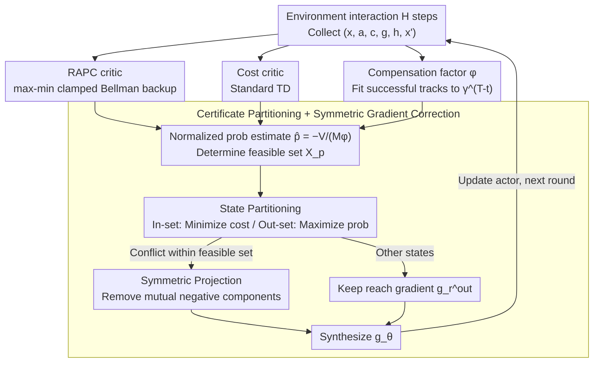

# Stochastic Minimum-Cost Reach-Avoid Reinforcement Learning

**Conference**: ICML 2026  
**arXiv**: [2605.11975](https://arxiv.org/abs/2605.11975)  
**Code**: None  
**Area**: Reinforcement Learning / Safe RL / Reach-Avoid Control  
**Keywords**: reach-avoid, probabilistic certificate, Bellman contraction, compensation factor, gradient correction

## TL;DR
Ours proposes the Reach-Avoid Probability Certificate (RAPC), which utilizes a max-min-clamped Bellman contraction operator to lower-bound the reach-avoid probability. Combined with a "compensation factor" to normalize against adversarial $\gamma^T$ decay and symmetric gradient projection to jointly optimize conflicting "cost" and "reach-avoid probability" objectives, the method achieves lower cumulative costs and higher reach success rates than RC-PPO / RESPO / CPPO on MuJoCo tasks.

## Background & Motivation

**Background**: Safe RL treats reach-avoid (reaching a goal while avoiding hazards) as a core pattern. Prevailing methods include CMDP (Achiam, Sauté, CPPO), reward shaping, HJ reachability, and barrier functions. Many real-world scenarios (AGV paths, autonomous driving) require simultaneous satisfaction of "reach-avoid probability $\ge p$" and "minimizing expected cost" — the stochastic minimum-cost reach-avoid problem.

**Limitations of Prior Work**: Existing methods suffer from specific flaws: (1) CMDP encodes reachability implicitly via sparse rewards/shaping, losing reach-avoid semantics and making weight tuning difficult or leading to infeasibility; (2) chance-constrained/CVaR methods characterize tail risks of "cumulative returns" rather than "temporal reach-avoid specifications," which is irrelevant to the objective; (3) HJ-based RC-PPO (So 2024) targets minimum-cost reach-avoid but **only supports deterministic environments**, failing to handle stochastic noise.

**Key Challenge**: In current theory, "probabilistic reach-avoid constraints" and "expected cumulative cost minimization" have **incompatible structures**. The former involves probability distributions of events, while the latter involves expectations of returns. Forcing both into a single expectation within the CMDP framework leads to distortion.

**Goal**: (a) Define a certificate (RAPC) that provides a lower bound for "$P(\mathbf{RA})\ge p$" and is learnable via Bellman updates; (b) design an objective function to minimize cost within the feasible set and maximize reach probability in the infeasible set; (c) provide convergence proofs that hold in stochastic environments.

**Key Insight**: The reach-avoid probability certificate is modeled as the fixed point of a Bellman operator. By using two shaping functions $g$ and $h$ (Eq. 1) to encode "goal reaching" and "danger entry" into boundaries, and employing max-min clamping, the operator becomes a $\gamma$-contraction.

**Core Idea**: The unique fixed point $V_{g,h}^\pi$ of the "max-min-clamped" Bellman operator $B^\pi[V]=\max\{h,\min\{g,\gamma\mathbb E V'\}\}$ provides the certificate $\mathbb P_\pi(\mathbf{RA}_x)\ge-V_{g,h}^\pi(x)/M$. A compensation factor $\phi_\gamma^\pi(x)=\mathbb E[\gamma^T\mid\mathbf{RA}_x]$ is introduced to correct the over-conservatism caused by long horizons. Finally, symmetric gradient correction is used to simultaneously optimize cost and probability.

## Method

### Overall Architecture
RAPCPO (Algorithm 1) is an actor-critic framework. Each iteration of the main loop: (1) runs $H$ steps of interaction, collecting $(x_t,a_t,c_t,g(x_t),h(x_t),x_{t+1})$ in a buffer; (2) initializes the RAPC critic $Q_{g,h}(x,a;\eta)$ using Eq. 17; (3) trains the cost critic $Q_c(x,a;\kappa)$ using TD; (4) fits the compensation factor $\phi_\gamma(x;\xi)$ using $y_t=\gamma^T-t$ from successful trajectories; (5) identifies the critic-induced feasible set $\mathcal X_p^{\pi_{\theta_l}}$ and constructs partitioned objectives; (6) updates the actor using symmetric projected gradients; (7) repeats until convergence.

### Key Designs

**1. Reach-Avoid Probability Certificate (RAPC) and max-min-clamped Bellman operator: Transforming specification probability into a learnable fixed point**

The true reach-avoid probability $\mathbb P_\pi(\mathbf{RA}_x)$ lacks a recursive Bellman form, which is the primary obstacle to integration with RL. This work uses two shaping functions to encode reach/avoid into boundaries: $g(x)<0$ (set to $-M$) on the target set $\mathcal T$, $g(x)>0$ elsewhere; $h(x)=M$ on the failure set $\mathcal F$, else $-M$. Based on this, the operator $B^\pi[V](x)=\max\{h(x),\min\{g(x),\gamma\mathbb E_{a\sim\pi,x'}[V(x')]\}\}$ (Eq. 9) is defined. Lemma 4.4 proves it is a $\gamma$-contraction with a unique fixed point $V_{g,h}^\pi$. Along a successful reach-avoid trajectory, the operator reduces to a linear recurrence $V(x_t)=\gamma V(x_{t+1})$ with boundary $V(x_T)=-M$, leading to $V(x_0)=-\gamma^T M$. Theorem 4.5 provides the certificate $\mathbb P_\pi(\mathbf{RA}_x)\ge-V_{g,h}^\pi(x)/M$. The key innovation is the positive value for $g(x)$: while fixed-$\gamma$ Bellman operators (Xue 2026) result in sparse signals, $g(x)>0$ provides dense signals at every non-target state without violating probability semantics, enabling success on stochastic MuJoCo (Table 2: reach rate 0.80 vs 0.44).

**2. Compensation Factor $\phi_\gamma^\pi(x)$: Neutralizing $\gamma^T$ decay to eliminate over-conservatism**

The lower bound $V_{g,h}^\pi=-\gamma^T M$ contains a $\gamma^T$ factor: as hit time $T$ increases, $V$ is suppressed, causing long-horizon tasks with high true probabilities to be misclassified as infeasible. This work uses the approximation $V_{g,h}^\pi(x)\approx\mathbb E_\pi[-M\gamma^T\mid\mathbf{RA}_x]\,\mathbb P_\pi(\mathbf{RA}_x)=-M\phi_\gamma^\pi(x)\mathbb P_\pi(\mathbf{RA}_x)$ (Eq. 11) to isolate the conditional expectation $\phi_\gamma^\pi(x)=\mathbb E[\gamma^T\mid\mathbf{RA}_x]$. The normalized probability estimate is derived as $\hat p_\pi(x)=-V_{g,h}^\pi(x)/(M\phi_\gamma^\pi(x))$ (Eq. 13). $\phi$ is fitted with a network $\phi_\gamma(x;\xi)$ using only successful trajectories with labels $y_t=\gamma^{T-t}$ via MSE (Eq. 19). Ablations (Fig 6) prove that without $\phi$, HalfCheetah costs spike and reach rates drop, confirming $\phi$ as an essential fix for long-horizon estimation bias.

**3. Certificate-Induced State Partitioning and Symmetric Gradient Correction: Resolving conflicts between cost and probability objectives**

With normalized probability estimates, a surrogate feasible set $\mathcal X_p^{\pi_{\theta_l}}=\{x:V_{g,h}^{\pi_{\theta_l}}(x)\le-pM\phi(x),\,\phi(x)\ge 0\}$ (Eq. 15) is constructed. States are partitioned to either minimize cost (feasible) or maximize reach probability (infeasible). To handle conflicts within the feasible set, three components are calculated: reach probability gradients $g_r^{in}, g_r^{out}$ and cost gradient $g_c^{in}$. If $\langle g_r^{in},g_c^{in}\rangle<0$, symmetric projection $\tilde g_r^{in}=g_r^{in}-\frac{\langle g_r^{in},g_c^{in}\rangle}{\|g_c^{in}\|^2}g_c^{in}$ (and vice-versa for $g_c^{in}$, Eq. 21) is applied. The final gradient $g_\theta=g_r^{out}+(\tilde g_r^{in} + \tilde g_c^{in})$ (Eq. 23) ensures progress in subspaces that do not harm the opposing objective, improving convergence and often exceeding the threshold $p$.

### Loss & Training
- **RAPC critic loss** (Eq. 17): $\mathcal J_{Q_{g,h}}(\eta)=\frac12\mathbb E[(Q_{g,h}(x,a;\eta)-\hat Q_{g,h}(x,a))^2]$, where the target is the max-min-clamped Bellman backup (Eq. 18).
- **Cost critic loss**: Standard TD.
- **$\phi$ loss**: MSE between $\phi$ and $\gamma^{T-t}$, updated only on successful trajectories.
- **Actor**: Based on PPO using the composite gradient in Eq. 23; $p=0.5$ is used.
- **Convergence**: Under standard step-size and bounded parameter conditions, the method almost surely converges to a generalized stationary point of the surrogate objective in the sense of differential inclusion (Appendix B.2).

## Key Experimental Results

### Main Results

**Deterministic reach-avoid (same iteration budget)** Table 1:

| Method | PointGoal reach | FixedWing reach |
|---|---|---|
| RC-PPO | 62.29% | 73.98% |
| **RAPCPO (ours)** | **78.49%** | **88.67%** |

Fig 2 further demonstrates that RAPCPO achieves lower cumulative costs than RESPO / CPPO / Sauté / PPO$_\beta$ in both environments.

**Stochastic reach-avoid (10% Gaussian action noise, Safety Hopper / HalfCheetah)** Fig 5: RAPCPO achieves the **lowest cost and highest reach rate** in both environments. Baselines like Sauté / CPPO suffer from over-conservative CVaR constraints, while RC-PPO is unstable under stochastic noise.

### Ablation Study

**Bellman Form Comparison (Table 2)**: Comparing the enhanced Bellman formula (Eq. 9) against the fixed-$\gamma$ Bellman (Eq. 8).

| Method | Safety HalfCheetah | Safety Hopper | PointGoal | FixedWing |
|---|---|---|---|---|
| Fixed-$\gamma$ Bellman | 0.44 | 0.32 | 0.45 | 0.47 |
| **Enhanced Bellman** | **0.80** | **0.94** | **0.78** | **0.88** |

**Compensation Factor $\phi$ Ablation (Fig 6)**: Removing $\phi$ leads to significantly higher costs (severe over-conservatism in FrozenLake) and lower reach rates, validating $\phi$ as a critical component.

**$p$ Hyperparameter (Fig 7, Safety Hopper)**: At $p=0$, signals are too weak, leading to poor performance; $p \in [0.1, 0.7]$ is the "sweet spot"; $p \ge 0.8$ causes costs to explode due to stochastic noise forcing excessively conservative paths.

### Key Findings
- The max-min-clamped Bellman operator is the key design for maintaining probability semantics while providing dense rewards, allowing independent and stable training of two critics.
- The compensation factor $\phi$ is a fundamental fix for estimation bias in long-horizon reach-avoid tasks.
- Symmetric gradient projection is a versatile trick for dual-critic, dual-objective Safe RL.
- Higher $p$ thresholds are not always better; in stochastic environments, high $p$ can force the policy onto inefficient conservative paths.

## Highlights & Insights
- **Theoretically sound structure**: The pipeline from operator contraction to fixed points, probability certificates, compensation factors, feasible sets, and projected gradients is logically rigorous.
- **Dense signals are vital**: Allowing $g(x)$ to be non-zero at non-target states transforms learning from "sparse" to "dense," which is why it succeeds on stochastic MuJoCo.
- Modeling reach-avoid probability as a Bellman fixed point suggests that similar operators could be constructed for other temporal logics (LTL until, response).
- Symmetric gradient projection can be applied to multi-task or alignment RL as a stable engineering component.

## Limitations & Future Work
- Theorem 4.5 provides sufficiency but not necessity; $V_{g,h}^\pi(x)<0$ may not cover all truly feasible reach-avoid states.
- $\phi$ is only trained on successful trajectories, which may lead to under-fitting and distorted feasibility sets during early training stages.
- Experiments lack high-dimensional visuomotor or real-world autonomous driving benchmarks; simulation noise is limited to simple Gaussian distributions.
- The forward invariance assumption of $\mathcal X$ is strong; physical robots often cross boundaries in practice.
- The parameter $p$ is manually tuned and lacks an adaptive mechanism.

## Related Work & Insights
- **vs RC-PPO (So 2024)**: RC-PPO solves min-cost reach-avoid with HJ reachability but only for deterministic cases. RAPCPO extends this to stochastic environments via Bellman certificates and is more stable in deterministic settings.
- **vs CMDP (CPPO / Sauté / RESPO)**: CMDP uses cumulative cost constraints which do not align with reach-avoid semantics. RAPCPO directly optimizes reach-avoid probability.
- **vs CVaR / chance-constrained**: These methods characterize return tail risks rather than event probabilities, which does not directly address specification satisfaction.
- **vs Barrier / CBF (Ames 2019, Xue 2026)**: These provide formal guarantees for safety but do not necessarily optimize cost performance.

## Rating
- Novelty: ⭐⭐⭐⭐⭐ Strong combination of clamped Bellman, compensation factors, and symmetric projection.
- Experimental Thoroughness: ⭐⭐⭐ Good range (MuJoCo + FrozenLake), but lacks high-dim visual or physical robot benchmarks.
- Writing Quality: ⭐⭐⭐⭐ Clear narrative and notation; design motivations are well-explained.
- Value: ⭐⭐⭐⭐ Provides the first stable, trainable baseline for stochastic reach-avoid task optimization.

<!-- RELATED:START -->

## Related Papers

- [\[ICLR 2026\] Solving Parameter-Robust Avoid Problems with Unknown Feasibility using Reinforcement Learning](../../ICLR2026/reinforcement_learning/solving_parameter-robust_avoid_problems_with_unknown_feasibility_using_reinforce.md)
- [\[ICML 2026\] Convergence of Two-Timescale Markovian Stochastic Approximations with Applications in Reinforcement Learning](convergence_of_two-timescale_markovian_stochastic_approximations_with_applicatio.md)
- [\[NeurIPS 2025\] Robust Adversarial Reinforcement Learning in Stochastic Games via Sequence Modeling](../../NeurIPS2025/reinforcement_learning/robust_adversarial_reinforcement_learning_in_stochastic_games_via_sequence_model.md)
- [\[AAAI 2026\] DeepProofLog: Efficient Proving in Deep Stochastic Logic Programs](../../AAAI2026/reinforcement_learning/deepprooflog_efficient_proving_in_deep_stochastic_logic_programs.md)
- [\[AAAI 2026\] Good-for-MDP State Reduction for Stochastic LTL Planning](../../AAAI2026/reinforcement_learning/good-for-mdp_state_reduction_for_stochastic_ltl_planning.md)

<!-- RELATED:END -->
