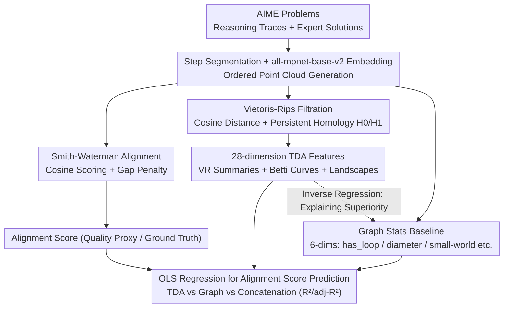

# The Shape of Reasoning: Topological Analysis of Reasoning Traces in Large Language Models

**Conference**: ICML 2026  
**arXiv**: [2510.20665](https://arxiv.org/abs/2510.20665)  
**Code**: TBD  
**Area**: LLM Reasoning / Reasoning Evaluation / Explainability  
**Keywords**: Reasoning Trace Evaluation, Topological Data Analysis, Persistent Homology, Smith-Waterman Alignment, AIME

## TL;DR
This paper treats LLM chain-of-thought as a "point cloud" in embedding space. It uses Topological Data Analysis (TDA) to extract persistent homology features as an objective measure of reasoning quality. Experiments on the AIME dataset demonstrate that TDA features significantly outperform traditional graph statistics in predicting Smith-Waterman alignment scores (average $R^2=0.236$ vs. average $R^2=0.064$).

## Background & Motivation

**Background**: Current evaluation of LLM reasoning quality relies on expert rubrics, manual labeling, or pairwise judging, which are slow and expensive. Automated methods mostly use graph-based proxies (transforming traces into directed graphs to calculate clustering coefficients, diameter, small-world indices, etc.), approximating "reasoning quality" through structural connectivity.

**Limitations of Prior Work**: (1) Most reasoning datasets only provide final answers; using answer accuracy as a proxy for reasoning quality has been debunked by several studies—LLMs can reach correct answers through flawed reasoning. (2) Graph statistics compress high-dimensional embeddings into a few scalars, losing geometric information regarding how the "reasoning process unfolds in semantic space." (3) Aggregation methods like self-consistency discard intermediate reasoning paths, failing to evaluate the reasoning process itself.

**Key Challenge**: Graph metrics only describe discrete connectivity between nodes. However, the true distinction between good and bad reasoning may reside in higher-dimensional geometric structures—such as local tightness, the persistence of loops (detours), and aggregation patterns across scales—which cannot be fully captured by single-scalar graph statistics.

**Goal**: (1) Construct a verifiable "reasoning ground truth" under realistic conditions lacking step-level labels. (2) Quantify reasoning quality using a set of invariants independent of surface paraphrasing. (3) Test whether these invariants predict reasoning quality better than graph statistics.

**Key Insight**: The authors treat each step of a reasoning trace as a sentence embedding in $\mathbb{R}^d$, forming an ordered point cloud. Two seemingly different correct solutions might be "homeomorphic"—like a donut and a coffee cup—sharing a deep geometric structure, while flawed reasoning lacks such structure. Persistent homology in TDA provides tools to characterize these "shape invariants" (connected components $H_0$, 1D loops $H_1$).

**Core Idea**: Use Smith-Waterman alignment in embedding space to align LLM traces to expert solutions, using the alignment score as ground truth. Perform Vietoris-Rips filtration on the embedding point cloud of the reasoning trace to extract $H_0/H_1$ persistent homology features. Validate the predictive power regarding alignment scores using OLS regression.

## Method

### Overall Architecture

The input consists of AIME (American Invitational Mathematics Examination) problems and their expert solutions. Models generate reasoning traces $r_i$ using answer-blind prompts via a local Ollama service. Traces and expert solutions $s_i$ are segmented into step lists, and each step is embedded using `all-mpnet-base-v2`. In the embedding space, one path performs Smith-Waterman alignment to obtain "alignment scores" as quality proxies; another path calculates Vietoris-Rips persistence diagrams for the reasoning trace point cloud to extract 28-dimensional TDA features. Finally, OLS regression is used to predict alignment scores using TDA features, graph features, or their concatenation, comparing $R^2$ and adjusted $R^2$.

### Key Designs

**1. Smith-Waterman Alignment in Embedding Space: Constructing Reasoning Ground Truth without Step-level Labels**

Since reasoning datasets often lack "correctness" labels for individual steps, this paper creates a quality proxy. Reasoning traces $R_i=(r_{i,1},\dots,r_{i,m})$ and expert solutions $S_i=(s_{i,1},\dots,s_{i,n})$ are embedded as $X_i^{(r)}\in\mathbb{R}^{m\times d}$ and $X_i^{(s)}\in\mathbb{R}^{n\times d}$. Using cosine similarity as match scores $s_{uv}$ and a gap penalty $\gamma>0$, standard DP recursion is performed:

$$H_{u,v}=\max\{0,\,H_{u-1,v-1}+s_{uv},\,H_{u-1,v}-\gamma,\,H_{u,v-1}-\gamma\},$$

Backtracking from $\arg\max H_{u,v}$ yields alignment pairs $\mathcal{A}_i$, summarized into two scalars: mean alignment score and gold-step coverage. This borrows the local alignment concept from bioinformatics—expert solutions and model traces often align only in specific segments; changing the scoring function to embedding cosine allows for the alignment of steps that are "semantically equivalent but phrased differently."

**2. Vietoris-Rips Filtration + Persistent Homology Features: Transforming Point Clouds into Robust Invariants**

Graph statistics discard geometric information. This step uses topological invariants. On the set of embedding steps $X=\{\mathbf{x}_1,\dots,\mathbf{x}_\ell\}$, cosine distance is defined as $\mathrm{dist}(\mathbf{x}_p,\mathbf{x}_q)=1-\langle\mathbf{x}_p,\mathbf{x}_q\rangle/(\|\mathbf{x}_p\|\|\mathbf{x}_q\|)$. A Vietoris-Rips complex is constructed across varying scale parameters, recording "birth-death" times of topological features to produce persistence diagrams $\mathcal{D}_k=\{(b_j^{(k)},d_j^{(k)})\}$ ($k\in\{0,1\}$). Three groups totaling 28 dimensions are extracted: VR summary statistics (mean life, entropy, etc.), Betti curve descriptors (centroid, spread, width), and persistence landscape descriptors. $H_0$ encodes how ideas cluster and merge, while $H_1$ encodes detours and loops. Together, they map a "local compactness + global retrieval/convergence" profile of good reasoning.

**3. Graph Baseline + Topology-Graph Interpretability Analysis: Explaining why TDA is Stronger**

To ensure a fair comparison, trace graphs are built on identical data following Minegishi et al. 2025, calculating 6 statistics: `has_loop`, `loop_count`, `diameter`, average clustering $\overline{C}$, average shortest path $\overline{L}$, and small-world index. OLS is then used to regress these graph stats onto TDA features, revealing systematic relationships: $H_0$ mean life increases clustering, $H_0$ Betti centroid extends path length and diameter, and $H_1$ landscape mean increases loop count. Graph statistics are essentially compressed projections of TDA at specific scales. Preserving the entire filtration naturally provides richer information.

### Loss & Training

Ours does not train a model. The process involves sentence embedding (`all-mpnet-base-v2` frozen) + Smith-Waterman DP + Vietoris-Rips persistent homology + OLS regression. Main hyperparameters include cosine distance thresholds, Smith-Waterman gap penalty $\gamma$, and Vietoris-Rips `maxdim=1`.

## Key Experimental Results

### Main Results

Dataset: AIME 2020-2025, totaling 180 (model, problem) observations across 8 LLM configurations (Qwen3 / DeepSeek-R1 / GPT-OSS). Prediction target: Smith-Waterman alignment score.

| Model | Graph $R^2$ | TDA $R^2$ | Graph+TDA $R^2$ | $\Delta R^2$ vs TDA |
|------|------|------|------|------|
| Qwen3-8B | 0.054 | 0.273 | 0.312 | +14.3% |
| Qwen3-32B | 0.088 | 0.181 | 0.233 | +28.7% |
| Qwen3-235B | 0.024 | 0.163 | 0.167 | +2.5% |
| DeepSeek-r1-7B | 0.047 | 0.210 | 0.226 | +7.6% |
| DeepSeek-r1-32B | 0.057 | 0.190 | 0.226 | +18.9% |
| DeepSeek-r1-70B | 0.058 | 0.249 | 0.300 | +20.5% |
| GPT-OSS-20B | 0.081 | 0.296 | 0.327 | +10.5% |
| GPT-OSS-120B | 0.101 | 0.327 | 0.368 | +12.5% |
| **Mean** | **0.064** | **0.236** | **0.270** | **+14.4%** |

TDA alone yields an $R^2$ approximately 3-4 times that of graph statistics. In 7 out of 8 configurations, adjusted $R^2$ is higher for TDA. Concatenating graph features with TDA increases raw $R^2$ by 14.4% on average, but adjusted $R^2$ decreases by 3.4%, suggesting graph features are largely covered by the TDA subspace.

### Ablation Study

| Feature Cluster | Meaning | Relationship with Alignment | Physical Interpretation |
|------|------|------|------|
| Cluster 2 ($H_0$ betti_spread) | Expansion of merges across scales | Positive | Reasoning "clusters" across multiple scales simultaneously; clear main path |
| Cluster 3 ($H_0$ betti_width) | Scale span of merges | Negative | Excessive span indicates many breakpoints, poor coherence |
| Cluster 12 ($H_1$ betti_width) | Scale range of 1D loops | Positive | Including moderate short-to-medium range local checks is beneficial |
| Cluster 16 ($H_1$ max_birth/death) | Late-stage large-scale loops | Weak Negative | Large-scale late detours usually indicate getting lost |

### Key Findings
- **TDA significantly outperforms Graph Statistics**: TDA-only average $R^2$ is $\approx 3.7\times$ that of Graph-only. High-quality reasoning resembles high-dimensional geometric invariants rather than simple discrete connectivity.
- **Topological Features are "Translateable" to Graph Features**: TDA explains $R^2 \approx 0.35$-$0.38$ for 4 global graph statistics (clustering, length, diameter, small-world), but only $\approx 0.07$ for loop incidence, which is determined by idiosyncratic local connections.
- **Good Reasoning Profile**: High-quality reasoning tends to "maintain a cohesive main path + include diverse local verifications + avoid large-scale late-stage detours," aligning with human intuition of "clear, checkable, and focused."
- **Dataset Ceiling**: Even the best configuration ($R^2 \approx 0.37$) explains less than 40% of alignment variance, indicating embedding geometry is only part of the reasoning quality signal.

## Highlights & Insights
- Treating Chain-of-Thought as an ordered point cloud for TDA provides a refreshing "geometric perspective" that fills the gap between token-level probabilities and discrete graphs.
- Smith-Waterman alignment in embedding space is a versatile tool for aligning model output to references without requiring literal identity (e.g., long-form QA, code logic).
- Explaining the superiority of TDA through inverse regression (TDA $\rightarrow$ Graph) creates a rigorous empirical structure.
- Implications for RL/RLHF: Using $H_0$ Betti spread or mean life as scalar process rewards could provide a denser training signal than traditional ORMs.

## Limitations & Future Work
- **Narrow Dataset Scope**: Only AIME math problems were used. Success in commonsense reasoning or science QA remains unknown.
- **Topological Features $\neq$ Reasoning Structure**: Persistent homology characterizes the geometry of sentence embeddings under cosine distance, not necessarily symbolic branching or merging. Results are sensitive to the embedder and segmentation.
- **Absolute Explanation Cap**: With $R^2 \approx 0.37$, TDA cannot yet replace human evaluation.
- **Future Improvements**: (1) Integration of multiple embedders. (2) Using supervised learning instead of OLS. (3) Verifying if TDA features can serve as process rewards in RL loops.

## Related Work & Insights
- **vs. Minegishi et al. 2025 (Topology of Reasoning)**: Both characterize reasoning "shape," but Minegishi uses graph statistics; Ours demonstrates graph stats are low-dimensional projections and adds $\approx 17$ points to explained variance.
- **vs. Xiong et al. 2025 (reasoning-graph framework)**: Both focus on structural analysis and note "long $\neq$ good"; Ours provides a finer geometric measure.
- **vs. Gardinazzi et al. 2025 (zigzag persistence in transformers)**: Both use persistent homology, but Gardinazzi looks at layer-wise representation evolution while Ours looks at the trace geometry.
- **vs. Ton et al. 2025 (information-theoretic step contribution)**: One measures step contribution via information theory; the other measures the "shape" of the whole trace. These are complementary.

<!-- RELATED:START -->

## Related Papers

- [\[ICML 2026\] Break the Block: Dynamic-size Reasoning Blocks for Diffusion Large Language Models via Monotonic Entropy Descent with Reinforcement Learning](break_the_block_dynamic-size_reasoning_blocks_for_diffusion_large_language_model.md)
- [\[ICML 2026\] d2: Improving Reasoning in Diffusion Language Models via Trajectory Likelihood Estimation](d2_improving_reasoning_in_diffusion_language_models_via_trajectory_likelihood_es.md)
- [\[ICML 2026\] Game of Thought: Robust Information Seeking with Large Language Models Using Game Theory](game_of_thought_robust_information_seeking_with_large_language_models_using_game.md)
- [\[NeurIPS 2025\] GraphChain: Large Language Models for Large-scale Graph Analysis via Tool Chaining](../../NeurIPS2025/reinforcement_learning/graphchain_large_language_models_for_large-scale_graph_analysis_via_tool_chainin.md)
- [\[NeurIPS 2025\] Incentivizing Reasoning for Advanced Instruction-Following of Large Language Models](../../NeurIPS2025/reinforcement_learning/incentivizing_reasoning_for_advanced_instruction-following_of_large_language_mod.md)

<!-- RELATED:END -->
