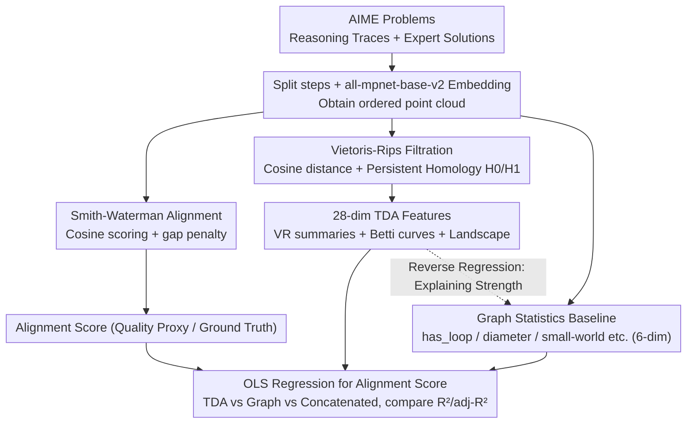

# The Shape of Reasoning: Topological Analysis of Reasoning Traces in Large Language Models

**Conference**: ICML 2026  
**arXiv**: [2510.20665](https://arxiv.org/abs/2510.20665)  
**Code**: TBD  
**Area**: LLM Reasoning / Reasoning Evaluation / Interpretability  
**Keywords**: Reasoning Trace Evaluation, Topological Data Analysis, Persistent Homology, Smith-Waterman Alignment, AIME

## TL;DR
This paper treats LLM chain-of-thought as a "point cloud" in embedding space and utilizes Topological Data Analysis (TDA) to extract persistent homology features as an objective measure of reasoning quality. Experiments on the AIME dataset demonstrate that TDA features possess significantly higher predictive power for Smith-Waterman alignment scores (mean $R^2=0.236$) compared to traditional graph statistics (mean $R^2=0.064$).

## Background & Motivation

**Background**: Evaluating the quality of LLM reasoning currently relies on expert-written rubrics, manual annotation, or pairwise judging, which are slow and expensive. Automated methods mostly utilize graph-based proxies (constructing reasoning traces as directed graphs and calculating clustering coefficients, diameter, small-world indices, etc.) to approximate "reasoning quality" through structural connectivity.

**Limitations of Prior Work**: (1) Most reasoning datasets only provide final answers; using answer accuracy as a proxy for reasoning quality has been debunked by several studies—LLMs can arrive at correct answers via flawed reasoning. (2) Graph statistics compress high-dimensional embeddings into a few scalars, losing geometric information regarding "how the reasoning process unfolds in semantic space." (3) Aggregation methods like self-consistency discard intermediate reasoning paths, failing to evaluate the reasoning process itself.

**Key Challenge**: Graph metrics only describe discrete connectivity between nodes, whereas the true difference between good and poor reasoning likely resides in higher-dimensional geometric structures—such as local compactness, the persistence of detours, and aggregation patterns across various scales—which cannot be fully captured by single-scalar graph statistics.

**Goal**: (1) Construct a "reasoning ground truth" under realistic conditions lacking step-level labels; (2) Quantify reasoning quality using a set of invariants independent of surface paraphrasing; (3) Verify whether these invariants predict reasoning quality better than graph statistics.

**Key Insight**: The authors embed each step of a reasoning trace into $\mathbb{R}^d$ using sentence embeddings, resulting in an ordered point cloud. Two seemingly different correct solutions might be "homeomorphic"—like a donut and a coffee cup—sharing a deep geometric structure, while flawed reasoning lacks such structure. Persistent homology in TDA provides tools to characterize "shape invariants" (connected components $H_0$, one-dimensional holes $H_1$).

**Core Idea**: Align LLM reasoning traces to expert solutions using Smith-Waterman in the embedding space, using the alignment score as the ground truth. Then, apply Vietoris-Rips filtration to the embedding point cloud of the reasoning trace to extract $H_0/H_1$ persistent homology features, and validate their predictive power for the alignment score using OLS regression.

## Method

### Overall Architecture

The input consists of AIME (American Invitational Mathematics Examination) problems and their expert solutions. Models generate reasoning traces $r_i$ using an answer-blind prompt via a local Ollama service. These are split into step lists alongside expert solutions $s_i$, and each step is embedded using all-mpnet-base-v2. In the embedding space, Smith-Waterman alignment is performed to obtain an "alignment score" as a quality proxy. Simultaneously, a Vietoris-Rips persistence diagram is computed for the reasoning trace point cloud to extract 28-dimensional TDA features. Finally, OLS regression is used to predict alignment scores from TDA features, graph features, and their combination, comparing $R^2$ and adjusted $R^2$.

### Key Designs

**1. Smith-Waterman Alignment in Embedding Space: Creating a Reasoning Ground Truth without Step-level Labels**

Reasoning datasets often lack labels for "step-level correctness." This paper creates a quality proxy by embedding reasoning traces $R_i=(r_{i,1},\dots,r_{i,m})$ and expert solutions $S_i=(s_{i,1},\dots,s_{i,n})$ into $X_i^{(r)}\in\mathbb{R}^{m\times d}$ and $X_i^{(s)}\in\mathbb{R}^{n\times d}$. Using cosine similarity as the match score $s_{uv}$ and a gap penalty $\gamma>0$, the standard DP recurrence is applied:

$$H_{u,v}=\max\{0,\,H_{u-1,v-1}+s_{uv},\,H_{u-1,v}-\gamma,\,H_{u,v-1}-\gamma\},$$

The alignment set $\mathcal{A}_i$ is obtained via backtracking from $\arg\max H_{u,v}$, summarized into scalar metrics: mean alignment score and gold-step coverage. This borrows the local alignment concept from bioinformatics—expert and model reasoning often only align in certain segments; global alignment would be penalized by redundant thoughts. Using cosine similarity allows "semantically equivalent but differently phrased" steps to match.

**2. Vietoris-Rips Filtration + Persistent Homology Features: Converting Reasoning Point Clouds into Robust Topological Invariants**

Graph statistics compress high-dimensional embeddings and lose geometric information. This step adopts topological invariants. On the set of step embeddings $X=\{\mathbf{x}_1,\dots,\mathbf{x}_\ell\}$, cosine distance is defined as $\mathrm{dist}(\mathbf{x}_p,\mathbf{x}_q)=1-\langle\mathbf{x}_p,\mathbf{x}_q\rangle/(\|\mathbf{x}_p\|\|\mathbf{x}_q\|)$. A Vietoris-Rips complex is constructed across varying scale parameters, recording "birth-death" times of topological features to generate persistence diagrams $\mathcal{D}_k=\{(b_j^{(k)},d_j^{(k)})\}$ ($k\in\{0,1\}$). Three families of features (28 dimensions total) are extracted: VR summary statistics (mean life, entropy), Betti curve descriptors (centroid, spread, width), and persistence landscape descriptors. $H_0$ and $H_1$ are selected because $H_0$ encodes "how ideas cluster and merge" while $H_1$ encodes "the presence of detours and loops," together corresponding to a profile of "local compactness + global retrieval/convergence."

**3. Graph Stat Baseline + Topology-Graph Interpretability Analysis: Not Just Proving TDA is Stronger, but Why**

Using identical embedding data, trace graphs are built following Minegishi et al. (2025) to calculate six graph statistics: has_loop, loop_count, diameter, average clustering $\overline{C}$, average shortest path $\overline{L}$, and small-world index. OLS is then used to regress these graph statistics onto TDA features, revealing systematic relationships: $H_0$ mean life enhances clustering; $H_0$ Betti centroid extends path length and diameter; $H_1$ landscape mean increases loop count. TDA explains $R^2\approx 0.35$-$0.38$ for 4 global graph statistics, but only $\approx 0.07$ for loop incidence. This reverse regression indicates that many graph statistics are essentially compressed projections of TDA at specific scales.

### Loss & Training

Ours does not involve training models. The evaluation pipeline only includes sentence embedding (frozen all-mpnet-base-v2) + Smith-Waterman DP + Vietoris-Rips persistent homology + OLS regression. Key hyperparameters include the cosine distance threshold, Smith-Waterman gap penalty $\gamma$, and Vietoris-Rips maxdim$=1$.

## Key Experimental Results

### Main Results

The dataset is AIME 2020-2025, with 180 (model, problem) observations covering 8 LLM configurations (Qwen3 / DeepSeek-R1 / GPT-OSS at various scales). The regression target is the Smith-Waterman alignment score.

| Model | Graph $R^2$ | TDA $R^2$ | Graph+TDA $R^2$ | $\Delta R^2$ vs TDA |
|------|------|------|------|------|
| Qwen3-8B | 0.054 | 0.273 | 0.312 | +14.3% |
| Qwen3-32B | 0.088 | 0.181 | 0.233 | +28.7% |
| Qwen3-235B | 0.024 | 0.163 | 0.167 | +2.5% |
| DeepSeek-r1-7B | 0.047 | 0.210 | 0.226 | +7.6% |
| DeepSeek-r1-32B | 0.057 | 0.190 | 0.226 | +18.9% |
| DeepSeek-r1-70B | 0.058 | 0.249 | 0.300 | +20.5% |
| GPT-OSS-20B | 0.081 | 0.296 | 0.327 | +10.5% |
| GPT-OSS-120B | 0.101 | 0.327 | 0.368 | +12.5% |
| **Mean** | **0.064** | **0.236** | **0.270** | **+14.4%** |

TDA alone increases $R^2$ to 3-4 times that of graph statistics, with higher adjusted $R^2$ in 7/8 configurations. Adding graph features to TDA yields a marginal raw $R^2$ increase of 14.4%, but a mean adjusted $R^2$ decrease of $3.4\%$, suggesting that graph features are largely subsumed by the TDA subspace.

### Ablation Study

| Feature Cluster | Meaning | Relation to Alignment | Physical Interpretation |
|------|------|------|------|
| Cluster 2 ($H_0$ betti_spread) | Expansion of merging across scales | Positive | Reasoning "clusters" simultaneously across scales; clear main line |
| Cluster 3 ($H_0$ betti_width) | Span of merging scales | Negative | Excessive span indicates many breakpoints; poor coherence |
| Cluster 12 ($H_1$ betti_width) | Scale range of 1D holes | Positive | Moderate short-to-medium scale local checks are beneficial |
| Cluster 16 ($H_1$ max_birth/max_death) | Late-stage large-scale holes | Weak Negative | Large-scale late detours usually indicate going off-track |

### Key Findings
- **TDA Outperforms Graph Stats**: TDA-only mean $R^2$ is $\approx 3.7\times$ that of Graph-only. High-quality reasoning is more like a high-dimensional geometric invariant than mere discrete connectivity.
- **Topological Features are "Translatable"**: TDA achieves $R^2\approx 0.35$-$0.38$ for global graph stats like clustering/diameter, but explains very little for loop count, which is determined by highly idiosyncratic local connectivity.
- **Portrait of Good Reasoning**: High-quality reasoning tends to "maintain a cohesive main line + include short, diverse local verifications + avoid large-scale late detours," aligning with the intuition of being "clear, checkable, and focused."
- **Dataset Ceiling**: Even the best configuration explains $<40\%$ of the variance ($R^2\approx 0.37$), indicating that embedding geometry is only one part of the reasoning quality signal.

## Highlights & Insights
- Treating chain-of-thought as a point cloud in embedding space and applying TDA is a refreshing geometric perspective that fills the gap between token-level probability and discrete graph statistics.
- Smith-Waterman alignment in embedding space is a standalone tool useful for any scenario requiring semantic alignment (e.g., long-form QA, code logic alignment).
- The "first prove strength, then explain why" structure of the reverse regression analysis is informative and superior to simple metric reporting.
- **Implications for RL**: Scalar metrics like $H_0$ betti_spread could provide cheaper, more granular process reward signals than traditional ORMs.

## Limitations & Future Work
- **Limited Dataset Scope**: Only used AIME math problems. Applicability to commonsense reasoning, science QA, or code reasoning remains unknown.
- **Topology $\neq$ Reasoning Structure**: Persistent homology characterizes the geometry of sentence embeddings under cosine distance, which may not directly map to symbolic branching or merging. $H_1$ as a "detour" is a descriptive interpretation, not a causal claim.
- **Absolute Explanation Cap**: With $R^2\approx 0.37$, TDA cannot yet fully replace human judgment.
- **Future Directions**: (1) Ensemble of multiple embedders; (2) Supervised learning for TDA features to break linear regression bottlenecks; (3) Integrating TDA features into the RL loop as process rewards.

## Related Work & Insights
- **vs Minegishi et al. 2025**: Both characterize reasoning trace "shapes," but Minegishi uses only graph statistics. Ours demonstrates that graph stats are low-dimensional projections of geometry.
- **vs Xiong et al. 2025**: Both focus on structural analysis, noting that "longer $\neq$ better." Ours provides a finer-grained geometric measure than simple branching.
- **vs Gardinazzi et al. 2025**: Both use persistent homology, but Gardinazzi analyzes inter-layer representation evolution while Ours analyzes the geometry of the inference-time trace.
- **vs Ton et al. 2025**: Information-theoretic step contribution vs geometric trace shape. These provide complementary perspectives for automated evaluation.

<!-- RELATED:START -->

## Related Papers

- [\[ICML 2026\] Break the Block: Dynamic-size Reasoning Blocks for Diffusion Large Language Models via Monotonic Entropy Descent with Reinforcement Learning](break_the_block_dynamic-size_reasoning_blocks_for_diffusion_large_language_model.md)
- [\[ICML 2026\] d2: Improving Reasoning in Diffusion Language Models via Trajectory Likelihood Estimation](d2_improving_reasoning_in_diffusion_language_models_via_trajectory_likelihood_es.md)
- [\[NeurIPS 2025\] GraphChain: Large Language Models for Large-scale Graph Analysis via Tool Chaining](../../NeurIPS2025/reinforcement_learning/graphchain_large_language_models_for_large-scale_graph_analysis_via_tool_chainin.md)
- [\[ICML 2026\] Game of Thought: Robust Information Seeking with Large Language Models Using Game Theory](game_of_thought_robust_information_seeking_with_large_language_models_using_game.md)
- [\[NeurIPS 2025\] Incentivizing Reasoning for Advanced Instruction-Following of Large Language Models](../../NeurIPS2025/reinforcement_learning/incentivizing_reasoning_for_advanced_instruction-following_of_large_language_mod.md)

<!-- RELATED:END -->
