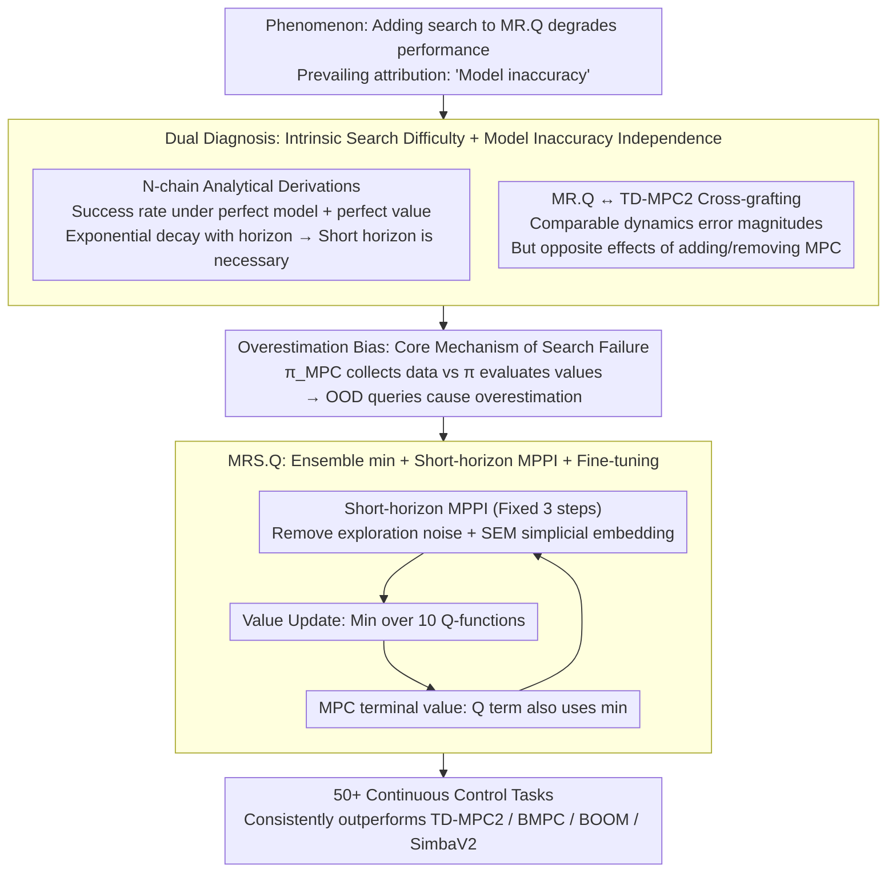

# The Surprising Difficulty of Search in Model-Based Reinforcement Learning

**Conference**: ICML 2026  
**arXiv**: [2601.21306](https://arxiv.org/abs/2601.21306)  
**Code**: https://github.com/facebookresearch/MRSQ  
**Area**: Reinforcement Learning / Model-Based RL / Planning  
**Keywords**: Model Predictive Control, Value Overestimation, Ensemble Minimum, Model-as-Representation, Search

## TL;DR
The authors counter-intuitively demonstrate that search failure in model-based RL is not caused by model inaccuracy, but rather by overestimation bias stemming from the policy mismatch between the MPC behavior policy and the value function training policy. They propose the MRS.Q algorithm, which utilizes a "min" operation over an ensemble of 10 value functions, consistently outperforming SOTA methods like TD-MPC2, BMPC, BOOM, and SimbaV2 across over 50 continuous control tasks.

## Background & Motivation
**Background**: The selling point of MBRL is "learning a dynamics model → imagining the future → planning." TD-MPC2, using MPPI short-horizon search and value function guidance, has become a recognized strong baseline. Meanwhile, MR.Q, a representative model-free method, treats the model only as an auxiliary objective for representation learning without search, yet achieves SOTA performance. The prevailing narrative in the community for MBRL failure is that "dynamics prediction errors accumulate step-by-step, becoming worse with longer search horizons," leading toward efforts focused on accurate models, uncertainty modeling, and long-horizon predictions.

**Limitations of Prior Work**: (a) Using more accurate models for longer-horizon search often fails to improve performance; (b) simply adding MPC to MR.Q degrades its performance; (c) existing "search-assisted" works (TD-M(PC)², BMPC, BOOM) use policy constraints to imitate search actions, but search actions themselves drift rapidly during training, making the constraint targets unstable. These observations suggest that the implicit assumption "more accurate model → better search" is fundamentally flawed.

**Key Challenge**: There is a mismatch between the behavior policy of search $\pi_{\text{MPC}}$ and the target policy $\pi$ assumed during value function training. The value function is evaluated using $\pi$ but queried with data collected by $\pi_{\text{MPC}}$. Consequently, query points fall outside the training distribution, causing overestimation bias similar to that observed in offline RL (Fujimoto 2019). No amount of model accuracy can resolve this mismatch.

**Goal**: To decompose this into three sub-questions: (i) Does search itself have intrinsic difficulties even with perfect dynamics and values? (ii) Does model accuracy really predict whether search will yield gains? (iii) If not model accuracy, what determines the success or failure of search?

**Key Insight**: Leveraging the fact that MR.Q and TD-MPC2 share highly similar architectures (losses, state embeddings, value functions), the authors perform cross-grafting experiments—adding MPC to MR.Q and removing MPC from TD-MPC2. This separates the "search" and "model quality" variables to cleanly isolate the factor that truly matters.

**Core Idea**: The search horizon is fixed to 3 steps to suppress search space explosion. A "min" operation over 10 value functions is then used for both "target calculation" and "MPC final value calculation" to maintain pessimistic estimates. This suppresses the overestimation introduced by search at its source. The resulting algorithm is named MRS.Q (Model-based Representations for Search and Q-learning).

## Method

### Overall Architecture
The paper presents two diagnostic phases followed by an algorithm. Diagnostic phase: (1) Proof on the analytically solvable N-chain toy MDP shows that even with perfect dynamics and values, the probability of uniform random search finding a non-zero reward trajectory is $1-(1-\frac{1}{A^n})^m$, which decays exponentially with horizon $n$. (2) A comparison between MR.Q and TD-MPC2 across 17 DMC/Gym tasks regarding "dynamics error + unroll error" versus "performance delta with/without MPC" proves that while error magnitudes are similar, the effects of MPC are in opposite directions. These diagnostics refute the "model inaccuracy" hypothesis and point directly at value overestimation. Algorithmic phase: MRS.Q makes minimal changes to MR.Q—adding MPPI short-horizon search, increasing the value function ensemble from 2 to 10 with a global min operation (applied to both value targets and MPC trajectory terminal values), adding SEM simplicial embeddings, removing extra exploration noise, and increasing the termination prediction loss weight from 0.1 to 1.

### Key Designs

**1. Dual Diagnosis of Intrinsic Search Difficulty and Model Inaccuracy Independence: Shifting "why search fails" from "inaccurate models" to "search mechanism + value learning coupling"**

The community narrative says "dynamics prediction errors accumulate, search becomes worse as horizon increases." The authors refute this through two diagnostics. Theoretical: On the N-chain toy MDP, the single non-zero reward trajectory requires selecting $a_0$ at every step. The success rate for sampling $m$ trajectories of length $n$ is $1-(1-A^{-n})^m$. For $A=10, m=1000$, $n=3$ yields 0.63, while $n=10$ drops to $10^{-7}$—this is a combinatorial difficulty present even with "perfect models + perfect values" that cannot be fixed by being "more accurate," explaining why short horizons are a necessity rather than an engineering compromise. Empirical: By making embedding scales comparable via SEM, dynamics MSE (weighted by $\gamma^t$ over three steps) and unroll error are calculated. Results show MR.Q + MPC dynamics error is comparable to or lower than TD-MPC2 ($\sim 10^{-5}$), yet MPC benefits TD-MPC2 while almost universally degrading MR.Q (e.g., cheetah-run −173, humanoid-stand −757 in DMC; HalfCheetah −8395, Humanoid −5693 in Gym). Model accuracy is clearly not the determinant for search success.

**2. Overestimation Bias as the Core Mechanism of Search Failure: Pointing diagnosis toward a clear, measurable, and treatable quantity**

If not model accuracy, what is it? The authors point to value function overestimation under MPC behavior. Value updates $Q(s,a)\approx r+\gamma Q(s',\pi(s'))$ use the learned policy $\pi$, but data is collected by the MPC behavior policy $\pi_{\text{MPC}}$. Query points $a\sim\pi_{\text{MPC}}$ fall outside the distribution of $\pi$, causing overestimation identical to offline RL. The paper measures $|Q_{\text{learned}}-\hat{G}_{\text{behavior}}|/\hat{G}_{\text{behavior}}$ (percentage error between learned Q and true discounted return) and finds that MR.Q+MPC consistently shows positive overestimation across 17 tasks, strongly correlated with MPC performance degradation. TD-MPC2 shows lower overestimation but remains high in tasks where it performs poorly (dog-stand, Gym Ant/Hopper/Humanoid/Walker2d). This grounds abstract "distribution shift" into a systematic 17-task matrix of overestimation versus performance changes.

**3. MRS.Q: 10 Value Function Ensemble Min + Short-horizon MPPI + Fine-tuning to "safely" integrate search**

The solution is pessimistic estimation. Built on the MR.Q backbone, MRS.Q takes the minimum across an ensemble of 10 $Q_i$ simultaneously. The update formula is $Q(s,a)\approx r+\gamma\min_{i\in\{1,...,10\}} Q_i(s',\pi(s'))$. Critically, this min is used not just for the target but also when evaluating the MPC trajectory terminal value $V(\tau)=\sum_{t=0}^{N-1}\gamma^t R(\tilde{z}_t,a_t)+\gamma^N \min_i Q_i(\tilde{z}_N,\pi(\tilde{z}_N))$, preventing search from favoring overestimated trajectories. This differs from TD-MPC2, which only randomly samples 2 for min during updates and uses the mean during MPC. Other adjustments support this goal: MPPI is fixed to a 3-step short horizon matching the N-chain analysis; $\mathcal{N}(0,0.2^2)$ exploration noise is removed (MPC already introduces sufficient action perturbation; Figure 4 shows its action variance is much larger than the policy network); SEM (Simplicial Embedding) is added to stabilize multi-step rollouts; dynamics loss weight is increased from 1 to 20; and termination prediction loss weight is increased from 0.1 to 1. The authors specifically avoid imitating search (the path of TD-M(PC)², BMPC, BOOM) because search actions drift rapidly during training (Figure 4 shows MPC actions change 3-5 times more than the policy network).

### Loss & Training
Inherits from MR.Q: $\mathcal{L}(z_s,W_p,W_r) = \mathcal{L}_{\text{Dyn}}(z_{sa}^\top W_p - z_{s'}) + \mathcal{L}_{\text{Reward}}(z_{sa}^\top W_r - r)$ (model as representation learning goal only). Value learning uses $\mathcal{L}_{\text{Value}}(r+\gamma\min_{i=1..10}Q_i(z_{s'a'})-Q(z_{sa}))$. MPPI uses default hyperparameters and sampling scales from TD-MPC2. All other hyperparameters follow MR.Q defaults. All 50+ tasks are run with the same set of hyperparameters for 1M steps across 10 seeds.

## Key Experimental Results

### Main Results: Aggregate performance at 1M steps across 4 benchmarks (10 seeds, 95% CI)

| Algorithm | MPC | Gym (TD3-norm) | DMC | HB (No Hand) | HB (Hand) |
|---|---|---|---|---|---|
| MR.Q | × | 1.46 [1.41, 1.52] | 0.84 [0.83, 0.84] | 0.48 [0.46, 0.49] | 0.31 [0.29, 0.32] |
| MR.Q + MPC | ✓ | 0.67 [0.55, 0.88] | 0.65 [0.63, 0.68] | 0.46 [0.45, 0.48] | 0.38 [0.37, 0.39] |
| TD-MPC2 | ✓ | 0.41 [0.27, 0.57] | 0.78 [0.77, 0.80] | 0.58 [0.56, 0.60] | 0.22 [0.19, 0.25] |
| TD-M(PC)² | ✓ | 0.62 | 0.76 | 0.51 | 0.44 |
| BMPC | ✓ | 0.54 | 0.86 | 0.40 | 0.38 |
| BOOM | ✓ | 0.61 | 0.83 | 0.55 | 0.23 |
| SimbaV2 | × | 1.44 | 0.84 | 0.38 | 0.18 |
| **MRS.Q (Ours)** | ✓ | **1.54 [1.46, 1.60]** | 0.81 [0.79, 0.82] | **0.59 [0.58, 0.60]** | **0.58 [0.57, 0.58]** |

MRS.Q ranks first in 3 out of 4 benchmarks, with its 0.58 on HB-Hand being 1.3x higher than the second-best 0.44.

### Ablation Study: Performance change relative to full MRS.Q (10 seeds)

| Configuration | Gym | DMC | HB (No Hand) | HB (Hand) | Description |
|---|---|---|---|---|---|
| 2 Q-functions | −0.63 | −0.04 | −0.18 | −0.40 | Default ensemble size insufficient for overestimation |
| 5 Q-functions | −0.37 | 0.00 | −0.02 | −0.13 | Near-optimal but still drops in Gym |
| 20 Q-functions | −0.05 | −0.03 | +0.03 | +0.03 | Saturated gains; computational cost not worth doubling |
| Add exploration noise | −0.13 | −0.02 | −0.02 | −0.02 | MPC already has action perturbations; noise causes interference |
| Remove SEM | −0.28 | −0.04 | +0.06 | +0.10 | SEM primarily preserves multi-step stability in Gym/DMC |
| Min(2) from ensemble | −0.49 | +0.01 | −0.05 | −0.19 | Confirms that full ensemble min is critical |
| Min not used in MPC | −0.33 | −0.02 | −0.04 | −0.19 | Only minning the target is insufficient; MPC terminal Q must use min |
| Graft Min(10) to TD-MPC2 | +0.07 | +0.03 | +0.02 | +0.11 | This trick also improves TD-MPC2, proving overestimation is universal |

### Key Findings
- The marginal benefit of ensemble size saturates at $\approx 10$; 2 is insufficient, and 20 provides minimal gains for double the cost.
- The ablation on "MPC final value also uses min" is particularly interesting—using min only for the target results in a 0.19-0.33 drop. This indicates that during trajectory ranking, MPC actively favors "overestimated potentially good trajectories," making search a maximization-bias amplifier.
- Grafting Min(10) back to TD-MPC2 still yields gains (HB-Hand +0.11), suggesting this is not a fix specific to MR.Q but a general solution for the "search-value coupling" problem.
- Figure 4 shows that the step-to-step variance of actions chosen by MPC is 3-5 times that of the policy network, explaining why forcing $\pi$ to imitate $\pi_{\text{MPC}}$ is noisy in TD-M(PC)²/BMPC/BOOM.

## Highlights & Insights
- **Paradigm Shift**: The long-neglected "distribution shift introduced by search" is quantified, visualized, and treated. The authors shift the MBRL focus from "optimizing model accuracy" to "mitigating value estimation," a rare paradigm-level contribution.
- **Minimal Changes + SOTA**: The core tricks are simply increasing ensemble size from 2→10 + full ensemble min + applying min to the MPC final value. With almost no other changes, it sets a strong baseline with a low engineering threshold.
- **N-chain Logic**: Using an analytically solvable environment to clarify "why short horizons are necessary" provides a compelling "proof of impossibility" before proposing the design.
- **Harmonizing "Model-as-Representation" vs "Model-for-Search"**: While MR.Q argued for model-only-as-representation, MRS.Q shows models can serve both—provided value functions are properly managed—unifying these two paths.

## Limitations & Future Work
- Training a 10-Q ensemble incurs significant computational overhead; the paper does not deeply discuss impacts on VRAM or throughput, which may be unfriendly to resource-constrained scenarios.
- Validation is primarily on continuous control with short horizons (3 steps); transferability to long-horizon planning, discrete actions (e.g., MuZero-style), or board games remains untested.
- Min-of-ensemble is an empirical pessimistic estimate without formal overestimation bound guarantees; the conditions under which it might become excessively pessimistic and degrade performance are not theoretically characterized.
- The focus is on overestimation between "behavior vs target policies," but related work (Lin 2025) identifies a secondary overestimation between "policy network vs MPC"; whether these can be unified is an open question.

## Related Work & Insights
- **vs TD-MPC2 (Hansen 2024)**: Architecturally similar, but TD-MPC2 uses random-sample-2-min for $N=5$, whereas MRS.Q uses full-ensemble-min for $10$ and applies it to MPC final values. The performance gap proves the criticality of ensemble size and minning location.
- **vs TD-M(PC)² / BMPC / BOOM**: These follow the "constraint policy to imitate search action" path, while this work follows the "mitigate value overestimation" path. Figure 4 proves the former's targets drift too fast; MRS.Q outperforms them across all 4 benchmarks.
- **vs MR.Q (Fujimoto 2025)**: MR.Q advocates for "model as representation, not search"; this work proves search can be revived if its introduced overestimation is actively managed, placing them on a spectrum from representation to search engine.
- **vs Min-of-N (Fujimoto 2018, An 2021)**: Classic TD3/REDQ use Min(2)/Min(N) for general overestimation; this work contextualizes the trick for "search-induced OOD" and validates that 10 is sufficient.

## Rating
- Novelty: ⭐⭐⭐⭐⭐ Re-positioning search failure in MBRL from "model inaccuracy" to "value overestimation" is a convincing diagnostic shift.
- Experimental Thoroughness: ⭐⭐⭐⭐⭐ 50+ tasks × 10 seeds × 4 benchmarks × 7 baselines × 7 ablations, supplemented by N-chain proofs and a 17-task overestimation matrix.
- Writing Quality: ⭐⭐⭐⭐ Very clear narrative (Diagnosis → Mechanism → Algorithm → Validation); some figures (Figure 3 matrix) have high information density.
- Value: ⭐⭐⭐⭐⭐ MRS.Q is a new strong MBRL baseline; the Min(10) trick even benefits TD-MPC2, offering immediate engineering value to the community.

<!-- RELATED:START -->

## Related Papers

- [\[ICML 2026\] D$^2$Evo: Dual Difficulty-Aware Self-Evolution for Data-Efficient Reinforcement Learning](d2evo_dual_difficulty-aware_self-evolution_for_data-efficient_reinforcement_lear.md)
- [\[ICML 2026\] Learning to Search and Searching to Learn for Generalization in Planning](learning_to_search_and_searching_to_learn_for_generalization_in_planning.md)
- [\[ICML 2026\] Coupled Variational Reinforcement Learning for Language Model General Reasoning](coupled_variational_reinforcement_learning_for_language_model_general_reasoning.md)
- [\[ICML 2026\] Long-Horizon Model-Based Offline Reinforcement Learning Without Explicit Conservatism](long-horizon_model-based_offline_reinforcement_learning_without_explicit_conserv.md)
- [\[NeurIPS 2025\] EvoLM: In Search of Lost Language Model Training Dynamics](../../NeurIPS2025/reinforcement_learning/evolm_in_search_of_lost_language_model_training_dynamics.md)

<!-- RELATED:END -->
