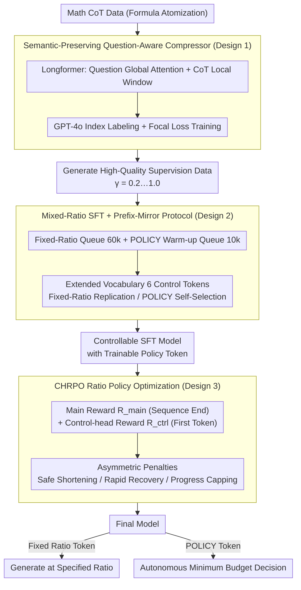

# Extra-CoT: A Chain-of-Thought Compression Framework under Extreme Compression Ratios

**Conference**: ICML2026  
**arXiv**: [2602.08324](https://arxiv.org/abs/2602.08324)  
**Code**: https://github.com/Mwie1024/Extra-CoT  
**Area**: LLM Reasoning  
**Keywords**: Chain-of-Thought Compression, CoT Efficiency, Reinforcement Learning, Reasoning Acceleration, Token Budget Control  

## TL;DR
Extra-CoT proposes a three-stage framework (semantic-preserving compressor → mixed-ratio SFT → hierarchical reward RL) that maintains reasoning accuracy even under extreme compression ratios (retaining only 20% of tokens). It achieves a 73% token reduction on MATH-500 while improving accuracy by 0.6%.

## Background & Motivation

**Background**: Large Language Reasoning Models (e.g., OpenAI o1, DeepSeek-R1) significantly enhance reasoning capabilities by generating step-by-step Chain-of-Thought (CoT), but this comes with massive token overhead—models tend to "overthink," generating redundant reasoning paths even for simple problems.

**Limitations of Prior Work**: Existing controllable CoT compression methods (e.g., TokenSkip, CTS) work reasonably well at medium-to-low compression ratios (50-60% tokens retained) but suffer sharp performance collapses at high ratios (20-30% tokens). The root cause is their reliance on general token importance evaluators (e.g., LLMLingua-2), which fail to preserve sparse but critical reasoning steps under extreme compression, leading to fatal losses in semantic integrity and logical faithfulness.

**Key Challenge**: CoT integrity is directly correlated with reasoning accuracy, but extreme compression inevitably discards a large number of tokens. Existing methods fail to achieve "semantic-preserving extreme compression"—general compressors break mathematical formulas and reasoning chains, and models fail to comply with ultra-low ratio instructions ("control collapse").

**Goal**: To achieve high-precision reasoning under extreme compression ratios ($\gamma = 0.2$, i.e., retaining only 20% of tokens).

**Key Insight**: The root of the problem lies at three levels: (1) Poor quality of compression supervision data—general compressors fragment formulas; (2) Model distrust of low-ratio training data leading to instruction non-compliance; (3) Lack of explicit incentives for the model to actively choose lower budgets.

**Core Idea**: Solve the problem layer-by-layer using a three-stage pipeline—first use a specialized question-aware compressor to generate high-quality supervision data, then teach the model to follow various compression instructions via mixed-ratio SFT, and finally optimize the model to autonomously choose ultra-low budgets using hierarchical reward RL.

## Method

### Overall Architecture
Extra-CoT consists of three sequential stages: (a) Training a semantic-preserving CoT compressor to generate high-quality training data across various compression ratios; (b) Performing mixed-ratio SFT on the reasoning LLM to teach it to follow different compression budget instructions (e.g., $\langle\text{COMP_40}\rangle$), while introducing a policy token ($\langle\text{COMP_POLICY}\rangle$) as a trainable mechanism for the RL stage; (c) Optimizing the policy token via CHRPO (Constrained and Hierarchical Ratio Policy Optimization) to explicitly incentivize the model to select the minimum budget while maintaining accuracy. During inference, providing a fixed-ratio token generates CoT at that ratio, while the POLICY token allows the model to decide autonomously.

### Key Designs

**1. Semantic-Preserving Question-Aware Compressor: Ensuring valid supervision data where formulas the reasoning chains are intact**

The source of failure in extreme compression is poor supervision data—general compressors (LLMLingua-2) fragment mathematical formulas and cause semantic fractures, which leads to the model failing to learn or trust low-ratio instructions. Extra-CoT trains a specialized compressor: using Longformer as the backbone, it enables global attention for question tokens (question-aware) and sliding window local attention for CoT tokens. Supervision labels are generated by GPT-4o via index-based labeling—it returns only the set of indices $R \subseteq \{1,\dots,m\}$ to be retained, avoiding noise from formula rendering differences. The most critical step is "Formula Atomization": merging all LaTeX entities and mathematical expressions into indivisible units, ensuring the compressor does not break symbolic reasoning components. Training employs category-weighted Focal Loss $\mathcal{L}_{\text{Focal}} = -\mathbb{E}_{i}[\alpha_{y_i}(1-p_{i,y_i})^{\lambda}\log p_{i,y_i}]$. Question-awareness + formula atomization preserve mathematical integrity and resolve the "low-quality supervision → instruction non-compliance" cascade.

**2. Mixed-Ratio SFT + Prefix-Mirror Protocol: Teaching the model to understand compression budgets and choose autonomously**

Directly performing SFT at a single extreme ratio results in collapse, so a robust perception of the "compression gradient" must be established first. Extra-CoT extends the vocabulary with 6 control tokens ($\langle\text{COMP_20}\rangle$ to $\langle\text{COMP_POLICY}\rangle$) and designs a "Prefix-Mirror Protocol": in fixed-ratio mode, the model replicates the input control token; in POLICY mode, the model first predicts a ratio token before generating reasoning. The training data is split into two queues—the Fixed-Ratio Queue (60k samples, 12k per ratio across 5 levels) teaches the model controllable generation at various compression ratios, while the POLICY Warm-up Queue (10k samples, with target ratios decided by a heuristic difficulty-selection model) presets a trainable decision mechanism for RL. Multi-ratio training is essential: only a model that has seen the full compression gradient remains stable at extreme ratios.

**3. CHRPO: Using hierarchical rewards + asymmetric penalties to push ratio selection to ultra-low budgets without accuracy loss**

Ratio selection occurs at the first token of the sequence, while the accuracy signal appears at the end. Under a single reward, this decision is too far from the final signal, diluting the gradient and making the policy risk-averse. CHRPO splits rewards into two levels: the Main Reward $\mathcal{R}_{\text{main}}$ is applied to all tokens at the end of the sequence, including accuracy rewards, Huber-type budget calibration, ratio optimization modes, and reasoning integrity constraints; the Control-head Reward $\mathcal{R}_{\text{ctrl}}$ is applied only to the first token, directly shaping the ratio selection policy with immediate feedback to shorten the credit assignment distance. Asymmetric penalties provide three additional safeguards: Safe Shortening ($\lambda_{\text{under}}^{\text{err}} > \lambda_{\text{over}}^{\text{err}}$, penalizing failure due to extreme compression more heavily than failure at excessive lengths), Rapid Recovery (preferring to increase budgets for hard problems over holding strict low budgets), and Progress Capping ($\kappa$ limiting the reward ceiling for successful compression to prevent unstable jumps). The overall logic is "fallback safely when uncertain, compress fully when confident."

## Key Experimental Results

### Main Results

| Method | Dataset | Target Ratio | ActRatio | Token Count ↓ | Acc ↑ |
|------|--------|---------|----------|---------|------|
| Base Model (Qwen3-1.7B) | MATH-500 | - | - | 1675 | 64.2 |
| TokenSkip | MATH-500 | 0.2 | 0.39 | 660 | 23.4 |
| Extra-CoT (SFT) | MATH-500 | 0.2 | 0.29 | 481 | 47.8 |
| Extra-CoT (CHRPO) | MATH-500 | POLICY | 0.27 | 452 | **64.8** |
| Thinkless (DeGRPO) | MATH-500 | - | 0.53 | 888 | 63.6 |
| TokenSkip | GSM8K | 0.2 | 0.30 | 273 | 59.1 |
| Extra-CoT (SFT) | GSM8K | 0.2 | 0.34 | 303 | 80.2 |
| Extra-CoT (CHRPO) | GSM8K | POLICY | 0.24 | 210 | **85.8** |

### Ablation Study (CHRPO Reward Components, Qwen3-1.7B)

| Configuration | GSM8K Token ↓ | GSM8K Acc ↑ | MATH-500 Token ↓ | MATH-500 Acc ↑ |
|------|-------------|-----------|----------------|--------------|
| w/o $\mathcal{R}_{\text{mode+ctrl}}$ | 324 | 85.7 | 604 | 60.0 |
| w/o $\mathcal{R}_{\text{ctrl}}$ | 258 | 82.1 | 568 | 59.6 |
| Full CHRPO | **210** | **85.8** | **452** | **64.8** |

### Key Findings
- At an extreme ratio of 0.2, Extra-CoT outperforms TokenSkip by **+24.4** accuracy points (47.8 vs 23.4) on MATH-500, demonstrating the decisive role of high-quality compression supervision.
- The CHRPO policy reaches 64.8% accuracy on MATH-500 with a 0.27 ActRatio, outperforming Thinkless (0.53 ActRatio / 63.6% accuracy), using less than half the tokens for higher precision.
- Removing $\mathcal{R}_{\text{mode}}$ causes token counts to surge from 210 to 324, indicating that the mode reward is the core engine driving the policy toward ultra-low budgets.
- End-to-end latency: Extra-CoT achieves 3.24× speedup on GSM8K and 2.35× on MATH-500.

## Highlights & Insights
- **Formula Atomization Labeling** is a clever design: it prevents the compressor from seeing internal tokens of a formula and treats the whole LaTeX expression as an indivisible unit. This avoids formula fragmentation, the most fatal failure mode of general compressors. This approach is transferable to any scenario involving structured text compression (e.g., code, SQL).
- **Temporal Separation of Hierarchical Rewards** addresses a common problem in RL: when a critical decision (selecting the ratio) occurs at the beginning but the signal (accuracy) is at the end, credit assignment is difficult. CHRPO applies an independent immediate reward to the first token, effectively shortening the credit propagation distance.
- The asymmetric penalty design (shortening failure > over-length failure) reflects an engineering intuition of "safety first"—encouraging the policy to choose conservatively when uncertain rather than risking compression.

## Limitations & Future Work
- Compressor training depends on GPT-4o for index labeling, resulting in high data generation costs.
- Experiments were primarily validated on mathematical reasoning tasks; generalization to other reasoning types such as code generation or logical reasoning has not been fully explored.
- The fixed 5-level discrete ratio grid (0.2/0.4/0.6/0.8/1.0) may limit policy flexibility; continuous ratio control is worth exploring.

## Related Work & Insights
- TokenSkip (Xia et al., 2025): A pioneering work using LLMLingua-2 as a compressor, but its performance collapses at extreme ratios.
- Thinkless (Fang et al., 2025): Decouples mode selection and answer generation via DeGRPO, but focuses on adjusting reasoning length rather than content.
- COCONUT (Hao et al., 2024): Performs reasoning compression in latent space but faces issues with catastrophic forgetting.

<!-- RELATED:START -->

## Related Papers

- [\[NeurIPS 2025\] Reinforcing the Diffusion Chain of Lateral Thought with Diffusion Language Models](../../NeurIPS2025/reinforcement_learning/reinforcing_the_diffusion_chain_of_lateral_thought_with_diffusion_language_model.md)
- [\[ICML 2026\] Game of Thought: Robust Information Seeking with Large Language Models Using Game Theory](game_of_thought_robust_information_seeking_with_large_language_models_using_game.md)
- [\[ICML 2026\] Convergence of Steepest Descent and Adam under Non-Uniform Smoothness](convergence_of_steepest_descent_and_adam_under_non-uniform_smoothness.md)
- [\[ICML 2026\] Safety Generalization Under Distribution Shift in Safe Reinforcement Learning: A Diabetes Testbed](safety_generalization_under_distribution_shift_in_safe_reinforcement_learning_a_.md)
- [\[ICML 2026\] Interaction-Breaking Adversarial Learning Framework for Robust Multi-Agent Reinforcement Learning](interaction-breaking_adversarial_learning_framework_for_robust_multi-agent_reinf.md)

<!-- RELATED:END -->
