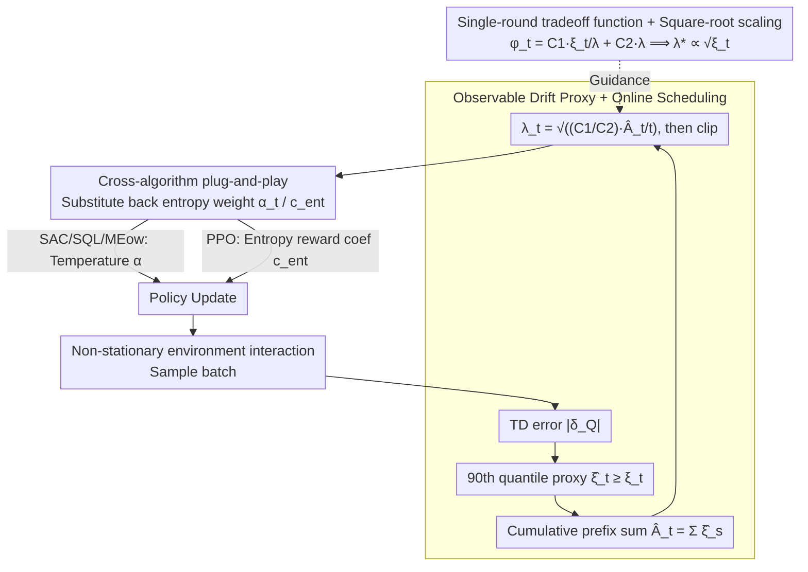

# Tracking Drift: Variation-Aware Entropy Scheduling for Non-Stationary Reinforcement Learning

**Conference**: ICML 2026  
**arXiv**: [2601.19624](https://arxiv.org/abs/2601.19624)  
**Code**: To be confirmed  
**Area**: Reinforcement Learning / Non-Stationary Learning  
**Keywords**: Non-Stationary Reinforcement Learning, Entropy Scheduling, Variation Budget, Exploration-Exploitation Tradeoff, Adaptive

## TL;DR
AES projects the exploration intensity scheduling problem of maximum entropy RL into the dynamic regret framework of Online Convex Optimization (OCO), deriving a hard theoretical result that "entropy weight should be proportional to the square root of the environment drift magnitude." By using TD-error quantiles as an observable drift proxy, it achieves a fully online, algorithm-agnostic entropy scheduler—halving catastrophic recovery times across SAC / PPO / SQL / MEow frameworks in 12 tasks.

## Background & Motivation

**Background**: Modern maximum entropy RL (e.g., SAC) explicitly controls the exploration-exploitation balance via an entropy coefficient. In practice, this coefficient is typically fixed or tuned for stationary environments. However, real-world environments change constantly—robots encounter varying physical conditions, autonomous vehicles adapt to traffic patterns, and recommendation systems track preference drift.

**Limitations of Prior Work**: Fixed entropy coefficients cause two simultaneous problems: (1) excessive exploration in stable periods wasting samples; (2) insufficient exploration after changes slowing recovery. Existing non-stationary RL: change-point detection introduces additional complexity making integration difficult; sliding windows lack theoretical guidance; while meta-learning can accelerate adaptation, it does not explicitly characterize the mapping from "environment variation rate → optimal entropy value."

**Key Challenge**: Significant environment changes necessitate increased exploration intensity, but a theoretical answer to "how much to increase" is lacking. Existing methods are largely heuristic or environment-dependent.

**Goal**: Provide a principled entropy scheduling strategy that explicitly depends on the degree of environment variation and automatically adjusts under non-stationary MDPs.

**Key Insight**: From the perspective of dynamic regret in Online Convex Optimization (OCO), when the optimal solution (drift comparator) changes over time, the learner faces a one-dimensional tradeoff between "tracking drift" and "maintaining stability." Transforming the entropy control problem into this tradeoff allows for solving the functional relationship between entropy weight and drift rate.

**Core Idea**: Deriving the single-round loss $\varphi_t(\lambda) = C_1 \xi_t / \lambda + C_2 \lambda$ ($\xi_t$ being the drift magnitude) from dynamic regret, minimizing it yields the **square-root scaling** rule $\lambda_t^* \propto \sqrt{\xi_t}$. Then, replacing the unobservable $\xi_t$ with an observable drift proxy (TD-error quantile) yields a fully online adaptive entropy scheduler.

## Method

### Overall Architecture
AES consists of three layers:

1.  **Theoretical Layer**: Derives dynamic regret bounds from non-stationary OCO, proving that entropy weight should be proportional to the square root of the drift magnitude.
2.  **Online Layer**: Replaces the unknown optimal comparator drift with an observable drift proxy, obtaining the fully online scheduling rule $\lambda_t = \sqrt{(C_1 / C_2) \cdot \widehat{A}_t / t}$, where $\widehat{A}_t$ is the cumulative drift proxy.
3.  **Implementation Layer**: Plugs the scheduled entropy coefficient $\alpha_t$ or $c_{\text{ent}, t}$ into SAC / PPO / SQL / MEow as a plug-and-play exploration control layer without modifying the core algorithm structure.

### Key Designs

**1. Single-round tradeoff function + Square-root scaling: A hard formula for "how much exploration to add"**

The root cause of fixed entropy coefficient failure is the lack of an answer to "how much should exploration be increased when the environment changes." The authors analyze non-stationary OCO via the Dynamic Mirror Descent lemma, expressing the single-round contribution of entropy weight $\lambda$ as:

$$\varphi_t(\lambda) = C_1\,\xi_t/\lambda + C_2\,\lambda,$$

The first term is the "tracking cost"—the larger the drift $\xi_t$ and the smaller the entropy weight, the slower the tracking; the second term is the "stability cost"—the larger the entropy weight, the more unnecessary randomness is introduced. Taking the derivative with respect to $\lambda$ and setting it to zero yields $\lambda_t^* = \sqrt{(C_1/C_2)\cdot\xi_t}$. This square-root scaling quantitatively binds exploration intensity to environment drift for the first time, replacing previous heuristics. It also explains why fixed entropy fails from the "tracking vs. stability" perspective—$\lambda$ is too small to keep up during drift periods and too large to avoid waste during stable periods.

**2. Observable drift proxy + Online scheduling: Using TD-error quantiles to replace unobservable $\xi_t$**

While $\lambda_t^*\propto\sqrt{\xi_t}$ is elegant, $\xi_t$ (the drift of the optimal comparator) is not actually observable. The authors' strategy is to find a conservative upper bound proxy $\widehat{\xi}_t\geq\xi_t$ (without requiring unbiasedness), defaulting to the 90th quantile of the absolute TD-error in the current batch $\widehat{\xi}_t = \mathrm{Quantile}_{0.9}(|\delta_Q|)$ (switching to value function TD-error in PPO). This signal naturally rises when the environment changes—old value functions become inaccurate for the new environment, causing TD-errors to amplify. By taking the prefix sum $\widehat{A}_t = \sum_{s=1}^t \widehat{\xi}_s$, the fully online scheduling $\lambda_t = \sqrt{(C_1/C_2)\cdot\widehat{A}_t/t}$ is obtained, clipped to $[\lambda_{\min},\lambda_{\max}]$ for numerical stability. TD-error is chosen because it is an existing RL signal requiring no extra computation and, as a continuous quantity, is better suited than discrete change-point detection for gradual or periodic drift.

**3. Cross-algorithm plug-and-play: A unified interface for temperature and coefficient frameworks**

The entropy weight in maximum entropy RL algorithms is hidden in different places—SAC / SQL / MEow use temperature $\alpha$, while PPO uses the entropy reward coefficient $c_{\text{ent}}$. AES does not touch the core algorithm logic; it merely calculates the drift proxy at each training step, derives the new entropy weight via the scheduling rule, and substitutes it back into the algorithm's existing position (e.g., $\alpha_t\log\pi(a\mid s)$ in the SAC actor loss). The reason for creating an algorithm-agnostic unified interface is that the RL community uses both temperature vs. coefficient regularizations and off-policy vs. on-policy frameworks. A unified interface allows this "drift → entropy weight" principle to maximize coverage—validated by the observation that recovery times were halved across SAC/PPO/SQL/MEow carriers.

### Loss & Training
The non-stationary soft MDP learning objective is $J_t(\pi) = \mathbb{E}[\sum_h \gamma^h (r_t(s_h, a_h) + \mu H(\pi(\cdot \mid s_h)))]$; AES adjusts $\mu$ or $\alpha_t$ to control the entropy term weight. Theoretically $\lambda_t^* \propto \sqrt{\xi_t}$, practically using $\lambda_t = \sqrt{\widehat{A}_t / t}$ (with clipping).

## Key Experimental Results

### Main Results: Normalized AUC under Four Drift Patterns

| Task Family | Mode | Standard SAC | SAC + AES | Gain |
| :--- | :--- | :--- | :--- | :--- |
| Toy (2D) | Steady | 1.00 | 1.13 | +13% |
| Toy (2D) | Abrupt | 0.72 | 0.88 | +22% |
| Toy (2D) | Periodic | 0.81 | 0.94 | +16% |
| Toy (2D) | Mixed | 0.73 | 0.97 | +33% |
| MuJoCo (Avg) | Steady | 1.00 | 1.24 | +24% |
| MuJoCo (Avg) | Abrupt | 0.67 | 0.87 | +30% |
| MuJoCo (Avg) | Periodic | 0.68 | 0.94 | +38% |
| MuJoCo (Avg) | Mixed | 0.65 | 0.94 | +45% |
| Isaac Gym (Avg) | Periodic | 0.57 | 0.95 | +67% |
| Isaac Gym (Avg) | Mixed | 0.51 | 0.79 | +55% |

SAC + AES significantly outperforms standard SAC in all non-stationary modes, especially in Mixed / Periodic modes; it does not degrade under Steady conditions but slightly improves (+13%), indicating that adaptive entropy scheduling does not penalize stable phases.

### Ablation Study: Catastrophic Recovery Time (% ↓ lower is better)

| Task | SAC | SAC + AES | PPO | PPO + AES | MEow | MEow + AES |
| :--- | :--- | :--- | :--- | :--- | :--- | :--- |
| Hopper | 12.2 | 6.4 | 12.7 | 6.1 | 6.1 | 4.7 |
| HalfCheetah | 9.6 | 5.1 | 11.8 | 5.1 | 7.7 | 4.4 |
| Walker2d | 10.9 | 5.6 | 12.2 | 5.5 | 9.0 | 4.7 |
| Humanoid | 14.8 | 8.6 | 16.3 | 10.3 | 15.1 | 7.5 |
| **Average** | **13.96** | **7.74** | **12.12** | **8.43** | **11.58** | **6.42** |

Catastrophic recovery time is defined as the percentage of total environment interaction steps required to recover performance after a change point. The average recovery time across all four algorithm carriers was halved (SAC 13.96% → 7.74%, MEow 11.58% → 6.42%). Improvements were most pronounced in high-dimensional tasks (AllegroHand, FrankaCabinet) (~17% → ~9%)—aligning with theoretical expectations: the higher the dimension and the more severe the drift, the greater the benefit of adaptive exploration.

### Key Findings
- Adaptive entropy scheduling provides significant gains across all four drift modes and does not degrade in Steady environments.
- Cross-algorithm validation confirms AES as a universal, algorithm-agnostic control principle.
- High-dimensional / strong drift scenarios yield the greatest benefits, verifying the practical existence of the "narrow tradeoff region" in the theory.

## Highlights & Insights
- **Hard-theory-backed exploration intensity formula**: Deriving $\lambda^* \propto \sqrt{\xi_t}$ from dynamic regret is a rare instance in RL where a quantitative link is established between exploration and environment drift.
- **Explicit characterization of causal mechanisms**: Explains fixed entropy coefficient failure via the "tracking cost vs. stability cost" framework—small $\lambda$ tracks slowly during drift, large $\lambda$ wastes samples during stability.
- **Transferable system design**: The plug-and-play mechanism allows AES to seamlessly adapt to four distinct algorithms: SAC, PPO, SQL, and MEow.
- **TD-error as a change detection signal**: Free, continuous, and responsive to both gradual and abrupt changes, proving more robust than specialized change-point detectors.

## Limitations & Future Work
- Conservatism / Noise of the drift proxy: TD-error upper quantiles might produce false signals due to optimization fluctuations, requiring finer calibration in multi-agent / high-dimensional settings.
- Theory is based on tabular + full observability; the bias term $\mathrm{Bias}_t$ under deep RL function approximation has no explicit bound.
- The default proxy only compared TD 90th quantiles; other possible proxies (policy parameter drift, model uncertainty) were not systematically compared.
- Combinations with mechanisms like change-point detection, intrinsic rewards, or meta-RL remain under-explored.

## Related Work & Insights
- **vs. Change-point Detection** (Alami 2023; Chartouny 2025): Precise localization vs. continuous signals; the former has strong guarantees but is hard to integrate, while the latter is lightweight but blurred. The two could be complementary.
- **vs. Intrinsic Rewards** (ICM, RND): Curiosity regulates "which states are explored" (state preference); AES regulates "how random the global policy is" (overall entropy). AES is more direct in scenarios where goals change but state novelty does not necessarily increase.
- **vs. Meta-RL**: Meta-learning provides fast adaptation + fixed entropy regularization; AES explicitly binds exploration intensity to drift magnitude, making it more targeted for distribution shift scenarios.
- **vs. Sliding Window / Time Decay**: Early non-stationary RL used fixed decay $\mathcal{O}(t^{-1/2})$, lacking principled guidance; AES responds dynamically via online variation estimation.

## Rating
- Novelty: ⭐⭐⭐⭐⭐ Establishes a quantitative relationship between exploration intensity and environment drift in max-entropy RL for the first time; the application of dynamic regret analysis is novel.
- Experimental Thoroughness: ⭐⭐⭐⭐⭐ Comprehensive validation across 4 algorithm frameworks × 12 tasks × 4 drift modes × 3 complementary metrics.
- Writing Quality: ⭐⭐⭐⭐ Clear logic, rigorous theoretical derivation, and detailed experimental descriptions; moving technical details to the appendix slightly reduces the main text's density.
- Value: ⭐⭐⭐⭐⭐ Non-stationary RL is increasingly important but theoretically underserved; this paper provides the first principled, implementable exploration control strategy, with plug-and-play potential ensuring broad practical application.

<!-- RELATED:START -->

## Related Papers

- [\[NeurIPS 2025\] Forecasting in Offline Reinforcement Learning for Non-stationary Environments](../../NeurIPS2025/reinforcement_learning/forecasting_in_offline_reinforcement_learning_for_non-stationary_environments.md)
- [\[ICML 2026\] Space-sampled Value Decay: Forgetting Mechanisms for Non-stationary Deep Reinforcement Learning](space-sampled_value_decay_forgetting_mechanisms_for_non-stationary_deep_reinforc.md)
- [\[NeurIPS 2025\] Solving Continuous Mean Field Games: Deep Reinforcement Learning for Non-Stationary Dynamics](../../NeurIPS2025/reinforcement_learning/solving_continuous_mean_field_games_deep_reinforcement_learning_for_non-stationa.md)
- [\[ICML 2026\] D$^2$Evo: Dual Difficulty-Aware Self-Evolution for Data-Efficient Reinforcement Learning](d2evo_dual_difficulty-aware_self-evolution_for_data-efficient_reinforcement_lear.md)
- [\[ICML 2026\] Break the Block: Dynamic-size Reasoning Blocks for Diffusion Large Language Models via Monotonic Entropy Descent with Reinforcement Learning](break_the_block_dynamic-size_reasoning_blocks_for_diffusion_large_language_model.md)

<!-- RELATED:END -->
