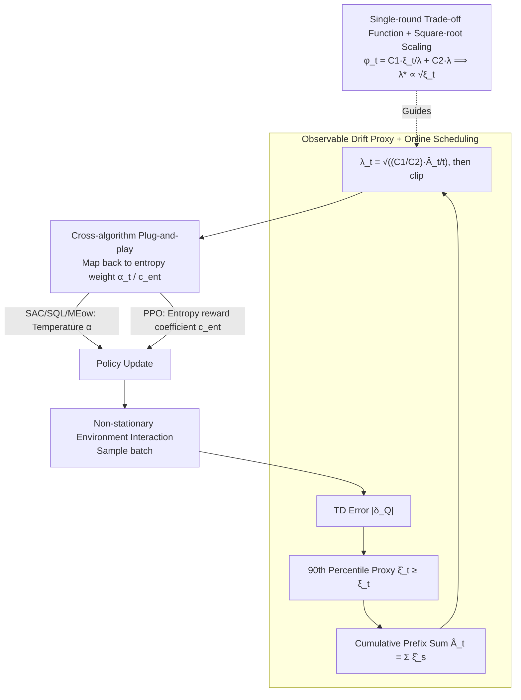

# Tracking Drift: Variation-Aware Entropy Scheduling for Non-Stationary Reinforcement Learning

**Conference**: ICML 2026  
**arXiv**: [2601.19624](https://arxiv.org/abs/2601.19624)  
**Code**: To be confirmed  
**Area**: Reinforcement Learning / Non-Stationary Learning  
**Keywords**: Non-stationary RL, entropy scheduling, variation budget, exploration-exploitation trade-off, adaptive

## TL;DR
AES projects the exploration intensity scheduling problem of maximum entropy RL into the dynamic regret framework of Online Convex Optimization (OCO). It derives a theoretical result stating that the "entropy weight should be proportional to the square root of the environment drift magnitude." By utilizing the TD error quantile as an observable drift proxy, it implements a completely online, algorithm-agnostic entropy scheduling mechanism—halving recovery time across four frameworks (SAC / PPO / SQL / MEow) and 12 tasks.

## Background & Motivation

**Background**: Modern maximum entropy RL (e.g., SAC) explicitly controls the exploration-exploitation balance via an entropy coefficient. In practice, however, this coefficient is typically fixed or tuned only for stationary environments. In real-world scenarios, environments change constantly—robots encounter different physical conditions, autonomous vehicles adapt to traffic patterns, and recommendation systems track preference drifts.

**Limitations of Prior Work**: Fixed entropy coefficients cause two simultaneous problems: (1) over-exploration during stable periods wasting samples; (2) under-exploration after changes, slowing recovery. Existing non-stationary RL approaches face issues: change point detection introduces integration complexity; sliding windows lack theoretical guidance; while meta-RL can accelerate adaptation, it does not explicitly characterize the mapping from "environment variation rate $\to$ optimal entropy."

**Key Challenge**: While environment changes clearly necessitate increased exploration, the question of "how much to increase" lacks a principled answer. Current methods are largely heuristic or environment-dependent.

**Goal**: Provide a principled entropy scheduling strategy that explicitly depends on the degree of environment variation and automatically adjusts under non-stationary MDPs.

**Key Insight**: From the perspective of dynamic regret in Online Convex Optimization, when the optimal solution (drift comparator) changes over time, the learner faces a one-dimensional trade-off between "tracking drift" and "maintaining stability." Transforming the entropy control problem into this trade-off allows for solving the functional relationship between entropy weight and drift rate.

**Core Idea**: Deriving a single-round loss $\varphi_t(\lambda) = C_1 \xi_t / \lambda + C_2 \lambda$ (where $\xi_t$ is drift magnitude) from dynamic regret, minimization yields a **square-root scaling** rule $\lambda_t^* \propto \sqrt{\xi_t}$. Replacing the unobservable $\xi_t$ with an observable drift proxy (TD error quantile) enables fully online adaptive entropy scheduling.

## Method

### Overall Architecture
AES consists of three layers:

1.  **Theoretical Layer**: Derives dynamic regret bounds from non-stationary OCO, proving that entropy weight should be proportional to the square root of the drift magnitude.
2.  **Online Layer**: Replaces the unknown optimal comparator drift with an observable drift proxy, yielding the fully online scheduling rule $\lambda_t = \sqrt{(C_1 / C_2) \cdot \widehat{A}_t / t}$, where $\widehat{A}_t$ is the cumulative drift proxy.
3.  **Implementation Layer**: Plugs the scheduled entropy coefficient $\alpha_t$ or $c_{\text{ent}, t}$ into SAC / PPO / SQL / MEow as a plug-and-play exploration control layer without altering the core algorithm structure.

### Key Designs

**1. Single-round Trade-off + Square-root Scaling: A rigid formula for "how much exploration"**

The root cause of fixed entropy coefficient failure is the lack of a quantitative answer to how much exploration should increase when the environment changes. Analyzing non-stationary OCO via the dynamic mirror descent lemma, the authors formulate the single-round contribution of entropy weight $\lambda$ as:

$$\varphi_t(\lambda) = C_1\,\xi_t/\lambda + C_2\,\lambda,$$

The first term is the "tracking cost"—the larger the drift $\xi_t$ and smaller the entropy weight, the slower the tracking; the second term is the "stability cost"—the larger the entropy weight, the more unnecessary stochasticity. Setting the derivative with respect to $\lambda$ to zero yields $\lambda_t^* = \sqrt{(C_1/C_2)\cdot\xi_t}$. This square-root scaling quantitatively links exploration intensity to environment drift for the first time, replacing previous heuristic tuning. It also explains why fixed entropy fails from the perspective of "tracking vs. stability"—$\lambda$ is too small to catch up during drift and too large to avoid waste during stability.

**2. Observable Drift Proxy + Online Scheduling: Using TD error quantiles to substitute unobservable $\xi_t$**

While $\lambda_t^*\propto\sqrt{\xi_t}$ is elegant, $\xi_t$ (the drift of the optimal comparator) is unobservable. The authors' strategy is to find a conservative upper bound proxy $\widehat{\xi}_t\geq\xi_t$ (not requiring unbiasedness). They default to the 90th percentile of absolute TD errors in the current batch: $\widehat{\xi}_t = \mathrm{Quantile}_{0.9}(|\delta_Q|)$ (using value function TD error for PPO). This signal naturally rises during environment changes as the old value function's predictions become inaccurate. Using the prefix sum $\widehat{A}_t = \sum_{s=1}^t \widehat{\xi}_s$, they obtain the fully online scheduling $\lambda_t = \sqrt{(C_1/C_2)\cdot\widehat{A}_t/t}$, clipped to $[\lambda_{\min},\lambda_{\max}]$ for numerical stability. TD error is chosen because it is an existing RL signal requiring no extra computation and, as a continuous measure, is better suited for gradual or periodic drifts than discrete change point detection.

**3. Cross-Algorithm Plug-and-Play: A unified interface for temperature and coefficient frameworks**

Entropy weights in max-entropy RL are located differently—SAC / SQL / MEow use temperature $\alpha$, while PPO uses an entropy reward coefficient $c_{\text{ent}}$. AES leaves the core logic untouched; it simply calculates the drift proxy at each training step, derives the new entropy weight via the scheduling rule, and feeds it back into the algorithm's existing slot (e.g., $\alpha_t\log\pi(a\mid s)$ in the SAC actor loss). Providing a unified, algorithm-agnostic interface allows these "drift $\to$ entropy weight" principles to cover both temperature-based and coefficient-based regularizations across off-policy and on-policy frameworks, as evidenced by the halved recovery times for SAC/PPO/SQL/MEow.

### Loss & Training
The learning objective for non-stationary soft MDPs is $J_t(\pi) = \mathbb{E}[\sum_h \gamma^h (r_t(s_h, a_h) + \mu H(\pi(\cdot \mid s_h)))]$. AES adjusts $\mu$ or $\alpha_t$ to control the entropy weight. Theoretically $\lambda_t^* \propto \sqrt{\xi_t}$, practically implemented as $\lambda_t = \sqrt{\widehat{A}_t / t}$ (with clipping).

## Key Experimental Results

### Main Results: Normalized AUC under Four Drift Patterns

| Task Family | Pattern | Standard SAC | SAC + AES | Gain |
| :--- | :--- | :--- | :--- | :--- |
| Toy (2D) | Steady | 1.00 | 1.13 | +13% |
| Toy (2D) | Abrupt | 0.72 | 0.88 | +22% |
| Toy (2D) | Periodic | 0.81 | 0.94 | +16% |
| Toy (2D) | Mixed | 0.73 | 0.97 | +33% |
| MuJoCo (Avg) | Steady | 1.00 | 1.24 | +24% |
| MuJoCo (Avg) | Abrupt | 0.67 | 0.87 | +30% |
| MuJoCo (Avg) | Periodic | 0.68 | 0.94 | +38% |
| MuJoCo (Avg) | Mixed | 0.65 | 0.94 | +45% |
| Isaac Gym (Avg) | Periodic | 0.57 | 0.95 | +67% |
| Isaac Gym (Avg) | Mixed | 0.51 | 0.79 | +55% |

SAC + AES significantly outperforms standard SAC in all non-stationary patterns, with the largest gains in Mixed and Periodic modes. Performance does not degrade under Steady conditions (+13%), indicating that adaptive entropy scheduling does not penalize stable phases.

### Ablation Study: Recovery Time (Percentage ↓, lower is better)

| Task | SAC | SAC + AES | PPO | PPO + AES | MEow | MEow + AES |
| :--- | :--- | :--- | :--- | :--- | :--- | :--- |
| Hopper | 12.2 | 6.4 | 12.7 | 6.1 | 6.1 | 4.7 |
| HalfCheetah | 9.6 | 5.1 | 11.8 | 5.1 | 7.7 | 4.4 |
| Walker2d | 10.9 | 5.6 | 12.2 | 5.5 | 9.0 | 4.7 |
| Humanoid | 14.8 | 8.6 | 16.3 | 10.3 | 15.1 | 7.5 |
| **Average** | **13.96** | **7.74** | **12.12** | **8.43** | **11.58** | **6.42** |

Recovery time is defined as the percentage of environment interaction steps from the change point to performance recovery. Average recovery time across all four algorithm carriers is halved (SAC 13.96% $\to$ 7.74%, MEow 11.58% $\to$ 6.42%). Improvements are most pronounced in high-dimensional tasks (AllegroHand, FrankaCabinet) (~17% $\to$ ~9%), consistent with theoretical expectations: higher dimensionality and sharper drifts yield greater returns from adaptive exploration.

### Key Findings
- Adaptive entropy scheduling provides significant improvements across all four drift patterns without degrading performance in Steady states.
- Cross-algorithm validation confirms AES as a universal, algorithm-agnostic control principle.
- High-dimensional and high-drift scenarios yield the greatest benefits, validating the existence of the "narrow trade-off zone" predicted by theory.

## Highlights & Insights
- **Theoretically Backed Exploration Formula**: Deriving $\lambda^* \propto \sqrt{\xi_t}$ from dynamic regret provides a rare quantitative link between exploration intensity and environment drift in RL.
- **Explicit Causal Mechanism**: The "tracking cost vs. stability cost" framework explains why fixed entropy fails—$\lambda$ is too small for tracking during drift and too large for efficiency during stability.
- **Transferable System Design**: The plug-and-play mechanism allows AES to seamlessly adapt to SAC, PPO, SQL, and MEow.
- **TD Error as a Variation Signal**: It is free, continuous, and responsive to both gradual and abrupt changes, proving more robust than specialized change point detectors.

## Limitations & Future Work
- Conservatism/Noise of the Drift Proxy: TD error upper quantiles might produce false signals due to optimization fluctuations; finer calibration may be needed in multi-agent or high-dimensional settings.
- Theory is based on tabular and fully observable settings; the bias term $\mathrm{Bias}_t$ under deep RL function approximation lacks an explicit bound.
- The default proxy was only compared with the 90th percentile TD error; other possible proxies (policy parameter drift, model uncertainty) were not systematically compared.
- The combination with mechanisms like change point detection, intrinsic rewards, or meta-RL has not been fully explored.

## Related Work & Insights
- **vs. Change Point Detection** (Alami 2023; Chartouny 2025): Precise localization vs. continuous signals; the former offers strong guarantees but is hard to integrate, while the latter is lightweight but less precise. They could be complementary.
- **vs. Intrinsic Reward** (ICM, RND): Curiosity regulates "which states to explore" (state preference); AES regulates "how stochastic the global policy is" (overall entropy). AES is more direct in scenarios where goals change but state novelty does not necessarily increase.
- **vs. Meta-RL**: Meta-learning provides rapid adaptation with fixed entropy regularization; AES explicitly ties exploration intensity to drift magnitude, making it more targeted for distribution shifts.
- **vs. Sliding Window / Time Decay**: Early non-stationary RL used fixed decay $\mathcal{O}(t^{-1/2})$ lacking principled guidance; AES responds dynamically via online variation estimation.

## Rating
- Novelty: ⭐⭐⭐⭐⭐ Establishes the first quantitative relationship between exploration intensity and environment drift in max-entropy RL; the application of dynamic regret analysis is novel.
- Experimental Thoroughness: ⭐⭐⭐⭐⭐ Comprehensive validation across 4 algorithm frameworks, 12 tasks, 4 drift patterns, and 3 complementary metrics.
- Writing Quality: ⭐⭐⭐⭐ Clear logic, rigorous theoretical derivation, and detailed experimental descriptions. Placing technical details in the appendix slightly reduces the body's density.
- Value: ⭐⭐⭐⭐⭐ Non-stationary RL is increasingly important yet theoretically underserved. This paper provides the first principled, implementable exploration control strategy with high potential for broad practical application.

<!-- RELATED:START -->

## Related Papers

- [\[NeurIPS 2025\] Forecasting in Offline Reinforcement Learning for Non-stationary Environments](../../NeurIPS2025/reinforcement_learning/forecasting_in_offline_reinforcement_learning_for_non-stationary_environments.md)
- [\[NeurIPS 2025\] Solving Continuous Mean Field Games: Deep Reinforcement Learning for Non-Stationary Dynamics](../../NeurIPS2025/reinforcement_learning/solving_continuous_mean_field_games_deep_reinforcement_learning_for_non-stationa.md)
- [\[ICML 2026\] D$^2$Evo: Dual Difficulty-Aware Self-Evolution for Data-Efficient Reinforcement Learning](d2evo_dual_difficulty-aware_self-evolution_for_data-efficient_reinforcement_lear.md)
- [\[ICML 2026\] Break the Block: Dynamic-size Reasoning Blocks for Diffusion Large Language Models via Monotonic Entropy Descent with Reinforcement Learning](break_the_block_dynamic-size_reasoning_blocks_for_diffusion_large_language_model.md)
- [\[ICML 2026\] Convergence of Steepest Descent and Adam under Non-Uniform Smoothness](convergence_of_steepest_descent_and_adam_under_non-uniform_smoothness.md)

<!-- RELATED:END -->
