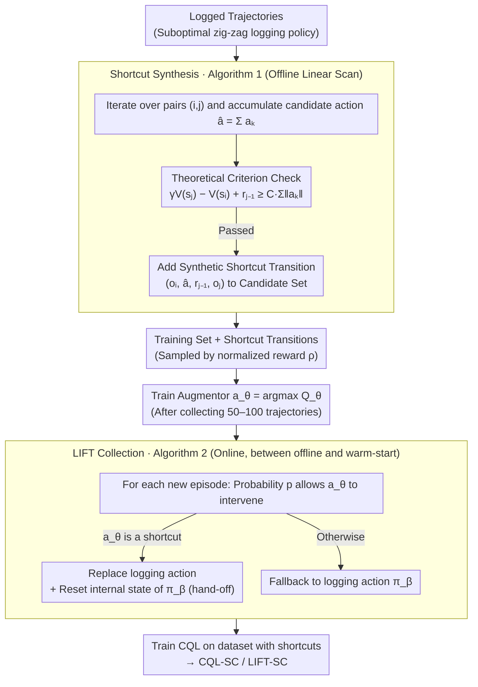

# Trajectory-Level Data Augmentation for Offline Reinforcement Learning

**Conference**: ICML 2026  
**arXiv**: [2605.13401](https://arxiv.org/abs/2605.13401)  
**Code**: https://github.com/HS-Kempten/lift  
**Area**: Reinforcement Learning / Offline RL / Data Augmentation / Active Alignment  
**Keywords**: Offline RL, Trajectory Augmentation, Shortcut, CQL, Active Alignment

## TL;DR
This paper proposes LIFT: in active alignment tasks, it leverages the geometric properties of trajectories to convert redundant zig-zag paths left by suboptimal logging policies into "shortcuts." These synthetic transitions are fed into a lightweight augmentor that replaces logging actions during data collection. This enables offline CQL to significantly outperform standard offline RL and warm-start SAC across various settings, including low-to-high dimensional spaces and partial observations.

## Background & Motivation
**Background**: The mainstream of offline RL focuses on "conservative updates + behavioral regularization" (BC loss, CQL pessimistic critic, IQL expectile policy extraction). All these algorithmic methods assume the dataset is already "good enough." However, substantial evidence suggests that the quality of the dataset itself (coverage, expertise, trajectory structure) often impacts final performance more than the choice of algorithm.

**Limitations of Prior Work**: In industrial active alignment scenarios (optical alignment, camera/telescope assembly, robotic arm coarse positioning), logging policies are usually scripted "coordinate-descent" styles with internal states—converging dimension by dimension from coarse to fine. While reliable, they are highly suboptimal and produce many detours. Existing approaches either follow pure offline paths (limited by data quality) or offline-to-online fine-tuning (requiring expensive online interaction). The middle ground—improving data directly while logging—is largely neglected. Furthermore, hard-injecting superior actions triggers the "hand-off problem": once perturbed, the script cannot recover and the entire episode must be reset.

**Key Challenge**: To insert superior actions during collection, (i) the augmentor must provide reliable suggestions with very little data; (ii) it cannot disrupt the subsequent progress of the logging policy; (iii) theoretical criteria are needed for both dynamics perturbations $f$ and value functions $V^\pi$ to determine when a shortcut is truly superior. Simply summing multi-step actions $a = \sum a_k$ neither guarantees reaching $s_j$ nor ensures stability of $V$ around $s_j$.

**Goal**: (1) Provide sufficient conditions to identify shortcuts on existing logged trajectories; (2) use these shortcuts to train an augmentor during data collection to replace certain logging actions; (3) verify whether this "middle ground" approach is more data-efficient than pure offline + warm-start RL.

**Key Insight**: It is observed that distance-improving logging policies for geometric alignment tasks have a strong prior—subsequent states are always closer to the target than preceding ones. Thus, the potential value of a shortcut can be inferred from the value difference between states without re-execution.

**Core Idea**: A verifiable inequality for "$\sum a_k$ is a $\pi$-shortcut" is derived using three conditions: distance improvement, LPE (Linear Position Error), and $L_V$-Lipschitz value functions. This is instantiated as Algorithm 1 to scan logged trajectories and synthesize shortcut transitions, which are then used to train an augmentor that replaces logging actions with probability $p$ during collection.

## Method

### Overall Architecture
Active alignment is modeled as a context POMDP: state $(s, W) \in \mathcal{P} \times \mathcal{W}$, action $a \in \mathcal{A}$, dynamics $s' = f(s, a, W)$, and reward $R = -\|f(s,a,W) - s_W\|$. Typical forms include $f(s,a,W) = s + W \cdot a$ (linear error) or versions with non-linear perturbations. The pipeline consists of two layers: (1) Offline shortcut synthesis (Algorithm 1) identifies $(o_i, \hat{a}, r_{j-1}, o_j)$ triples from a logged trajectory that satisfy theoretical conditions and adds them to the training set; (2) Online LIFT collection (Algorithm 2) uses a $Q_\theta$-based augmentor $a_\theta(o) = \arg\max_a Q_\theta(o,a)$ to replace logging actions with probability $p$. Upon replacement, the internal state of the logging policy is reset to ensure a smooth hand-off. Finally, CQL is trained on the dataset containing shortcut transitions to obtain CQL-SC, which combined with LIFT forms LIFT-SC.

### Key Designs

**1. Theoretical Criterion for Shortcuts (Theorem 3.6 + Corollary 3.8): Formulating "When to Take a Shortcut" as a Verifiable Inequality**

Simply summing multi-step actions $\sum a_k$ almost certainly misses the target—it guarantees neither reaching $s_j$ nor stabilizing $V$ near $s_j$. LIFT requires a condition to determine "when this accumulation truly yields a value improvement." It first requires the logging policy to be distance-improving (monotonically increasing rewards along the trajectory), introduces LPE (Linear Position Error) $\|f(s_0,\sum a_i, W)-s_k\|\le L_f\cdot\sum\|a_i\|$ to bound accumulation drift, and assumes $V^\pi$ is $L_V$-Lipschitz. Together, these prove that if:

$$\gamma V^\pi(s_j, W) - V^\pi(s_i, W) - \|s_j - s_W\| \ge (\gamma L_V + 1) L_f \sum_{k=i}^{j-1}\|a_k\|,$$

then $\sum a_k$ is guaranteed to be a shortcut (linear dynamics $f(s,a,W)=s+Wa$ is a special case with $L_f=0$, where any accumulation holds). The elegance of this criterion lies in converting the engineering intuition of "obvious shortcuts" into a computable formula—it instructs the algorithm to select $(i,j)$ pairs with "large value differences and short paths," which correspond exactly to the zig-zag segments in logged trajectories.

**2. Algorithm 1: Linearly Scanning Logged Trajectories to Filter Shortcuts**

To implement the criterion as a plug-and-play interface, Algorithm 1 iterates through a trajectory with returns $G_i=V^{\pi_\beta}(s_i,W)=\sum_{k=i}^n\gamma^{k-i}r_k$. Starting from position $i$, it traverses $j>i$, checking each candidate $\hat a=\sum_{k=i}^{j-1}a_k$ against $\gamma G_j - G_i + r_{j-1}\ge C\sum\|a_k\|$. Here, $C$ abstracts the constants from Theorem 3.6 into a hyperparameter (defaulting to $C=0$, meaning all candidates with increasing value are included). Valid synthetic transitions $(o_i,\hat a, r_{j-1}, o_j)$ enter a candidate set and are eventually sampled for the return based on normalized reward $\rho\propto\hat r-\min\hat r$. The linear-time scan can be plugged into d3rlpy as a "transition picker," allowing any d3rlpy algorithm to utilize shortcuts simply by swapping the picker.

**3. Algorithm 2: Probabilistic Action Substitution during Collection and Resetting for Hand-off**

Beyond offline synthesis, LIFT improves the distribution during the collection phase—a middle ground between pure offline and warm-start RL. A few trajectories (50–100) are first collected via the logging policy to train an augmentor $a_\theta(o)=\arg\max_a Q_\theta(o,a)$. In subsequent episodes, $a_\theta$ intervenes with probability $p=0.6$. The augmented policy $\pi_{\text{aug}}(o)=a_\theta(o)$ is used if it represents a $\pi_\beta$-shortcut; otherwise, it falls back to $\pi_\beta(o)$, with $V^{\pi_{\text{aug}}}\ge V^{\pi_\beta}$ guaranteed by Proposition A.1. A critical engineering detail is the hand-off: scripted logging policies have internal states (e.g., current step size). Intervention causes inconsistencies. LIFT explicitly resets the internal state of $\pi_\beta$ whenever the augmentor takes over, ensuring the script resumes cleanly.

### Loss & Training
No new loss functions are introduced; standard CQL (Conservative Q-Learning) objectives are used. Algorithm 1 transitions are injected via the d3rlpy picker interface. $Q_\theta$ is trained on an initial small dataset, followed by the main collection loop. Hyperparameters: $C=0$, $p=0.6$, max 20 augmentations per trajectory.

## Key Experimental Results

### Main Results

| Scenario | logging | CQL | CQL-SC | LIFT | LIFT-SC | warm-start SAC |
|---|---|---|---|---|---|---|
| $(\mathcal{O}_{\text{PO}}, f_{\text{blend}})$, $d=5$ | Highly suboptimal | Moderate | Gain | Further Gain | **Best** | Lags behind |
| Lens Alignment $\mathcal{O}_{\text{LP}}$ (Image) | Suboptimal | Medium | High | High | **Best** | Weaker than LIFT-SC |
| Fetch Reach $\mathcal{O}_{\text{Fetch}}$ | Suboptimal | Medium | High | High | **Best** | Slightly weaker |
| Polarized Channel $\mathcal{O}_{\text{LT}}$ (Image) | Suboptimal | Weak | Medium | Medium | **Best** | Weak |
| $d=2$ Low-dim $\mathcal{O}_{\text{PO}}$ | — | — | — | Equal | Equal | **Strong** |

In Figure 7 and Appendix E, LIFT-SC leads almost universally in high-dimensional, partially observable, and image-based observations. Diffusion-based methods like GTA and Diffusion-QL failed to consistently outperform LIFT-SC.

### Ablation Study

| Configuration | Phenomenon | Interpretation |
|---|---|---|
| Adding Shortcuts (CQL → CQL-SC) | Consistent improvement across all scenarios | Offline shortcuts alone extract significant potential from logged data. |
| Adding LIFT Collection (CQL → LIFT) | Better than CQL | Improving data distribution during collection is more powerful than pure offline methods. |
| LIFT-SC (LIFT + Shortcuts) | Almost always optimal | Gains from both steps are additive. |
| $f_{\text{regrot}}$ (violates contraction) | Shortcuts fail | Validates that Corollary 3.8 constraints are physically necessary. |
| $f_{\text{sqrt}}$ (violates LPE) | Shortcuts still effective but with smaller gains | LPE is "sufficient" but not strictly "necessary." |
| Noise injection (breaks logging structure)| LIFT-SC remains superior | Indicates no dependence on the structured nature of coordinate scripts. |

### Key Findings
- Shortcuts provide the most significant gains in high-dimensional and image-based observations, exactly where standard offline RL is most fragile. This suggests that expanding data coverage using task geometry is more effective than merely increasing algorithmic regularization.
- For $f_{\text{regrot}}$, which violates the contraction property, shortcuts fail. Theoretical assumptions are not just decorative; dynamics must be checked for LPE/contraction during deployment.
- LIFT dataset metrics show "high average return, low exploration," contrasting with IORL, which has high exploration but poor hand-off quality, resulting in lower trajectory quality.
- TBPTT-style improvement during collection addresses data issues more directly than complex offline algorithms. Warm-start SAC remains superior in low dimensions, showing LIFT's advantage is concentrated in mid-to-high dimensions and partial observability.

## Highlights & Insights
- The formalization of the "shortcut = multi-step action accumulation + geometric conditions" criterion is elegant, turning engineering intuition into a computable inequality. This logic can be transferred to any task with "distance improvement + smooth dynamics" (e.g., robotic arm positioning, autonomous parking).
- The hand-off design is a highly practical detail. Many augmentation methods look good in papers but fail when scripted logging is interrupted. Explicitly including "reset on hand-off" in the pseudocode shows a deep understanding of industrial deployment.
- The augmentor's availability with minimal data relies on the high-quality supervision provided by synthetic shortcut transitions rather than extensive online interaction. This turns the "middle ground" into a practical, evidence-based roadmap.

## Limitations & Future Work
- Theoretical guarantees depend on the distance-improving / LPE / $V$ Lipschitz triad, failing under discontinuous dynamics like $f_{\text{regrot}}$ (often found in contact-based assembly).
- Evaluations were conducted in semi-physical simulations; real-world optical/robotic platforms were not tested, leaving the sim-to-real gap unverified.
- Setting $C=0$ is equivalent to taking all value-increasing segments, which might include false shortcuts in noisy trajectories. While adjusting $C$ is suggested for large $L_f$, no adaptive scheme is provided.
- Integration with model-based or world-model approaches is an open direction—shortcuts are essentially simplified local models.
- Verification was limited to CQL; systematic reports on whether other offline RL methods like IQL or BCQ benefit similarly are missing.

## Related Work & Insights
- **vs HER (Hindsight Experience Replay)**: Both are transition augmentations, but HER relabels goals/states to create success examples for sparse rewards, while LIFT compresses action chains to generate shortcuts. They are complementary.
- **vs IORL (Zhang et al. 2023)**: Both involve collection-time augmentation. IORL injects exploratory actions to expand coverage, whereas LIFT injects exploitive shortcuts. LIFT achieves higher trajectory quality due to better hand-off handling.
- **vs GuDA (Corrado et al. 2024)**: Both use expert-guided collection, but GuDA depends on human intervention. LIFT replaces humans with an algorithm (augmentor + shortcut criterion).
- **vs Diffusion Augmentation (GTA, Diffusion-QL)**: Diffusion methods generate transitions that might lack consistency with real dynamics. LIFT ensures geometric consistency within the original dynamics, providing better interpretability.
- **vs warm-start SAC / Ball et al. 2023**: Warm-starting requires significant online interaction budgets. LIFT outperforms these under fixed trajectory budgets, reinforcing that "improving data" is often more economical than "increasing online steps."

## Rating
- Novelty: ⭐⭐⭐⭐ "Synthesizing shortcuts during collection + reset-friendly hand-off" is a novel and systematic approach for active alignment.
- Experimental Thoroughness: ⭐⭐⭐⭐ Covers low-dim, high-dim, and image observations across five dynamics types, though limited to simulation.
- Writing Quality: ⭐⭐⭐⭐ The theoretical structure (Definition→Proposition→Theorem→Corollary) is clear; Figure 1 and Algorithms 1/2 are well-coordinated.
- Value: ⭐⭐⭐⭐ Provides a plug-and-play d3rlpy-compatible toolkit for industrial alignment while advancing the methodological discussion of "data augmentation vs. algorithmic regularization."

<!-- RELATED:START -->

## Related Papers

- [\[ICML 2026\] Offline Reinforcement Learning with Generative Trajectory Policies](offline_reinforcement_learning_with_generative_trajectory_policies.md)
- [\[ICML 2026\] Beyond the Proxy: Trajectory-Distilled Guidance for Offline GFlowNet Training](beyond_the_proxy_trajectory-distilled_guidance_for_offline_gflownet_training.md)
- [\[ICML 2026\] Offline Reinforcement Learning with Universal Horizon Models](offline_reinforcement_learning_with_universal_horizon_models.md)
- [\[ICML 2026\] DARTS: Distribution-Aware Active Rollout Trajectory Shaping for Accelerating LLM Reinforcement Learning](darts_distribution-aware_active_rollout_trajectory_shaping_for_accelerating_llm_.md)
- [\[NeurIPS 2025\] NoisyRollout: Reinforcing Visual Reasoning with Data Augmentation](../../NeurIPS2025/reinforcement_learning/noisyrollout_reinforcing_visual_reasoning_with_data_augmenta.md)

<!-- RELATED:END -->
