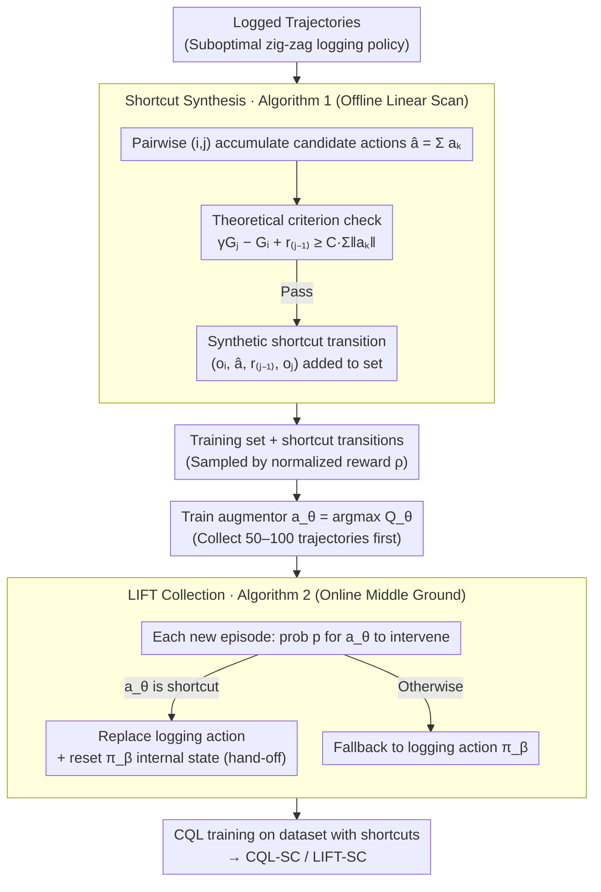

# Trajectory-Level Data Augmentation for Offline Reinforcement Learning

**Conference**: ICML 2026  
**arXiv**: [2605.13401](https://arxiv.org/abs/2605.13401)  
**Code**: https://github.com/HS-Kempten/lift  
**Area**: Reinforcement Learning / Offline RL / Data Augmentation / Active Alignment  
**Keywords**: Offline RL, trajectory augmentation, shortcut, CQL, active alignment

## TL;DR
This paper proposes LIFT: in active alignment tasks, it leverages the geometric properties of trajectories to turn redundant zig-zag paths from suboptimal logging policies into "shortcuts." These synthetic transitions are fed to a lightweight augmentor that replaces logging actions during data collection. Consequently, offline CQL significantly outperforms standard offline RL and warm-start SAC across various settings, including low-to-high dimensional and partial observation environments.

## Background & Motivation
**Background**: The mainstream of offline RL focuses on "conservative updates + behavioral regularization" (e.g., BC loss, CQL pessimistic critics, IQL expectile policy extraction). These algorithmic methods assume the dataset is already "sufficiently good." However, substantial evidence suggests that dataset quality (coverage, expertise, trajectory structure) often impacts final performance more than the specific algorithm used.

**Limitations of Prior Work**: In industrial-grade active alignment scenarios (optical alignment, camera/telescope assembly, robotic arm coarse positioning), logging policies are usually scripted "coordinate-descent" methods with internal states—converging dimension by dimension. These are reliable but highly suboptimal, producing many circuitous paths. Existing approaches either use pure offline RL (limited by data quality) or offline-to-online fine-tuning (requiring expensive online interaction). The middle ground—"improving data directly during logging"—has been largely overlooked. Furthermore, hard-injecting superior actions triggers the "hand-off problem": once the script is interrupted, it cannot recover and requires a full reset.

**Key Challenge**: To insert better actions during collection: (i) the augmentor must provide reliable suggestions with very little data; (ii) it must not break the subsequent execution of the logging policy; (iii) theoretical criteria for both dynamics $f$ and value function $V^\pi$ are needed to determine "when a shortcut is truly better." Simply summing multi-step actions $a = \sum a_k$ guarantees neither reaching $s_j$ nor the stability of $V$ near $s_j$.

**Goal**: (1) Establish sufficient conditions for identifying shortcuts in logged trajectories; (2) Train an augmentor during data collection using these shortcuts to replace certain logging actions; (3) Verify whether this "middle ground" approach is more data-efficient than pure offline + warm-start RL.

**Key Insight**: It is observed that distance-improving logging policies in tasks with geometric structures have strong priors—successor states are always closer to the target than predecessor states. Therefore, the potential value of a shortcut can be inferred from the value difference between states without needing re-execution.

**Core Idea**: Verifiable inequalities for "$\sum a_k$ is a $\pi$-shortcut" are derived using three conditions: "distance-improving + LPE (Linear Position Error) + $L_V$-Lipschitz value function." This is instantiated in Algorithm 1, which scans logged trajectories line-by-line to synthesize shortcut transitions. These transitions then train an augmentor to replace logging actions with probability $p$ during collection.

## Method

### Overall Architecture
Active alignment is modeled as a contextual POMDP: state $(s, W) \in \mathcal{P} \times \mathcal{W}$, action $a \in \mathcal{A}$, dynamics $s' = f(s, a, W)$, and reward $R = -\|f(s,a,W) - s_W\|$. Typical $f(s,a,W) = s + W \cdot a$ (linear error) or forms with non-linear perturbations. The pipeline consists of two layers: (1) Offline shortcut synthesis (Algorithm 1), which identifies $(o_i, \hat{a}, r_{j-1}, o_j)$ triples from a logged trajectory and adds them to the training set; (2) Online LIFT collection (Algorithm 2), which uses a $Q_\theta$-based augmentor $a_\theta(o) = \arg\max_a Q_\theta(o,a)$ to replace logging actions with probability $p$. Upon replacement, the logging policy's internal state is immediately reset to ensure hand-off. Finally, CQL is trained on the dataset containing shortcut transitions (CQL-SC), and the combination with LIFT is denoted as LIFT-SC.

### Key Designs

**1. Theoretical Criterion for Shortcuts (Theorem 3.6 + Corollary 3.8): Turning "when to take a shortcut" into a checkable inequality**

Directly summing multi-step actions $\sum a_k$ almost certainly misses the target—it guarantees neither reaching $s_j$ nor $V$ stability. LIFT requires a condition to determine "when this accumulation actually brings a value improvement." It first requires the logging policy to be distance-improving (monotonically increasing rewards), introduces LPE (Linear Position Error) $\|f(s_0,\sum a_i, W)-s_k\|\le L_f\cdot\sum\|a_i\|$ to limit accumulation drift, and assumes $V^\pi$ is $L_V$-Lipschitz. Together, it is proved that if:

$$\gamma V^\pi(s_j, W) - V^\pi(s_i, W) - \|s_j - s_W\| \ge (\gamma L_V + 1) L_f \sum_{k=i}^{j-1}\|a_k\|,$$

then $\sum a_k$ is a shortcut (linear dynamics $f(s,a,W)=s+Wa$ is a special case with $L_f=0$, where any accumulation holds). This criterion transforms the engineering intuition of "obvious shortcuts" into a computable formula. It directs the algorithm to select $(i,j)$ pairs with "large value differences and short paths," which exactly correspond to the zig-zag segments in logged trajectories.

**2. Algorithm 1: Linearly scanning logged trajectories to filter shortcuts**

With the criterion established, it is implemented as a plug-and-play interface. Algorithm 1 processes a trajectory with returns $G_i=V^{\pi_\beta}(s_i,W)=\sum_{k=i}^n\gamma^{k-i}r_k$. Starting from index $i$, it iterates through $j>i$, checking $\gamma G_j - G_i + r_{j-1}\ge C\sum\|a_k\|$ for each candidate $\hat a=\sum_{k=i}^{j-1}a_k$, where $C$ condenses the constants from Theorem 3.6 into a hyperparameter (defaulting to $C=0$ in experiments). Synthetic transitions $(o_i,\hat a, r_{j-1}, o_j)$ that pass the check enter the candidate set and are sampled based on normalized rewards $\rho\propto\hat r-\min\hat r$. This linear-time scan acts as a "transition picker" for d3rlpy, allowing any d3rlpy algorithm to benefit from shortcuts by simply swapping the picker.

**3. Algorithm 2: Probabilistic replacement during collection with hand-off resets**

Synthesizing offline is insufficient; LIFT aims to improve the distribution during data collection—a middle ground between pure offline and warm-start RL. First, a small number of trajectories (50–100) are collected via the logging policy to train an augmentor $a_\theta(o)=\arg\max_a Q_\theta(o,a)$. In subsequent episodes, $a_\theta$ intervenes with probability $p=0.6$, defining $\pi_{\text{aug}}(o)=a_\theta(o)$ if it is a $\pi_\beta$-shortcut, else falling back to $\pi_\beta(o)$. Proposition A.1 guarantees $V^{\pi_{\text{aug}}}\ge V^{\pi_\beta}$. The critical engineering detail is the hand-off: scripted logging policies have internal states (step size, optimized dimensions). If interrupted, they continue in an inconsistent state. LIFT explicitly resets the internal state of $\pi_\beta$ whenever the augmentor takes over, ensuring the script resumes cleanly.

### Loss & Training
No new loss functions are introduced; standard CQL (Conservative Q-Learning) objectives are used. Algorithm 1 transitions are injected via the d3rlpy picker. $Q_\theta$ is trained on the initial small dataset before the main collection loop. Hyperparameters: $C=0$, $p=0.6$, maximum 20 augmentations per trajectory.

## Key Experimental Results

### Main Results

| Scenario | logging | CQL | CQL-SC | LIFT | LIFT-SC | warm-start SAC |
|---|---|---|---|---|---|---|
| $(\mathcal{O}_{\text{PO}}, f_{\text{blend}})$, $d=5$ | Highly Suboptimal | Average | Gain | Further Gain | **Best** | Lags |
| Lens Alignment $\mathcal{O}_{\text{LP}}$ (Image) | Suboptimal | Med | High | High | **Best** | Worse than LIFT-SC |
| Fetch Reach $\mathcal{O}_{\text{Fetch}}$ | Suboptimal | Med | High | High | **Best** | Slightly Worse |
| Polarized Channel $\mathcal{O}_{\text{LT}}$ (Image) | Suboptimal | Weak | Med | Med | **Best** | Weak |
| $d=2$ Low-Dim $\mathcal{O}_{\text{PO}}$ | — | — | — | Even | Even | **Better** |

LIFT-SC leads across almost all settings in high-dimensional, partially observable, and image-based observations. Diffusion-based methods like GTA and Diffusion-QL failed to outperform consistently.

### Ablation Study

| Configuration | Observation | Interpretation |
|---|---|---|
| Adding shortcuts (CQL → CQL-SC) | Consistent improvement | Offline shortcuts alone capitalize on logged data potential |
| adding LIFT collection (CQL → LIFT) | Better than CQL | Improving distribution during collection is stronger than pure offline |
| LIFT-SC = LIFT + shortcut | Nearly always optimal | Dual gains are additive |
| $f_{\text{regrot}}$ (Violates contraction) | Shortcut fails | Validates the physical necessity of Corollary 3.8 constraints |
| $f_{\text{sqrt}}$ (Violates LPE) | Shortcut remains effective | LPE is "sufficient" but not "necessary" |
| Noise injection | LIFT-SC remains superior | Not dependent on purely structured coordinate-descent scripts |

### Key Findings
- Shortcuts provide the greatest gains in high-dimensional and image observations—exactly where standard offline RL is most fragile. This suggests that expanding data coverage using geometric task structures is more effective than tighter algorithmic regularization.
- For $f_{\text{regrot}}$ (violating contraction properties), shortcuts fail: theoretical assumptions are not just for show; dynamics must be checked for LPE/contraction.
- LIFT dataset metrics show "high average return, low exploration," contrasting with IORL (high exploration, poor hand-off), which results in lower trajectory quality.
- TBPTT-style "improvement during collection" solves data issues more directly than "complex offline algorithms." Warm-start SAC still excels in low dimensions, indicating LIFT's advantages are concentrated in mid-to-high dimensions and partial observability.

## Highlights & Insights
- The formal criterion "shortcut = multi-step accumulation + geometric conditions" elegantly turns engineering intuition into a computable inequality. This logic is transferable to any task with "distance-improving + smooth dynamics" (e.g., robotic alignment, autonomous parking).
- The hand-off design is a grounded, practical detail. While many hybrid methods look good in papers, scripted logging policies often fail upon interruption. LIFT's "reset on hand-off" in the pseudocode demonstrates an understanding of industrial deployment.
- The augmentor's usability with minimal data is achieved through high-quality supervision from synthetic shortcut transitions, rather than relying on massive online interaction.

## Limitations & Future Work
- Theoretical guarantees rely on the distance-improving/LPE/$V$ Lipschitz trio; they fail in discontinuous dynamics like $f_{\text{regrot}}$. Many real-world robotic tasks involving contact assembly have discontinuous dynamics.
- Evaluations are performed in semi-physical simulations; performance on real optical/robotic platforms is not yet demonstrated (sim-to-real gap).
- Setting $C=0$ includes all value-increasing segments, which might include false shortcuts in noisy trajectories. While an adaptive $C$ scheme is suggested for large $L_f$, it is not yet implemented.
- Integration with model-based or world-model approaches is an open direction. Shortcuts are essentially simplified local models.

## Related Work & Insights
- **vs. HER (Hindsight Experience Replay)**: Both use transition augmentation. HER relabels goals/states for sparse rewards, while LIFT compresses action chains for shortcuts. They are complementary.
- **vs. IORL (Zhang et al. 2023)**: Both augment during collection. IORL injects exploratory actions; LIFT injects exploitative shortcuts. Experiments show IORL's poor hand-off results in lower trajectory quality.
- **vs. GuDA (Corrado et al. 2024)**: Both use expert-guided collection. GuDA relies on humans; LIFT replaces humans with an algorithmic augmentor.
- **vs. Diffusion Augmentation (GTA, Diffusion-QL)**: Diffusion generates transitions with potentially weak dynamics consistency; LIFT ensures synthetic transitions hold under original dynamics via geometric conditions.
- **vs. warm-start SAC**: Warm-start requires significant online interaction budgets. LIFT outperforms within fixed trajectory budgets, showing "improving data" is more economical than "increasing steps."

## Rating
- Novelty: ⭐⭐⭐⭐ Synthetic shortcuts during collection + reset-friendly hand-off is a systematic approach for active alignment.
- Experimental Thoroughness: ⭐⭐⭐⭐ Covers low/high-dimensional and image observations across five dynamics, but lacks real-world hardware tests.
- Writing Quality: ⭐⭐⭐⭐ Clear theoretical structure (Definition → Theorem); Figures and Algorithms are well-coordinated.
- Value: ⭐⭐⭐⭐ Provides a plug-and-play d3rlpy tool for industrial alignment and advances the "data augmentation vs. algorithmic regularization" methodology.

<!-- RELATED:START -->

## Related Papers

- [\[ICLR 2026\] Koopman-Assisted Trajectory Synthesis: A Data Augmentation Framework for Offline Imitation Learning](../../ICLR2026/reinforcement_learning/koopman-assisted_trajectory_synthesis_a_data_augmentation_framework_for_offline_.md)
- [\[ICML 2026\] Offline Reinforcement Learning with Generative Trajectory Policies](offline_reinforcement_learning_with_generative_trajectory_policies.md)
- [\[ICLR 2026\] Trajectory Generation with Conservative Value Guidance for Offline Reinforcement Learning](../../ICLR2026/reinforcement_learning/trajectory_generation_with_conservative_value_guidance_for_offline_reinforcement.md)
- [\[ICML 2026\] Long-Horizon Model-Based Offline Reinforcement Learning Without Explicit Conservatism](long-horizon_model-based_offline_reinforcement_learning_without_explicit_conserv.md)
- [\[ICML 2026\] Counterfactual Transport Flows for Offline Conservative Trajectory Refinement](counterfactual_transport_flows_for_offline_conservative_trajectory_refinement.md)

<!-- RELATED:END -->
