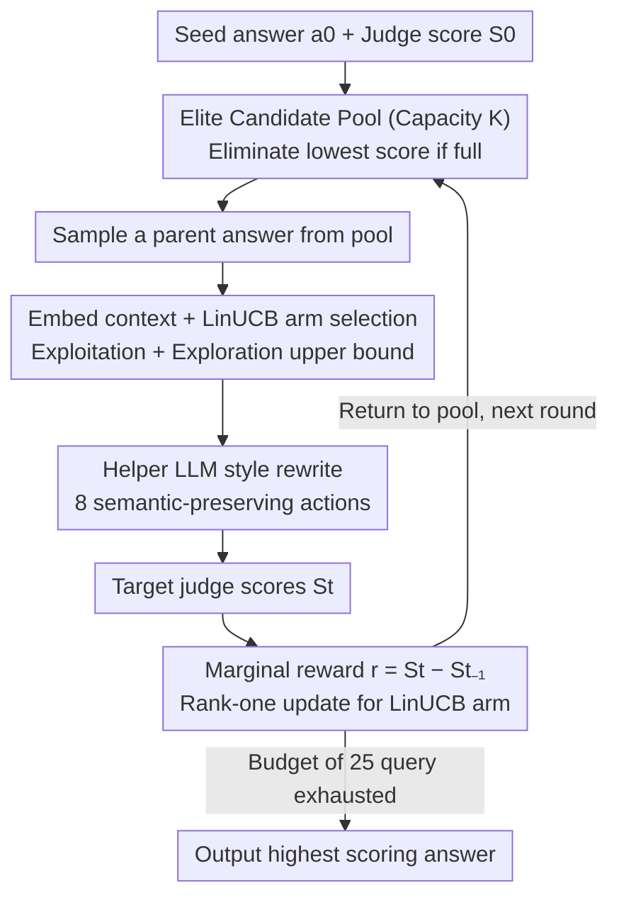

# Turning Bias into Bugs: Bandit-Guided Style Manipulation Attacks on LLM Judges

**Conference**: ICML 2026  
**arXiv**: [2605.26156](https://arxiv.org/abs/2605.26156)  
**Code**: https://github.com/xianglinyang/llm-as-a-judge-attack  
**Area**: AI Safety / LLM Evaluation / Adversarial Attacks  
**Keywords**: LLM-as-a-Judge, Style Bias, Contextual Bandit, LinUCB, Black-box Attack

## TL;DR
Treating known style preferences of LLM judges (verbosity, lists, emojis, etc.) as an attack surface that can be systematically exploited, the authors model the attack as a contextual bandit. Using LinUCB, they adaptively select from 8 semantic-preserving style rewriting actions within a 25-query budget, achieving an attack success rate of $>65\%$ and score inflation of $+1 \sim 2$ points (on a 9-point scale) across 5 mainstream judges while bypassing style control defenses.

## Background & Motivation

**Background**: LLM-as-a-Judge has become the de facto standard for chatbot evaluation, preference dataset construction, RLHF reward modeling, and even automated peer review (e.g., MT-Bench, AlpacaEval, Arena-Hard). This paradigm is built on the assumption that "LLM judges are objective and reliable."

**Limitations of Prior Work**: Another line of research continuously reveals that LLM judges possess systematic biases—preference for their own model family (self-preference), preference for verbosity, preference for answers using lists/markdown/emojis, and even preference for "well-written but factually incorrect" answers. However, existing work primarily treats these as "limitations" or "side effects requiring calibration" rather than weaponizing them.

**Key Challenge**: Judges are already deployed at scale in high-risk pipelines (leaderboards, RLHF, AI peer review) and have been proven to have predictable style preferences. This combination naturally constitutes an exploitable security vulnerability, yet the security community has not systematically characterized this threat. Existing attack works (e.g., BadJudge backdoors, universal adversarial perturbations, null models) either require intervention during training or use obvious triggers that are easily detected by defenses.

**Goal**: Under strict black-box and limited budget (25 queries) conditions, answer three questions: (1) Can style bias be systematically exploited to manipulate scores as needed? (2) Do different judges have different bias profiles? (3) Can the attack maintain semantic equivalence while bypassing style control defenses?

**Key Insight**: The problem of "selecting which style edit among a set of known ones most effectively raises the score" is modeled as a **contextual bandit**. The context is the semantic embedding of the (question, current answer), the arms are the 8 style rewriting actions, and the reward is the marginal score improvement given by the judge. This abstraction naturally fits the core trade-off of "exploration of new biases vs. exploitation of known biases" and inherently supports "learning a personalized fingerprint for each judge."

**Core Idea**: Use LinUCB for adaptive selection over the style action space to approximate the judge's style preference curve within 25 steps. By performing only semantic-preserving style rewrites on the answer each time, the attack is both stealthy (appearing merely as a change in writing style) and efficient (learning a separate strategy for each target model).

## Method

### Overall Architecture
BITE maintains a candidate answer pool $\mathcal{P}$ with capacity $K$, initialized as $\{(a_0, S_0)\}$, where $S_0$ is the judge's score for the seed answer $a_0$. Each arm (action) $b \in \mathcal{B}$ corresponds to a type of style rewrite (8 types in total, such as changing verbosity, tone, or adding lists); each arm maintains its own LinUCB parameters $(\mathbf{A}_b, \bm{v}_b)$. In each round: a parent answer is randomly sampled from the pool $\rightarrow$ embedded as context $\rightarrow$ an arm is selected via LinUCB $\rightarrow$ an auxiliary LLM performs the rewrite $\rightarrow$ the result is submitted to the target judge for a score $\rightarrow$ the marginal reward is calculated $\rightarrow$ the LinUCB model for that arm is updated $\rightarrow$ the new answer is placed back in the pool (the lowest score is eliminated if full). This process forms an online loop of "sampling—rewriting—scoring—updating," outputting the highest-scoring answer in the pool after the 25-query budget is exhausted.

### Key Designs

**1. Contextual Bandit Modeling + LinUCB Arm Selection: Approximating the judge's preference curve within a tight budget of 25 steps**

The core trade-off of the attack is "probing new biases vs. exploiting known biases," which contextual bandits fit perfectly. In each round $t$, a pretrained embedding $\phi(q,a_{t-1})=\bm{x}_t\in\mathbb{R}^d$ encodes the current context. The arm selection rule follows the UCB upper bound:

$$b_t = \arg\max_{b\in\mathcal{B}}\Big(\bm{x}_t^\top\hat{\bm\theta}_b + \alpha\sqrt{\bm{x}_t^\top\mathbf{A}_b^{-1}\bm{x}_t}\Big),$$

where the first term represents exploitation (estimated expected reward) and the second term represents exploration (uncertainty reward), with $\alpha$ controlling the trade-off. Each arm independently maintains $\mathbf{A}_b\in\mathbb{R}^{d\times d}$ and $\bm{v}_b\in\mathbb{R}^d$. Upon observing $(\bm{x}_t,r_t)$, a rank-one update is performed: $\mathbf{A}_{b_t}\!\leftarrow\!\mathbf{A}_{b_t}+\bm{x}_t\bm{x}_t^\top$, $\bm{v}_{b_t}\!\leftarrow\!\bm{v}_{b_t}+r_t\bm{x}_t$, and $\hat{\bm\theta}_{b_t}$ is re-estimated as $\mathbf{A}_{b_t}^{-1}\bm{v}_{b_t}$. The advantage of this design is that each judge has a unique "vulnerability fingerprint"—some prefer verbosity, others prefer markdown lists. The contextual bandit can learn this personalized preference curve online for each target without model parameter access. The choice of a linear model involves an explicit trade-off: while the authors admit the true reward is highly non-linear (model misspecification), the linear model offers the highest sample efficiency, enabling convergence within 25 steps.

**2. 8 Semantic-Preserving Action Space Distilled from Bias Literature: Compressing "infinite language transformations" into learnable discrete arms**

If the action space is too large, LinUCB cannot explore it within 25 steps. The authors systematically review LLM judge bias literature (verbosity bias, list bias, markdown bias, tone bias, self-preference, etc.) to distill 8 effective style transformations as arms. Each action is implemented via a helper LLM $\psi$: given the original answer $a_{t-1}$ and action $b_t$, it produces a semantically equivalent but style-altered answer $a_t=\psi(a_{t-1},b_t)$, with strict requirements to maintain semantic content. The key is that this action space itself is a manually encoded "prior of known biases," making it a hot zone where the hit rate is much higher than random style perturbations—later ablation studies show that "Random Action" significantly outperforms full-text rewriting simply by choosing among these 8 actions, proving that the action space prior is the primary driver of attack success.

**3. Elite Candidate Pool + Marginal Reward Signal: Iteratively layering styles on high-scoring answers like an evolutionary algorithm**

If each round restarted from the original $a_0$, the attack would waste the high scores already achieved. BITE maintains a pool of size $K$, uniformly sampling a parent answer each round. The reward is defined as the **marginal** improvement $r_t=S_t-S_{t-1}$ relative to the parent answer rather than the absolute score. This ensures LinUCB learns "which style addition increases the score further in this context," rather than "which style has a generally high score." Marginal rewards are preferred because absolute scores suffer from a ceiling effect: seed answers $S_0$ are often near the maximum score of 9, causing absolute rewards for all actions to cluster near 0. Using marginal improvements avoids this collapse. Eliminating the current lowest-scoring element instead of the oldest when the pool is full ensures "high-score diversity," providing more useful directions for parent selection in the next round.

### Loss & Training
The attack is black-box and online, involving no training phase. On the theoretical side, a key result is provided: when the degree of model misspecification is $\zeta_T$, the pseudo-regret of BITE satisfies $R_T = \tilde{O}(dK\sqrt{T} + \zeta_T dKT)$. This implies that even if there is a gap between the linear model and the true non-linear reward, the regret remains controllable with a statistical $\sqrt{T}$ term and a linear $\zeta_T$ term. The technical contribution lies in extending Abbasi-Yadkori's LinUCB analysis to a multi-arm and misspecified setting.

## Key Experimental Results

### Main Results

| Judge | Naive Injection | Fake Completion | PAIR (Jailbreak) | AutoDAN | **BITE (Ours)** |
|--------|-----------|-----------------|------------------|---------|-----------------|
| Qwen3-235b | 0.833 | 1.287 | 1.284 | 0.941 | **2.010** |
| DeepSeek-R1 | 1.016 | 1.214 | 1.856 | 1.365 | **1.909** |
| Llama-3.3-70B | 0.763 | 1.080 | 1.233 | 1.166 | **1.347** |
| Gemini-2.5-flash | 0.862 | 1.089 | 1.337 | 1.489 | **1.731** |
| o3-mini | 0.650 | 1.103 | 0.869 | 1.091 | **1.356** |

BITE significantly outperforms prompt injection baselines (Naive/Fake Completion/Escape) and jailbreak baselines (PAIR/TAP/AutoDAN) across all 5 judges.

### Ablation Study (MLRBench automated peer review scenario)

| Judge | Initial Score | Iterative Rewrite | Random Action | **BITE (Ours)** |
|--------|--------|-------------------|----------------|-----------------|
| DeepSeek-R1-0528 | 5.67 ± 0.97 | 6.84 ± 0.22 | 7.31 ± 0.23 | **7.63 ± 0.29** |
| Gemini-2.5-flash | 5.28 ± 0.66 | 6.59 ± 0.39 | 7.18 ± 0.28 | **7.44 ± 0.40** |
| Llama-3.3-70B | 7.90 ± 0.07 | 8.17 ± 0.24 | 8.34 ± 0.19 | **8.38 ± 0.18** |

"Iterative Rewrite" uses only a single rewrite action; "Random Action" uses the full action space but selects randomly; "BITE" uses LinUCB for adaptive selection.

### Key Findings
- **The contribution of action space diversity outweighs the adaptive strategy**: Random Action already significantly outperforms Iterative Rewrite, indicating that merely choosing among English bias actions is more effective than repeated full-text rewriting. This confirms that "known bias priors" are the primary reason for success.
- **LinUCB adds an additional layer of gain on top of diversity**: The improvement of BITE over Random Action validates the value of the adaptive strategy itself, especially in pairwise scenarios where the gap is more pronounced.
- **Equally effective for objective/factual questions**: BITE consistently raises scores even on factual questions, confirming that LLM judges' assessments of "objective correctness" are interfered with by style. This finding is particularly dangerous, suggesting that no question type on a leaderboard is safe.
- **Preference profiles do not transfer between judges**: The "vulnerability fingerprint" of each judge is personalized, and attacks cannot be directly transferred. This further justifies the need for BITE's adaptive, per-target personalized learning.
- **Stealth**: Over 90% of attacked responses remain semantically equivalent to the original answer under LLM similarity assessments, allowing them to bypass style control defenses and automated detectors targeting style manipulation.

## Highlights & Insights
- **Treating known biases as priors is a key design philosophy**: Instead of letting the agent explore the entire linguistic space from scratch, the authors explicitly encode 8 literature-verified biases as actions. This makes the 25-query budget sufficient for convergence, providing a paradigm for "few-shot black-box attacks": compressing action spaces with prior knowledge.
- **Marginal Rewards + Elite Pool**: Grafting population-based ideas from evolutionary algorithms onto bandits avoids the reward signal collapse caused by absolute score saturation. This trick can be applied to other optimization scenarios where targets are near an upper bound (e.g., aligning high-scoring questions, jailbreaking models with high refusal rates).
- **Explicit tracking of misspecification in regret bounds**: This is a practical theoretical contribution, informing users under what degree of model mismatch the attack still provably converges, providing "theoretical security" for the attack.
- **Exposing a paradigm-level flaw**: The true value of the paper is not just "another attack," but the falsification of the foundation of the entire LLM-as-a-Judge paradigm: judicial neutrality toward style. This has direct policy implications for leaderboard design, RLHF data cleaning, and AI peer review.

## Limitations & Future Work
- The action space consists of 8 manually encoded biases, which can be "counter-sanitized" by defenders. If defenders train judges to normalize these 8 styles, the attack may fail; the paper does not discuss automatic expansion of action spaces or closed-loop adversarial scenarios.
- A 25-query budget is a realistic assumption for chatbot scenarios, but for large-scale RLHF data generation, the budget is nearly infinite, potentially making attacks stronger but more easily detected by traffic anomaly detection. This trade-off is not characterized.
- Semantic preservation relies on another LLM for similarity assessment, leading to a circular vulnerability where "judge LLMs and evaluation LLM biases are correlated." Ideally, human evaluation should be used for final semantic consistency verification.
- The "non-transferability" of the attack is both a highlight and a limitation: full 25-query budgets must be spent to relearn strategies for each new model, incurring non-negligible costs for large-scale attacks (e.g., across multiple leaderboards).
- Discussion on the defense side is relatively weak—the paper proves that style control and existing detectors fail but does not provide a constructive "how to defend" solution.

## Related Work & Insights
- **vs. BadJudge (Tong et al., 2025)**: BadJudge implants backdoor triggers during training, whereas this work is purely inference-time black-box. BadJudge requires supply chain poisoning; BITE only requires API access, representing a wider threat surface.
- **vs. PAIR / AutoDAN (Jailbreak Types)**: These methods optimize adversarial prefixes to force restricted behaviors, while BITE changes style without changing content. Jailbreak prefixes are easily recognized by safety training, whereas style rewrites fall into the blind spots of "safety + instruction following" training.
- **vs. Universal Adversarial Perturbations (Shi et al., 2024)**: Universal perturbations seek universality at the cost of high detectability. BITE takes the opposite route—personalizing for each target and maintaining stealth, achieving high levels of both.
- **vs. Null Model (Zheng et al., 2025)**: Null Model uses heuristics to exploit evaluation protocol flaws (e.g., high scores for irrelevant answers). BITE uses learning algorithms to systematically explore the bias curve, making it more general and effective on harder benchmarks like Arena-Hard.

## Rating
- **Novelty**: ⭐⭐⭐⭐⭐ Combining "known bias as a prior" with LinUCB in the LLM judge safety context is a genuinely new perspective, not just a variant of common jailbreaks.
- **Experimental Thoroughness**: ⭐⭐⭐⭐⭐ Extensive coverage across 5 judges, two benchmarks, two grading modes, three types of defense, and an MLRBench peer review case study.
- **Writing Quality**: ⭐⭐⭐⭐ Clear progression through three RQs with intuitive algorithm diagrams. The theoretical section has a high barrier for readers without a bandit background, but main results are clearly stated.
- **Value**: ⭐⭐⭐⭐⭐ Directly shakes the foundation of the LLM-as-a-Judge paradigm, with policy-level impacts on leaderboards, RLHF, and AI peer review.

<!-- RELATED:START -->

## Related Papers

- [\[ICLR 2026\] When Greedy Wins: Emergent Exploitation Bias in Meta-Bandit LLM Training](../../ICLR2026/reinforcement_learning/when_greedy_wins_emergent_exploitation_bias_in_meta-bandit_llm_training.md)
- [\[ICML 2026\] Adaptive Bandit Algorithms for Contextual Matching Markets](adaptive_bandit_algorithms_for_contextual_matching_markets.md)
- [\[ICML 2026\] LLM-Guided Communication for Cooperative Multi-Agent Reinforcement Learning](llm-guided_communication_for_cooperative_multi-agent_reinforcement_learning.md)
- [\[ICML 2026\] One Bias After Another: Mechanistic Reward Shaping and Persistent Biases in Language Reward Models](one_bias_after_another_mechanistic_reward_shaping_and_persistent_biases_in_langu.md)
- [\[ICML 2026\] Noise-Guided Transport: Imitation Learning from Random Priors](noise-guided_transport_for_imitation_learning.md)

<!-- RELATED:END -->
