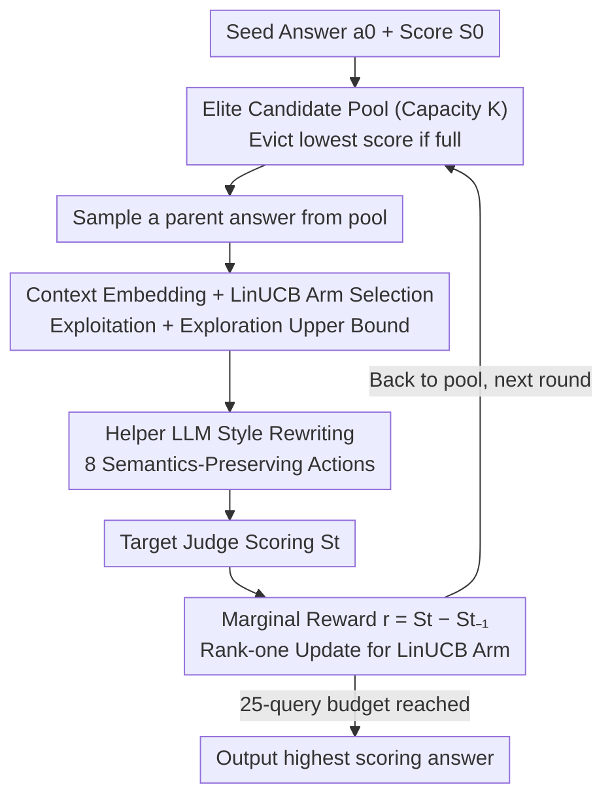

# Turning Bias into Bugs: Bandit-Guided Style Manipulation Attacks on LLM Judges

**Conference**: ICML 2026  
**arXiv**: [2605.26156](https://arxiv.org/abs/2605.26156)  
**Code**: https://github.com/xianglinyang/llm-as-a-judge-attack  
**Area**: AI Safety / LLM Evaluation / Adversarial Attacks  
**Keywords**: LLM-as-a-Judge, Style Bias, Contextual Bandit, LinUCB, Black-box Attack

## TL;DR
Treating known stylistic preferences of LLM judges (verbosity, lists, emojis, etc.) as a systematically exploitable attack surface, the authors model the attack as a contextual bandit. Using LinUCB to adaptively select from 8 semantics-preserving style rewriting actions within a 25-query budget, they achieve >65% attack success rate and +1~2 point score inflation (on a 9-point scale) across 5 major judges, effectively bypassing style control defenses.

## Background & Motivation

**Background**: LLM-as-a-Judge has become the de facto standard for chatbot evaluation, preference dataset construction, RLHF reward modeling, and even automated peer review (MT-Bench, AlpacaEval, Arena-Hard, etc.). This paradigm is built on the assumption that "LLM judges are objective and reliable."

**Limitations of Prior Work**: Another line of research continuously reveals that LLM judges have systematic biases—preferring their own model family (self-preference), favoring verbose answers, preferring answers using lists/markdown/emojis, and even favoring "well-written but factually incorrect" responses. However, existing work primarily treats these as "limitations" or "side effects requiring calibration," rather than weaponizing them directly.

**Key Challenge**: Judges are already deployed at scale in high-stakes pipelines (leaderboards, RLHF, AI peer review) yet possess predictable stylistic preferences—a combination that naturally constitutes an exploitable security vulnerability. However, the safety community has not yet systematically characterized this threat. Existing attacks (BadJudge backdoors, universal adversarial perturbations, null models, etc.) either require intervention during training or use obvious triggers that are easily detected by defenses.

**Goal**: Under strict black-box conditions and a limited budget (25 queries), this paper aims to answer three questions: (1) Can stylistic bias be systematically exploited to manipulate scores on demand? (2) Do different judges have distinct bias profiles? (3) Can the attack maintain semantic equivalence while bypassing style control defenses?

**Key Insight**: Choosing which style edit from a set of known biases most effectively inflates a score can be modeled as a **contextual bandit**. The context is the semantic embedding of the (question, current answer) pair, the arms are 8 style rewriting actions, and the reward is the marginal score increase provided by the judge. This abstraction naturally fits the core trade-off of "exploring new biases vs. exploiting known ones" and supports learning a "personalized fingerprint" for each judge.

**Core Idea**: Use LinUCB for adaptive selection over the style action space to approximate the judge's stylistic preference curve within 25 steps. By performing only semantics-preserving style rewrites on the answer, the attack is both stealthy (appearing as a mere change in writing style) and efficient (learning a unique strategy for each target model).

## Method

### Overall Architecture
BITE maintains a candidate answer pool $\mathcal{P}$ with capacity $K$, initialized with $\{(a_0, S_0)\}$, where $S_0$ is the score given by the judge to the seed answer $a_0$. Each arm (action) $b \in \mathcal{B}$ corresponds to a style rewrite (8 types, e.g., changing verbosity, tone, adding lists); each arm maintains its own LinUCB parameters $(\mathbf{A}_b, \bm{v}_b)$. In each round: a parent answer is randomly sampled from the pool → embedded into a context → LinUCB selects an arm → a helper LLM executes the rewrite → the result is submitted to the target judge for scoring → marginal reward is calculated → the LinUCB model for that arm is updated → the new answer is placed back into the pool (evicting the lowest score if full). This process forms an online loop of "sampling-rewriting-scoring-updating," outputting the highest-scoring answer in the pool after the 25-query budget is exhausted.

### Key Designs

**1. Contextual Bandit Modeling + LinUCB Arm Selection: Approximating preference curves within a tight 25-step budget**

The core trade-off of the attack is "probing new biases vs. exploiting known ones," which fits the contextual bandit framework. In each round $t$, a pretrained embedding $\phi(q,a_{t-1})=\bm{x}_t\in\mathbb{R}^d$ encodes the current context. The arm selection rule incorporates a UCB upper bound:

$$b_t = \arg\max_{b\in\mathcal{B}}\Big(\bm{x}_t^\top\hat{\bm\theta}_b + \alpha\sqrt{\bm{x}_t^\top\mathbf{A}_b^{-1}\bm{x}_t}\Big),$$

The first term represents exploitation (current estimated expected reward), and the second term represents exploration (uncertainty reward), with $\alpha$ controlling the balance. Each arm independently maintains $\mathbf{A}_b\in\mathbb{R}^{d\times d}$ and $\bm{v}_b\in\mathbb{R}^d$. Upon observing $(\bm{x}_t,r_t)$, a rank-one update is performed: $\mathbf{A}_{b_t}\!\leftarrow\!\mathbf{A}_{b_t}+\bm{x}_t\bm{x}_t^\top$, $\bm{v}_{b_t}\!\leftarrow\!\bm{v}_{b_t}+r_t\bm{x}_t$, followed by re-estimating $\hat{\bm\theta}_{b_t}\!\leftarrow\!\mathbf{A}_{b_t}^{-1}\bm{v}_{b_t}$. The advantage of this design is that each judge has a unique "vulnerability fingerprint"—some favor verbosity, others favor markdown lists—and the contextual bandit can learn this personalized preference curve online without model parameter access. The linear model choice involves an explicit trade-off: while the authors admit true rewards are highly non-linear (model misspecification), the linear model provides the highest sample efficiency, enabling convergence within 25 steps.

**2. 8 Semantics-Preserving Action Space Distilled from Bias Literature: Compressing "infinite linguistic transformations" into learnable discrete arms**

If the action space is too large, LinUCB cannot explore it within 25 steps. The authors systematically reviewed LLM judge bias literature (verbosity bias, list bias, markdown bias, tone bias, self-preference, etc.) and distilled 8 effective style transformations as arms. Each action is implemented via a helper LLM $\psi$: given an original answer $a_{t-1}$ and action $b_t$, it produces a semantically equivalent but stylistically altered $a_t=\psi(a_{t-1},b_t)$, with strict requirements to maintain semantic content. The crux is that this action space itself is a hand-coded "prior of known biases"—a "hot zone" where the hit rate is much higher than random stylistic perturbations. Ablation studies show that "Random Action" using these 8 actions significantly outperforms full-text rewriting, proving that the action space prior is the primary driver of attack success.

**3. Elite Candidate Pool + Marginal Reward Signal: Stacking styles on high-scoring answers like an evolutionary algorithm**

If every round restarted from the original $a_0$, the attack would waste the high scores already achieved. BITE maintains a pool of size $K$, uniformly sampling a parent answer in each round. The reward is the **marginal** improvement $r_t=S_t-S_{t-1}$ relative to the parent answer rather than the absolute score. This allows LinUCB to learn "which style to add in this context to gain a bit more," rather than "which style generally gets high scores." Why use marginal rewards? Because absolute scores suffer from a ceiling effect: seed answers $S_0$ are often close to the maximum score of 9, causing absolute rewards for all actions to cluster near 0, making it hard for LinUCB to learn signals. Marginal rewards avoid this collapse. When the pool is full, the lowest-scoring element is evicted rather than the oldest, ensuring the population maintains "high-scoring diversity" and providing more useful directions for parent sampling.

### Loss & Training
The attack is black-box, online, and has no training phase. On the theoretical side, a key result is provided: when the model misspecification is $\zeta_T$, the pseudo-regret of BITE satisfies $R_T = \tilde{O}(dK\sqrt{T} + \zeta_T dKT)$, meaning that even with a gap between the linear model and true non-linear rewards, the regret grows controllably with a $\sqrt{T}$ statistical term and a linear $\zeta_T$ term. The technical contribution extends Abbasi-Yadkori’s LinUCB analysis to a multi-arm, misspecified setting.

## Key Experimental Results

### Main Results

| Judge | Naive Injection | Fake Completion | PAIR (Jailbreak) | AutoDAN | **BITE (ours)** |
|--------|-----------|-----------------|------------------|---------|-----------------|
| Qwen3-235b | 0.833 | 1.287 | 1.284 | 0.941 | **2.010** |
| DeepSeek-R1 | 1.016 | 1.214 | 1.856 | 1.365 | **1.909** |
| Llama-3.3-70B | 0.763 | 1.080 | 1.233 | 1.166 | **1.347** |
| Gemini-2.5-flash | 0.862 | 1.089 | 1.337 | 1.489 | **1.731** |
| o3-mini | 0.650 | 1.103 | 0.869 | 1.091 | **1.356** |

BITE significantly outperforms two categories of baselines—prompt injection (Naive/Fake Completion/Escape) and jailbreak (PAIR/TAP/AutoDAN)—across all five judges.

### Ablation Study (MLRBench Automated Peer Review Scenario)

| Judge | Initial Score | Iterative Rewrite | Random Action | **BITE (ours)** |
|--------|--------|-------------------|----------------|-----------------|
| DeepSeek-R1-0528 | 5.67 ± 0.97 | 6.84 ± 0.22 | 7.31 ± 0.23 | **7.63 ± 0.29** |
| Gemini-2.5-flash | 5.28 ± 0.66 | 6.59 ± 0.39 | 7.18 ± 0.28 | **7.44 ± 0.40** |
| Llama-3.3-70B | 7.90 ± 0.07 | 8.17 ± 0.24 | 8.34 ± 0.19 | **8.38 ± 0.18** |

Iterative Rewrite uses only a single rewrite action; Random Action uses the entire action space but selects randomly; BITE uses LinUCB for adaptive selection.

### Key Findings
- **Contribution of Action Space Diversity Exceeds Adaptive Strategy**: Random Action significantly outperforms Iterative Rewrite, suggesting that simply "randomly selecting from 8 biased actions" is much more effective than "repeatedly rewriting the full text with an LLM"—confirming that the "known bias prior" is the primary factor in attack success.
- **LinUCB Adds a Layer of Gain Above Diversity**: The improvement of BITE over Random Action validates the value of the adaptive strategy itself, especially in pairwise scenarios where the gap is more pronounced.
- **Effective on Objective/Factual Questions**: BITE still significantly inflates scores on factual questions, confirming that LLM judges' assessments of "objective correctness" are also interfered with by style. This is a dangerous finding, indicating that all question types on leaderboards are insecure.
- **Preference Profiles Do Not Transfer Between Judges**: Authors found that each judge's "vulnerability fingerprint" is personalized; attacks do not transfer directly, which in turn proves the necessity of BITE's adaptive, target-specific learning.
- **Stealth**: >90% of attacked responses maintain semantic equivalence with the original answer under LLM similarity assessments, allowing them to bypass style control defenses and automated detectors targeting stylistic manipulation.

## Highlights & Insights
- **Using "Known Bias as a Prior" is a Key Design Philosophy**: Rather than letting an agent explore the entire linguistic space from scratch, the authors explicitly encoded 8 literature-verified biases as actions, making the 25-step budget sufficient for convergence. This provides a paradigm for "few-shot black-box attack" problems: using prior literature to compress the action space.
- **Marginal Rewards + Elite Pool**: Grafting population-based ideas from evolutionary algorithms onto bandits bypasses the "reward signal collapse due to absolute score saturation," a trick applicable to other optimization scenarios where the target is already near the upper bound (e.g., aligning high-score questions, jailbreaking models with high refusal rates).
- **Regret Bound Explicitly Tracks Misspecification**: This is a practical theoretical contribution—telling users at what level of model mismatch the attack still provably converges, providing a "theoretical sense of security" for the attack.
- **Exposing a Paradigm-Level Flaw**: The true value of the paper lies not just in "another attack," but in falsifying the foundation of the LLM-as-a-Judge paradigm—the assumption that "judges are style-neutral." This has direct policy implications for leaderboard design, RLHF data cleaning, and AI peer review.

## Limitations & Future Work
- The action space consists of 8 hand-coded biases that could be "counter-sanitized" by defenders: if a defender trains a judge to normalize these 8 styles, the attack may fail; the paper does not discuss automatic expansion of the action space or closed-loop adversarial scenarios.
- A 25-query budget is a realistic assumption for chatbot scenarios, but for large-scale RLHF data generation, the budget is nearly infinite; the attack could become stronger but also easier to detect via traffic anomaly detection—this trade-off is not characterized.
- Semantic preservation relies on another LLM for similarity assessment, leading to a circular vulnerability where the "referee LLM and judge LLM share biases"; ideally, human evaluation should be used for final semantic consistency verification.
- Non-transferability is both a highlight and a limitation: full 25-query budgets must be spent to relearn strategies for every new model, making the cost non-negligible for large-scale attacks (e.g., gaming multiple leaderboards simultaneously).
- Discussion on the defense side is weaker—while the paper proves that style control and existing detectors fail, it does not provide a constructive "how to defend" solution.

## Related Work & Insights
- **vs. BadJudge (Tong et al., 2025)**: BadJudge implants backdoor triggers during training; this work is pure inference-time black-box. BadJudge requires supply chain poisoning, whereas BITE only requires API access, making the threat surface much broader despite potentially lower single-point effectiveness.
- **vs. PAIR / AutoDAN (Jailbreak-style)**: These methods optimize adversarial prefixes to force restricted behaviors; BITE changes style without altering content. Jailbreak prefixes are easily recognized by safety training, while stylistic rewrites fall into the blind spot of "safety + instruction following" training.
- **vs. Universal Adversarial Perturbations (Shi et al., 2024)**: Universal perturbations seek universality but have high detectability. BITE takes the opposite route—personalizing for each target and maintaining stealth, achieving both high stealth and effectiveness.
- **vs. Null Model (Zheng et al., 2025)**: Null Model uses heuristics to exploit evaluation protocol flaws (e.g., high scores for irrelevant answers). BITE uses learning algorithms to systematically explore bias curves, making it more general and effective on harder benchmarks like Arena-Hard.

## Rating
- Novelty: ⭐⭐⭐⭐⭐ The combination of "known bias as prior" + LinUCB in the LLM judge safety context is a truly new perspective, not just a variant of common jailbreaks.
- Experimental Thoroughness: ⭐⭐⭐⭐⭐ Comprehensive coverage across 5 judges × 2 benchmarks × 2 grading modes × 3 types of defense, plus an MLRBench peer review case study.
- Writing Quality: ⭐⭐⭐⭐ Clear main line with three RQs and intuitive algorithm diagrams; the theoretical section has a high barrier for readers without a bandit background, but the main results are clear.
- Value: ⭐⭐⭐⭐⭐ Directly shakes the foundations of the LLM-as-a-Judge paradigm, with policy-level impacts on leaderboards, RLHF, and AI peer review—a rare work capable of changing community practice.

<!-- RELATED:START -->

## Related Papers

- [\[ICML 2026\] LLM-Guided Communication for Cooperative Multi-Agent Reinforcement Learning](llm-guided_communication_for_cooperative_multi-agent_reinforcement_learning.md)
- [\[ICML 2026\] Adaptive Bandit Algorithms for Contextual Matching Markets](adaptive_bandit_algorithms_for_contextual_matching_markets.md)
- [\[ICML 2026\] One Bias After Another: Mechanistic Reward Shaping and Persistent Biases in Language Reward Models](one_bias_after_another_mechanistic_reward_shaping_and_persistent_biases_in_langu.md)
- [\[AAAI 2026\] A Multi-Agent Conversational Bandit Approach to Online Evaluation and Selection of User-Aligned LLM Responses](../../AAAI2026/reinforcement_learning/a_multi-agent_conversational_bandit_approach_to_online_evaluation_and_selection_.md)
- [\[CVPR 2026\] Adversarial Agents: Black-Box Evasion Attacks with Reinforcement Learning](../../CVPR2026/reinforcement_learning/adversarial_agents_black-box_evasion_attacks_with_reinforcement_learning.md)

<!-- RELATED:END -->
