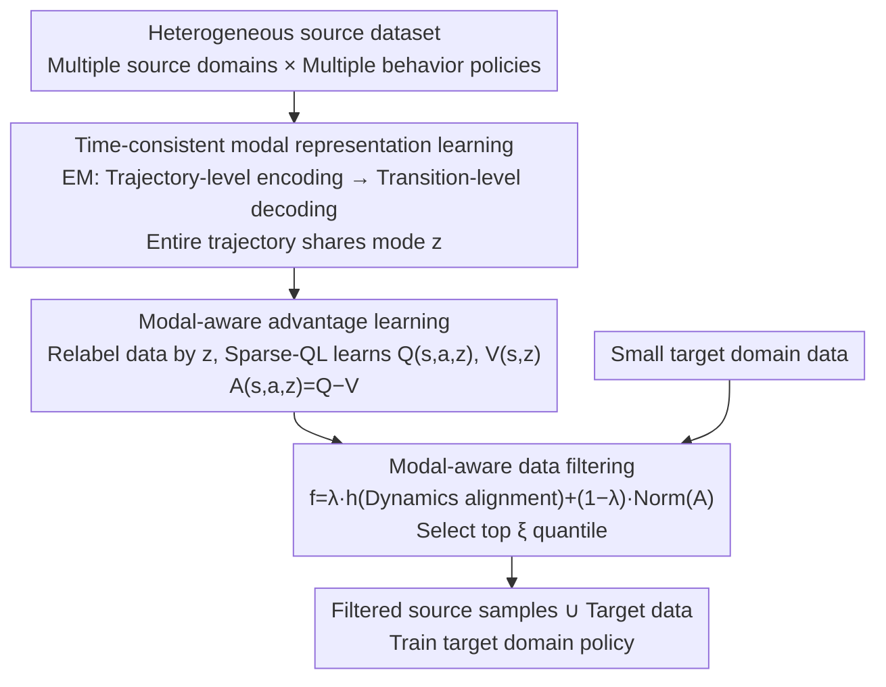

# Unified Value Alignment and Assignment in Cross-Domain Offline Reinforcement Learning

**Conference**: ICML 2026  
**arXiv**: [2605.24862](https://arxiv.org/abs/2605.24862)  
**Code**: https://github.com/zq2r/V2A.git  
**Area**: Reinforcement Learning / Cross-Domain Learning  
**Keywords**: Offline Reinforcement Learning, Cross-Domain Transfer, Value Alignment, Heterogeneous Datasets

## TL;DR
This paper reveals the "value misassignment" problem under heterogeneous cross-domain offline RL settings—where source data originates from multiple domains and policies, leading to inaccurate advantage evaluations that cause data filtering failure. The proposed V2A framework addresses value alignment and assignment issues through time-consistent modal representation learning and modal-aware advantage learning, outperforming DVDF by 21.4%.

## Background & Motivation

**Background**: Cross-domain offline RL addresses data scarcity by combining abundant source domain data with limited target domain data. Recent methods filter data through dynamics alignment (IGDF/OTDF) or value alignment (DVDF).

**Limitations of Prior Work**: These methods assume source data originates from a single environment and a single policy (unimodal). However, in practical scenarios (e.g., robotics), source data often comes from multiple source domains and behavior policies (multimodal mixtures), significantly degrading the performance of existing methods.

**Key Challenge**: With heterogeneous source data, DVDF uses a global advantage function $A_{\text{insrc}}^{\star}(s,a)$ to evaluate sample quality across sub-datasets. However, the same advantage value represents different relative qualities under different dynamics, leading to "value misassignment"—incorrectly rating low-quality samples as high-quality.

**Goal**: In the heterogeneous cross-domain offline RL setting, the objective is to align dynamics, align values, and ensure correct value assignment simultaneously.

**Key Insight**: The key insight is to distinguish different dynamics modes in source data through clustering and learn separate advantage functions for each mode to ensure accurate value evaluation.

**Core Idea**: Use an EM approach to learn time-consistent modal representations, followed by modal-aware advantage learning and data filtering—forming the end-to-end V2A framework.

## Method

### Overall Architecture
V2A consists of three stages—(1) Extracting dynamics modes from source data; (2) Relabeling data based on modes and learning accurate advantage functions; (3) Filtering source samples using modal-aware scoring.

### Key Designs

**1. Time-consistent modal representation learning: Extracting latent dynamics mode $z$ for each trajectory from heterogeneous source data.**

Source data mixes multiple domains and behavior policies. Correct value assignment requires identifying which dynamics mode each trajectory belongs to. Standard ELBO encodes $z$ for each transition independently, causing $z$ to fluctuate randomly within a trajectory, leading to inconsistent mode identification. V2A adopts trajectory-level encoding and transition-level decoding with EM alternating optimization. In the E-step, the encoder is optimized while fixing the decoder; in the M-step, the decoder is optimized while fixing the encoder. The loss is $\mathsf{TC\text{-}ELBO} = \mathbb{E}_{\tau,z}[\sum_t \log p_\theta(s_{t+1}|s_t,a_t,z) - D_{KL}(q_\psi(\cdot|\tau),p(\cdot))]$. This ensures an entire trajectory shares a single $z$ reflecting a unified dynamics environment, preventing trajectories from the same domain from being fragmented.

**2. Modal-aware advantage learning: Scoring each dynamics mode separately to rectify DVDF's "value misassignment".**

DVDF evaluates sample quality across all sub-datasets using a single global advantage function $A_{\text{insrc}}^{\star}(s,a)$. However, the relative quality represented by the same advantage value differs across dynamics, leading to the misclassification of low-quality samples as high-quality. V2A feeds the learned mode $z$ directly into Q and V functions, using Sparse-QL to learn $Q(s,a,z)$ and $V(s,z)$, defining the advantage as $A(s,a,z) = Q(s,a,z) - V(s,z)$. This allows the same $(s,a)$ pair to receive different advantage values under different modes, accurately reflecting relative quality within their respective dynamics environments and eliminating the global advantage's inability to distinguish modal differences.

**3. Modal-aware data filtering: Selecting source samples that are both dynamics-aligned and high-quality.**

Dynamics alignment alone is insufficient; quality must also be guaranteed. The filtering score combines both factors: $f(s,a,s',z) = \lambda \cdot h(s,a,s') + (1-\lambda) \cdot \text{Norm}(A(s,a,z))$, where $h$ represents dynamics alignment and $A$ denotes modal-aware advantage. The weight $\lambda$ is fixed at 0.6 in experiments, and samples in the top $\xi$ quantile are selected. If $\lambda$ is too small, dynamics alignment is ignored; if too large, quality variance is neglected. With modal awareness, filtering is no longer deceived by samples "overestimated under the wrong mode."

## Key Experimental Results

### Main Results

| Method | IGDF | DVDF | V2A | OTDF | DVDF | V2A |
|------|------|------|-----|------|------|-----|
| Total Score | 1286.7 | 1374.7 | **1562.5** | 1319.5 | 1395.9 | **1612.9** |
| Gain | — | +6.8% | +21.4% | — | +5.5% | +22.2% |

Tested on 4 tasks (HalfCheetah / Hopper / Walker2d / Ant) × 6 source-target combinations. V2A outperformed IGDF in 20/24 tasks and OTDF in 21/24 tasks.

### Ablation Study

| Analysis Dimension | Result | Description |
|---------|------|------|
| Modal Representation Quality | Fig 2(a) t-SNE | Trajectories from the same source domain cluster tightly; different shift types are separated. |
| Advantage Distribution | Fig 2(b) Density | V2A advantage distribution is sharper; DVDF's flat distribution indicates misestimated sample quality. |
| Hyperparameter $\lambda$ | Fig 3(a) | $\lambda=0.6$ is optimal; too small ignores dynamics alignment, too large ignores quality. |
| Data Selection Ratio $\xi$ | Fig 3(b) | $\xi \in [0.5, 0.75]$ is preferred; both extremes degrade performance. |

## Highlights & Insights
- **Precise Problem Definition**: Value misassignment is a genuine issue in multimodal heterogeneous data, formally characterized by Definition 4.6.
- **Concise Method Design**: The framework uses three modules with distinct roles—EM for representation learning, modal-conditional advantages, and joint data filtering.
- **Strong Experimental Evidence**: Motivational experiments intuitively demonstrate DVDF's failure; qualitative analysis (modal visualization, advantage distribution) validates the internal logic.

## Limitations & Future Work
- Computational Cost: Iterative EM learning for modal representation increases training overhead.
- Theoretical Assumptions: Suboptimality bounds depend on "mild assumptions" that might not hold in highly non-stationary environments.
- Dynamics-centric Heterogeneity: The paper focuses on dynamics shifts but does not explore other source-specific discrepancies like rewards or initial distributions.

## Related Work & Insights
- **vs. DVDF**: Both consider value alignment, but DVDF uses a global advantage function whereas V2A incorporates modal decomposition.
- **vs. IGDF/OTDF**: The former only consider dynamics alignment, while V2A additionally incorporates quality considerations.
- **Insight**: The modal decomposition approach can be generalized to other multi-source transfer tasks, such as multi-source domain adaptation.

## Rating
- Novelty: ⭐⭐⭐⭐⭐ The heterogeneous data setting is a significant gap, and the value misassignment problem is identified for the first time.
- Experimental Thoroughness: ⭐⭐⭐⭐⭐ Systematic task design combined with comprehensive ablation and visualization.
- Writing Quality: ⭐⭐⭐⭐ Clear logic with compelling motivational examples.
- Value: ⭐⭐⭐⭐⭐ Resolves practical challenges in offline RL; the framework is general and can combine with various base algorithms.

<!-- RELATED:START -->

## Related Papers

- [\[ICLR 2026\] Dual-Robust Cross-Domain Offline Reinforcement Learning Against Dynamics Shifts](../../ICLR2026/reinforcement_learning/dual-robust_cross-domain_offline_reinforcement_learning_against_dynamics_shifts.md)
- [\[ICML 2026\] 视觉工具使用强化学习究竟学到了什么？](what_does_vision_tool-use_reinforcement_learning_really_learn_disentangling_tool.md)
- [\[ICML 2026\] RL-SPH: Learning to Achieve Feasible Solutions for Integer Linear Programs](rl-sph_learning_to_achieve_feasible_solutions_for_integer_linear_programs.md)
- [\[ICML 2026\] Probing RLVR Training Instability through the Lens of Objective-Level Hacking](probing_rlvr_training_instability_through_the_lens_of_objective-level_hacking.md)
- [\[ICML 2026\] Global Policy-Space Response Oracles for Two-Player Zero-Sum Games](global_policy-space_response_oracles_for_two-player_zero-sum_games.md)

<!-- RELATED:END -->
