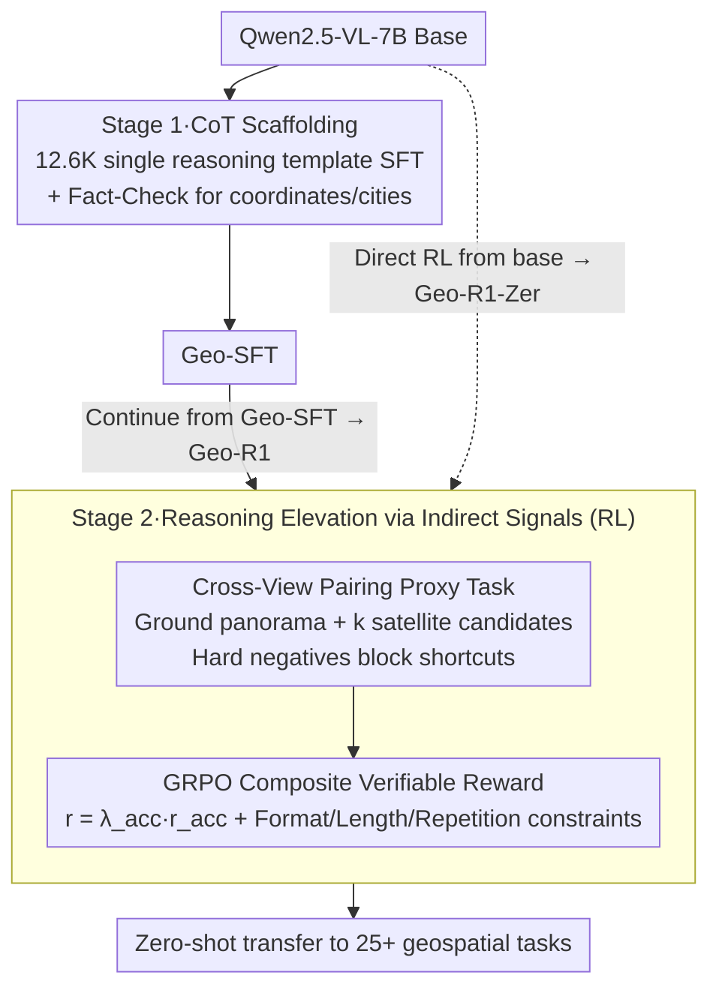

# Unlocking Zero-Shot Geospatial Reasoning via Indirect Rewards

**Conference**: ICML 2026  
**arXiv**: [2510.00072](https://arxiv.org/abs/2510.00072)  
**Code**: https://github.com/miniHuiHui/Geo-R1  
**Area**: Reinforcement Learning / Multimodal VLM / Geospatial Reasoning  
**Keywords**: Indirect Rewards, RLVR, Cross-View Pairing, Geospatial Reasoning, Zero-Shot Generalization

## TL;DR
The authors utilize "whether street-level and satellite imagery can be localized to the same coordinates" as a verifiable indirect reward. They apply GRPO for two-stage post-training (CoT scaffolding + RL self-exploration) on Qwen2.5-VL-7B, enabling the model to learn general reasoning capabilities that generalize zero-shot to 25+ geospatial tasks using only GPS metadata.

## Background & Motivation
**Background**: Images in the geospatial domain (satellite, UAV, street view) are virtually infinite, but samples with dense semantic labels are extremely scarce. Prevailing methods (MAE, Contrastive Learning, RS-VLM) excel at representation and retrieval but lack scene decomposition and reasoning capabilities. Recently, R1-style RL has succeeded in math and code, but the same bottleneck persists: there are no large-scale, strong direct reward signals available in the geospatial domain.

**Limitations of Prior Work**: (1) SFT is limited by task distribution, causing models to learn narrow domains and fail on OOD data; (2) Fully supervised detection, segmentation, and VQA annotation are expensive; (3) Existing R1-style works (e.g., GLOBE) still treat "geographical location" as the sole direct reward, lacking a unified principle for inducing reasoning.

**Key Challenge**: Metadata (coordinates, timestamps) is easily obtained but seemingly irrelevant to complex visual reasoning. However, if designed appropriately, its verifiability can serve as the foundation for rewards in proxy tasks.

**Goal**: (1) Demonstrate that "indirect verifiable rewards" are sufficient to induce complex and transferable geospatial reasoning; (2) Provide a theoretical explanation for when indirect rewards are effective; (3) Construct a reproducible RLVR framework and perform large-scale OOD validation across 25+ tasks.

**Key Insight**: Treat "Street View $\leftrightarrow$ Satellite Image" cross-view pairing as a proxy task—the challenge being that matching must rely on transferable geometric semantics such as object geometry, shadow direction, and building layout.

**Core Idea**: Cross-View Pairing provides binary verifiable rewards. Combined with hard negatives, it blocks shortcuts (using nuisance features), forcing the model to learn view-invariant geometric semantics $\Phi$, thereby acquiring general zero-shot geospatial reasoning capabilities.

## Method

### Overall Architecture
Geo-R1 uses Qwen2.5-VL-7B as the base and undergoes two stages of post-training: Stage 1 is Geospatial Thinking Scaffolding, using 12.6K high-quality CoT data derived from CV-Cities for SFT to inject a unified geospatial reasoning template (observe visual cues $\rightarrow$ cross-view evidence comparison $\rightarrow$ associate geospatial knowledge $\rightarrow$ provide conclusion). Stage 2 is Reasoning Elevation via Indirect Signals, switching the training objective to Cross-View Pairing: given a ground panorama $I_g$ and $k$ candidate satellite images $\mathcal S=\{I_s^1,\dots,I_s^k\}$ (containing 1 positive and $k-1$ neighborhood hard negatives), the model must choose the positive instance after CoT reasoning. The reward is optimized using the group-relative form of GRPO with a composite reward $r=\lambda_{\mathrm{acc}}r_{\mathrm{acc}}+\lambda_{\mathrm{fmt}}r_{\mathrm{fmt}}+\lambda_{\mathrm{len}}r_{\mathrm{len}}+\lambda_{\mathrm{rep}}r_{\mathrm{rep}}$. Both SFT and RL utilize full-parameter fine-tuning on 8×H100, accelerated by Llama-Factory + VLM-R1 + vLLM. Two paths yield two outputs: Geo-R1 (continued from Geo-SFT) and Geo-R1-Zero (direct RL from the base skipping scaffolding).

### Key Designs

**1. CoT Scaffolding: Injecting a single reasoning paradigm to avoid RL cold-start without introducing forgetting**

Starting RL directly from a base model often results in cold-start collapse. However, traditional SFT typically uses a vast array of tasks to ensure diversity, which can interfere with subsequent RL. Geo-R1 does the opposite—using only 12.6K synthesized reasoning traces from CV-Cities to inject a **single** template: "analyze visual cues $\rightarrow$ verify cross-view evidence $\rightarrow$ associate geospatial common sense $\rightarrow$ output answer." A Fact-Check Engine is introduced to verify key entities like coordinates and city names using metadata, ensuring the scaffolding does not learn false facts. The logic is: SFT is only responsible for the paradigm of "how to organize geospatial reasoning," while specific capabilities are explored during the RL phase. This achieves RL warm-up while minimizing catastrophic forgetting.

**2. Cross-View Pairing + Hard-Negative Bottleneck: Forcing view-invariant features via verifiable proxy tasks**

Whether indirect rewards can stimulate reasoning is the most questioned aspect of this work. This core design formalizes this doubt into a falsifiable theorem. The authors decompose image information into view-invariant geometric semantics $\Phi(I)$ and modality-specific nuisance factors $N(I)$. By sampling hard negatives from the same spatio-temporal neighborhood, they ensure $\mathcal I(Y;N(\mathcal S))=0$—meaning any strategy relying solely on nuisance features for shortcuts can only achieve maximum entropy $\mathcal H(Y|\pi_{shortcut})=\log K$ (Theorem 3.1), equivalent to guessing. Consequently, even with a binary reward $r_{acc}\in\{-1,+1\}$, the model must maximize $\mathcal I(C;Y|\mathcal S)\Leftrightarrow\mathcal I(C;\Phi(I_s^*))$ to gain points, forcing the reasoning chain $C$ to encode transferable geometric semantics $\Phi$ (object geometry, shadow direction, building layout). Hard negatives act as a bottleneck that completely blocks "nuisance shortcuts," where the difficulty gap $\Delta\mathcal H=\log K$ is the reasoning margin the RL must cross.

**3. GRPO + Composite Verifiable Reward: Producing structured, appropriately lengthed reasoning chains under pure outcome signals**

Stage 2 switches the training objective to Cross-View Pairing. It uses the verifiable $r_{acc}$ as the primary signal, overlaid with format regularization $r_{fmt}$, length regularization $r_{len}$, and repetition penalty $r_{rep}$. The composite reward $r=\lambda_{acc}r_{acc}+\lambda_{fmt}r_{fmt}+\lambda_{len}r_{len}+\lambda_{rep}r_{rep}$ uses GRPO for group-relative advantage normalization to stabilize long-horizon updates. Crucially, no process rewards are introduced in intermediate steps. Maintaining pure outcome-based rewards ("free process, verifiable result") is cost-effective (no process annotation needed) and leaves discovery to the model's self-exploration. Regularization prevents abnormally long, repetitive, or unformatted outputs used to exploit rewards. Driving complex reasoning with only simple binary $\{-1,+1\}$ rewards demonstrates that process rewards are not mandatory.

### Loss & Training
Stage 1 uses standard SFT cross-entropy followed by Fact-Check filtering. Stage 2 uses GRPO. Geo-R1-Zero is obtained by direct RL from the base; Geo-R1 is obtained by continuing RL from Geo-SFT. Full-parameter fine-tuning on 8×H100 is used; inference is accelerated by vLLM. Hard negatives are sampled from the same spatio-temporal neighborhood to ensure nuisance factors are inseparable.

## Key Experimental Results

### Main Results

| Benchmark / Task | Metric | Qwen2.5-VL-7B (base) | Geo-SFT | Geo-R1-Zero | Geo-R1 |
|-------------|------|---------------------|--------|-------------|--------|
| In-distribution Cross-View Pairing | Accuracy | 19.0% | 23.1% | 78.1% | 82.4% |
| Ibid. | Completion length | 204.6 | 1127.6 | 587.4 | 378.8 |
| GeoChain (13 OOD tasks) | Avg accuracy | baseline | — | — | Significantly > baseline (Fig. 1) |
| IMAGEO-GSS Global 6152 imgs | City / Country Acc | — | — | — | 0.3272 / 0.8146 (vs GeoCLIP 0.1086 / 0.6361) |
| IMAGEO-GSS | Mean / Median Dist (km) | — | — | — | 568.32 / 69.40 (vs GeoCLIP 943.48 / 266.90) |

### Ablation Study

| Configuration | Key Finding | Interpretation |
|------|----------|------|
| SFT only (Geo-SFT) | Only 4.1% higher than base, nearly random | Positive-only SFT cannot capture indirect signals |
| RL from base only (Geo-R1-Zero) | 78.1%, +59% vs base | Indirect rewards alone can drive elevation |
| SFT + RL (Geo-R1) | 82.4%, shorter and more stable | Scaffolding provides compliant reasoning templates |
| MP16-Reason (OOD) | Nearly parity with fully supervised GLOBE-7B (1km Street 17.98 vs 17.99; 2500km Continent 93.56 vs 92.52) | Indirect rewards are as effective as direct rewards |
| RSTeller satellite geolocation | Parity with o4-mini, exceeds base | Cross-view proxy tasks generalize to satellite-only views |
| GeoBench-VLM satellite understanding | Exceeds expert models like GeoChat / EarthDial | Reasoning capability transfers to fine-grained RS tasks |

### Key Findings
- Indirect reward training leads to the spontaneous emergence of high-level semantic concepts: Word clouds of MP16-Reason reasoning traces show high frequencies of "architecture," "vegetation," "climate," and "analyzing," indicating the model performs physical world reasoning rather than simple pattern matching.
- A single proxy task unlocks broad capabilities: Training exclusively on Cross-View Pairing leads to zero-shot improvements across 25+ diverse downstream tasks (VQA, geolocation, disaster assessment, land use, etc.).
- Geo-R1 outperforms the base on satellite-view tasks, confirming that cross-view tasks implicitly build "ground $\rightarrow$ top-down" back-projection logic, making the model a more general aerial interpreter.

## Highlights & Insights
- The concept of "verifiable indirect rewards" can be generalized to any domain with "massive raw data + sparse metadata" (e.g., medical imaging + DICOM metadata, chemical structures + reaction temperatures), representing a new RLVR paradigm.
- Using a hard-negative bottleneck to close shortcuts and describing the reasoning margin with entropy difference $\Delta\mathcal{H}=\log K$ is a rare example of tight theory-engineering coupling.
- Counter-intuitively emphasizes that "SFT should be narrow, not wide": Scaffolding SFT with a single reasoning template provides the best RL warm-up with minimal forgetting.
- Complex reasoning driven by minimal binary $\{-1, +1\}$ rewards indicates process rewards are not always necessary, offering significant engineering value for cost-sensitive domains.

## Limitations & Future Work
- Proxy tasks depend on "paired ground + satellite imagery"; it may be difficult to find equivalent cross-view structures in other rare domains.
- Only ground/aerial views were demonstrated; the approach has not been extended to more complex modalities like SAR, LiDAR, or multi-temporal imagery.
- Verification was limited to a 7B model scale; whether outcome-only RL remains stable for 30B+ models is unverified.
- A gap still exists between Geo-R1 and closed-source o3 on IMAGEO-GSS, attributed by the authors to differences in parameter scale and RL investment.

## Related Work & Insights
- **vs GLOBE (Li et al. 2025a)**: GLOBE uses direct geolocation rewards within the MP16-Reason training set. Geo-R1 never sees the MP16-Reason training set, yet achieves nearly parity performance using only indirect cross-view pairing rewards, serving as a strong alternative to the direct reward approach.
- **vs GeoCLIP / RFM-YFCC**: Traditional retrieval and representation learning methods excel at nearest-neighbor localization but lack reasoning and cross-task transfer capabilities; Geo-R1 significantly outperforms them on IMAGEO-GSS.
- **vs GeoReasoner / GeoChat / EarthDial**: These methods rely on large-scale task-specific supervision. Geo-R1 exceeds them zero-shot via a single proxy task, showing that "task breadth can be induced by proxy tasks rather than exhaustive supervision."
- **vs DeepSeek-R1-style Math/Code RLVR**: This paper proves the RLVR paradigm can extend to verifiable but weakly correlated proxy rewards, providing the first clear blueprint for porting R1 to rare domains.

## Rating
- Novelty: ⭐⭐⭐⭐⭐ "Indirect verifiable rewards" + hard-negative bottleneck is a brand-new paradigm for geospatial RLVR with cross-domain methodological significance.
- Experimental Thoroughness: ⭐⭐⭐⭐⭐ Covers 25+ downstream OOD tasks, multiple benchmarks, and horizontal comparisons with GLOBE, GeoCLIP, and o3.
- Writing Quality: ⭐⭐⭐⭐ Clean connection between theory and engineering; formulas and Remarks are clear, though some details require the appendix.
- Value: ⭐⭐⭐⭐⭐ Provides a replicable RLVR blueprint for rare domains with much data but few labels, directly applicable to medical, climate, and robotics fields.

<!-- RELATED:START -->

## Related Papers

- [\[ICML 2025\] Zero-Shot Generalization of Vision-Based RL Without Data Augmentation](../../ICML2025/reinforcement_learning/zero-shot_generalization_of_vision-based_rl_without_data_augmentation.md)
- [\[ICML 2026\] MindZero: Learning Online Mental Reasoning with Zero Annotations](mindzero_learning_online_mental_reasoning_with_zero_annotations.md)
- [\[NeurIPS 2025\] Reasoning Gym: Reasoning Environments for Reinforcement Learning with Verifiable Rewards](../../NeurIPS2025/reinforcement_learning/reasoning_gym_reasoning_environments_for_reinforcement_learning_with_verifiable_.md)
- [\[CVPR 2026\] Incentivizing Generative Zero-Shot Learning via Outcome-Reward Reinforcement Learning with Visual Cues](../../CVPR2026/reinforcement_learning/incentivizing_generative_zero-shot_learning_via_outcome-reward_reinforcement_lea.md)
- [\[ICML 2025\] Pessimism Principle Can Be Effective: Towards a Framework for Zero-Shot Transfer RL](../../ICML2025/reinforcement_learning/pessimism_principle_can_be_effective_towards_a_framework_for_zero-shot_transfer_.md)

<!-- RELATED:END -->
