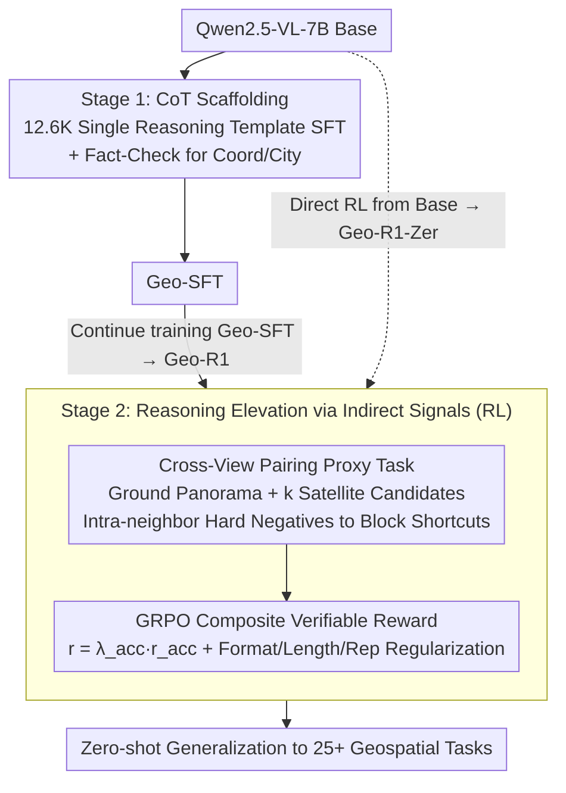

# Unlocking Zero-Shot Geospatial Reasoning via Indirect Rewards

**Conference**: ICML 2026  
**arXiv**: [2510.00072](https://arxiv.org/abs/2510.00072)  
**Code**: https://github.com/miniHuiHui/Geo-R1  
**Area**: Reinforcement Learning / Multimodal VLM / Geospatial Reasoning  
**Keywords**: Indirect Rewards, RLVR, Cross-View Pairing, Geospatial Reasoning, Zero-Shot Generalization

## TL;DR
The authors utilize "whether ground-level street views and satellite images can be localized to the same coordinates" as a verifiable indirect reward. Using GRPO, they perform two-stage post-training (CoT scaffolding + RL self-exploring) on Qwen2.5-VL-7B. This allows the model to learn general reasoning capabilities from GPS metadata alone, which generalizes zero-shot to 25+ geospatial tasks.

## Background & Motivation
**Background**: Images available in the geospatial domain (satellite / UAV / street view) are nearly infinite, but samples with dense semantic labels are extremely scarce. Mainstream approaches (MAE / Contrastive Learning / RS-VLM) excel at representation and retrieval but lack the ability to decompose and reason about scenes. While R1-style RL has succeeded in mathematics and code, the same bottleneck persists: there are no large-scale, strong direct reward signals available in the geospatial domain.

**Limitations of Prior Work**: (1) SFT is constrained by task distribution, causing the model to learn narrow domains and fail on OOD data; (2) Fully supervised detection / segmentation / VQA annotations are expensive; (3) Existing R1-style works (e.g., GLOBE) still treat "geospatial location" as the sole direct reward, lacking a unified principle for "why reasoning can be induced from it."

**Key Challenge**: Metadata (coordinates, timestamps) are easily obtained and seemingly irrelevant to "complex visual reasoning." However, if designed properly, their verifiability can serve as the reward foundation for "proxy tasks."

**Goal**: (1) Demonstrate that "indirect verifiable rewards" are sufficient to induce complex, transferable geospatial reasoning; (2) Provide a theoretical explanation for when indirect rewards are effective; (3) Construct a reproducible RLVR framework and perform large-scale OOD validation on 25+ tasks.

**Key Insight**: Utilizing "street view ↔ satellite image" cross-view pairing as a proxy task—the challenge lies in requiring the use of transferable geometric semantics like object geometry, shadow direction, and building layouts to complete the match.

**Core Idea**: Cross-View Pairing provides binary verifiable rewards. In conjunction with hard negatives, it blocks shortcuts that rely on nuisance features, forcing the model to learn view-invariant geometric semantics $\Phi$, thereby acquiring general zero-shot geospatial reasoning capabilities.

## Method

### Overall Architecture
Geo-R1 uses Qwen2.5-VL-7B as the base and undergoes two-stage post-training: Stage 1 is Geospatial Thinking Scaffolding, using 12.6K high-quality CoT data derived from CV-Cities for SFT to inject a unified geospatial reasoning template (observing visual cues → cross-view evidence comparison → associating geospatial knowledge like climate zones → providing conclusions). Stage 2 is Reasoning Elevation via Indirect Signals, switching the training objective to Cross-View Pairing: given a ground panorama $I_g$ and $k$ candidate satellite images $\mathcal S=\{I_s^1,\dots,I_s^k\}$ (containing 1 positive + $k-1$ intra-neighbor hard negatives), the model selects the positive example after CoT reasoning. The reward is optimized using GRPO's group-relative form for a composite reward $r=\lambda_{\mathrm{acc}}r_{\mathrm{acc}}+\lambda_{\mathrm{fmt}}r_{\mathrm{fmt}}+\lambda_{\mathrm{len}}r_{\mathrm{len}}+\lambda_{\mathrm{rep}}r_{\mathrm{rep}}$. Both SFT and RL involve full-parameter fine-tuning on 8×H100, accelerated by LLama-Factory + VLM-R1 + vLLM. The two outputs correspond to two entries: Geo-R1 is obtained by continuing RL from Geo-SFT, while Geo-R1-Zero is obtained by direct RL from the base, skipping the scaffolding.

### Key Designs

**1. CoT Scaffolding: Injecting a single reasoning paradigm to avoid RL cold-start without introducing forgetting**

Direct RL from a base model is prone to cold-start collapse, but traditional SFT typically uses a large volume of tasks to ensure diversity, which can undermine subsequent RL. Geo-R1 does the opposite—using only 12.6K synthesized reasoning traces from CV-Cities to inject a **single** template: "analyze visual cues → verify cross-view evidence → associate geospatial common sense → output answer." A Fact-Check Engine is introduced to verify key entities like coordinates and city names using metadata, ensuring the scaffolding does not learn incorrect facts. The logic is that the SFT stage only handles the paradigm of "how to organize a geospatial reasoning segment," leaving specific capabilities for the RL stage to explore. This achieves RL warm-up while minimizing catastrophic forgetting.

**2. Cross-View Pairing + Hard-Negative Bottleneck: Forcing view-invariant features via verifiable proxy tasks**

Whether indirect rewards can stimulate reasoning is the most questioned point of this paper. This core design formalizes this doubt into a falsifiable theorem. The authors decompose image information into view-invariant geometric semantics $\Phi(I)$ and modality-specific nuisance factors $N(I)$. By sampling hard negatives from the same spatio-temporal neighborhood, they ensure $\mathcal I(Y;N(\mathcal S))=0$—meaning any shortcut strategy relying only on nuisance features will only achieve maximum entropy $\mathcal H(Y|\pi_{shortcut})=\log K$ (Theorem 3.1), which is equivalent to guessing. Consequently, even with a binary reward $r_{acc}\in\{-1,+1\}$, the model must maximize $\mathcal I(C;Y|\mathcal S)\Leftrightarrow\mathcal I(C;\Phi(I_s^*))$ to gain points, forcing the reasoning chain $C$ to encode transferable geometric semantics $\Phi$ (object geometry, shadow direction, building layouts). Hard negatives here are not just difficult examples; they are a bottleneck that completely blocks the "nuisance shortcut." The entropy gap $\Delta\mathcal H=\log K$ represents the reasoning margin that RL must overcome.

**3. GRPO + Composite Verifiable Rewards: Producing compliant, appropriately lengthed reasoning chains under pure outcome signals**

Stage 2 switches the training objective to Cross-View Pairing, using the verifiable $r_{acc}$ as the primary signal, overlaid with format regularization $r_{fmt}$, length regularization $r_{len}$, and repetition penalty $r_{rep}$. The composite reward is $r=\lambda_{acc}r_{acc}+\lambda_{fmt}r_{fmt}+\lambda_{len}r_{len}+\lambda_{rep}r_{rep}$. GRPO is used for group-relative advantage normalization to stabilize updates for long horizons. Crucially, no process rewards are introduced at intermediate steps, maintaining a pure outcome-based nature of "free process, verifiable result." This is cost-effective (no process annotation needed) and leaves all degrees of freedom to the model for exploration; regularization terms merely prevent the generation of abnormally long, repetitive, or unformatted outputs to game the reward. The fact that the simplest binary $\{-1,+1\}$ reward can drive complex reasoning proves that process rewards are not mandatory.

### Loss & Training
Stage 1 uses standard SFT cross-entropy + filtering after Fact-Check. Stage 2 uses GRPO: direct RL from the base yields Geo-R1-Zero, while RL continued from Geo-SFT yields Geo-R1. Full-parameter fine-tuning is performed on 8×H100; inference is accelerated by vLLM. Hard negatives are sampled from the same spatio-temporal neighborhood to ensure nuisances are inseparable.

## Key Experimental Results

### Main Results

| Benchmark / Task | Metric | Qwen2.5-VL-7B (base) | Geo-SFT | Geo-R1-Zero | Geo-R1 |
|-------------|------|---------------------|--------|-------------|--------|
| In-distribution Cross-View Pairing | Accuracy | 19.0% | 23.1% | 78.1% | 82.4% |
| Above | Completion length | 204.6 | 1127.6 | 587.4 | 378.8 |
| GeoChain (13 Tasks OOD) | Avg accuracy | baseline | — | — | Significantly higher than baseline (Fig. 1) |
| IMAGEO-GSS (6152 global images) | City / Country Acc | — | — | — | 0.3272 / 0.8146 (vs GeoCLIP 0.1086 / 0.6361) |
| IMAGEO-GSS | Mean / Median Dist (km) | — | — | — | 568.32 / 69.40 (vs GeoCLIP 943.48 / 266.90) |

### Ablation Study

| Configuration | Key Finding | Interpretation |
|------|----------|------|
| SFT Only (Geo-SFT) | Only 4.1% higher than base, nearly random | Positive-example SFT cannot capture indirect signals |
| RL from Base Only (Geo-R1-Zero) | 78.1%, +59% over base | Indirect rewards can drive reasoning on their own |
| SFT + RL (Geo-R1) | 82.4%, shorter and more stable | Scaffolding provides a compliant reasoning template |
| MP16-Reason (OOD) | Nearly parity with fully supervised GLOBE-7B (1km Street 17.98 vs 17.99; 2500km Continent 93.56 vs 92.52) | Indirect rewards are as effective as direct rewards |
| RSTeller Satellite Geolocation | Same tier as o4-mini, exceeding base | Cross-view proxy task generalizes to pure satellite views |
| GeoBench-VLM Satellite Understanding | Exceeds expert models like GeoChat / EarthDial | Reasoning capability transfers to fine-grained RS tasks |

### Key Findings
- Indirect reward training leads to the spontaneous emergence of high-level semantic concepts: Wordclouds of MP16-Reasoning traces show frequent occurrences of "architecture," "vegetation," "climate," and "analyzing," indicating the model is performing physical world reasoning rather than pattern matching.
- A single proxy task unlocks broad-spectrum capabilities: Training only on Cross-View Pairing yields significant zero-shot improvements across 25+ completely different downstream tasks (VQA, geolocation, disaster assessment, land use, etc.).
- Geo-R1 also outperforms the base on satellite-view tasks, confirming that the cross-view task implicitly constructs a "ground → top-down" back-projection logic, making the model a more general aerial interpreter.

## Highlights & Insights
- The concept of "verifiable indirect rewards" can be generalized to any rare domain with "massive raw data + sparse metadata" (e.g., medical imaging + DICOM metadata, chemical structures + reaction temperatures), representing a new paradigm for RLVR.
- Using a hard-negative bottleneck to strictly block shortcuts combined with the use of entropy difference $\Delta\mathcal H=\log K$ to describe the reasoning margin is a rare example of tight coupling between theory and engineering.
- Counter-intuitively, the study emphasizes that "SFT should be narrow rather than wide": scaffolding SFT with only one reasoning template achieves the best RL warm-up with minimal forgetting.
- The use of a minimal binary {-1,+1} reward to drive complex reasoning suggests that process rewards are not mandatory, which has significant engineering value for cost-sensitive domains.

## Limitations & Future Work
- The proxy task relies on "paired ground + satellite images," and finding equivalent cross-view structures in other rare domains may not be easy;
- The work only demonstrates ground/aerial views and has not generalized to more complex modalities like SAR, LiDAR, or multi-temporal data;
- The experiments used a 7B model; whether outcome-only RL remains stable when scaled to 30B+ remains unverified;
- There is still a gap compared to closed-source o3 on IMAGEO-GSS, which the authors attribute to differences in parameter scale and RL investment.

## Related Work & Insights
- **vs GLOBE (Li et al. 2025a)**: GLOBE uses direct geolocation rewards within the MP16-Reason training set. Geo-R1 never sees the MP16-Reason training set yet achieves nearly identical performance via indirect cross-view pairing rewards, serving as a strong alternative to the direct reward route.
- **vs GeoCLIP / RFM-YFCC**: Traditional retrieval and representation learning methods are good at nearest-neighbor localization but lack reasoning and cross-task transfer capabilities; Geo-R1 outperforms them comprehensively on IMAGEO-GSS.
- **vs GeoReasoner / GeoChat / EarthDial**: These methods rely on large-scale task-specific supervision; Geo-R1 surpasses them zero-shot via a single proxy task, suggesting that "task breadth can be induced by proxy tasks rather than exhaustive supervision."
- **vs DeepSeek-R1 style Math / Code RLVR**: This paper proves that the RLVR paradigm can be extended to verifiable but weakly correlated proxy rewards, providing the first clear blueprint for "how to migrate R1 to rare domains."

## Rating
- Novelty: ⭐⭐⭐⭐⭐ "Verifiable indirect rewards" + hard-negative bottleneck is a brand-new paradigm for geospatial RLVR with cross-domain methodological significance.
- Experimental Thoroughness: ⭐⭐⭐⭐⭐ 25+ downstream OOD tasks + multiple benchmarks + horizontal comparisons with GLOBE / GeoCLIP / o3, covering an extreme range.
- Writing Quality: ⭐⭐⭐⭐ Clean connection between theory and engineering; formulas and Remarks are clear; some details require checking the appendix.
- Value: ⭐⭐⭐⭐⭐ Provides a replicable RLVR blueprint for rare domains with "high data but low labels," with direct reference value for medical, climate, robotics, etc.

<!-- RELATED:START -->

## Related Papers

- [\[ICML 2025\] Zero-Shot Generalization of Vision-Based RL Without Data Augmentation](../../ICML2025/reinforcement_learning/zero-shot_generalization_of_vision-based_rl_without_data_augmentation.md)
- [\[ICLR 2026\] Balancing the Experts: Unlocking LoRA-MoE for GRPO via Mechanism-Aware Rewards](../../ICLR2026/reinforcement_learning/balancing_the_experts_unlocking_lora-moe_for_grpo_via_mechanism-aware_rewards.md)
- [\[ICML 2026\] MindZero: Learning Online Mental Reasoning with Zero Annotations](mindzero_learning_online_mental_reasoning_with_zero_annotations.md)
- [\[CVPR 2026\] Incentivizing Generative Zero-Shot Learning via Outcome-Reward Reinforcement Learning with Visual Cues](../../CVPR2026/reinforcement_learning/incentivizing_generative_zero-shot_learning_via_outcome-reward_reinforcement_lea.md)
- [\[NeurIPS 2025\] Reasoning Gym: Reasoning Environments for Reinforcement Learning with Verifiable Rewards](../../NeurIPS2025/reinforcement_learning/reasoning_gym_reasoning_environments_for_reinforcement_learning_with_verifiable_.md)

<!-- RELATED:END -->
