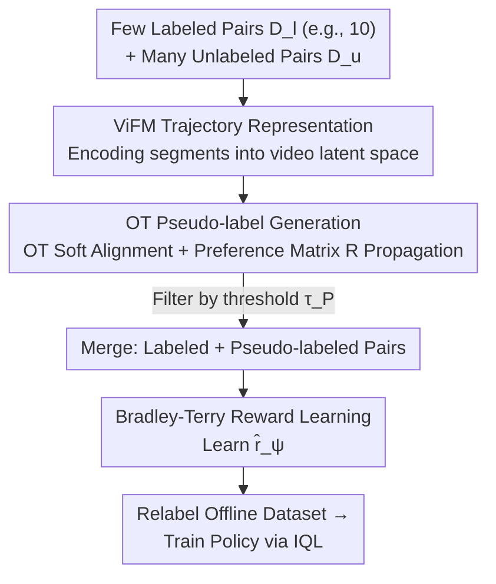

# Video-Based Optimal Transport for Feedback-Efficient Offline Preference-Based Reinforcement Learning

**Conference**: ICML 2026  
**arXiv**: [2606.16856](https://arxiv.org/abs/2606.16856)  
**Code**: https://github.com/tunglm2203/votp (Available)  
**Area**: Reinforcement Learning / Offline Preference-Based Reinforcement Learning  
**Keywords**: Preference-based RL, Optimal Transport, Video Foundation Models, Semi-supervised Pseudo-labeling, Feedback Efficiency  

## TL;DR
To address the high annotation cost in Preference-based RL (PbRL), which typically requires thousands of human comparisons, VOTP encodes trajectory segments into a semantic space using Video Foundation Models (ViFM). It then applies Optimal Transport (OT) to align a "small labeled set" with a "large unlabeled set" to propagate preferences and automatically generate pseudo-labels. With only 10 annotations, it learns effective rewards that outperform existing offline PbRL methods on D4RL locomotion and MetaWorld manipulation tasks, nearly matching Oracle performance.

## Background & Motivation
**Background**: Many decision-making tasks can be solved via RL if a high-quality reward function exists. However, reward design is notoriously difficult—relying on expensive sensor setups or manually handcrafted rewards that are prone to reward hacking. Preference-based RL (PbRL) offers an alternative: instead of writing reward functions, humans provide feedback on pairs of video segments, which is used to learn a reward model (Bradley-Terry model + cross-entropy) for subsequent policy optimization.

**Limitations of Prior Work**: Generating robust rewards requires PbRL to cover the state-action space effectively, which often necessitates **hundreds to thousands** of human comparisons, creating an unsustainable annotation burden. Existing efforts (semi-supervised, meta-learning, active learning) have made progress, but a fundamental dimension has been neglected: **human preferences are inherently shaped by visual perception of agent behavior**, yet this perceptual distinction is rarely exploited to improve efficiency.

**Key Challenge**: Reward quality $\propto$ preference coverage, and coverage $\propto$ annotation volume. Reducing annotations compromises coverage, leading to performance collapse. Semi-supervised methods (like SURF) attempt to use the "reward model under training" to generate pseudo-labels for unlabeled pairs. However, in low-data regimes, the reward model is inaccurate, and noisy pseudo-labels cause confirmation bias, degrading performance.

**Goal**: Achieve accurate pseudo-labeling and high-quality reward learning under extremely low annotation budgets (e.g., only 10 preferences) by leveraging unlabeled data (which is cost-free and easily sampled from offline datasets).

**Key Insight**: Video Foundation Models (ViFM) pretrained on massive human activity datasets offer highly expressive, robust, and generalizable representation spaces. These spaces can be used to align new behaviors with known preferred behaviors based on behavioral similarity to infer preferences. Optimal Transport (OT) is a natural tool for this alignment task.

**Core Idea**: Use Optimal Transport to find soft alignments between "unlabeled segment pairs $\leftrightarrow$ labeled segment pairs" in the ViFM representation space. Propagate labeled preferences as pseudo-labels based on alignment strength, shifting semi-supervised labeling from "unreliable reward models" to "distribution alignment."

## Method

### Overall Architecture
VOTP is a semi-supervised reward learning framework. It transforms "few labels + massive unlabeled data" into a trainable preference dataset in two steps. First, it treats each trajectory segment as a short video $\sigma=\{o_1,\dots,o_H\}$ and uses a pretrained ViFM encoder $f_\phi$ to embed it into a latent space $z=f_\phi(o_{1:H})$, capturing both spatial details and temporal dynamics. Second, it solves an OT problem in this latent space to find a soft alignment $\mu^*$ between the labeled set $L$ and unlabeled set $U$. Combined with the preference matrix $R$ of the labeled segments, it calculates preference scores for unlabeled pairs and converts them into pseudo-labels via thresholding.

After obtaining pseudo-labels, the combined set of "labeled + high-confidence pseudo-labeled" pairs is used for Bradley-Terry reward learning. The learned reward $\hat r_\psi$ then relabels all state-action pairs in the offline dataset, followed by standard offline RL (e.g., IQL).

### Key Designs

**1. ViFM Trajectory Representation: Encoding Behavior via Video Models**

This design exploits the fact that "preferences are shaped by visual perception." VOTP models each segment as a short video rather than a set of independent frames, using a Video Foundation Model (S3D) pretrained on large-scale human activities (e.g., HowTo100M). Determining "which behavior is better" requires **temporal dynamics and subtle motion cues**. Unlike single-frame image models (R3M, CLIP), ViFM capture the progression of actions. Its pretraining covers diverse actors, viewpoints, and backgrounds, yielding actor-agnostic, semantically rich, and robust embeddings that generalize to unseen robot environments.

**2. OT Pseudo-label Generation: Propagating Preferences via Alignment Strength**

This is the core of VOTP. Preference relationships in the labeled set $L=\{\sigma_i\}_{i=1}^N$ ($N=2N_l$) are stored in an anti-symmetric matrix $R\in\{-1,0,1\}^{N\times N}$. The OT plan $\mu^*$ is solved between $L$ and the unlabeled set $U=\{\bar\sigma_{i'}\}$ in the ViFM space:

$$\mu^* = \arg\min_{\mu\in M} \sum_{i=1}^N\sum_{i'=1}^M c(\sigma_i, \bar\sigma_{i'})\,\mu_{ii'}$$

where the cost $c(\sigma_i,\bar\sigma_{i'}) = d(f_\phi(\sigma_i), f_\phi(\bar\sigma_{i'}))$ is the visual distance. Each $\mu_{ii'}$ represents the probability that unlabeled segment $\bar\sigma_{i'}$ matches labeled segment $\sigma_i$. These probabilities are combined with $R$ to compute a preference score for an unlabeled pair $(\bar\sigma_{i'},\bar\sigma_{j'})$:

$$S(\bar\sigma_{i'},\bar\sigma_{j'}) = \sum_{i=1}^N\sum_{j=1}^N R_{ij}(\mu_{ii'}\mu_{jj'} - \mu_{ij'}\mu_{ji'})$$

Intuitively, $\mu_{ii'}\mu_{jj'}$ measures the alignment between $(\sigma_i,\sigma_j)$ and $(\bar\sigma_{i'},\bar\sigma_{j'})$. The final score aggregates alignment comparisons across all labeled pairs, making it more robust than simple similarity baselines (SIM) by weighting **all** labeled information. Scores are normalized to $S_{\text{norm}}\in[-1,1]$, and labels are assigned if $|S_{\text{norm}}|\geq\tau_P$.

**3. Sinkhorn Solver + Threshold Filtering: Balancing Efficiency and Noise**

VOTP uses the entropy-regularized Sinkhorn algorithm for efficient and numerically stable OT computation. Crucially, it filters pseudo-labels using a threshold $\tau_P$ to explicitly trade off "quality" vs "quantity." This helps VOTP resist noise and avoid the confirmation bias found in reward-model-based pseudo-labeling. The entire pipeline completes within 2 hours, whereas alternatives like FTB (which uses diffusion models) can take days.

## Key Experimental Results

### Main Results
On D4RL locomotion and MetaWorld manipulation tasks with only 10 initial labels, VOTP outperforms offline PbRL baselines and nearly matches Oracle performance:

| Task | IQL+GT | Oracle | P-IQL | SURF | LiRE | FTB | **VOTP** |
|------|--------|--------|-------|------|------|-----|----------|
| hop-m-r | 87.5 | 91.3 | 36.5 | 9.3 | 52.1 | 90.5 | **91.1** |
| walker2d-m-e | 109.9 | 109.6 | 103.4 | 103.2 | 109.7 | 76.5 | **108.1** |
| **loco avg.** | 93.6 | 92.4 | 65.3 | 59.5 | 83.2 | 85.4 | **92.8** |
| door-open | 79.2 | 90.4 | 36.8 | 74.4 | 84.0 | 43.2 | **84.0** |
| plate-slide | 56.0 | 62.4 | 15.2 | 23.2 | 38.0 | 41.6 | **57.6** |
| **mw avg.** | 71.0 | 80.1 | 31.0 | 51.0 | 64.0 | 51.6 | **67.6** |

VOTP effectively matches the Oracle (92.4) in locomotion and leads manipulation domains. 

### Ablation Study

| Configuration | Key Metric | Description |
|------|---------|------|
| Full VOTP (S3D + OT) | Best | Complete method |
| Image Models (R3M/CLIP) | Significant Drop | Lacks temporal dynamics, verifying ViFM necessity |
| SIM-individual | Suboptimal | Loses multi-pair aggregation information |
| SIM-mean | Worst | Averages out fine-grained distinctions |
| SIM-weighted | Unstable | Significantly lower than OT |

### Key Findings
- **OT vs. Similarity**: All SIM baselines underperform compared to VOTP. Aggregating all labeled preferences based on relative alignment strength is critical.
- **Video vs. Image Models**: Temporal dynamics are indispensable for judging behavior. S3D (31M parameters) is sufficient; larger models are not strictly necessary.
- **Feedback Efficiency**: VOTP achieves target performance with far fewer labels than P-IQL (which requires 50–100 for D4RL and ~1k for MetaWorld).
- **Threshold $\tau_P$**: Performance follows a bell curve relative to $\tau_P$, requiring domain-specific tuning to balance pseudo-label precision and quantity.

## Highlights & Insights
- **Shifting Pseudo-labeling Strategy**: Moving from reward models to OT alignment avoids the vicious cycle of "low data $\rightarrow$ poor model $\rightarrow$ noisy labels $\rightarrow$ confirmation bias."
- **Elegant Score Formulation**: The score formula involving the anti-symmetric matrix $R$ naturally handles swap-invariance and can extend to any semi-supervised scenario involving soft alignment of paired tags.
- **Plug-and-Play Efficiency**: Leveraging off-the-shelf ViFMs without extra pretraining makes the method lightweight and fast (2 hours vs. days for diffusion-based methods).

## Limitations & Future Work
- **Dependence on Rendering**: The size of the unlabeled set is constrained by the cost of rendering visual segments from offline data.
- **OT Computational Scaling**: While Sinkhorn is fast, the $L \times U$ coupling matrix can become a bottleneck for extremely large unlabeled sets.
- **ViFM Representation Limits**: If the encoder fails to generalize to specific robotic behaviors, OT alignment accuracy will suffer.
- **Synthetic Teachers**: Most experiments use scripted teachers; further validation with noisy, real-world human preferences is needed.

## Related Work & Insights
- **vs. SURF**: Both are semi-supervised, but SURF uses the active reward model for labeling, leading to bias. VOTP uses OT alignment in ViFM space, independent of the reward model.
- **vs. FTB**: FTB generates "better trajectories" via diffusion, which is computationally expensive (~2 days). VOTP is faster and more performant.
- **vs. VLM-based Reward**: While some methods use Vision-Language Models to directly compute rewards, VOTP focuses on temporal behavior representations and preference inference.

## Rating
- Novelty: ⭐⭐⭐⭐⭐ Uses OT in ViFM space for preference propagation, effectively solving the semi-supervised bottleneck in PbRL.
- Experimental Thoroughness: ⭐⭐⭐⭐⭐ Comprehensive coverage of D4RL, MetaWorld, and real robots; thorough ablations for encoders, OT, and thresholds.
- Writing Quality: ⭐⭐⭐⭐ Clear derivations; Figure 1b provides an excellent illustrative example.
- Value: ⭐⭐⭐⭐⭐ Significant reduction in PbRL annotation costs with fast training and practical applicability.

<!-- RELATED:START -->

## Related Papers

- [\[ICML 2026\] Counterfactual Transport Flows for Offline Conservative Trajectory Refinement](counterfactual_transport_flows_for_offline_conservative_trajectory_refinement.md)
- [\[ICML 2026\] From Reward-Free Representations to Preferences: Rethinking Offline Preference-Based Reinforcement Learning](from_reward-free_representations_to_preferences_rethinking_offline_preference-ba.md)
- [\[CVPR 2026\] EVA: Efficient Reinforcement Learning for End-to-End Video Agent](../../CVPR2026/reinforcement_learning/eva_efficient_reinforcement_learning_for_end-to-end_video_agent.md)
- [\[ICML 2026\] Safe Reinforcement Learning with Preference-Based Constraint Inference](safe_reinforcement_learning_with_preference-based_constraint_inference.md)
- [\[ICML 2026\] Noise-Guided Transport: Imitation Learning from Random Priors](noise-guided_transport_for_imitation_learning.md)

<!-- RELATED:END -->
