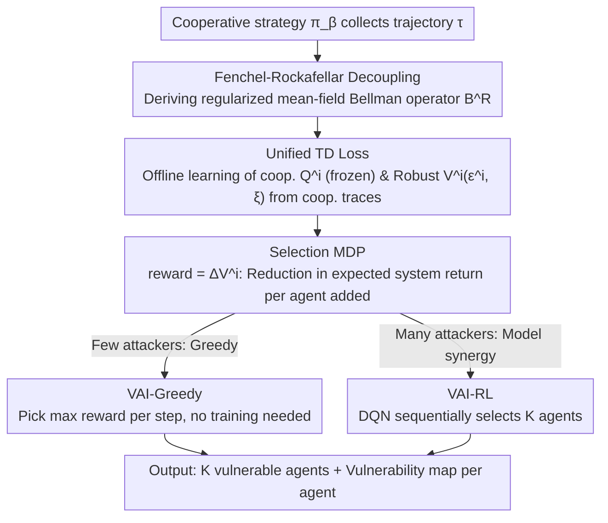

# Vulnerable Agent Identification in Large-Scale Multi-Agent Reinforcement Learning

**Conference**: ICML 2026  
**arXiv**: [2509.15103](https://arxiv.org/abs/2509.15103)  
**Code**: https://github.com/Waken-dream/VAI  
**Area**: Reinforcement Learning / Multi-Agent / Adversarial Robustness  
**Keywords**: Mean-field MARL, Vulnerable Agent ID, Fenchel-Rockafellar, NP-hard Combinatorial Optimization, Robust Bellman

## TL;DR
This paper investigates the bi-level NP-hard problem of "identifying the $K$ most vulnerable agents in a large-scale MARL system with $N$ agents." It formalizes this as HAD-MFC (Hierarchical Adversarial Decentralized Mean Field Control). By applying the Fenchel-Rockafellar transformation, the training of the lower-level worst-case adversarial policy is collapsed into a regularized "robust mean-field Bellman operator." The upper-level combinatorial selection problem is then transformed into an MDP with dense rewards, solved via greedy search or RL. The decomposition is proved to maintain optimality, and the method outperforms baselines in 17 out of 18 tasks.

## Background & Motivation

**Background**: Mean-field MARL (Yang 2018, Subramanian 2022) scales MARL to thousands of agents by approximating "other agents" with a mean-field distribution. It has been applied to robotic swarm control, power grid voltage control, and taxi dispatching. However, during real-world deployment, **disconnection, attacks, or hardware failures of a minority of agents** are inevitable.

**Limitations of Prior Work**: (1) Existing MARL robustness research focuses on small scales—while 10 agents only yield $\binom{10}{1}=10$ attack scenarios, 1000 agents yield $\binom{1000}{100} \approx 10^{139}$, causing a combinatorial explosion. (2) Influence Maximization (IM) algorithms assume known graph structures and propagation rules, which are unavailable in MARL. (3) Existing MARL attack methods (GMA-FGSM, RTCA) rely on random selection or differential evolution, which are ineffective for large-scale mean-field systems.

**Key Challenge**: This is a **bi-level coupled** problem—the upper level seeks to pick $K$ agents from $N$ (NP-hard combinatorial optimization), while the lower level trains the **worst-case adversarial policy** for those $K$ agents (a mean-field MARL problem). The levels are interdependent: the upper-level choice depends on the lower-level damage potential, and the lower-level training depends on the upper-level selection. Direct bi-level RL fails to converge, and combinatorial enumeration is infeasible.

**Goal**: (1) Mathematically define the problem as HAD-MFC and prove its NP-hardness; (2) Find a proxy to estimate "how much reward will drop after an attack" **without actually training adversarial policies**; (3) Transform the combinatorial upper level into an MDP with dense rewards for efficient solving; (4) Prove that this decomposition does not sacrifice global optimality.

**Key Insight**: Observation 1—Under mean-field approximation, the "worst-case value" of the Bellman operator for agent $i$ under a perturbation ratio $\epsilon^i$ and a peer perturbation ratio $\xi$ can be modeled using $\ell_p$ ball constraints. Observation 2—The Fenchel-Rockafellar transformation can convert the "inner min problem" into an "outer regularization term," transforming the difficult task of training a worst-case adversary into a single TD learning process on cooperative trajectories.

**Core Idea**: Compress the "worst-case adversarial policy training" into "learning a robust V-function containing $\epsilon$ and $\xi$ on cooperative trajectories." This V-function then serves as a reward signal to drive an upper-level selection MDP, achieving both computational efficiency and optimality preservation.

## Method

### Overall Architecture
HAD-MFC Formalization: $\mathcal{G} = \langle \mathcal{N}, \mathcal{S}, \mathcal{A}, \mathcal{P}, R, \mu_0, \nu_0, \gamma\rangle$. Each agent $i$ follows a well-trained cooperative policy $\pi_\beta$ by default. If selected into the attack set $\mathcal{K}$, the policy becomes $\hat{\pi}^i = \epsilon^i \pi_\alpha^i + (1-\epsilon^i) \pi_\beta^i$. The attacker’s objective $\min_{\mathcal{K}} \min_{\pi_\alpha} J(\pi_\alpha, \pi_\beta)$ is a bi-level NP-hard problem. The authors' strategy is to **decompose this coupled problem into two levels and solve them independently**: The **lower level** uses Fenchel-Rockafellar to collapse the "worst-case adversary training" into a regularized "robust mean-field Bellman operator" $\mathcal{B}^R_{\epsilon^i, \xi}$. This allows learning the cooperative $Q^i$ (frozen as a dual term) and the robust value function $V^i(s^i, \mu, \epsilon^i, \xi)$ (representing the worst-case return under perturbations) **using only cooperative trajectories** without ever training an adversary. The **upper level** reformulates the "pick $K$ agents" problem as an MDP, using the difference in $V^i$ as dense rewards, solved sequentially via VAI-Greedy or VAI-RL (DQN). Proposition 4.5 proves this decomposition maintains the original HAD-MFC optimal solution.

### Key Designs

**1. Fenchel-Rockafellar Decoupling: Collapsing worst-case training into a regularized robust Bellman operator**

Directly training a worst-case adversary requires solving $\min_{\pi_\alpha} J(\pi_\alpha, \pi_\beta)$, which must be redone for every possible attack set $\mathcal{K}$. The core innovation is using convex duality to eliminate this inner minimization. Let the perturbed policy be $\hat{\pi}^i = \epsilon^i \pi_\alpha^i + (1-\epsilon^i) \pi_\beta^i$ and mean-field action be $\nu(a) = \xi \nu_\alpha(a) + (1-\xi)\nu_\beta(a)$, where $\hat{\pi}_\alpha^i = \hat{\pi}^i - \pi_\beta^i$ is constrained by $\|\hat{\pi}_\alpha^i\|_p \le \epsilon^i$. Applying the Fenchel-Rockafellar transformation to the robust Bellman inequality $V^i \le \mathcal{B}^{\hat{\pi}} V^i$ yields the regularized mean-field Bellman operator:

$$\mathcal{B}^R_{\epsilon^i, \xi} V^i = (\mathcal{B}^{\pi_\beta} V^i) - (\epsilon^i + \xi + \epsilon^i \xi) \|Q^i\|_q,\quad 1/p + 1/q = 1.$$

This is an exact transformation (provided the uncertainty set is convex, proper, and lower semi-continuous, which holds for $\ell_p$ balls) that introduces no approximation. Proposition 4.3 proves it remains a contraction. The learned $V^i(s^i, \mu, \epsilon^i, \xi)$ is equivalent to the worst-case expected return for agent $i$ when they and $\xi$ of the team are perturbed. Training only requires cooperative trajectories.

**2. Unified TD Loss: Offline learning of robust V and cooperative Q on cooperative trajectories**

To learn $V^i$ without environment interaction—adhering to the black-box threat model—the authors implement a standard TD loss:

$$\min \mathbb{E}_{\tau \sim \pi_\beta}\big(V^i(s^i, \mu, \epsilon^i, \xi) - r - \gamma V^i(s'^i, \mu', \epsilon^i, \xi) + (\epsilon^i \xi + \epsilon^i + \xi)\|Q^i(s^i, a^i_\beta, \mu, \nu_\beta)\|_q\big)^2,$$

where $\epsilon \sim U[0, 2^{1/p}]$ and $\xi \sim \text{Bernoulli}(\xi)$. $Q^i$ is pre-learned under the cooperative policy and fixed. Proposition 4.4 provides a geometric intuition: the regularization term $\epsilon^i \xi \|Q^i\|_q$ represents the worst-case first-order deviation of Q within the $\ell_p$ ball. Sampling $\epsilon$ and $\xi$ allows V to learn a family of value functions under different perturbations, satisfying the assumption that attackers only have access to cooperative traces.

**3. Selection MDP with Dense Rewards: Solving NP-hard combinatorial selection via Greedy or RL**

The upper level picks $K$ agents from $N$. To overcome the sparsity of rewards in traditional combinatorial optimization, this is reformulated as a sequential selection MDP $\mathcal{M} = \langle \boldsymbol{\mathcal{S}}, \epsilon, \mathcal{N}, \tilde{\mathcal{P}}, \tilde{R}, \gamma\rangle$. At each step, an agent $n_k$ is added to the attack set $\mathcal{K}_k = \mathcal{K}_{k-1} \cup n_k$. The reward is defined as the marginal decrease in system expected return:

$$r_k = \frac{1}{N}\sum_i \big(V^i(s_0^i, \mu_0, \epsilon^i_{k-1}, \xi_{k-1}) - V^i(s_0^i, \mu_0, \epsilon^i_k, \xi_k)\big),$$

using the learned robust V. This provides a dense signal at every step, allowing for simple greedy selection (VAI-Greedy) or DQN to capture long-term dependencies (VAI-RL). Proposition 4.5 ensures this maintains the optimal solution of the original HAD-MFC. Experiments show RL significantly outperforms Greedy when the number of attackers is large (e.g., in a Battle with 144 agents and 36 attackers, RL improves by ~30%).

### Loss & Training
Cooperative Q: Pre-trained using MF-Q (Battle) or MF-AC (Taxi) under $\pi_\beta$ and then frozen. Robust V: Trained using the aforementioned TD loss. Upper Level: VAI-Greedy selects the agent with the highest reward at each step; VAI-RL uses DQN to select $K$ agents sequentially. All baselines (Random, DC, Bi-level RL, PIANO, RTCA) share the same network architecture and hyperparameters across five random seeds.

## Key Experimental Results

### Main Results
Evaluation across three environments (Battle, Taxi Matching, Vicsek Group Dynamics) with 18 sub-tasks. Selected results (Battle ↓ lower is better for stronger attack; Vicsek ↑ higher indicates closer to target policy):

| Env/Scale | Adv Count | Random | DC | PIANO | RTCA | VAI-Greedy | VAI-RL |
|----------|-------|--------|-----|-------|------|------------|--------|
| Battle-64 | 32 | -152.89 | -160.51 | -175.24 | -192.78 | -214.40 | **-929.88** |
| Battle-144 | 72 | -1809 | -2014 | -2313 | -2221 | -2579 | **-2837** |
| Taxi-100 | 36 | 884.49 | 867.62 | 793.71 | 860.58 | 770.14 | **652.10** |
| Vicsek-400 | 200 | -295.13 | -313.55 | -290.53 | -287.53 | -256.44 | -275.62 |

VAI-RL reaches -929.88 on Battle-64 with 32 adversaries, 5x stronger than the best baseline (-214), identifying combinations that lead to **total system collapse**. Overall, it outperforms baselines in 17/18 tasks.

### Ablation Study

| Configuration | Description | Effect |
|------|------|------|
| Random | Pick K agents randomly | Weak baseline |
| DC | Degree Centrality (pick agents with most neighbors) | Strong in rule-based systems, weak in MARL |
| Bi-level RL | End-to-end training of both levels | Weaker than VAI (lacks explicit reward signal) |
| PIANO | GNN + RL sequential selection | Ignores worst-case adversarial behavior |
| RTCA | Differential Evolution | Effective only at small scales |
| VAI-Greedy | Greedy selection without RL | Close to RL for few attackers |
| VAI-RL | Upper-level DQN | Significantly superior to Greedy for many attackers |

### Key Findings
- **VAI-RL is superior when attackers are numerous**: RL wins in 10/18 tasks, specifically where many agents are involved. RL captures long-term synergy between agents that Greedy misses.
- **Degree Centrality (DC) failure**: In Battle, frontline agents are more vulnerable than those in the central crowd. DC picks central agents and fails, proving graph heuristics are unreliable in large-scale MARL.
- **PIANO/Bi-level RL insufficiency**: Existing learning baselines fail to solve worst-case selection because they do not explicitly model the presence of an adversarial policy following selection.
- **Capability on rule-based systems (Vicsek)**: By converting rule-based agents to Boltzmann policies, Q-functions can be estimated and the method generalizes to non-MARL robustness analysis.
- **Interpretable vulnerability**: Figure 1 visualizes the contribution of each agent, identifying specific roles/positions as critical vulnerabilities.

## Highlights & Insights
- Using the **Fenchel-Rockafellar transformation to turn RL into offline learning** is elegant—it reduces the engineering nightmare of training adversaries to a single TD learning step with regularization. This is portable to any "min-max RL" scenario.
- Converting NP-hard combinatorial optimization into a dense-reward MDP (reward = marginal gain) is a universal trick applicable to feature selection, subset selection, etc.
- The method is **fully black-box**—it requires no victim parameters or environment models, only cooperative trajectories, matching real-world attacker capabilities.
- The geometric intuition of Proposition 4.4 ($\epsilon^i \xi \|Q^i\|_q$ as the worst-case first-order deviation) justifies the regularization term.
- The "vulnerability map" byproduct allows designers to identify and prioritize protection for critical nodes, providing direct value for fault-tolerant system design.

## Limitations & Future Work
- The learning of $V^i$ relies on function approximation. As noted in Remark 3, if Q-learning is poor, the entire method fails. Error propagation from V-function to selection is not fully characterized.
- While $\epsilon^i = 1$ (full control) is studied, real-world scenarios often involve partial perturbations. Full exploration of the defender's perspective was not deep.
- In large-scale sparse scenarios, if the V-function error exceeds the marginal reward difference, the gradient signal may become distorted.
- Extension to "million-agent" scales (e.g., city-wide traffic) remains to be verified beyond the 400-agent experiments.
- VAI-RL uses DQN for discrete selection; for extremely large $K$, PPO or actor-critic approaches have not yet been explored.

## Related Work & Insights
- **vs RTCA (Zhou & Liu 2023)**: RTCA uses differential evolution for small scales; VAI scales to mean-field levels with theoretical decoupling guarantees.
- **vs Influence Maximization (Kempe et al. 2003)**: IM assumes known rules; VAI infers vulnerabilities via V-functions, essentially acting as RL-based IM for unknown rules.
- **vs Bi-level RL (Vezhnevets et al. 2017)**: VAI avoids the convergence issues and sparse signals of direct bi-level training through explicit decoupling.
- **vs PR-MDP (Tessler et al. 2019)**: VAI extends the perturbation formalization of PR-MDP to mean-field settings and combinatorial selection.

## Rating
- Novelty: ⭐⭐⭐⭐⭐ — FR transformation for worst-case RL is highly innovative; NP-hard to dense MDP is elegant; Proposition 4.5 is a core theoretical contribution.
- Experimental Thoroughness: ⭐⭐⭐⭐ — 18 sub-tasks across 3 environments and substantial baselines; lacks stress tests for varying $\epsilon$ or massive scales.
- Writing Quality: ⭐⭐⭐⭐ — Clear linkage between propositions; however, the FR transformation section may have a high barrier for non-RL experts.
- Value: ⭐⭐⭐⭐⭐ — Robustness assessment for large-scale MARL in power grids or traffic is a high-demand real-world need; this is a first-of-its-kind tool for efficient vulnerability identification.

<!-- RELATED:START -->

## Related Papers

- [\[ICML 2026\] Interaction-Breaking Adversarial Learning Framework for Robust Multi-Agent Reinforcement Learning](interaction-breaking_adversarial_learning_framework_for_robust_multi-agent_reinf.md)
- [\[ICML 2026\] Plug-and-Play Benchmarking of Reinforcement Learning Algorithms for Large-Scale Flow Control](plug-and-play_benchmarking_of_reinforcement_learning_algorithms_for_large-scale_.md)
- [\[ICML 2026\] Multi-Agent Decision-Focused Learning via Value-Aware Sequential Communication](multi-agent_decision-focused_learning_via_value-aware_sequential_communication.md)
- [\[ICML 2026\] LLM-Guided Communication for Cooperative Multi-Agent Reinforcement Learning](llm-guided_communication_for_cooperative_multi-agent_reinforcement_learning.md)
- [\[AAAI 2026\] Explaining Decentralized Multi-Agent Reinforcement Learning Policies](../../AAAI2026/reinforcement_learning/explaining_decentralized_multi-agent_reinforcement_learning_policies.md)

<!-- RELATED:END -->
