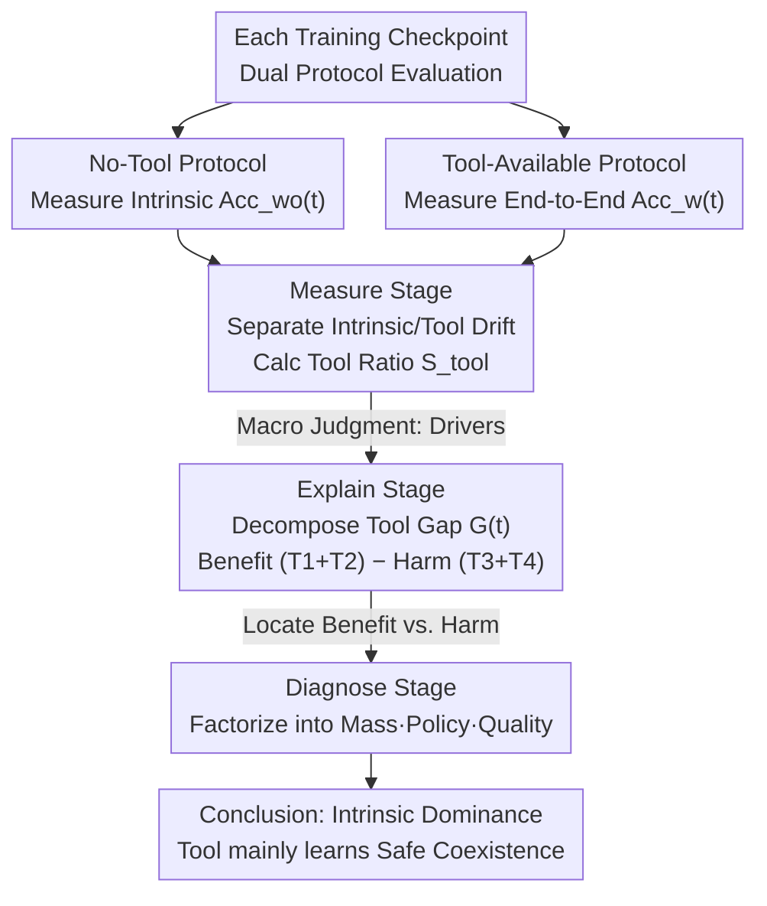

# What Does Reinforcement Learning for Visual Tool Use Really Learn?

**Conference**: ICML 2026  
**arXiv**: [2602.01334](https://arxiv.org/abs/2602.01334)  
**Code**: https://github.com/GAIR-NLP/Med  
**Area**: Multimodal VLM / Reinforcement Learning / Agent Tool Use  
**Keywords**: Visual Tool Use, RL Interpretation, Crop-and-Zoom Tool, Multimodal Reasoning

## TL;DR
This paper proposes the MED framework to systematically analyze the actual learning effects of visual tool-use RL in crop-and-zoom scenarios—finding that the performance gains brought by RL training primarily stem from **intrinsic capability improvement** rather than enhanced tool mastery; the model mainly learns how to safely coexist with tools rather than truly mastering them.

## Background & Motivation

**Background**: Current VLMs widely adopt tool-use RL to enhance multimodal reasoning capabilities. Researchers equip VLMs with visual manipulation tools (e.g., crop-and-zoom) and use RL training to teach models how to invoke these tools during the reasoning process.

**Limitations of Prior Work**: While visual tool-use RL brings performance gains, **the nature of the improvements actually achieved remains unclear**. Observed performance gains may come from three different sources: (1) RL strengthening intrinsic capabilities (improving even without using tools); (2) RL improving the tool interaction itself; (3) RL simply reducing side effects brought by tools rather than truly improving the ability to fix failures. Existing evaluations only report end-to-end accuracy when tools are available, failing to provide mechanism-level attribution.

**Key Challenge**: The unclear attribution of performance improvements makes it difficult to design effective RL objective functions. If improvements are mainly due to intrinsic capabilities, the effect of optimizing tool invocation strategies will be limited; if they are due to improved tool use, rewards should target the capability of tools to correct failures.

**Goal**: Systematically decompose the sources of performance improvement from a training dynamics perspective—separating intrinsic capability drift from tool-induced effects, and further decomposing these into interpretable benefit and harm terms.

**Key Insight**: Perform checkpoint-level analysis on two VLM backbones with different tool priors (Qwen2.5-VL, which was not trained on crop-and-zoom, and Qwen3-VL, which was) across six benchmarks, comparing the evolution curves of **inference accuracy without tools** and **inference accuracy with tools available**.

**Core Idea**: Design the MED (Measure-Explain-Diagnose) three-layer progressive framework—probabilistic decomposition identities split the tool-induced performance gap into four terms, followed by a Mass-Policy-Quality factorization for each term to diagnose root causes.

## Method

### Overall Architecture
For each training checkpoint, the model is evaluated under two protocols—**No-Tool Protocol**: evaluating "intrinsic capability" without providing the tool schema; **Tool-Available Protocol**: providing the tool schema for the model to actively invoke. By tracking both curves, intrinsic drift $f_{wo}(t)$ and tool-induced drift $\Delta_{tool}(t)$ are separated: $f_w(t) = f_{wo}(t) + \Delta_{tool}(t)$. On this basis, MED uses a coarse-to-fine diagnostic pipeline to approach the causes—Measure provides the macro judgment, Explain decomposes the gap into actionable components, and Diagnose localizes the mechanism behind each term.

### Key Designs

**1. Measure Stage: Answering the macro question of "intrinsic capability vs. tool use"**

To separate the two sources, the cumulative magnitudes of the curves are calculated: intrinsic drift $|B_{wo}| = \int_0^T |f_{wo}(t)|\,dt$, and tool drift $|B_{\Delta tool}| = \int_0^T |\Delta_{tool}(t)|\,dt$. Then calculate the tool contribution ratio:

$$S_{tool} = \frac{|B_{\Delta tool}|}{|B_{wo}| + |B_{\Delta tool}|}.$$

$S_{tool} \approx 0$ indicates intrinsic drift dominance, while $\approx 1$ indicates tool-induced dominance. This step provides a macro judgment—whether RL strengthens intrinsic capabilities or genuinely improves tool use—setting the stage for fine-grained decomposition (in experiments, $S_{tool}$ for both models was well below 0.5, directly pointing to intrinsic capability dominance).

**2. Explain Stage: Decomposing the tool performance gap into four "Invocation/Schema × Benefit/Harm" terms**

Following the macro judgment, the next question is "where exactly does the tool help or harm?". Samples are split based on whether they succeed under the no-tool protocol ($\mathcal{D}_{fail}$ / $\mathcal{D}_{succ}$) and whether the tool is actually invoked (call / no-call). The performance gap is decomposed as $G(t) = T1 + T2 - T3 - T4$: $T1$ represents failure without tools but success after invocation (true tool correction), $T3$ represents success without tools but failure after invocation (tool harm), while $T2/T4$ represent benefits and harms from Schema exposure itself (even without actual invocation). This decomposition turns the abstract performance gap into actionable components—benefit as $T1+T2$ and harm as $T3+T4$—distinguishing between effects caused by "invocation actions" vs. "Schema exposure."

**3. Diagnose Stage: Mass-Policy-Quality factorization to locate mechanisms behind changes**

Knowing that a term (e.g., call benefit $T1$) has stalled is insufficient; the underlying mechanism must be identified. Each term is further factorized into three probabilistic factors:

$$\text{Term}(\mathcal{D},a,o) = P(\mathcal{D}) \cdot P(a\mid\mathcal{D}) \cdot P(o\mid a,\mathcal{D}),$$

corresponding to **Mass** (size of the sample group), **Policy** (the decision of "when to call"), and **Quality** (the execution "quality of the call"). Consequently, "stalled invocation benefit" can be precisely attributed to one of three causes: a shrinking failure set (Mass↓), the model choosing not to invoke (Policy↓), or declining execution performance (Quality↓). This decomposition reveals the most counter-intuitive conclusion—stalled invocation benefit is not due to quality collapse, but rather a "capacity limit" caused by the natural shrinkage of the hard failure set (Mass↓) as intrinsic capabilities improve, i.e., the "intrinsic capability-tool trade-off."

### Loss & Training
The GRPO algorithm was used with outcome-based rewards for training. Analysis was performed across 21 checkpoints using two VLM backbones and six benchmarks (VStar, HR-Bench 4k/8k, VisualProbe Easy/Medium/Hard).

## Key Experimental Results

### Main Results: Intrinsic Drift Dominance

| Model | Tool Ratio $S_{tool}$ | Intrinsic Drift $\|B_{wo}\|$ | Tool Drift $\|B_{\Delta tool}\|$ |
|-----|----------------|-------------------|----------------------|
| Qwen2.5-VL | 0.30 | Large | Small |
| Qwen3-VL | 0.22 | Large | Small |

The tool contribution ratio for both models is well below 0.5, indicating that over 70% of learning progress comes from intrinsic capability improvement.

### Benefit-Harm Decomposition

| Phase | Call Benefit (T1) | Schema Benefit (T2) | Call Harm (T3) | Schema Harm (T4) | Net Benefit |
|-----|----------|-----------|-----------|-----------|--------|
| Early | Rapid Rise | Small | Moderate | Moderate | Positive Growth |
| Middle | Plateau/Decline | Small | Decline | Decline | Slow Growth |
| Late | Plateau/Decline | Small | Continued Decline | Continued Decline | Stagnant |

### Persistent Failure Cases (Manual Annotation of 370 samples)

| Failure Type | Count | Proportion |
|--------|------|------|
| Not called but should have been | 82 | 22.2% |
| Called but crop error | 52 | 14.1% |
| Correct crop but reasoning still wrong | 37 | 10.0% |
| Correct crop but task still hard | 10 | 2.7% |

### Key Findings
- **Stalled Invocation Benefit**: T1 rose quickly and پھر plateaued on Qwen2.5-VL, while it monotonically decreased on Qwen3-VL.
- **Continuous Harm Reduction**: T3+T4 consistently decreased throughout the training process.
- **Net Tool Benefit Plateau**: Reflects a balance between reaching the benefit ceiling and diminishing harm.
- **Deep Insight**: Stalled invocation benefit is not a result of quality collapse but a **capacity limit**—as intrinsic capabilities improve, the set of difficult failure samples naturally shrinks, limiting the ceiling for tool assistance.

## Highlights & Insights
- **Elegance of the Probabilistic Decomposition Identity**: Decomposing the performance gap into four terms serves as both a mathematical identity and an actionable diagnostic tool.
- **Diagnostic Power of Mass-Policy-Quality Factorization**: Effectively captures the "intrinsic capability-tool trade-off" phenomenon.
- **Clear Understanding of What Tools Actually Learn**: Models essentially learn "safe coexistence"—reducing the harm caused by tools rather than strengthening tool-based correction capabilities.
- **Dual VLM Backbone Comparative Design**: Reveals the significant impact of tool priors on learning dynamics.

## Limitations & Future Work
- Analysis is limited to a single tool (crop-and-zoom); dynamics in multi-tool scenarios may differ.
- The paper analyzes training dynamics but does not propose a new RL algorithm.
- Metrics focus only on accuracy, without considering efficiency or interpretability.
- Fixed checkpoint sampling might miss certain rapid dynamics.
- Future work: Design RL objective functions to explicitly maximize "selective correction on failure sets" while minimizing "harm on success sets"; extend to multi-tool scenarios.

## Related Work & Insights
- **vs. Tool-use Faithfulness**: Faithfulness checks surface alignment, whereas MED diagnoses actual efficacy.
- **vs. Single VLM Analysis**: Comparing two models with different tool priors reveals the significant impact of priors on learning curves.
- **vs. Outcome vs. Tool Reward Debate**: MED analysis suggests that tool-related rewards primarily change Policy rather than Quality and cannot resolve the fundamental Mass capacity limit.

## Rating
- Novelty: ⭐⭐⭐⭐⭐ The probabilistic decomposition identity and Mass-Policy-Quality factorization constitute an original diagnostic framework.
- Experimental Thoroughness: ⭐⭐⭐⭐⭐ 2 VLMs + 6 benchmarks + 21 longitudinal checkpoints + manual cases + multiple sanity checks.
- Writing Quality: ⭐⭐⭐⭐ Clear logic with a natural progression through three layers of analysis.
- Value: ⭐⭐⭐⭐⭐ Challenges the intuitive understanding that "tool-use RL equals learning to master tools."

<!-- RELATED:START -->

## Related Papers

- [\[ICLR 2026\] ReTool: Reinforcement Learning for Strategic Tool Use in LLMs](../../ICLR2026/reinforcement_learning/retool_reinforcement_learning_for_strategic_tool_use_in_llms.md)
- [\[ICML 2026\] Learning to Search and Searching to Learn for Generalization in Planning](learning_to_search_and_searching_to_learn_for_generalization_in_planning.md)
- [\[ICLR 2026\] AutoTool: Automatic Scaling of Tool-Use Capabilities in RL via Decoupled Entropy Constraints](../../ICLR2026/reinforcement_learning/autotool_automatic_scaling_of_tool-use_capabilities_in_rl_via_decoupled_entropy_.md)
- [\[ICLR 2026\] ResT: Reshaping Token-Level Policy Gradients for Tool-Use Large Language Models](../../ICLR2026/reinforcement_learning/rest_reshaping_token-level_policy_gradients_for_tool-use_large_language_models.md)
- [\[ICML 2026\] You Can Learn Tokenization End-to-End with Reinforcement Learning](you_can_learn_tokenization_end-to-end_with_reinforcement_learning.md)

<!-- RELATED:END -->
