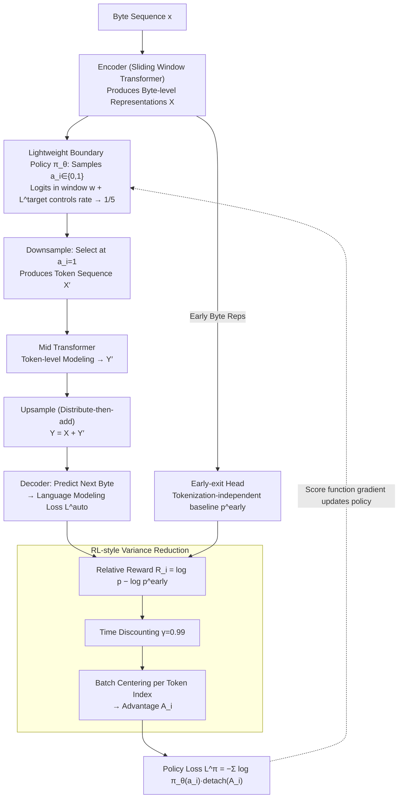

# You Can Learn Tokenization End-to-End with Reinforcement Learning

**Conference**: ICML2026  
**arXiv**: [2602.13940](https://arxiv.org/abs/2602.13940)  
**Code**: https://github.com/SamD770/bitter-lesson-tokenization  
**Area**: LLM Pre-training / End-to-End Tokenization / Byte-level Language Modeling  
**Keywords**: End-to-end tokenization, score function estimator, REINFORCE, autoregressive U-Net, byte-level LLM  

## TL;DR
This paper models the decision of "where to draw token boundaries" in byte-level LLMs as a discrete stochastic process. By using a score function estimator equipped with early-exit relative rewards, time discounting, and batch-relative advantage, it achieves end-to-end learning of tokenization. The method outperforms straight-through estimators on a 147M natural language model and a 90M code model, approaching the performance of BPE-guided downsampling.

## Background & Motivation
**Background**: Modern LLMs still rely on tokenizers to compress raw text into common subword tokens. While effective, methods like BPE are hard-coded compression steps outside the training pipeline, involving numerous manual rules such as digit splitting, whitespace preservation, and special token handling. Meanwhile, byte-level and hierarchical language models attempt to return model input to UTF-8 bytes and perform downsampling within the architecture.

**Limitations of Prior Work**: Pure byte-level models suffer from long sequences and high attention costs. Downsampling rules like fixed stride, whitespace-based, or entropy-spike based are heuristic and not necessarily optimal. Existing end-to-end methods for learning token boundaries mostly use straight-through estimators (STE), treating discrete boundaries as continuous variables to approximate gradients. However, STE lack theoretical guarantees for directly optimizing the expected loss of discrete boundaries.

**Key Challenge**: Tokenization is essentially a discrete compression decision, whereas LLM training relies on differentiable backpropagation. While a score function estimator can directly compute gradients for the expected loss of a discrete policy, it suffers from high variance. STE has lower variance but is more heuristic in both objective and theory. The core challenge is to prove that a score function estimator can be viable in real LLM pre-training if RL variance reduction techniques are correctly applied.

**Goal**: The authors aim to learn token boundaries end-to-end within an autoregressive U-Net architecture, satisfying three constraints: the boundary policy is learned from the loss rather than manual rules; byte-level representations are reused at the token level; and the additional training compute is less than 0.1% of BPE-guided tokenization.

**Key Insight**: Treat the decision of whether to place a token boundary at each byte position as an action from a Bernoulli policy, and use the next-byte cross-entropy as the reward signal. In this way, the entire model becomes a stochastic computation graph where the boundary policy can be optimized via REINFORCE/score function gradients.

**Core Idea**: Use a score function estimator to learn discrete token boundaries, significantly reducing variance through early-exit baselines, time discounting, and batch-relative centering. This allows the model to naturally learn a tokenization strategy that approximates semantic boundaries from the language modeling loss.

## Method
The method centers on an autoregressive U-Net: the model first encodes at the byte level, downsamples byte representations into token representations based on sampled boundaries, performs transformer computations on the shorter sequence in intermediate layers, and finally upsamples back to the byte level to predict the next byte. The core contribution lies in the token boundary policy and its low-variance training objective.

### Overall Architecture
Given a byte sequence $x_1,\ldots,x_N$, the encoder produces byte-level representations $X$. The boundary policy $\pi_\theta$ samples $a_i\in\{0,1\}$ at each position, where $a_i=1$ indicates a token boundary. The downsample operation selects byte representations at these boundaries to form the token-level sequence $X'$. A mid transformer models the token level, followed by a distribute-then-add upsample to add token-level information back to byte representations $Y$. Finally, the decoder predicts the next bytes.

The training objective is to maximize the next-byte likelihood marginalized over all possible tokenization strategies. Since $a$ is a discrete random variable, the gradient decomposes into two parts: the standard conditional language modeling gradient and the policy gradient term $\log p_\theta(y|a,x)\nabla_\theta\log \pi_\theta(a|x)$. Reducing the variance of the latter is the technical core of the paper.

### Key Designs
**1. Score Function Estimator: Direct Gradients on Discrete Boundaries**

Token boundaries are discrete 0/1 actions, making direct backpropagation impossible. Prior end-to-end methods used the straight-through estimator (STE), treating discrete boundaries as continuous and using surrogate gradient rules, which lack theoretical grounding for discrete optimization. This paper employs the score function estimator: viewing the boundary sequence $a$ as a random variable sampled from $\pi_\theta(a|x)$ and optimizing the expected likelihood $\mathbb{E}_{a\sim\pi_\theta}\log p_\theta(y|a,x)$. Its gradient splits into the conditional language modeling gradient and a policy gradient term $\log p_\theta(y|a,x)\,\nabla_\theta\log\pi_\theta(a|x)$, which signals whether a decision improved subsequent byte prediction. While SFE converges to local optima in discrete landscapes—unlike STE—it suffers from high variance.

**2. RL-style Variance Reduction: Stabilizing Single-Sample Policy Gradients**

For efficiency, only one $a$ is sampled per sequence for Monte-Carlo estimation. Vanilla REINFORCE is too noisy. The difficulty lies in reward attribution (which boundary was responsible for the loss). The paper uses three techniques: ① **Early-exit relative reward**: An early-exit head predicts next bytes from early byte representations as a baseline. The relative reward $R_i=\log p_\theta(x_i|x_{<i},a_{<i})-\log p^{early}_\theta(x_i|x_{<i})$ isolates the specific gain provided by tokenization. ② **Time discounting** $\gamma=0.99$: Future rewards are discounted and accumulated into the advantage, effectively decoupling distant decisions and providing multiple independent signals per sequence. ③ **Batch-relative advantage**: Since the final layer is consistently stronger than the early-exit, $G_i$ is systematically positive and grows with token index. Centering the advantage across a batch for each token index removes this bias. The final policy loss is $L^\pi=-\sum_i\log\pi_\theta(a_i|x_{<i},a_{<i})\,detach(A_i)$.

**3. Lightweight Boundary Policy and Target Compression: Negligible Compute and Anti-Degeneracy**

Boundary probability is the sigmoid of logit $l_i$, derived from a linear projection of $X_i$ and a conditional term for historical boundaries in a window (computed via an efficient scan). Compute cost is negligible. To prevent the model from degenerating into a "mark every byte as boundary" strategy, a target rate loss $L^{target}=\bar{l}\cdot detach(\bar{p}-\bar{\pi}_{target})$ is added to push the batch average downsampling rate toward $\bar{\pi}_{target}=1/5$. Applying pressure on logits rather than probabilities ensures stability relative to sigmoid gradient magnitudes.

### Loss & Training
The total loss is $L=L^{auto}+\lambda_\pi L^\pi+\lambda_{target}L^{target}+\lambda_{early}L^{early}$. Here, $L^{auto}$ is the final next-byte cross-entropy, $L^{early}$ trains the baseline, $L^\pi$ is the policy loss, and $L^{target}$ controls the boundary rate. Hyperparameters are $\lambda_\pi=\lambda_{target}=10^{-2}$ and $\lambda_{early}=10^{-1}$.

## Key Experimental Results

### Main Results
Natural language experiments were conducted on filtered FineWeb with a 147M parameter model, reporting bits-per-byte (BPB). Code experiments used a 90M parameter model on CodeParrot.

| Method | PIQA↓ | HellaSwag↓ | ARC-Easy↓ | LAMBADA↓ | FineWeb Test↓ |
|------|-------|------------|-----------|----------|---------------|
| Uniform | 1.660 | 1.306 | 1.974 | 1.926 | 1.376 |
| Dynamic (Nawrot et al.) | 1.737 | 1.340 | 2.011 | 1.956 | 1.372 |
| H-Net (Hwang et al.) | 1.641 | 1.313 | 2.000 | 2.130 | 1.386 |
| BPE guidance | 1.589 | 1.230 | 2.084 | 1.645 | 1.299 |
| Ours (w=1) | 1.561 | 1.199 | 1.987 | 1.584 | 1.280 |
| Ours | 1.557 | 1.212 | 2.016 | 1.737 | 1.297 |

### Ablation Study
Ablations focused on boundary window size, BPE-guidance comparison, target rate, and code data.

| Analysis Item | Setting | Key Result | Description |
|--------|------|----------|------|
| Boundary Window Size | Ours w=8 vs Ours w=1 | FineWeb Test 1.297 vs 1.280 | Large windows are not essential; short windows are sufficient. |
| BPE-guidance Comparison | 200k BPE shifted right | FineWeb Test 1.299 | The learned dynamic policy matches external BPE priors. |
| FLOPs-Validation Loss | 147M FineWeb | Ours ~1.279 bits-per-byte | Semantic boundaries translate into training loss advantages. |
| CodeParrot | 90M Python code | Ours Val Loss 0.568 vs H-Net 0.769 | Advantages of SFE are more pronounced on structured code. |
| Downsampling Rate | $\bar{a}$ after convergence | Ours 0.204 | Rate control is stable and close to the BPB target. |

### Key Findings
- The model learns whitespace-like and semantic boundaries without prior knowledge of whitespace or BPE, suggesting that language modeling loss contains strong tokenization signals.
- Performance of $w=1$ matches full windows, implying that boundary policy depends primarily on local byte representations and the immediate preceding boundary.
- The method is the first dynamic policy to recover the performance of BPE-guided downsampling on FineWeb without external BPE priors.
- On Python code, the model learns to place boundaries at module name starts and avoids wasting compute on boilerplate like Apache Licenses.

## Highlights & Insights
- The most valuable takeaway is handling the discreteness of tokenization directly rather than relying on surrogate gradients. This provides a clean interface for future learned tokenizers.
- The early-exit relative reward is a clever design: it removes the inherent difficulty of the text from the reward, forcing the boundary policy to focus on the gains provided by tokenization.
- The results suggest that BPE's strength might not just be frequency statistics, but providing reasonable semantic compression points. If models can learn these points, future tokenizers can be language-agnostic.

## Limitations & Future Work
- Experiments were limited to 90M-147M parameters. Many advantages of autoregressive U-Nets over token transformers may only manifest at larger scales ($>10^{21}$ FLOPs).
- Downstream accuracy at this scale is near random; bits-per-byte is used instead. This is stable but not perfectly correlated with actual task capability.
- Score function estimators still require careful variance reduction and hyperparameter tuning; stability across different data and scales needs more validation.
- The optimal tokenization aspect ratio as a function of model scale remains an open question.

## Related Work & Insights
- **vs BPE / SuperBPE**: Unlike BPE which is an offline rule, this method integrates boundary decisions into training, allowing the tokenizer to evolve with the objective.
- **vs Byte-level Models**: While pure byte models like ByT5 avoid tokenizer bias, they suffer from sequence length. This architecture seeks to balance byte-level generality with token-level efficiency.
- **vs STE Tokenization**: STE uses continuous relaxations, which are engineering-friendly but theoretically approximate. SFE optimizes the discrete policy directly.
- **vs RL for Routing/MoE**: Similar to learned routing in MoE, but token boundary credit assignment spans long byte sequences, making early baselines and discounting crucial.

## Rating
- Novelty: ⭐⭐⭐⭐☆ Using SFE for LLM tokenization successfully is challenging and innovative.
- Experimental Thoroughness: ⭐⭐⭐⭐☆ Includes code, natural language, BPE comparisons, and ablations, though model scale is small.
- Writing Quality: ⭐⭐⭐⭐☆ Clear derivation and well-articulated motivation for variance reduction.
- Value: ⭐⭐⭐⭐☆ Highly insightful for future tokenizer-free or learned-tokenizer LLMs, particularly for non-English text.

<!-- RELATED:START -->

## Related Papers

- [\[CVPR 2026\] EVA: Efficient Reinforcement Learning for End-to-End Video Agent](../../CVPR2026/reinforcement_learning/eva_efficient_reinforcement_learning_for_end-to-end_video_agent.md)
- [\[ICML 2026\] Can Large Language Models Generalize Procedures Across Representations?](can_large_language_models_generalize_procedures_across_representations.md)
- [\[ICML 2026\] Learning to Search and Searching to Learn for Generalization in Planning](learning_to_search_and_searching_to_learn_for_generalization_in_planning.md)
- [\[NeurIPS 2025\] Shift Before You Learn: Enabling Low-Rank Representations in Reinforcement Learning](../../NeurIPS2025/reinforcement_learning/shift_before_you_learn_enabling_low-rank_representations_in_reinforcement_learni.md)
- [\[ICML 2026\] Offline Reinforcement Learning with Generative Trajectory Policies](offline_reinforcement_learning_with_generative_trajectory_policies.md)

<!-- RELATED:END -->
