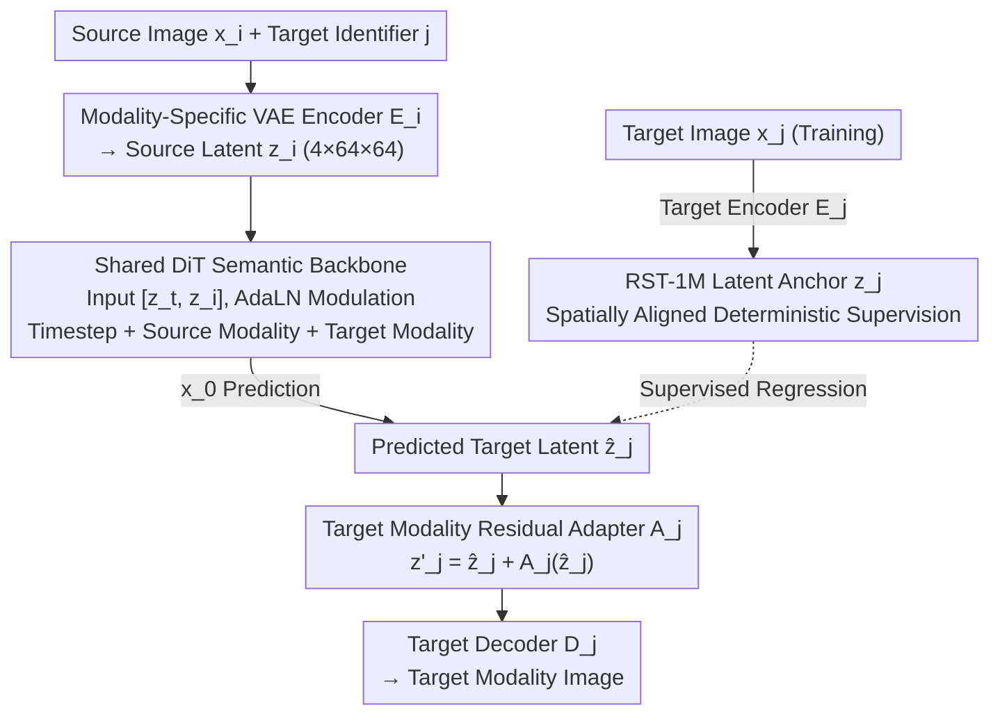

# Any2Any: Unified Arbitrary Modality Translation for Remote Sensing

**Conference**: ICML2026  
**arXiv**: [2603.04114](https://arxiv.org/abs/2603.04114)  
**Code**: https://github.com/MiliLab/Any2Any (Available)  
**Area**: Remote Sensing / Multi-modal Generation  
**Keywords**: Arbitrary Modality Translation, Remote Sensing Multi-modality, Latent Diffusion, RST-1M, Residual Adapter  

## TL;DR
Any2Any transforms remote sensing inter-modal translation (RGB, SAR, NIR, MS, PAN, etc.) from a collection of pairwise models into a unified latent diffusion model within a shared latent space. Utilizing the million-scale RST-1M dataset and target-modality residual adapters, it achieves superior fidelity and generalization across 14 seen translation directions and multiple unseen modality combinations.

## Background & Motivation
**Background**: Remote sensing scenarios increasingly rely on the collaborative observation of multi-source sensors. A single geographical area may be observed simultaneously by optical RGB, Synthetic Aperture Radar (SAR), Near-Infrared (NIR), Multi-Spectral (MS), and Pansharpening (PAN) modalities, each providing specific texture, structural, spectral, or all-weather information. In practical applications, only partial modalities are often available for a given region; thus, synthesizing missing modalities from existing ones is crucial for continuous earth observation, disaster monitoring, urban analysis, and downstream recognition tasks.

**Limitations of Prior Work**: Mainstream remote sensing cross-modal translation methods are still trained per specific direction, such as SAR-to-RGB, NIR-to-RGB, or RGB-to-PAN. While acceptable for a few modalities, this approach requires approximately $O(N^2)$ direction-specific models as the number of sensors $N$ increases. More critically, models for each direction learn only on local data, failing to stably reuse semantic information from other modality pairs and struggling to transfer to modality combinations without paired samples during training.

**Key Challenge**: Remote sensing modalities share the same geographic scene but are constrained by different physical imaging mechanisms. RGB, SAR, NIR, MS, and PAN differ in resolution, channel count, sampling geometry, and noise characteristics. A completely shared model leads to misaligned detail distributions for target modalities, whereas completely separate training per direction loses the benefits of cross-modal semantic sharing and scalability. This paper seeks an extensible compromise between "unified semantic mapping" and "preserving sensor-specific differences."

**Goal**: The authors define the task as Any-to-Any remote sensing modality translation: given any source modality and any target modality, the model should perform the translation within a single framework. This requires solving three sub-problems: constructing a sufficiently connected large-scale cross-modal supervision graph, projecting different sensors into a comparable latent representation space, and using a shared backbone to learn semantic mapping while employing lightweight modules to correct systematic biases of target modalities.

**Key Insight**: The authors observe that although sensors vary in observation form, they point to the same underlying geographic semantic scene. By using spatially registered samples to provide "latent space anchors," cross-modal generation can be transformed from unstable marginal distribution matching into supervised regression of target modality latent variables. This perspective is particularly suitable for remote sensing, which emphasizes geographic alignment and physical scale consistency.

**Core Idea**: Establish a unified latent space via modality-specific VAEs, use a shared DiT backbone conditioned on source/target modalities to predict target latents, and finally apply target-modality residual adapters for fine calibration. This compresses arbitrary remote sensing modality translation into a single unified model.

## Method
The Any2Any method can be viewed as a three-stage framework: "align representations, shared translation, and refine target boundaries." Instead of learning generators in pixel space for all directions, the model assigns individual encoders and decoders to each modality, projecting images with different resolutions and channel structures into latent representations of a uniform shape. Subsequently, a shared Diffusion Transformer (DiT) learns the semantic mapping from the source to the target modality within this latent space. Since each target modality's VAE latent space retains its own distributional characteristics, the model introduces target-indexed residual adapters to push the shared backbone's output latents back into regions that the target decoder handles most effectively.

### Overall Architecture
The input consists of a source modality image $x_i$ (e.g., SAR or NIR) and a target modality identifier $j$ (e.g., RGB or MS). The model first uses the corresponding source encoder $E_i$ to obtain the source latent $z_i$. During training, the target image $x_j$ passes through the target encoder $E_j$ to obtain the target latent $z_j$, which serves as the supervision anchor. The diffusion backbone receives the concatenation of the noisy target latent $z_t$ and the source latent $z_i$. It predicts the clean target latent $\hat{z}_j$ via DiT layers modulated by AdaLN based on three types of embeddings: timestep, source modality, and target modality. Finally, the target modality adapter $A_j$ performs residual calibration on $\hat{z}_j$ before the target decoder $D_j$ reconstructs the target modality image.

In terms of complexity, traditional pairwise models require independent networks for every direction; Any2Any maintains a single shared semantic backbone, plus one VAE and one minimal target adapter per modality. Consequently, adding a new modality primarily increases modality-specific projection/decoding components rather than causing a quadratic explosion in the number of translation models.

### Key Designs
1. **RST-1M Latent Anchors: Converting Fuzzy Generation to Supervised Latent Regression**
   The most difficult aspect of arbitrary modality translation is that for a given source image, the "correct" target image is not just a style but a specific imaging of the same geographic scene under a different sensor. If only adversarial or distribution matching is used, models often produce results that "look like" the target domain but fail to align features. Any2Any bypasses this ambiguity using the RST-1M dataset, which aggregates public data like SEN1-2, SEN12MS, CACo, SpaceNet-3, and SpaceNet-5, covering RGB, SAR, NIR, MS, and PAN modalities across seven types of cross-modal pairings. For a source image $x_i$, its aligned target $x_j$ is encoded to $z_j=E_j(x_j)$. The paper treats this latent as a deterministic anchor in the target distribution, requiring the model to predict a value close to $z_j$ during training. This shifts cross-modal mapping from marginal distribution matching to specific scene latent regression, stabilizing semantic structures like boundaries, roads, and buildings.

2. **Modality-Specific VAE Encoding + Shared DiT Semantic Mapping: Decoupling Physical Differences from Semantic Conversion**
   The five sensors differ in channel counts, resolutions, and noise profiles. Inserting these into a pixel-level generator would entangle low-level physical differences with high-level semantic transitions. Any2Any separates these roles: each modality has independent VAE encoders and decoders to absorb imaging statistics and unify inputs into a $4 \times 64 \times 64$ latent representation (trained with reconstruction, perceptual, and KL losses). After freezing the VAEs, a shared Diffusion Transformer (DiT) learns all direction mappings in this unified space. The DiT input is $[z_t, z_i]$, and the conditioning vector is the sum of timestep, source, and target modality embeddings passed through an MLP to modulate AdaLN.

3. **$x_0$ Prediction and Target Modality Residual Adapter: Stabilizing Structure and Refining Distribution Biases**
   Standard diffusion models often predict noise residuals, but the authors found that noise prediction leads to unstable boundaries when sensor differences are significant. Thus, Any2Any employs $x_0$ prediction: $\hat{z}_j = f_\theta([z_t, z_i], c)$. To address systematic misalignment between the shared backbone and specific VAE decoders, a target modality residual adapter $A_j$ is added for calibration: $z'_j = \hat{z}_j + A_j(\hat{z}_j)$. The adapter is a compact convolutional network with the last layer zero-initialized. Training utilizes a stop-gradient to isolate calibration loss, preventing it from perturbing the shared backbone. This ensures the backbone maintains cross-direction generalization while target details are not smoothed out by multi-direction averaging.

### Loss & Training
Training is divided into two major phases. Phase one trains the VAEs for each modality to ensure high-quality reconstruction in the unified latent space. The VAE objective is $L_{VAE}=L_{rec}+\gamma L_{lpips}+\beta L_{KL}$. For RGB, $\gamma=1.0$, while for other modalities it is set to $0$; the KL weight is $10^{-5}$.

Phase two freezes the VAEs and trains the shared DiT and adapters. The diffusion backbone uses the $x_0$ prediction loss $L_{z0}$ to align with the target anchor $z_j$. The adapter uses $L_{calib}=\|\hat{z}_j+A_j(sg(\hat{z}_j))-z_j\|_2^2$ for calibration. The total objective is $L_{total}=L_{z0}+\lambda L_{calib}$, with $\lambda=1.0$. Implementation uses DiT-S/4, DiT-B/4, and DiT-L/4 architectures with a global batch size of 384 and 250-step DDIM sampling for inference.

## Key Experimental Results

### Main Results
The paper evaluates 14 seen translation directions on the RST-1M test set using PSNR, SSIM, and RMSE. Baseline methods (Pix2Pix, Pix2PixHD, BBDM, ControlNet, LBM) are trained as separate models for each of the 14 directions, while Any2Any uses a single unified model. Despite this, Any2Any-L leads in most metrics.

| Translation Direction | Metric | Any2Any-L | Strongest Baseline | Gain / Difference |
|----------|------|-----------|--------------|-------------|
| SAR → RGB | PSNR / RMSE | 25.20 / 16.85 | BBDM: 19.50 / 31.02 | PSNR +5.70, RMSE -14.17 |
| NIR → RGB | PSNR / RMSE | 27.03 / 13.70 | BBDM: 20.39 / 29.59 | PSNR +6.64, RMSE -15.89 |
| MS → RGB | PSNR / RMSE | 33.22 / 6.45 | BBDM: 26.39 / 12.76 | PSNR +6.83, RMSE -6.31 |
| RGB → PAN | PSNR / RMSE | 33.45 / 9.47 | LBM: 27.02 / 13.30 | PSNR +6.43, RMSE -3.83 |
| MS → NIR | PSNR / RMSE | 29.14 / 10.26 | LBM: 19.00 / 34.33 | PSNR +10.14, RMSE -24.07 |

The results show stable advantages across SAR, Optical, NIR, MS, and PAN. Notably, for tasks involving spectral information conversion (e.g., MS $\rightarrow$ NIR), the unified latent space leverages multi-direction supervision to accumulate more transferable geographic and spectral relationships.

| Model Scale | SAR→RGB PSNR / RMSE | NIR→RGB PSNR / RMSE | MS→RGB PSNR / RMSE | RGB→PAN PSNR / RMSE | Observation |
|----------|----------------------|----------------------|---------------------|----------------------|------|
| Any2Any-S | 22.25 / 23.45 | 23.01 / 21.25 | 29.81 / 9.23 | 31.30 / 11.27 | Competes with most pairwise baselines |
| Any2Any-B | 24.35 / 18.42 | 26.02 / 15.27 | 32.35 / 7.07 | 33.03 / 9.87 | Synchronized improvement across scales |
| Any2Any-L | 25.20 / 16.85 | 27.03 / 13.70 | 33.22 / 6.45 | 33.45 / 9.47 | Best overall performance |

### Ablation Study
Ablations focus on the residual adapter, incremental training, and multi-direction vs. unified training. Metrics are reported for SAR $\rightarrow$ RGB.

| Configuration | Strategy | PSNR | RMSE | Description |
|------|----------------|------|------|------|
| Setting 1 | SAR→RGB, w/o adapter | 20.68 | 28.51 | Lacks target latent calibration |
| Setting 2 | SAR→RGB, w/ adapter | 20.88 | 27.89 | Adapter provides +0.20 PSNR |
| Setting 3 | SAR↔RGB, Scratch | 19.63 | 32.83 | Bi-directional scratch training is unstable |
| Setting 4 | SAR↔RGB, Incremental | 21.44 | 25.87 | Better than scratch (+1.81 PSNR) |
| Setting 5 | SAR→All connected | 22.06 | 24.00 | Multi-direction improves results |
| Setting 6 | All connected→RGB | 21.36 | 26.32 | Another multi-direction improvement |
| Setting 7 | Any→Any (14 directions) | 22.25 | 23.45 | Unified training yields best results |

### Key Findings
- **Residual Adapters**: While the gain is modest, it is consistent. They correct latent offsets with minimal parameters, preventing the backbone from being biased by specific target modalities.
- **Incremental Training**: Better than training from scratch, indicating that geographic structures learned in simpler directions transfer to new ones.
- **Multi-direction Synergy**: Unified training did not dilute performance; instead, more directions provided extra supervision anchors.
- **Zero-shot Capability**: Qualitative results on unseen pairs (e.g., SAR-PAN) demonstrate that the model learns transferable cross-modal structures via the connected modality graph.

## Highlights & Insights
- **Redefining as Unified Inference on a Connected Graph**: The primary contribution is expanding the task from pairwise models to Any-to-Any. This is more practical for real systems where arbitrary modalities might be missing.
- **Strategic Use of RST-1M**: By connecting public datasets into a graph via shared modalities (like RGB), the model gains generalization through graph transitivity.
- **Functional Decoupling**: VAEs handle physics, DiT handles semantics, and adapters handle calibration. This hierarchical design is more interpretable and extensible.
- **Multi-direction Training as Regularization**: Cross-modal tasks act as bridges for learning geographic semantics rather than competing for model capacity.

## Limitations & Future Work
- **Dataset Bias**: RST-1M relies on public data; robustness in extreme weather, disaster areas, or unconventional regions requires further verification.
- **Graph Reliance**: The Any-to-Any generalization is effectively transitive learning on a graph. Totally isolated new sensors still require anchor points.
- **Inference Efficiency**: 250 DDIM steps are computationally expensive for large-scale production. Optimizing the $O(1)$ model's sampling latency is a future requirement.
- **Downstream Validation**: The evaluation lacks systematic verification on tasks like segmentation or change detection.

## Related Work & Insights
- **Comparison to Pix2Pix**: While GANs handle fixed pairs well, they lack scalability. Any2Any's unified space is superior for multi-sensor systems.
- **Comparison to BBDM/LBM**: These specialize in generation paths between two domains. Any2Any pivots to target anchor regression within a unified space.
- **Foundation Model Inspiration**: Multi-modal remote sensing doesn't strictly require perfectly aligned all-modality datasets. Graph connectivity allows for latent semantic transfer, providing a roadmap for adding HSI, TIR, or LiDAR data.

## Rating
- Novelty: ⭐⭐⭐⭐⭐ Formalizes Any-to-Any translation in RS and provides a unified solution for zero-shot combinations.
- Experimental Thoroughness: ⭐⭐⭐⭐☆ Extensive testing across 14 directions, but zero-shot evaluations remain qualitative.
- Writing Quality: ⭐⭐⭐⭐☆ Clear motivation and framework, though some technical details require cross-referencing with appendices.
- Value: ⭐⭐⭐⭐⭐ High utility for multi-sensor data completion; RST-1M is likely to become a key benchmark.

<!-- RELATED:START -->

## Related Papers

- [\[ICCV 2025\] SkySense V2: A Unified Foundation Model for Multi-Modal Remote Sensing](../../ICCV2025/remote_sensing/skysense_v2_a_unified_foundation_model_for_multi-modal_remote_sensing.md)
- [\[CVPR 2026\] UniGeoSeg: Towards Unified Open-World Segmentation for Geospatial Scenes](../../CVPR2026/remote_sensing/unigeoseg_towards_unified_open-world_segmentation_for_geospatial_scenes.md)
- [\[CVPR 2026\] UniGeoRS: A Unified Benchmark for Tri-view Geo-Localization](../../CVPR2026/remote_sensing/unigeors_a_unified_benchmark_for_tri-view_geo-localization.md)
- [\[CVPR 2026\] Fast Kernel-Space Diffusion for Remote Sensing Pansharpening](../../CVPR2026/remote_sensing/fast_kernel-space_diffusion_for_remote_sensing_pansharpening.md)
- [\[CVPR 2026\] GeoCoT: Towards Reliable Remote Sensing Reasoning with Manifold Perspective](../../CVPR2026/remote_sensing/geocot_towards_reliable_remote_sensing_reasoning_with_manifold_perspective.md)

<!-- RELATED:END -->
