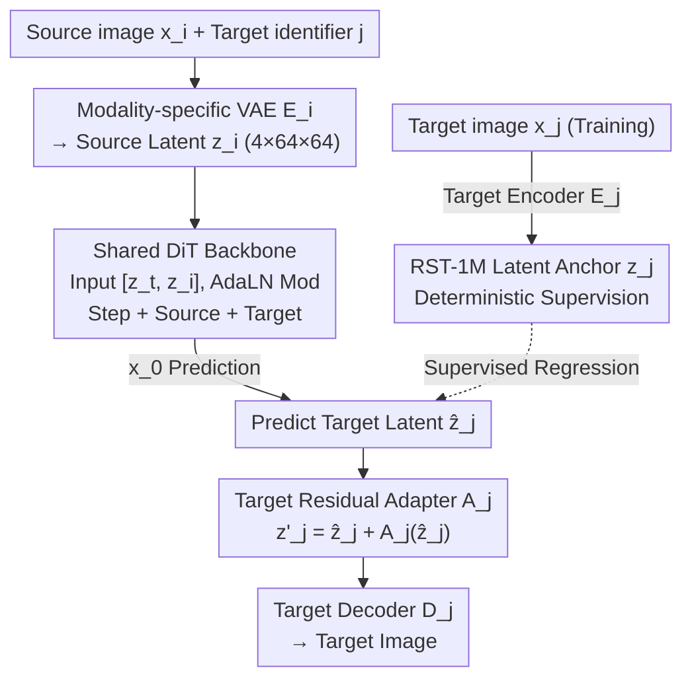

# Any2Any: Unified Arbitrary Modality Translation for Remote Sensing

**Conference**: ICML2026  
**arXiv**: [2603.04114](https://arxiv.org/abs/2603.04114)  
**Code**: https://github.com/MiliLab/Any2Any (Available)  
**Area**: Remote Sensing / Multimodal Generation  
**Keywords**: Arbitrary modality translation, Remote sensing multimodality, Latent diffusion, RST-1M, Residual adapter  

## TL;DR
Any2Any transforms remote sensing (RS) translation between RGB, SAR, NIR, MS, and PAN from a collection of paired models into a unified latent diffusion model within a shared latent space. By utilizing the million-level RST-1M dataset and target modality residual adapters, it achieves superior fidelity and generalization across 14 seen translation directions and multiple unseen modality combinations.

## Background & Motivation
**Background**: Remote sensing increasingly relies on the synergistic observation of multi-source sensors. A single geographic area may simultaneously possess optical RGB, Synthetic Aperture Radar (SAR), Near-Infrared (NIR), Multispectral (MS), and Pansharpening (PAN) modalities, which provide texture, structural, spectral, and all-weather information, respectively. In practical applications, only certain modalities are often available for a given region; thus, synthesizing missing modalities from existing ones is a critical problem for continuous earth observation, disaster monitoring, urban analysis, and downstream recognition tasks.

**Limitations of Prior Work**: Mainstream RS cross-modal translation methods are still trained per direction, such as SAR-to-RGB, NIR-to-RGB, or RGB-to-PAN. While acceptable for one or two modalities, supporting all mutual translation directions as the number of sensors $N$ increases requires approximately $O(N^2)$ direction-specific models. More critically, each directional model learns only on local data, failing to stabilize the reuse of semantic information from other modality pairs and struggling to transfer to modality combinations without paired samples during training.

**Key Challenge**: RS modalities share the same geographic scene but are constrained by different physical imaging mechanisms. RGB, SAR, NIR, MS, and PAN differ in resolution, channel count, sampling geometry, and noise characteristics. If a model is fully shared, the distribution of target modality details easily becomes misaligned; if models are split entirely by direction, cross-modal semantic sharing and scalability are lost. This paper seeks an extensible compromise between "unified semantic mapping" and "preserving sensor differences."

**Goal**: The authors define the task as Any-to-Any remote sensing modality translation: given any source modality and any target modality, the model should complete the translation within a unified framework. This requires solving three sub-problems: constructing a sufficiently connected large-scale cross-modal supervision graph, projecting different sensors into a comparable latent representation space, and using a shared backbone for semantic mapping while employing lightweight modules to correct systematic biases in the target modality.

**Key Insight**: The authors observe that while different sensors have different observation forms, they point to the same underlying geographic semantic scene. As long as spatially registered samples can provide "latent space anchors," cross-modal generation can be transformed from unstable marginal distribution matching into supervised regression of target modality latents. This perspective is well-suited for RS, which naturally emphasizes geographic alignment and physical scale consistency.

**Core Idea**: Modality-specific VAEs establish a unified latent space, followed by a shared DiT backbone conditioned on source/target modalities to predict target latents. Finally, target modality residual adapters perform minor calibrations, compressing arbitrary RS modality translation into a single unified model.

## Method
The Any-to-Any method can be viewed as a three-stage framework: "align representations, shared translation, then refine for the target." Instead of learning generators for all directions in pixel space, the paper first assigns each modality its own encoder and decoder to project images of varying resolutions and channel structures into a unified latent representation. Subsequently, a shared Diffusion Transformer learns the semantic mapping from source to target within this latent space. Since each target modality's VAE latent space retains its own distributional characteristics, the model introduces target-indexed residual adapters to push the latents output by the shared backbone back into regions the target decoder handles best.

### Overall Architecture
The input consists of a source RS image $x_i$ (e.g., SAR or NIR) and a target modality identifier $j$ (e.g., RGB or MS). The model first uses the source encoder $E_i$ to obtain source latent $z_i$. During training, the target image $x_j$ passes through the target encoder $E_j$ to obtain target latent $z_j$, which serves as a supervision anchor. The diffusion backbone receives the noisy target latent $z_t$ concatenated channel-wise with the source latent $z_i$. It modulates the DiT’s AdaLN layers via embeddings for the timestep, source modality, and target modality to directly predict the clean target latent $\hat{z}_j$. Finally, the target modality adapter $A_j$ performs residual calibration on $\hat{z}_j$ before the target decoder $D_j$ reconstructs the target image.

In terms of complexity, traditional paired models require independent networks for every direction; Any2Any maintains only one shared semantic backbone, plus one VAE and a minimal target adapter per modality. Consequently, adding a new modality primarily adds modality-related projection/decoding components rather than increasing the number of translation directions quadratically.

### Key Designs
1. **RST-1M Latent Anchors: Converting Vague Generation to Supervised Latent Regression**

	The most difficult aspect of arbitrary modality translation is that, given a source image, the "correct" target image is not a style but a specific rendering of the same geographic scene under a different sensor. Methods relying only on adversarial or distribution matching often produce results that "look" like the target domain but fail to match ground features. Any2Any bypasses this ambiguity using the RST-1M dataset, which aggregates data from SEN1-2, SEN12MS, CACo, SpaceNet-3, and SpaceNet-5, covering RGB, SAR, NIR, MS, and PAN across seven cross-modal pairings. For a source image $x_i$, the spatially aligned target $x_j$ is encoded into $z_j=E_j(x_j)$. The paper treats this latent as a deterministic anchor in the target distribution, training the model to predict values close to $z_j$. Thus, cross-modal mapping shifts from marginal distribution matching to specific scene latent regression, stabilizing the semantic consistency of boundaries, roads, water, and buildings—features RS translation values over natural image style transfer.

2. **Modality-Specific VAE Encoding + Shared DiT Semantic Mapping: Decoupling Physical Differences and Semantic Conversion**

	Sensors differ in channel counts, resolution, geometry, and noise. In a pixel-level generator, low-level physical differences entangle with high-level semantic conversion. Any2Any decouples these: each modality has independent VAE encoders and decoders to absorb specific imaging statistics and unify inputs into $4 \times 64 \times 64$ latent representations (trained with reconstruction, perceptual, and KL losses). Once VAEs are frozen, a shared Diffusion Transformer (DiT) learns semantic mappings for all directions in this unified space. The DiT input is $[z_t, z_i]$, and the condition vector is derived from summing timestep, source, and target embeddings via an MLP to modulate AdaLN. This allows VAEs to focus on low-level differences while the shared DiT focuses on high-level geographic semantics, enabling different directions to reuse the same mapping capability.

3. **$x_0$ Prediction and Target Residual Adapter: Stabilizing Structure and Refining Target Bias**

	Standard diffusion models often predict noise residuals, but the paper finds that noise prediction yields unstable boundaries when source/target sensors differ significantly. Any2Any has the DiT directly predict the clean target latent $\hat{z}_j=f_\theta([z_t,z_i],c)$ (i.e., $x_0$ prediction), using the structured target as supervision. However, because the shared backbone must account for all directions, its output may systematically shift from what a specific target VAE decoder expects. A target residual adapter $A_j$—a compact convolutional network with a zero-initialized final layer (initially an identity map)—performs a small calibration: $z'_j=\hat{z}_j+A_j(\hat{z}_j)$. Training uses stop-gradient to isolate calibration losses, preventing them from perturbing the shared backbone. This maintains the backbone's cross-direction generalization while ensuring target details are not blurred by multi-directional averaging.

### Loss & Training
Training involves two key stages. The first stage trains modality-specific VAEs for high-quality reconstruction in a unified latent space. The objective is $L_{VAE}=L_{rec}+\gamma L_{lpips}+\beta L_{KL}$. For RGB, perceptual weight $\gamma=1.0$ is used, while it is set to $0$ for other modalities; KL weight is $10^{-5}$.

The second stage freezes the VAEs and trains the shared DiT and adapters. The diffusion backbone utilizes the $target$ latent $x_0$ prediction loss $L_{z0}$ to stay close to anchor $z_j$. The adapter uses $L_{calib}=\|\hat{z}_j+A_j(sg(\hat{z}_j))-z_j\|_2^2$ for latent space calibration. The total objective is $L_{total}=L_{z0}+\lambda L_{calib}$ ($\lambda=1.0$ in experiments). Architectures used include DiT-S/4, DiT-B/4, and DiT-L/4. Training uses a global batch size of 384, with 250-step DDIM sampling during inference.

## Key Experimental Results

### Main Results
The paper evaluates 14 seen translation directions on the RST-1M test set using PSNR, SSIM, and RMSE. Baselines like Pix2Pix, Pix2PixHD, BBDM, ControlNet, and LBM are trained as 14 separate models, whereas Any2Any uses one unified model. Despite this, Any2Any-L leads in most metrics.

| Translation Direction | Metric | Any2Any-L | Strongest Baseline | Gain / Diff |
|----------|------|-----------|--------------|-------------|
| SAR → RGB | PSNR / RMSE | 25.20 / 16.85 | BBDM: 19.50 / 31.02 | PSNR +5.70, RMSE -14.17 |
| NIR → RGB | PSNR / RMSE | 27.03 / 13.70 | BBDM: 20.39 / 29.59 | PSNR +6.64, RMSE -15.89 |
| MS → RGB | PSNR / RMSE | 33.22 / 6.45 | BBDM: 26.39 / 12.76 | PSNR +6.83, RMSE -6.31 |
| RGB → PAN | PSNR / RMSE | 33.45 / 9.47 | LBM: 27.02 / 13.30 | PSNR +6.43, RMSE -3.83 |
| MS → NIR | PSNR / RMSE | 29.14 / 10.26 | LBM: 19.00 / 34.33 | PSNR +10.14, RMSE -24.07 |

Any2Any’s advantage is stable across SAR, optical, NIR, MS, and PAN. Particularly in tasks involving spectral conversion (MS → NIR, MS → RGB), the unified latent space seems to accumulate more transferable geographic structural and spectral relationships from multi-directional supervision.

| Model Scale | SAR→RGB PSNR / RMSE | NIR→RGB PSNR / RMSE | MS→RGB PSNR / RMSE | RGB→PAN PSNR / RMSE | Observations |
|----------|----------------------|----------------------|---------------------|----------------------|------|
| Any2Any-S | 22.25 / 23.45 | 23.01 / 21.25 | 29.81 / 9.23 | 31.30 / 11.27 | Small model already exceeds most paired baselines |
| Any2Any-B | 24.35 / 18.42 | 26.02 / 15.27 | 32.35 / 7.07 | 33.03 / 9.87 | Synchronous improvement across directions as backbone grows |
| Any2Any-L | 25.20 / 16.85 | 27.03 / 13.70 | 33.22 / 6.45 | 33.45 / 9.47 | Largest model achieves strongest overall performance |

### Ablation Study
Ablations focus on the residual adapter, incremental training, and unified multi-direction training. Values are reported for SAR → RGB.

| Config | Training Direction / Strategy | PSNR | RMSE | Description |
|------|----------------|------|------|------|
| Setting 1 | SAR→RGB, w/o adapter | 20.68 | 28.51 | Lacks target latent calibration |
| Setting 2 | SAR→RGB, w/ adapter | 20.88 | 27.89 | Adapter provides +0.20 PSNR and -0.62 RMSE |
| Setting 3 | SAR↔RGB, from scratch | 19.63 | 32.83 | Bi-directional training from scratch is unstable |
| Setting 4 | SAR↔RGB, incremental | 21.44 | 25.87 | Better than from scratch: +1.81 PSNR, -6.96 RMSE |
| Setting 5 | SAR→All connected | 22.06 | 24.00 | Multi-direction training further improves SAR→RGB |
| Setting 6 | All connected→RGB | 21.36 | 26.32 | Another multi-direction setup also superior to single |
| Setting 7 | Any→Any, 14 directions | 22.25 | 23.45 | Unified training on all directions is best |

### Key Findings
- The residual adapter provides stable gains by correcting target latent misalignment with minimal parameters.
- Incremental training outperforms training from scratch, indicating that geographic structures learned in simpler directions transfer to new ones.
- Multi-directional training does not dilute SAR→RGB performance but strengthens it, providing additional supervision anchors.
- Zero-shot experiments show that Any2Any generates semantically reasonable results for combinations (e.g., SAR-PAN) not present in paired training data, suggesting the model learns cross-modal structures via graph connectivity.

## Highlights & Insights
- **Re-defining RS translation as unified inference on a connected modality graph**: The contribution lies in extending the task to Any-to-Any, which better reflects real-world systems where arbitrary modalities might be missing.
- **Strategic Design of RST-1M**: By using shared modalities (like RGB) to link disparate datasets into a graph, the authors pragmatic approach explains why the model generalizes to unseen combinations via graph transitivity.
- **Clear Separation of Duties**: VAEs handle physical imaging discrepancies, DiT handles shared semantic mapping, and adapters handle target distribution calibration.
- **Experience in Multi-Direction Training**: In this context, multiple directions act as regularizers and extra supervision sources, serving as a bridge to learn geographic semantics.

## Limitations & Future Work
- RST-1M is aggregated from public data; robustness in uncovered regions, extreme weather, or unconventional sensors requires further validation.
- Generalization relies on graph connectivity; truly isolated or highly divergent new sensors may still require additional anchors.
- Inference speed (250-step DDIM) remains high for large-scale production, although the model count is reduced from $O(N^2)$ to $O(1)$.
- Quantifiable verification on downstream tasks (segmentation, detection) is currently missing.
- Zero-shot results are qualitative; future work should introduce physical consistency constraints or expert annotations to evaluate unseen directions.

## Related Work & Insights
- **vs Pix2Pix / Pix2PixHD**: GAN-based methods require separate models per direction and often suffer from boundary misalignment in RS cross-sensor tasks.
- **vs BBDM / LBM**: These diffusion/bridge models offer higher quality but are typically domain-pair fixed. Any2Any shifts the focus to target anchor regression within a multi-modal space.
- **vs ControlNet / T2I-Adapter**: While similar in "lightweight calibration," Any2Any’s adapter focuses on correcting latent distribution bias for specific RS target modalities rather than adding generic conditions.
- **Inspiration for RS Foundation Models**: Multimodal RS doesn't strictly require perfectly co-registered all-in-one datasets. A sufficiently connected graph allows models to acquire cross-path transfer capabilities through a shared latent space.

## Rating
- Novelty: ⭐⭐⭐⭐⭐ First to formalize RS Any-to-Any translation in a unified framework.
- Experimental Thoroughness: ⭐⭐⭐⭐☆ Extensive seen directions and ablations; unseen directions remain qualitative.
- Writing Quality: ⭐⭐⭐⭐☆ Clear motivation and framework; some dataset details require cross-referencing with supplements.
- Value: ⭐⭐⭐⭐⭐ Highly valuable for multi-sensor imputation and unified earth observation models.

<!-- RELATED:START -->

## Related Papers

- [\[ICCV 2025\] SkySense V2: A Unified Foundation Model for Multi-Modal Remote Sensing](../../ICCV2025/remote_sensing/skysense_v2_a_unified_foundation_model_for_multi-modal_remote_sensing.md)
- [\[CVPR 2026\] GeoCoT: Towards Reliable Remote Sensing Reasoning with Manifold Perspective](../../CVPR2026/remote_sensing/geocot_towards_reliable_remote_sensing_reasoning_with_manifold_perspective.md)
- [\[CVPR 2026\] UniGeoSeg: Towards Unified Open-World Segmentation for Geospatial Scenes](../../CVPR2026/remote_sensing/unigeoseg_towards_unified_open-world_segmentation_for_geospatial_scenes.md)
- [\[CVPR 2026\] UniGeoRS: A Unified Benchmark for Tri-view Geo-Localization](../../CVPR2026/remote_sensing/unigeors_a_unified_benchmark_for_tri-view_geo-localization.md)
- [\[CVPR 2026\] ChangeBridge: Spatiotemporal Image Generation with Multimodal Controls for Remote Sensing](../../CVPR2026/remote_sensing/changebridge_spatiotemporal_image_generation_with_multimodal_controls_for_remote.md)

<!-- RELATED:END -->
