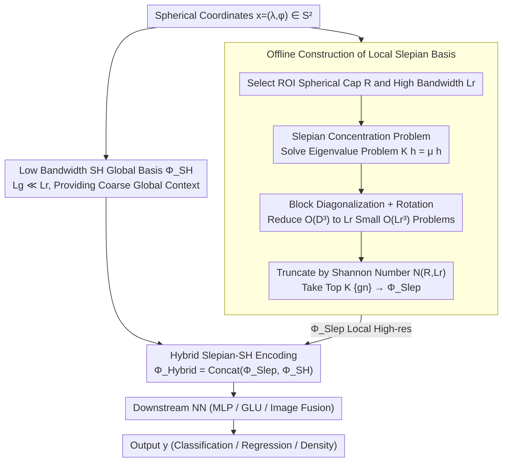

# Localized, High-resolution Geographic Representations with Slepian Functions

**Conference**: ICML 2026  
**arXiv**: [2602.00392](https://arxiv.org/abs/2602.00392)  
**Code**: https://github.com/arjunarao619/SlepianPosEnc (Available)  
**Area**: Remote Sensing / Geographic Representation / Positional Encoding  
**Keywords**: Slepian Functions, Spherical Harmonics, Positional Encoding, Local High-resolution, Geographic Machine Learning

## TL;DR
This paper constructs a geographic positional encoder using spherical Slepian functions to concentrate representation capacity within a Region of Interest (ROI). It proposes a hybrid Slepian-Spherical Harmonic encoding to balance local high resolution with global coarse-grained context, consistently outperforming mainstream baselines such as SH, Wavelet, and RFF across five classification, regression, and image-enhanced prediction tasks.

## Background & Motivation
**Background**: Standard practice in geographic machine learning involves embedding latitude and longitude $(\lambda, \phi) \in S^2$ into a continuous function $\Phi(x)$, which is then fed into an MLP for downstream prediction. Typical choices include grid-cell style multi-scale sinusoidal encodings (Space2Vec), Double Fourier Sphere series (SphereC/M), Random Fourier Features (RFF), and natively defined Spherical Harmonics (SH) on the sphere. SatCLIP, which uses SH for large-scale pre-training, is currently recognized as a universal global positional encoder.

**Limitations of Prior Work**: All these encodings distribute the "resolution budget" uniformly across the globe. To capture city-level details ($\sim$ several kilometers), the global resolution must be increased simultaneously, causing the feature dimension to expand quadratically by $(L+1)^2$, leading to prohibitive memory and computational costs. Furthermore, the recurrence of associated Legendre polynomials in SH is numerically unstable; normalization constants $N_{\ell m} \sim \ell^{-m}$ decay rapidly, causing NaNs at $L \gtrsim 40$ in FP32. Consequently, the practical resolution of SH is limited to approximately $20000/40 = 500$ km, which is insufficient for local tasks like California housing prices or Japanese prefectures.

**Key Challenge**: A structural trade-off exists between "global completeness" and "local high resolution" on the sphere. To achieve global utility, a complete orthogonal basis must span the entire sphere; to achieve local high resolution, one must use exponentially many dimensions for forced refinement.

**Goal**: (1) Identify basis functions that concentrate energy within a user-specified ROI under a fixed bandwidth; (2) Seamlessly integrate this basis with global SH to retain global context; (3) Ensure the representation is pole-safe; (4) Scale computationally to resolutions like $L_r \sim 256$, where SH is unusable.

**Key Insight**: A classic concentration problem exists in signal processing (Slepian & Pollak, 1961): among all band-limited functions, which ones maximize energy concentration in a given interval? Extending this to the sphere (Simons et al. 2006) yields spherical Slepian functions, traditionally used for "local signal analysis" in geophysics (e.g., gravity fields, ice sheet changes). This paper shifts the perspective: rather than using Slepian functions to analyze observed signals, it treats them as a positional encoding basis to learn local representations directly.

**Core Idea**: Project the band-limited SH subspace $\mathcal{H}_{L_r}$ onto the ROI to obtain a concentration matrix $K$. Take the first $K = \lceil N(R,L_r) \rceil$ eigenvectors as the positional encoding basis and concatenate them with a low-bandwidth global SH basis. This enables "local high-resolution Slepian and global low-resolution SH."

## Method
The core of the methodology involves reformulating the spherical concentration problem as an eigenvalue problem, making it computable at high bandwidths using spherical caps, and finally concatenating local Slepian and global SH into a hybrid encoding for the MLP.

### Overall Architecture
The input consists of spherical coordinates $x = (\lambda, \phi) \in S^2$. The encoder $\Phi(x)$ generates a $D$-dimensional feature, which is passed through a Neural Network (MLP / GLU / bottleneck fused with image embeddings) to output a label $y$. This paper focuses on replacing $\Phi$ without altering the NN. The pipeline consists of four steps: (A) Select one or more ROI spherical caps $R_c$ and a high bandwidth $L_r$, pre-calculate the spherical cap Slepian eigenfunctions $\{g_n\}$ sorted by concentration eigenvalues $\mu_n$, and truncate them by the Shannon number; (B) Select a low bandwidth $L_g \ll L_r$ to compute the global SH basis $\Phi_{\text{SH}}$; (C) During online inference, concatenate the Slepian evaluations for each ROI with the global SH evaluations to form $\Phi_{\text{Hybrid}}(x)$; (D) Feed the result into the downstream NN.

### Key Designs

**1. Slepian Concentration Problem: Selecting Orthogonal Bases with Energy Concentrated in the ROI**

Standard spherical encodings distribute resolution budget uniformly. To see a city clearly, global resolution must increase, causing the dimension to explode by $(L+1)^2$. Slepian functions instead select basis functions that maximize energy concentration in the ROI. Defining the concentration ratio $\mu = \int_R |h(x)|^2 ds / \int_{S^2} |h(x)|^2 ds \in [0,1)$, maximizing it is equivalent to solving the eigenvalue problem $K h = \mu h$ for a $D_{L_r} \times D_{L_r}$ symmetric concentration matrix $K$, where $K_{\ell m, \ell' m'} = \int_R Y_\ell^m Y_\ell'^{m'} ds$. The eigenvalues exhibit a sharp drop-off (the "Slepian transition") from $\mu_n \approx 1$ to $\mu_n \approx 0$ at the Shannon number $N(R,L_r) = \mathrm{tr}(K) \approx \frac{\text{area}(R)}{4\pi}(L_r+1)^2$. Taking the first $K = \lceil N(R,L_r)\rceil$ eigenfunctions $\{g_n\}$ yields the encoding $\Phi_{\text{Slep}}(x) = [g_1(x), \dots, g_K(x)]^\top$.

The advantage is that the Shannon number naturally translates "region + bandwidth" into the "number of independent modes the region can accommodate," providing an intrinsic upper bound for sparsity. For an area like Sri Lanka ($f_R \approx 1.29 \times 10^{-4}$), $L_r = 256$ requires only $K \approx 9$ Slepian modes, whereas the corresponding global SH would require $D_{L_r} \approx 6.6\times 10^4$ dimensions.

**2. Spherical Cap Slepian and High-Bandwidth Computability: Using Rotation to Scale Calculations**

Directly calculating a dense $K$ matrix for an arbitrary ROI at $L_r = 256$ is infeasible. The authors restrict ROIs to spherical caps with center $c$ and angular radius $\Theta$. In this axisymmetric setting, the concentration matrix becomes block-diagonal by order $m$, with each block size $\leq L_r$. The Shannon number is given by $N_\Theta(L_r) = \frac{1-\cos\Theta}{2}(L_r+1)^2$, where $\Theta$ directly controls the "local information budget." Implementation involves calculating the cap Slepian once at a standard position and using spherical rotation to shift it to any target center.

**3. Hybrid Slepian-SH Encoding and Pole Safety: Parallelizing Local and Global Scales**

Pure Slepian functions are nearly zero outside the ROI, which fails for tasks like global pre-training or cross-domain species distribution. Pure SH is limited by numerical instability. The authors concatenate them: $\Phi_{\text{Hybrid}}(x) = \mathrm{Concat}(\Phi_{\text{Slep}}(x), \Phi_{\text{SH}}(x))$, where $\Phi_{\text{SH}}$ uses a low bandwidth $L_g \ll L_r$ to provide coarse global context. For multiple ROIs, multiple $\Phi_{\text{Slep}}^{(c)}$ are concatenated. Pole safety is guaranteed because each $g_n = \sum_{\ell,m} h_{\ell m}^{(n)} Y_\ell^m$ is a finite linear combination of spherical harmonics, which are analytic at the poles.

### Loss & Training
The positional encoding is non-parametric (Slepian bases are pre-calculated offline). Training occurs only in the downstream NN. Regression/classification uses a 3-layer MLP with ReLU and dropout (0.1). Building density regression uses a 2-layer bottleneck to fuse positional encodings with frozen AlphaEarth/Galileo image features. Species distribution follows the SINR framework with presence-only training and global pseudo-negative sampling.

## Key Experimental Results

### Main Results
Across five tasks and over a dozen baselines, the key findings are identified below.

| Dataset | Metric | Ours (Hybrid Slepian) | Strong Baseline SphereC / Theory | Gain |
| :--- | :--- | :--- | :--- | :--- |
| California Housing (Regression) | $R^2 \uparrow$ | Significantly Best | SphereC 0.53 / SH(L=40) Weak | Substantial vs. dense RFF |
| Japan Prefectures (47 classes) | Acc $\uparrow$ | Best | Space2Vec 0.84 | Superior on 2 km boundary hard samples |
| Arctic MSS (Sea Surface Height) | $R^2 \uparrow$ | Best | SphereM 0.91 | Validates pole-safety |
| OpenBuildings Density Regression | $R^2$ at $\sigma$ 0–40 km | All Lead | SH degrades at small $\sigma$ | High-frequency details from Slepian |
| Species (eBird S&T / IUCN) | mAP $\uparrow$ | Best / Superior even out-of-cap | Pure Slepian fails out-of-cap | Demonstrates hybrid necessity |

### Ablation Study
| Configuration | Key Metric | Description |
| :--- | :--- | :--- |
| Full Hybrid Slepian (L_r=120, L_g=10) | **Best** | Complete model |
| Slepian only (No Global SH) | Significant drop | Fails out-of-cap for global tasks (e.g., IUCN) |
| SH only, High L | Numerical collapse | $L \gtrsim 40$ produces NaNs in FP32 |
| High-dim Planar RFF | Cal: 0.42 / JP: 0.59 | Simple dimension increase cannot replace spatio-spectral priors |

### Key Findings
- **Spatio-spectral concentration is the true driver of performance**, not just high dimensionality: Planar RFF with 2000 dimensions still loses to Slepian with 9-200 dimensions.
- **Physical significance of $N(R,L_r)$**: Using more Slepian modes than the Shannon number introduces noise; truncation at $K$ aligns with the region's intrinsic dimension.
- **Pole-safety**: Performance on Arctic tasks is comparable to pure SH, proving the encoding does not introduce artifacts at the poles.
- **Temporal Extension**: The use of DPSS (Discrete Slepian Sequences) for temporal encoding also outperforms Fourier methods in climate simulations.

## Highlights & Insights
- Translating a decades-old tool from geophysics (local concentration bases) into "positional encoding" solves an open problem in geographic ML.
- The "Region $\to$ Shannon Number $\to$ Dimension" chain provides clean capacity allocation semantics; dimensionality is no longer an arbitrary hyperparameter but an intrinsic quantity.
- The spherical cap rotation trick provides the bridge from "elegant theory" to "engineering utility" by reducing $O(D^3)$ complexity.

## Limitations & Future Work
- **ROI Specification**: Requires manual selection of cap center and radius; adaptive or learnable ROI selection is a logical next step.
- **Geometry Constraints**: Spherical caps simplify math but may not fit complex shapes like elongated coastlines or administrative boundaries.
- **Hyperparameter Tuning**: $L_r$ and $L_g$ must be tuned separately; principled guidance for optimal combinations across tasks is needed.
- **Temporal Scaling**: DPSS was only verified on limited climate data; performance on irregular sampling or decadal scales remains to be tested.

## Related Work & Insights
- **vs SatCLIP / Pure SH**: Both are natively spherical and pole-safe, but Slepian scaling to $L_r = 256$ bypasses the numerical limits that hinder SatCLIP on local tasks.
- **vs Spherical Wavelets**: Wavelets often rely on stereographic projection, leading to polar distortion; Slepian functions, as linear combinations of SH, are more "spherical-native."
- **vs RFF / Space2Vec**: RFF lacks the ability to "point" capacity toward specific regions; Slepian matches several thousand SH dimensions with just a handful of modes in small regions.

## Rating
- **Novelty**: ⭐⭐⭐⭐⭐ Repositioning spherical Slepian functions as a positional encoding basis is a rare and effective cross-disciplinary insight.
- **Experimental Thoroughness**: ⭐⭐⭐⭐ Covers regression, classification, polar, and spatio-temporal tasks, though complex non-cap ROIs remain unexplored.
- **Writing Quality**: ⭐⭐⭐⭐ Clear explanation of Shannon numbers and concentration problems, though some engineering details are relegated to the appendix.
- **Value**: ⭐⭐⭐⭐⭐ Provides an open-source, plug-and-play, and mathematically interpretable localized high-resolution encoder for remote sensing and ecology.

<!-- RELATED:START -->

## Related Papers

- [\[CVPR 2026\] YieldSAT: A Multimodal Benchmark Dataset for High-Resolution Crop Yield Prediction](../../CVPR2026/remote_sensing/yieldsat_a_multimodal_benchmark_dataset_for_high-resolution_crop_yield_predictio.md)
- [\[CVPR 2026\] ZoomEarth: Active Perception for Ultra-High-Resolution Geospatial Vision-Language Tasks](../../CVPR2026/remote_sensing/zoomearth_active_perception_for_ultra-high-resolution_geospatial_vision-language.md)
- [\[NeurIPS 2025\] Cloud4D: Estimating Cloud Properties at a High Spatial and Temporal Resolution](../../NeurIPS2025/remote_sensing/cloud4d_estimating_cloud_properties_at_a_high_spatial_and_temporal_resolution.md)
- [\[CVPR 2026\] GeoAgent: Learning to Geolocate Everywhere with Reinforced Geographic Characteristics](../../CVPR2026/remote_sensing/geoagent_learning_to_geolocate_everywhere_with_reinforced_geographic_characteris.md)
- [\[ICML 2025\] High-Resolution Live Fuel Moisture Content (LFMC) Maps for Wildfire Risk from Multimodal Earth Observation Data](../../ICML2025/remote_sensing/high-resolution_live_fuel_moisture_content_lfmc_maps_for_wildfire_risk_from_mult.md)

<!-- RELATED:END -->
