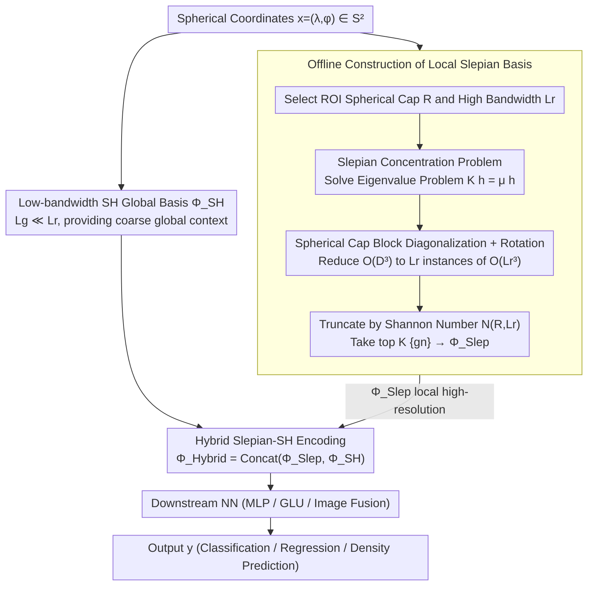

# Localized, High-resolution Geographic Representations with Slepian Functions

**Conference**: ICML 2026  
**arXiv**: [2602.00392](https://arxiv.org/abs/2602.00392)  
**Code**: https://github.com/arjunarao619/SlepianPosEnc (Available)  
**Area**: Remote Sensing / Geographic Representation / Positional Encoding  
**Keywords**: Slepian functions, Spherical harmonics, Positional encoding, Local high-resolution, Geographic machine learning

## TL;DR
This paper constructs a geographic positional encoder that concentrates representation capacity on a Region of Interest (ROI) using spherical Slepian functions. It proposes a Slepian-Spherical Harmonic (SH) hybrid encoding to simultaneously capture local high-resolution details and global coarse-grained context. It consistently outperforms mainstream baselines such as SH, Wavelets, and RFF across five classification, regression, and image-enhancement prediction tasks.

## Background & Motivation
**Background**: Embedding latitude and longitude $(\lambda, \phi) \in S^2$ into a continuous function $\Phi(x)$, followed by an MLP for downstream prediction, is the standard practice in geographic machine learning. Typical choices include grid-cell-style multi-scale sinusoidal encodings (Space2Vec), the Double Fourier Sphere series (SphereC/M), Random Fourier Features (RFF), and Spherical Harmonics (SH) defined natively on the sphere. SatCLIP uses SH for large-scale pre-training and is currently recognized as a universal global positional encoder.

**Limitations of Prior Work**: All these encodings distribute the "resolution budget" uniformly across the entire globe. To resolve details at a city level ($\sim$ several kilometers), the global resolution must be increased globally, causing the feature dimensionality to expand quadratically as $(L+1)^2$, which leads to prohibitive memory and computational costs. Furthermore, the recurrence of associated Legendre polynomials in SH is numerically unstable; the normalization constants $N_{\ell m} \sim \ell^{-m}$ decay rapidly, causing numerical overflow in FP32 when $L \gtrsim 40$. With lower thresholds for mixed-precision training, the stable resolution for SH is capped at approximately $20000/40 = 500$ km, which is insufficient for local tasks like California housing prices or Japanese prefectures that require ten-kilometer scales.

**Key Challenge**: There is a structural trade-off between "global completeness" and "local high resolution" on the sphere. To achieve global utility, a complete orthogonal basis must be spread across the sphere, where each basis function spans the entire domain. To achieve local high resolution, one must spend exponential dimensions to force refinement.

**Goal**: (1) Find a basis function that concentrates the vast majority of energy within a user-specified ROI for a fixed bandwidth; (2) Ensure this basis can seamlessly concatenate with global SH to retain global context; (3) Ensure it is pole-safe; (4) Scale computationally to resolutions like $L_r \sim 256$, which are unattainable for standard SH.

**Key Insight**: There is a classic concentration problem in signal processing (Slepian & Pollak, 1961): among all band-limited functions, which ones maximize energy concentration within a given interval? Extending this to the sphere (Simons et al. 2006) yields spherical Slepian functions, which have been used for "localized signal analysis" in geophysical tasks like Earth's gravity field and ice sheet mass changes. The authors' shift is: instead of using Slepian functions to analyze observed signals, use them as a positional encoding basis to directly learn local representations.

**Core Idea**: Project the band-limited SH subspace $\mathcal{H}_{L_r}$ onto an ROI to obtain a concentration matrix $K$. Take the first $K = \lceil N(R,L_r) \rceil$ eigenvectors as the positional encoding basis. By concatenating this with a low-bandwidth global SH basis, one can achieve "high-resolution Slepian locally and low-resolution SH globally."

## Method
The core of the paper involves rewriting the spherical concentration problem as an eigenvalue problem, making it computable at high bandwidths using spherical caps, and finally concatenating local Slepian and global SH into a hybrid encoding for the MLP.

### Overall Architecture
The input is spherical coordinates $x = (\lambda, \phi) \in S^2$. The encoder $\Phi(x)$ provides a $D$-dimensional feature, which is then passed through an arbitrary NN (MLP / GLU / bottleneck fused with image embeddings) to output the label $y$. This paper does not change the NN but only replaces $\Phi$. The pipeline consists of four steps: (A) Select one or more ROI spherical caps $R_c$ and a high bandwidth $L_r$, pre-solve for the spherical cap Slepian eigenfunctions $\{g_n\}$, sort them by concentration eigenvalues $\mu_n$, and truncate according to the Shannon number; (B) Select a low bandwidth $L_g \ll L_r$ to calculate the global SH basis $\Phi_{\text{SH}}$; (C) During online inference, concatenate the Slepian evaluation values of each ROI with the global SH evaluation values to form $\Phi_{\text{Hybrid}}(x)$; (D) Feed this into the downstream NN for classification, regression, or fusion with image features. In the figure below, the offline branch (Designs 1+2) handles solving the "region + bandwidth" into a set of local bases concentrated in the ROI, while the global SH branch provides coarse context, both operating in parallel at the hybrid encoding stage (Design 3):

### Key Designs

**1. Slepian Concentration Problem and Basis Construction: Selecting orthogonal bases in the band-limited subspace that fall almost entirely within the ROI**

Spherical encoding spreads the "resolution budget" uniformly. Resolving a city requires increasing the global resolution, causing dimensions to expand by $(L+1)^2$. Slepian's approach is the inverse: picking basis functions in the band-limited subspace that maximize "energy concentration in the ROI." Defining the concentration ratio $\mu = \int_R |h(x)|^2 ds / \int_{S^2} |h(x)|^2 ds \in [0,1)$, maximizing it is equivalent to an eigenvalue problem for a $D_{L_r} \times D_{L_r}$ symmetric concentration matrix $K$, where $K_{\ell m, \ell' m'} = \int_R Y_\ell^m Y_{\ell'}^{m'} ds$. Sorting eigenvalues in descending order shows a sharp transition where $\mu_n \approx 1$ drops suddenly to $\mu_n \approx 0$. This transition point is the Shannon number $N(R,L_r) = \mathrm{tr}(K) \approx \frac{\text{area}(R)}{4\pi}(L_r+1)^2$. Taking the first $K = \lceil N(R,L_r)\rceil$ eigenfunctions $\{g_n\}$ yields the positional encoding $\Phi_{\text{Slep}}(x) = [g_1(x), \dots, g_K(x)]^\top$.

The beauty is that the Shannon number automatically translates "region + bandwidth" into the "number of independent modes the region can accommodate," acting as a natural upper bound for intrinsic dimensionality—the sparsification is intrinsic rather than manual pruning. For a small area like Sri Lanka ($f_R \approx 1.29 \times 10^{-4}$), only $K \approx 9$ Slepian modes are needed at $L_r = 256$, whereas the corresponding global SH would require $D_{L_r} \approx 6.6\times 10^4$ dimensions.

**2. Spherical Cap Slepian and High-Bandwidth Computability: Scaling large eigenvalue problems via spherical caps and rotation**

Directly calculating the dense $K$ matrix ($\sim 6.6\times 10^4$ dimensions) for an arbitrary ROI at $L_r = 256$ is infeasible in terms of memory and numerical precision. The authors restrict ROIs to spherical caps with center $c$ and angular radius $\Theta$. In this axisymmetric setup, the concentration matrix is block-diagonalized by order $m$, with each block size not exceeding $L_r$. There is an explicit formula for the number of well-concentrated modes $N_\Theta(L_r) = \frac{1-\cos\Theta}{2}(L_r+1)^2$, allowing $\Theta$ to directly control the "local information budget." Implementation-wise, the spherical cap Slepian is calculated once at a canonical position and then moved to any target center via spherical rotation, preserving the first $N_\Theta(L_r)$ modes.

Block diagonalization reduces the $O(D_{L_r}^3)$ cost into $L_r$ small $O(L_r^3)$ problems. This is the bridge that makes the paper transition from "theoretically elegant" to "engineered for utility"—without it, $L_r$ could not reach 256, and multi-ROI concatenation would be impossible.

**3. Hybrid Slepian-SH Encoding and Pole-Safety: Local high-resolution Slepian and global low-resolution SH in parallel**

Pure Slepian functions are nearly zero outside the ROI, making them unsuitable for tasks requiring global signals like cross-domain species distribution or global pre-training. Pure SH is limited by numerical instability and resolution. The authors parallelize them: $\Phi_{\text{Hybrid}}(x) = \mathrm{Concat}(\Phi_{\text{Slep}}(x), \Phi_{\text{SH}}(x))$, where $\Phi_{\text{SH}}$ uses a low bandwidth $L_g \ll L_r$ to provide coarse "where on Earth" information. For multiple ROIs, each $\Phi_{\text{Slep}}^{(c)}$ is concatenated side-by-side; since Slepian energy does not overlap, cross-regional interference is negligible. Pole-safety comes from the fact that each $g_n = \sum_{\ell,m} h_{\ell m}^{(n)} Y_\ell^m$ is a finite linear combination of spherical harmonics, and since $Y_\ell^m$ is analytic at the poles, $g_n$ is analytic as well. When $R = S^2$, the concentration matrix becomes the identity matrix, and Slepian reduces back to SH.

This decomposes the structural "local vs. global" trade-off into two parallel components. The authors extend this to the temporal dimension using discrete Slepian sequences (DPSS) for time encoding, where the spatio-temporal Shannon number $k_t \approx 2 N_t W$ controls the temporal bandwidth budget, resulting in $\Phi_{\text{ST}}(x,t) = \mathrm{Concat}(\Phi_{\text{SH}}(x), \Phi_{\text{Time}}(t))$.

## Loss & Training
The positional encoding itself is non-parametric (Slepian bases are pre-calculated offline). Training occurs only within the downstream NN. Classification and regression use a 3-layer MLP with ReLU and 0.1 dropout. Building density regression uses a 2-layer bottleneck, concatenating positional encodings with frozen AlphaEarth/Galileo image features. Species distribution follows the SINR framework with presence-only training, global pseudo-negative sampling, and positional predictions serving as spatial priors via element-wise weighting of Xception outputs. All tasks use a unified positional encoding replacement protocol for comparison.

## Key Experimental Results

### Main Results
Across five tasks and over a dozen baselines, the most critical comparisons are summarized below:

| Dataset | Metric | Ours (Hybrid Slepian) | Strong Baselines SphereC / Theory | Gain |
|--------|------|----------------------|-------------------------|------|
| California Housing (Regression) | $R^2 \uparrow$ | Significantly Optimal | SphereC 0.53 / SH(L=40) Weak | Large lead over dense RFF |
| Japan Prefectures (47 Classes) | Acc $\uparrow$ | Best | Space2Vec 0.84 | Clear win on 2 km boundary hard samples |
| Arctic MSS (Arctic Sea Surface Height) | $R^2 \uparrow$ | Best | SphereM 0.91 | Validates pole-safety |
| OpenBuildings Density Regression (4 Regions) | $R^2$ at smoothing $\sigma$ 0–40 km | Leading in all | SH degrades significantly at small $\sigma$ | High-frequency details provided by Slepian |
| Species (eBird S&T / IUCN) | mAP $\uparrow$ | Best / Superior out-of-cap | Pure Slepian collapses outside cap | Demonstrates hybrid necessity |

### Ablation Study

| Configuration | Key Metric | Explanation |
|------|---------|------|
| Full Hybrid Slepian ($L_r=120, L_g=10$) | best | Complete model |
| Slepian only (No global SH) | Significant drop | Near zero outside cap in global tasks/pseudo-negative scenarios |
| SH only, High $L$ | Numerical collapse | $L \gtrsim 40$ in FP32 yields NaNs, SH path is non-viable |
| High-dim Planar RFF | California 0.42 / Japan 0.59 | Simple dimension stacking cannot replace spatio-spectral priors |
| Different NN backbone (MLP / GLU / SIREN) | Stable ranking | Gains come from encoder, not downstream network |

### Key Findings
- The true source of improvement is spatio-spectral concentration, not high dimensionality: Planar RFF with 2000 dimensions is far inferior to Slepian with 9-200 dimensions, showing that "placing capacity correctly" is more vital than "increasing capacity."
- The physical meaning of $N(R,L_r)$ is empirically validated: taking Slepian modes beyond the Shannon number introduces noise, while truncation at the first $K$ aligns with the region's intrinsic dimensionality.
- On polar tasks, hybrid encoding is on par with pure SH, proving that it successfully reduces to SH when $R = S^2$ without introducing new polar artifacts.
- The temporal DPSS extension outperforms Fourier time encoding in ACE climate simulation, suggesting the concentration framework is reusable across modalities.

## Highlights & Insights
- Re-purposing "local concentration bases used for decades in geophysics" as "positional encodings" is a rare, hard-core cross-domain transplant in geographic ML. The cost is simply inverting the perspective: instead of decomposing signals with Slepian, represent coordinates with Slepian.
- The chain "Region → Shannon Number → Dimension" provides a clean semantic for capacity allocation: dimension is no longer a magic hyperparameter but an intrinsic quantity determined by area and bandwidth. This "prior-informed dimensionality" is worth emulating in other spatial data (point clouds, maps, meshes).
- The spherical cap + rotation engineering trick reduces $O(D^3)$ to $L_r$ small $O(L_r^3)$ problems, serving as the bridge to practical utility and facilitating multi-cap concatenation.

## Limitations & Future Work
- ROIs require manual specification of spherical cap center and radius. Tasks that are globally uniform but locally sparse (e.g., randomly distributed rare events) lack obvious ROI partitions; adaptive or learnable ROI selection is a natural next step.
- The spherical cap assumption simplifies geometry but sacrifices boundary shapes (e.g., elongated coastlines, complex administrative borders). Moving to general ROIs would break block diagonalization.
- Hybrid dimensionality requires tuning $L_r$ and $L_g$ separately; no principled guidance is provided for the optimal combination across tasks; Shannon numbers + task priors could be used for automated search.
- Temporal DPSS was only validated on climate data with 6-hour resolution over one year; performance over longer scales (interannual/decadal) and irregular sampling needs testing.

## Related Work & Insights
- **vs. SatCLIP / Pure SH (Klemmer 2025a)**: Both are natively spherical and pole-safe, but this work allows $L_r$ to scale to 256 without numerical collapse, significantly outperforming SatCLIP on local tasks like California housing.
- **vs. Spherical Wavelets (Cai & Balestriero 2025)**: Wavelets rely on stereographic projection, leading to polar distortion; Slepian functions are finite linear combinations of SH, naturally inheriting analyticity and providing a more "spherical-native" multi-resolution scheme.
- **vs. Random Fourier Features**: RFF stacks capacity through high dimensionality (2000 in this paper) but cannot "point" capacity to specific regions. Slepian matches the performance of tens of thousands of SH dimensions using just 9 dimensions in small areas like Sri Lanka.
- **vs. Sphere2Vec / Space2Vec (Mai 2020/2023)**: DFS series have discontinuities at the poles and uniform global resolution; Slepian addresses both polar and local refinement issues, serving as a natural evolution of this line of research.

## Rating
- Novelty: ⭐⭐⭐⭐⭐ Repositioning spherical Slepian from a "signal analysis tool" to a "positional encoding basis" is a sophisticated cross-disciplinary move.
- Experimental Thoroughness: ⭐⭐⭐⭐ Five tasks covering regression/classification/polar/fusion/spatio-temporal, though complex ROIs beyond caps and cross-continental transfer remain unexplored.
- Writing Quality: ⭐⭐⭐⭐ Shannon number and concentration problems are clearly explained; visual mapping between formulas and figures is intuitive; the appendix is heavy while main engineering details are brief.
- Value: ⭐⭐⭐⭐⭐ Directly provides the community with an open-source, plug-and-play, mathematically interpretable local high-resolution encoder, immediately useful for city-scale remote sensing and ecological distribution tasks.

<!-- RELATED:START -->

## Related Papers

- [\[CVPR 2026\] YieldSAT: A Multimodal Benchmark Dataset for High-Resolution Crop Yield Prediction](../../CVPR2026/remote_sensing/yieldsat_a_multimodal_benchmark_dataset_for_high-resolution_crop_yield_predictio.md)
- [\[CVPR 2026\] ZoomEarth: Active Perception for Ultra-High-Resolution Geospatial Vision-Language Tasks](../../CVPR2026/remote_sensing/zoomearth_active_perception_for_ultra-high-resolution_geospatial_vision-language.md)
- [\[NeurIPS 2025\] Cloud4D: Estimating Cloud Properties at a High Spatial and Temporal Resolution](../../NeurIPS2025/remote_sensing/cloud4d_estimating_cloud_properties_at_a_high_spatial_and_temporal_resolution.md)
- [\[ICML 2025\] High-Resolution Live Fuel Moisture Content (LFMC) Maps for Wildfire Risk from Multimodal Earth Observation Data](../../ICML2025/remote_sensing/high-resolution_live_fuel_moisture_content_lfmc_maps_for_wildfire_risk_from_mult.md)
- [\[ICLR 2026\] Measuring the Intrinsic Dimension of Earth Representations](../../ICLR2026/remote_sensing/measuring_the_intrinsic_dimension_of_earth_representations.md)

<!-- RELATED:END -->
