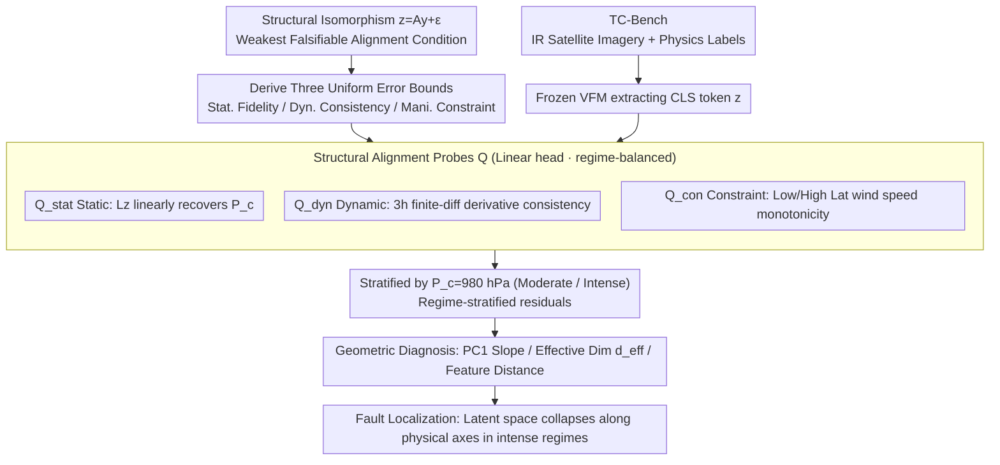

# The Perception-Physics Paradox: Probing Scientific Alignment with TC-Bench

**Conference**: ICML 2026  
**arXiv**: [2605.24782](https://arxiv.org/abs/2605.24782)  
**Code**: https://github.com/CausalLearningAI/tc-bench  
**Area**: Remote Sensing / Vision Foundation Model Evaluation / Representation Learning Diagnosis  
**Keywords**: Scientific Alignment, Structural Isomorphism, Vision Foundation Models, Tropical Cyclones, Probing Evaluation

## TL;DR
The authors observe that Vision Foundation Models (VFMs) "appear" to predict satellite imagery well but collapse along physical axes in extreme regimes. By formalizing "scientific alignment" as "structural isomorphism," they release TC-Bench—a global tropical cyclone benchmark—and a three-tier linear probing suite (Static/Dynamic/Constraint) to reveal representation collapse in frozen backbones like DINO, CLIP, SigLIP, and MAE for intense cyclones where $P_c<980$ hPa.

## Background & Motivation
**Background**: Adapting general Vision Foundation Models to scientific domains (meteorology, ecology, medicine) is a rising trend. The industry standard metric relies on in-distribution accuracy and cross-domain OOD accuracy (e.g., varying geographical regions or agencies). If a VFM maintains OOD predictive performance, it is often interpreted as having "learned invariant physical structures." Benchmarks like Digital Typhoon largely follow this "average case + OOD" evaluation paradigm.

**Limitations of Prior Work**: Tropical cyclone samples are naturally concentrated around moderate intensities ($P_c$ near 1000 hPa). Average errors mask the failure in high-risk intense regimes. Agency-based OOD primarily perturbs visual appearance (banding conventions, reporting habits) rather than physical axes. Consequently, "stable OOD performance" may reflect "visual feature stability" rather than "physical coordinate stability." Existing evaluations fail to distinguish between perceptual robustness and physical utility.

**Key Challenge**: When visual signals saturate (the eyewall morphology of intense cyclones becomes highly similar), visual variance $\to 0$ while physical variables (minimum central pressure $P_c$, maximum sustained wind speed $V_m$) still vary significantly. This creates a paradox of "Perception $\approx$ Invariant / Physics $\neq$ Invariant," which the authors name the **Perception–Physics Paradox**.

**Goal**: To decompose this problem into two tasks: (i) find a minimal falsifiable definition for "scientific alignment"; (ii) provide a testable diagnostic protocol and fair benchmark to identify when, where, and why VFMs collapse.

**Key Insight**: Drawing from Causal Representation Learning (CRL) but weakening the requirements—not insisting on coordinate-wise identifiability, but requiring a unique linear mapping from latent space to physical space, termed **structural isomorphism**. This weak condition corresponds precisely to "recoverability via linear probes."

**Core Idea**: Use the condition that "latent representations can be mapped back to the physical state space across all regimes by the same linear decoder with uniformly bounded residuals" as a necessary condition for scientific alignment. This condition is hierarchicalized into Static Fidelity, Dynamic Consistency, and Manifold Constraint linear probes to measure failures in intense regimes.

## Method

### Overall Architecture
The pipeline consists of four components: (1) formal definitions of "physical system $\mathcal{S}$" and "representation $\mathbf{z}=g(\mathbf{x})$"; (2) definition of structural isomorphism $\mathbf{z}=\mathbf{A}\mathbf{y}+\epsilon_{\mu}(\mathbf{y})$ (linear map $\mathbf{A}$ + bounded residual), proving it implies three population-level error bounds (Static, Dynamic, Constraint); (3) instantiating each bound as a uniform residual $V(g)=\inf_h \sup_{\mu} \mathbb{E}[\psi(h(\mathbf{z}),\mathbf{r})]$ over a restricted proxy class $h\in\mathcal{H}$—the structural alignment probe $\mathcal{Q}$; (4) running linear probes and geometric diagnostics on TC-Bench using frozen backbones to locate failure modes. Inputs are 224×224 infrared satellite images; outputs are regime-stratified probe residual curves with confidence intervals.

### Key Designs

**1. Structural Isomorphism as the Weakest Falsifiable Condition for Scientific Alignment**

The authors tighten the vague concept of "learning physical structure" into a geometric statement: for any regime $\mu\in\mathcal{M}$, there exists an injective linear map $\mathbf{A}\in\mathbb{R}^{d\times m}$ such that $\mathbf{z}=\mathbf{A}\mathbf{y}+\epsilon_{\mu}(\mathbf{y})$, where residuals and their Jacobians are uniformly bounded: $\sup_\mu \mathbb{E}[\|\epsilon_\mu\|]\le\bar{\epsilon}$ and $\sup_\mu \mathbb{E}[\|J_{\epsilon_\mu}\|]\le\bar{\delta}$. Proposition 2.1 derives three uniform error bounds—**Static Fidelity** $\sup_\mu \mathbb{E}\|\mathbf{y}-L\mathbf{z}\|\le\|L\|\bar{\epsilon}$, **Dynamic Consistency** $\sup_\mu \mathbb{E}\|\dot{\mathbf{y}}-L\dot{\mathbf{z}}\|\le\|L\|\bar{\delta}K$, and **Manifold Constraint** $\sup_\mu \mathbb{E}\|\mathcal{P}(L\mathbf{z})\|\le\Lambda_{\mathcal{P}}\|L\|\bar{\epsilon}$, where $L$ is a shared left-inverse decoder. Theorem 2.1 shows this alignment grants an $n$-step interventional replay error $\epsilon_{\text{int}}(n)\le\epsilon_{\text{stat}}+\epsilon_{\text{dyn}}(t_n-t^*)$, linking representation geometry to interventional causal consistency.

**2. Structural Alignment Probes $\mathcal{Q}=(\mathcal{Z},\mathcal{R},\mathcal{H},\psi)$ Suite**

To bridge theory and testing, three probes are instantiated with linear proxy functions to prevent "cheating" via decoder expressivity: $\mathcal{Q}_{\text{stat}}$ uses $\xi_{\text{stat}}=\|h(\mathbf{z})-P_c\|/\sigma(P_c)$ to measure linear recoverability; $\mathcal{Q}_{\text{dyn}}$ uses 3-hour finite differences $\xi_{\text{dyn}}=\|L\Delta\mathbf{z}_t-\Delta\mathbf{y}_t\|$ to test derivative consistency; $\mathcal{Q}_{\text{con}}$ uses monotonicity constraints between low vs. high latitude wind speeds $\Delta V_m$ (derived from gradient wind balance $f\propto\sin\phi$) to test physical coupling. All probes are trained on regime-balanced subsets using a shared linear head and evaluated across Moderate ($P_c \ge 980$ hPa) and Intense ($P_c < 980$ hPa) regimes.

**3. TC-Bench + Geometric Diagnosis of Failure Modes**

The authors release TC-Bench—the first reproducible, versioned global tropical cyclone benchmark (IBTrACS v4r01 + GridSat-B1 IR, 1980–2024, 3-hour resolution, 2601 cleaned trajectories). For geometric profiling of backbones like DINOv3, they calculate three metrics in $P_c$ bins ($N \ge 500$): the relationship between PC1 and $P_c$, effective dimension $d_{\text{eff}}=(\sum_i\lambda_i)^2/\sum_i\lambda_i^2$, and mean pairwise feature distances. Simultaneous drops in these metrics for $P_c < 980$ hPa identify "latent collapse along physical axes" as the root cause.

### Loss & Training
Backbones are not fine-tuned during evaluation. CLS tokens from models (DINOv2/v3, CLIP, SigLIP/2, MAE, and others like VideoMAE, V-JEPA2 in the appendix) serve as representations $\mathbf{z}$. Downstream linear heads $h$ (least squares) are trained with trajectory-level splits to prevent spatio-temporal leakage. Appendix E includes ablations on MLP/Transformer probes, pooling methods, and pixel-level baselines.

## Key Experimental Results

### Main Results: Probing Performance in Moderate vs. Intense Regimes

| Probe | Moderate ($P_c\ge 980$ hPa) | Intense ($P_c<980$ hPa) | Catastrophic ($P_c<920$ hPa) | Description |
|---|---|---|---|---|
| $\mathcal{Q}_{\text{stat}}$ ($\xi_{\text{stat}}$ median) | Low & stable (well below 1.0) | Median & variance rise; catastrophic samples > 1.0 | — | Consistent across 6 VFM families |
| $\mathcal{Q}_{\text{dyn}}$ ($\xi_{\text{dyn}}$) | Stable | Monotonic increase | Peaks observed | Representational derivatives diverge from physics |
| $\mathcal{Q}_{\text{con}}$ ($\psi_{\text{con}}$) | ≈ 20% error | ≈ 55% error | — | Latitude/wind speed ranking violations worsen |

### Ablation Study: DINOv3-base Latent Geometry

| Configuration / bin | PC1 vs. $P_c$ Slope | Effective Dim $d_{\text{eff}}$ | Mean Pairwise Distance | Description |
|---|---|---|---|---|
| Moderate bin ($P_c\ge 980$) | Monotonic | Baseline | Baseline | Physics resolved along principal components |
| Intense bin ($P_c<980$) | Significant compression | ↓ approx. 60% | Concurrent drop | Latent directions collapse into few components |
| Pixel-supervised baseline | — | — | — | **Lower** error than frozen VFMs; signals are recoverable |
| Video Backbones (Appdx E.4) | Collapse observed | — | — | Failure is not exclusive to static pre-training |

### Key Findings
- Failures in the three probes appear across 6 backbone families (DINOv2/3, CLIP, SigLIP/2, MAE), indicating a structural issue rather than a specific loss bias.
- The moderate-to-intense gap persists with non-linear MLP/Transformer probes, proving the issue is not limited to linear head expressivity.
- Pixel-supervised models achieve lower error in the $P_c<980$ hPa regime, confirming that physical signals remain in the data; the failure lies in the VFM representation geometry.
- VFMs that appear robust to agency-based OOD collapse when intensities shift, serving as a counter-example to "OOD robustness implies physical invariance."

## Highlights & Insights
- **Defining the Paradox**: The "Perception–Physics Paradox" provides a concise label for phenomena likely prevalent in other scientific ML domains (wildfire saturation, medical imaging saturation).
- **Formalizing Alignment as a Weak Condition**: By relaxing CRL requirements to "unique linear reparameterization," the authors bridge theoretical alignment with practical linear probing.
- **Diagnosis to Causal Replay**: Theorem 2.1 links static/dynamic alignment to $n$-step interventional replay error, providing a metric for whether a representation is suitable for a world model with do-calculus.
- **Transferable Framework**: The regime-balanced + linear head + pixel baseline methodology can be applied to any scientific ML field where OOD metrics might hide physical collapse.

## Limitations & Future Work
- The conditions provided are necessary but not sufficient; the study covers perception-based world models but not emulator-based ones (e.g., GenCast).
- Counterfactual reasoning is excluded; the framework only guarantees interventional causal consistency.
- Physical variables are limited to $P_c$ and $V_m$; introducing finer variables (radial profiles, temperature fields) might reveal further failure modes.
- TC-Bench uses 2D IR patches; extending to multi-channel (visible, microwave) or 3D structures is a direct follow-up.

## Related Work & Insights
- **vs. Digital Typhoon**: While Digital Typhoon is agency-centric and leaderboard-oriented, TC-Bench is regime-stratified and diagnostic-oriented, exposing blind spots in the former's paradigm.
- **vs. Classic CRL**: Unlike classic CRL requiring strong multi-environment intervention and element-wise identifiability, this work uses structural isomorphism for falsifiable verification on observational data.
- **vs. OOD Generalization**: It challenges the assumption that "OOD accuracy implies invariant structure" by showing that agency-invariant models still collapse on physical axes.

## Rating
- Novelty: ⭐⭐⭐⭐⭐ Formalizing scientific alignment as a linear test and naming the paradox is a major contribution to scientific VFM evaluation.
- Experimental Thoroughness: ⭐⭐⭐⭐⭐ Comprehensive coverage across 6 backbone families, 3 probes, and multiple ablations (non-linear probes, pixel baselines, video models).
- Writing Quality: ⭐⭐⭐⭐ Clear concepts and tight theorem-to-experiment mapping; the appendix provides excellent physical context.
- Value: ⭐⭐⭐⭐⭐ TC-Bench and the probing framework are immediately applicable to other remote sensing and scientific ML scenarios.

<!-- RELATED:START -->

## Related Papers

- [\[CVPR 2026\] ZoomEarth: Active Perception for Ultra-High-Resolution Geospatial Vision-Language Tasks](../../CVPR2026/remote_sensing/zoomearth_active_perception_for_ultra-high-resolution_geospatial_vision-language.md)
- [\[CVPR 2025\] DiSciPLE: Learning Interpretable Programs for Scientific Visual Discovery](../../CVPR2025/remote_sensing/disciple_learning_interpretable_programs_for_scientific_visual_discovery.md)
- [\[ICML 2025\] Causal Foundation Models: Disentangling Physics from Instrument Properties](../../ICML2025/remote_sensing/causal_foundation_models_disentangling_physics_from_instrument_properties.md)
- [\[ICCV 2025\] Pan-Crafter: Learning Modality-Consistent Alignment for Pan-Sharpening](../../ICCV2025/remote_sensing/pan-crafter_learning_modality-consistent_alignment_for_pan-sharpening.md)
- [\[CVPR 2026\] Cross-modal Fuzzy Alignment Network for Text-Aerial Person Retrieval and A Large-scale Benchmark](../../CVPR2026/remote_sensing/cross-modal_fuzzy_alignment_network_for_text-aerial_person_retrieval_and_a_large.md)

<!-- RELATED:END -->
