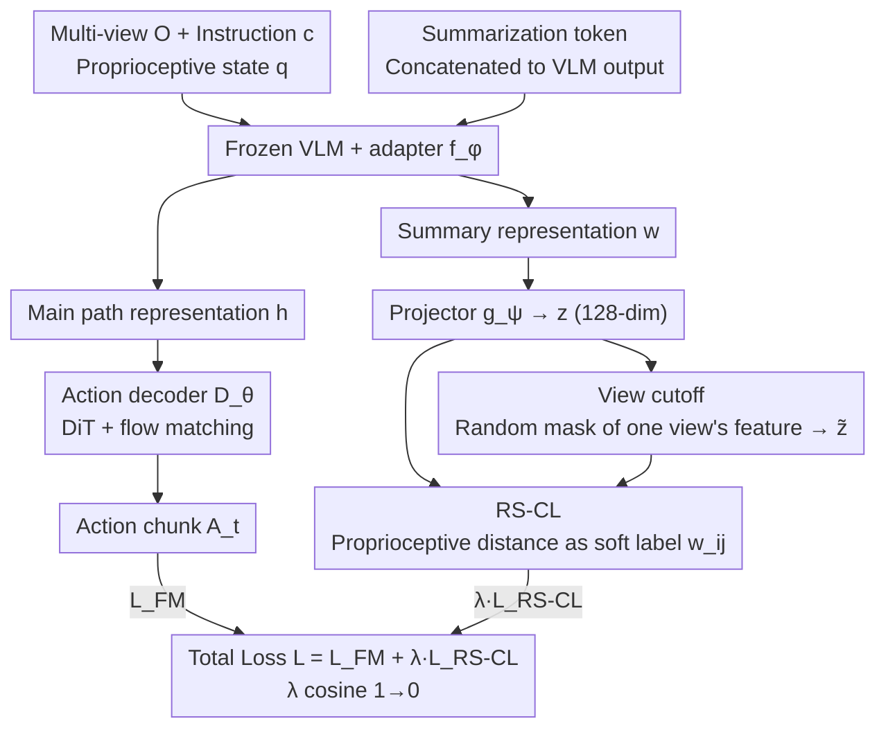

# Contrastive Representation Regularization for Vision-Language-Action Models

**Conference**: ICML 2026  
**arXiv**: [2510.01711](https://arxiv.org/abs/2510.01711)  
**Code**: To be confirmed  
**Area**: Robotics / VLA / Representation Learning  
**Keywords**: Vision-Language-Action Models, Proprioceptive Contrastive Learning, Representation Regularization, view cutoff, GR00T

## TL;DR
The authors observe that representations in VLA models inherited from VLMs are dominated by visual appearance and are insensitive to robot proprioceptive states. They propose Robot State-aware Contrastive Loss (RS-CL), which uses the Euclidean distance between proprioceptive states as "soft contrastive labels" to reshape representations. Combined with "view cutoff" feature-level augmentation, this method achieves a SOTA success rate of 69.7% on RoboCasa-Kitchen using GR00T N1.5 and improves success rates from 45.0% to 58.3% on real-world Franka pick-and-place tasks.

## Background & Motivation
**Background**: Current SOTA VLA models ($\pi_0$, GR00T N1.5, $\pi_0$-FAST, etc.) almost exclusively follow the "pre-trained VLM + generative action decoder (DiT + flow matching)" paradigm, supervised end-to-end with action prediction loss.

**Limitations of Prior Work**: VLMs are pre-trained on internet-scale visual instruction data and lack exposure to low-level control actions or proprioceptive states. Directly using a frozen VLM as a condition limits downstream VLA action precision; even with joint fine-tuning, representations remain dominated by scene backgrounds and object appearances, remaining largely insensitive to the robot's current pose or next action (t-SNE plots in Fig. 2b show that trajectories for the same task in different scenes cluster by scene rather than task progress).

**Key Challenge**: The objective is to preserve the semantic priors of the VLM while making the representations sensitive to control signals. However, action prediction loss is an indirect signal, and the gradients for updating the VLM backbone are "diluted" by the decoder, making it difficult to directly reshape the representation geometry.

**Goal**: To introduce a lightweight regularizer to the standard VLA pipeline that explicitly aligns VLM representations with robot proprioceptive states without requiring extra training stages or external robotics datasets.

**Key Insight**: The authors note that the efficacy of contrastive learning depends on the definition of positive and negative samples (e.g., CLIP uses image-text pairs, TCN uses temporal neighbors). The "natural similarity signal" for robots is the proprioceptive state: poses that are physically closer should have closer action distributions and, therefore, closer representations.

**Core Idea**: Use continuous distances between proprioceptive states as soft contrastive labels. Instead of binary classification, a soft weight $w_{ij} \propto \exp(-\|\mathbf{q}_i - \mathbf{q}_j\|_2 / \beta)$ is assigned to each sampled pair. Action prediction and RS-CL are trained jointly in a single-stage end-to-end manner.

## Method
RS-CL introduces a "contrastive regularization path" to the standard VLA pipeline. This framework adds only a summarization token, a 2-layer MLP projector, and view cutoff augmentation to the base GR00T N1.5 model, leaving the primary path largely unchanged.

### Overall Architecture
- Input: Multi-view observations $\mathbf{O}_t^V$, task instruction $\mathbf{c}$, and proprioceptive state $\mathbf{q}$.
- VLM + adapter: Frozen VLM with a trained adapter $f_\phi$, outputting $\mathbf{h} \in \mathbb{R}^{N \times d_{\text{model}}}$.
- Action decoder $D_\theta$: A DiT architecture that fits the action chunk $\mathbf{A}_t$ over horizon $H$ using a flow-matching objective.
- Regularization path: A learnable summarization token $\mathbf{u}$ is appended to the VLM output to obtain $\mathbf{w}$, which is then passed through a projector $g_\psi$ to obtain $\mathbf{z}$. View cutoff augmentation is applied to $\mathbf{z}$ to generate $\tilde{\mathbf{z}}$, and RS-CL is applied between them.
- Training: End-to-end, single-stage training where $\lambda$ follows a cosine schedule decaying from 1.0 to 0—emphasizing representation shaping early and action precision later.

### Key Designs

**1. Summarization token $\mathbf{u}$ for VLM representation amortization**

VLM outputs are sequences of length $N$. Applying contrastive loss to all tokens is computationally expensive and dilutes the signal. RS-CL adopts a strategy similar to BERT's [CLS] token: a learnable token $\mathbf{u}$ is concatenated to the VLM output, allowing the adapter $f_\phi$ to produce a "full sequence summary" $[\mathbf{h}, \mathbf{w}] = f_\phi(\text{VLM}(\mathbf{O}_t^V, \mathbf{c}) \oplus \mathbf{u})$. A 2-layer MLP projector $g_\psi$ then projects $\mathbf{w}$ to a 128-dimensional space to obtain $\mathbf{z}$. This decouples the representation path $\mathbf{h}$ used by the decoder from the contrastive path $\mathbf{w}$, preventing contrastive gradients from directly "contaminating" the decoder input.

**2. Robot State-aware Contrastive Loss (RS-CL)**

To address the VLM's bias toward visual appearance, RS-CL utilizes proprioceptive states as natural signals for representation similarity. Poses that are physically close should have similar representations. Instead of discrete positive/negative pairs, RS-CL uses soft weights in an InfoNCE-like objective for a batch of size $B$:

$$\mathcal{L}_{\text{RS-CL}} = -\sum_{i,j=1}^{B} w_{ij} \log \frac{e^{\text{sim}(\mathbf{z}_i, \tilde{\mathbf{z}}_j)/\tau}}{\sum_{k=1}^{B} e^{\text{sim}(\mathbf{z}_i, \tilde{\mathbf{z}}_k)/\tau}},\qquad w_{ij} = \frac{e^{-\|\mathbf{q}_i - \mathbf{q}_j\|_2 / \beta}}{\sum_k e^{-\|\mathbf{q}_i - \mathbf{q}_k\|_2 / \beta}}.$$

Here, $\mathbf{q}$ includes end-effector $x,y,z$, 6D rotation, and gripper state (normalized to $[-1,1]$). The soft weighting pulls "nearly identical poses" together and pushes "opposite poses" apart smoothly, embedding the robot's physical structure into the representation geometry.

**3. View cutoff feature-level augmentation**

To generate positive samples for contrastive learning without doubling the computation of the VLM backbone, RS-CL performs augmentation in the feature space. A view index $i \in \{1, \dots, V\}$ is randomly selected, and its corresponding feature slice in the VLM output is masked to produce $\tilde{\mathbf{z}}$. Only the adapter $f_{\phi}$ and projector $g_{\psi}$ are re-computed. This not only saves computation but also forces the model to be robust to view occlusion, a common challenge in real-world deployment.

### Loss & Training
The total objective is $\mathcal{L} = \mathcal{L}_{\text{FM}} + \lambda \, \mathcal{L}_{\text{RS-CL}}$, where the flow-matching loss is $\mathcal{L}_{\text{FM}} = \mathbb{E}_s [\|D_\theta(\mathbf{h}, \mathbf{A}_t^s, \mathbf{q}) - (\epsilon - \mathbf{A}_t)\|_2^2]$ with $\mathbf{A}_t^s = s \mathbf{A}_t + (1-s) \epsilon$. The weight $\lambda$ decays from 1.0 to 0 using a cosine schedule, ensuring strong representation shaping in early stages and focusing on action precision in later stages.

## Key Experimental Results

### Main Results

| Benchmark | Method | Success Rate (%) |
|------|------|-----------|
| RoboCasa-Kitchen (300 demos) | GR00T N1.5 baseline | 65.7 |
| RoboCasa-Kitchen | $\pi_0$ | 62.5 |
| RoboCasa-Kitchen | $\pi_0$-FAST | 63.6 |
| RoboCasa-Kitchen | FLARE | 66.4 |
| RoboCasa-Kitchen | GR00T N1.5 + HAMLET | 66.4 |
| **RoboCasa-Kitchen** | **GR00T N1.5 + RS-CL (Ours)** | **69.7** |
| RoboCasa pick-and-place | baseline | 30.3 |
| RoboCasa pick-and-place | + RS-CL | 41.5 (+11.2) |
| Real robot (Avg. of 5 tasks) | baseline | 45.0 |
| Real robot | + RS-CL | 58.3 (+13.3) |
| LIBERO Avg | GR00T N1.5 | 95.7 |
| LIBERO Avg | + RS-CL | 96.4 |

### Ablation Study

| Configuration | RoboCasa-Kitchen 30 demos SR (%) | FLOPs ($\times 10^{12}$) |
|------|----------------------------------|--------------------------|
| GR00T N1.5 baseline | 48.2 | 2.58 |
| + Multi-view TCN | 50.0 | 7.53 |
| + Single-view TCN | 50.3 | 7.53 |
| **+ RS-CL (Ours)** | **53.0** | **2.91** |

### Key Findings
- **Control Relevance vs. Semantic Richness**: t-SNE visualizations show that while standard VLM representations cluster by scene appearance, RS-CL reshapes them to cluster by task progress and robot state.
- **Precision vs. Exploration**: The highest gains (+11.2%) occur in pick-and-place tasks, which are sensitive to end-effector precision, suggesting RS-CL is most effective when precision is the bottleneck.
- **Robustness from View Cutoff**: In "close-lid" tasks where the wrist camera is often occluded, the view cutoff augmentation significantly improves success rates compared to the baseline.
- **Backbone Agnosticism**: RS-CL provides consistent gains across various backbones, including Qwen2.5-VL and SigLIP2.

## Highlights & Insights
- **Prior Injection**: Using proprioceptive distance as a soft weight successfully embeds the robot's physical structure into the representation without requiring manual labels or external rewards.
- **Architectural Efficiency**: Moving augmentation from the "input space" to the "feature space" via view cutoff is a generalizable strategy for optimizing compute-heavy VLA models.
- **Simplified Scheduling**: The cosine decay of $\lambda$ combines representation learning and action refinement into a single training phase, reducing engineering overhead.

## Limitations & Future Work
- **State Selection**: The choice of proprioceptive features (e.g., end-effector vs. joint positions) is currently empirical and lacks a systematic selection rule.
- **Scalability**: Testing is currently limited to single-arm 6-7 DoF manipulators; performance on bipedal or high-DoF dexterous platforms remains unknown.
- **Manifold Metrics**: Euclidean distance was used for all states, but rotation representations (e.g., 6D rotation) might benefit from more rigorous manifold-based distance metrics.

## Related Work & Insights
- **vs. $\pi_0$ / GR00T N1.5**: While standard VLAs rely only on action prediction loss, RS-CL introduces explicit representation-level supervision, leading to significant performance boosts.
- **vs. TCN**: Compared to temporal contrastive networks, RS-CL is more computationally efficient (2.91 vs 7.53 FLOPs) and effective due to its use of continuous proprioceptive signals.
- **vs. R3M / VIP**: Unlike pre-training methods that require external datasets, RS-CL operates as a "piggyback" regularizer during downstream training.

## Rating
- Novelty: ⭐⭐⭐⭐
- Experimental Thoroughness: ⭐⭐⭐⭐
- Writing Quality: ⭐⭐⭐⭐
- Value: ⭐⭐⭐⭐

<!-- RELATED:START -->

## Related Papers

- [\[CVPR 2026\] Cross-Hand Latent Representation for Vision-Language-Action Models](../../CVPR2026/robotics/cross-hand_latent_representation_for_vision-language-action_models.md)
- [\[ICML 2026\] Scaling by Diversified Experience for Vision-Language-Action Models](scaling_by_diversified_experience_for_vision-language-action_models.md)
- [\[ICML 2026\] LangForce: Bayesian Decomposition of Vision-Language-Action Models via Latent Action Queries](langforce_bayesian_decomposition_of_vision_language_action_models_via_latent_act.md)
- [\[ICML 2026\] From Abstraction to Instantiation: Learning Behavioral Representation for Vision-Language-Action Model](from_abstraction_to_instantiation_learning_behavioral_representation_for_vision-.md)
- [\[ICML 2026\] Test-Time Training for Visual Foresight Vision-Language-Action Models](test-time_training_for_visual_foresight_vision-language-action_models.md)

<!-- RELATED:END -->
