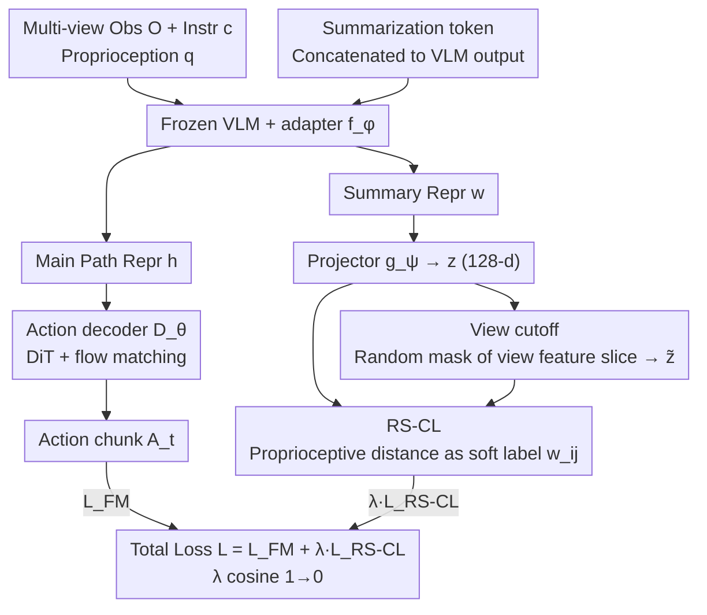

# Contrastive Representation Regularization for Vision-Language-Action Models

**Conference**: ICML 2026  
**arXiv**: [2510.01711](https://arxiv.org/abs/2510.01711)  
**Code**: To be confirmed  
**Area**: Robotics / VLA / Representation Learning  
**Keywords**: Vision-Language-Action Models, Proprioceptive Contrastive Learning, Representation Regularization, view cutoff, GR00T

## TL;DR
The authors identify that representations in VLA models inherited from VLMs are dominated by visual appearance and insensitive to robot proprioceptive states. They propose Robot State-aware Contrastive Loss (RS-CL), which utilizes the Euclidean distance between proprioceptive states as "soft contrastive labels" to reshape representations. Combined with "view cutoff" representation-level augmentation, this method pushes GR00T N1.5 to a 69.7% SOTA success rate on RoboCasa-Kitchen and increases the success rate from 45.0% to 58.3% on real Franka pick-and-place tasks.

## Background & Motivation
**Background**: Current SOTA VLA models ($\pi_0$, GR00T N1.5, $\pi_0$-FAST, etc.) almost exclusively follow the paradigm of "pre-trained VLM + generative action decoder (DiT + flow matching)," supervised end-to-end using action prediction loss.

**Limitations of Prior Work**: VLMs are pre-trained on internet-scale visual instruction data and have never encountered low-level control actions or proprioceptive states. Directly using frozen VLMs as conditions limits downstream VLA action precision; even with joint fine-tuning, representations remain dominated by scene backgrounds and large object appearances, showing minimal sensitivity to the robot's current pose or next action (t-SNE in Fig. 2b shows trajectories of the same task in different scenes clustering by scene rather than task progress).

**Key Challenge**: The goal is to preserve the semantic priors of the VLM while making representations sensitive to control signals. However, action prediction loss is an indirect signal, and the gradient is "diluted" by the decoder when updating the VLM backbone, making it difficult to directly reshape the representation geometry.

**Goal**: To introduce a lightweight regularization to the standard VLA pipeline that explicitly aligns VLM representations with robot proprioceptive states, without additional training stages or reliance on external robotics datasets.

**Key Insight**: The authors note that the essence of contrastive learning lies in how positive and negative samples are defined—CLIP uses image-text pairs, TCN uses temporal neighbors, and R3M/VIP use reward proximity. The "natural similarity signal" for robots is the proprioceptive state: physically closer poses have closer action distributions and should be pulled together in the representation space.

**Core Idea**: Continuous distances between proprioceptive states are used as soft contrastive labels. Instead of binary positive/negative pairs, a soft weight $w_{ij} \propto \exp(-\|\mathbf{q}_i - \mathbf{q}_j\|_2 / \beta)$ is assigned to each sample pair. Action prediction and RS-CL are then trained jointly in a single-stage end-to-end manner.

## Method
RS-CL adds a "contrastive regularization path" to the standard VLA pipeline. The framework only adds a summarization token, a 2-layer MLP projector, and a view cutoff augmentation to the original GR00T N1.5, leaving the main path almost unchanged.

### Overall Architecture
- Input: Multi-view observations $\mathbf{O}_t^V$, task instructions $\mathbf{c}$, and proprioceptive states $\mathbf{q}$.
- VLM + adapter: Frozen VLM with a trainable adapter $f_\phi$, outputting $\mathbf{h} \in \mathbb{R}^{N \times d_{\text{model}}}$.
- Action decoder $D_\theta$: DiT architecture fitting the action chunk $\mathbf{A}_t$ for the next horizon $H$ using a flow-matching objective.
- Regularization path: A learnable summarization token $\mathbf{u}$ is appended to the VLM output to obtain $\mathbf{w}$, which passes through a projector $g_\psi$ to get $\mathbf{z}$. View cutoff augmentation is applied to $\mathbf{z}$ to obtain $\tilde{\mathbf{z}}$, and RS-CL is applied between the two.
- Training: End-to-end, single-stage, with $\lambda$ following a cosine schedule decaying from 1.0 to 0—strong representation shaping in the early phase and pure action prediction in the later phase.

### Key Designs

**1. Summarization token $\mathbf{u}$ for Amortized VLM Representation: Compressing long sequences into a single token for contrastive learning**

VLM outputs are sequences of length $N$. Applying contrastive loss to all tokens is computationally expensive and dilutes the signal. RS-CL borrows from BERT’s [CLS] token by concatenating a learnable token $\mathbf{u}$ to the VLM output. The adapter $f_\phi$ treats it as a "full-sequence summary," producing $[\mathbf{h}, \mathbf{w}] = f_\phi(\text{VLM}(\mathbf{O}_t^V, \mathbf{c}) \oplus \mathbf{u})$, which is then projected to 128 dimensions via a 2-layer MLP projector $g_\psi$ to obtain $\mathbf{z}$.

Crucially, the two paths are decoupled: $\mathbf{h}$ follows the main path to the action decoder, while $\mathbf{w}$ follows the new contrastive path. The projector follows SimCLR practice, isolating the contrastive objective in the projection space to prevent it from contaminating the representations sent to the decoder.

**2. Robot State-aware Contrastive Loss (RS-CL): Using proprioceptive distance as soft labels to shift representations from "appearance-based" to "control-state-based" clustering**

VLM representations are primarily dominated by scene background and object appearance. RS-CL leverages the proprioceptive state as a "natural similarity signal"—physically similar poses should have similar action distributions. Since proprioception is continuous, the objective uses soft weights instead of binary pairs (like SupCon):

$$\mathcal{L}_{\text{RS-CL}} = -\sum_{i,j=1}^{B} w_{ij} \log \frac{e^{\text{sim}(\mathbf{z}_i, \tilde{\mathbf{z}}_j)/\tau}}{\sum_{k=1}^{B} e^{\text{sim}(\mathbf{z}_i, \tilde{\mathbf{z}}_k)/\tau}},\qquad w_{ij} = \frac{e^{-\|\mathbf{q}_i - \mathbf{q}_j\|_2 / \beta}}{\sum_k e^{-\|\mathbf{q}_i - \mathbf{q}_k\|_2 / \beta}}.$$

Proprioception $\mathbf{q}$ consists of end-effector $x,y,z$ + 6D rotation + gripper state (normalized to $[-1,1]$). The parameters $\beta$ and $\tau$ control the sharpness of the mapping and similarity respectively. Soft weights allow "nearly identical poses" to be pulled together and "opposite poses" to be pushed apart smoothly, embedding the robot's physical structure into the representation geometry.

**3. View cutoff Representation-level Augmentation: Creating positive samples in feature space to avoid redundant VLM forwards**

Contrastive learning requires positive samples, but traditional data-level augmentations (cropping, jittering) require additional VLM forward passes, doubling the compute for backbones like GR00T-N1.5. RS-CL exploits the multi-view input structure: it randomly selects a view index $i \in \{1, \dots, V\}$ and masks the corresponding feature slice in the VLM output to obtain $\tilde{\mathbf{z}}$. Only the adapter $f_\phi$ and projector $g_\psi$ are re-run.

Moving augmentation to the feature space improves efficiency and teaches the model to remain robust under view loss. In "close-lid" tasks, where the wrist camera is often occluded after grasping, models trained with view cutoff show significantly higher success rates than baselines.

### Loss & Training
The total objective is $\mathcal{L} = \mathcal{L}_{\text{FM}} + \lambda \, \mathcal{L}_{\text{RS-CL}}$, where the flow-matching loss is $\mathcal{L}_{\text{FM}} = \mathbb{E}_s [\|D_\theta(\mathbf{h}, \mathbf{A}_t^s, \mathbf{q}) - (\epsilon - \mathbf{A}_t)\|_2^2]$, with $\mathbf{A}_t^s = s \mathbf{A}_t + (1-s) \epsilon$ being the interpolated action chunk. $\lambda$ starts at 1.0 and decays to 0 via a cosine schedule. Simulation experiments were conducted on RoboCasa-Kitchen and LIBERO; real-robot experiments used a Franka Research 3 with two camera views across 5 tasks.

## Key Experimental Results

### Main Results
| Benchmark | Method | Success Rate (%) |
|------|------|-----------|
| RoboCasa-Kitchen (300 demos) | GR00T N1.5 baseline | 65.7 |
| RoboCasa-Kitchen | $\pi_0$ | 62.5 |
| RoboCasa-Kitchen | $\pi_0$-FAST | 63.6 |
| RoboCasa-Kitchen | FLARE | 66.4 |
| RoboCasa-Kitchen | GR00T N1.5 + HAMLET | 66.4 |
| **RoboCasa-Kitchen** | **GR00T N1.5 + RS-CL** | **69.7** |
| RoboCasa pick-and-place | baseline | 30.3 |
| RoboCasa pick-and-place | + RS-CL | 41.5 (+11.2) |
| Real robot (Avg. of 5 tasks) | baseline | 45.0 |
| Real robot | + RS-CL | 58.3 (+13.3) |
| LIBERO Avg | GR00T N1.5 | 95.7 |
| LIBERO Avg | + RS-CL | 96.4 |

While the baseline on LIBERO is already near the ceiling, RS-CL still improves the Long-horizon suite from 87.8 to 90.4, indicating advantages in scenarios where action precision is the bottleneck.

### Ablation Study
| Configuration | RoboCasa-Kitchen 30 demos SR (%) | FLOPs ($\times 10^{12}$) |
|------|----------------------------------|--------------------------|
| GR00T N1.5 baseline | 48.2 | 2.58 |
| + Multi-view TCN | 50.0 | 7.53 |
| + Single-view TCN | 50.3 | 7.53 |
| **+ RS-CL (ours)** | **53.0** | **2.91** |

TCN (Time-Contrastive Networks) consumes significantly more FLOPs (approx. 3×) due to redundant VLM forwards while providing smaller gains compared to RS-CL.

### Key Findings
- **Representation bottleneck is "control relevance" rather than "semantic richness"**: t-SNE visualizations show VLM representations clustering by scene appearance, while RS-CL shifts them to cluster by task progress (robot pose).
- **Highest gains in pick-and-place tasks (+11.2)**: These tasks are sensitive to end-effector precision; proprioceptive alignment translates directly into localization accuracy.
- **View cutoff provides robustness**: In tasks with camera occlusion (close-lid), success rates are higher than the baseline as a "by-product" of the efficient augmentation.
- **Cosine decay of $\lambda$ is essential**: Early training focuses on representation shaping, while later training concentrates on action precision.

## Highlights & Insights
- **Embedding "Physical Structure" into Representation Space**: Using proprioceptive distance as a soft contrastive label is an elegant form of prior injection. It requires no manual labels or external rewards, utilizing built-in sensor readings.
- **View Cutoff as Representation-Level Augmentation**: This serves as a general path for optimization in the VLA era, where compute is a luxury, by moving augmentation from input space to feature space.
- **Decoupled Summarization**: Appending a summarization token avoids the computational cost of contrastive learning on long sequences while maintaining a clean separation between the main policy path and the regularization path.

## Limitations & Future Work
- **Proprioceptive state selection is empirical**: The choice between end-effector pose and joint positions lacks a systematic rule. For high-DoF platforms like dexterous hands (21+ DoF), Euclidean distance might be a poor metric.
- **Limited to single-arm 6-7 DoF manipulation**: Dual-arm, mobile manipulation, and legged platforms have not yet been tested.
- **Metric Formulation**: The Euclidean distance used for $w_{ij}$ does not formally account for the manifold properties of 6D rotations.
- **Sample Variance**: Success rate gains in low-data regimes (e.g., 30 demos) would benefit from multi-seed variance analysis.

## Related Work & Insights
- **vs $\pi_0$ / GR00T N1.5**: Original VLAs rely on action prediction loss to update the VLM, which the authors prove is too weak or delayed. RS-CL provides explicit supervision at the representation layer.
- **vs TCN**: TCN uses temporal neighbors and requires redundant forwards. RS-CL uses proprioceptive distance and soft labels, being more efficient and effective (53.0 vs 50.3 SR, 2.91 vs 7.53 FLOPs).
- **vs R3M / VIP**: These works focus on representation learning during a pre-training phase with external data. RS-CL "piggybacks" on the downstream VLA training without extra data or stages.
- **vs DUST / HAMLET / FLARE**: While these use dual-contrastive or flow-based objectives for 1-2 ACC gains, RS-CL achieves +4 ACC by simply leveraging proprioception, a previously underestimated supervision source.

## Rating
- Novelty: ⭐⭐⭐⭐ 
- Experimental Thoroughness: ⭐⭐⭐⭐ 
- Writing Quality: ⭐⭐⭐⭐ 
- Value: ⭐⭐⭐⭐

<!-- RELATED:START -->

## Related Papers

- [\[CVPR 2026\] Cross-Hand Latent Representation for Vision-Language-Action Models](../../CVPR2026/robotics/cross-hand_latent_representation_for_vision-language-action_models.md)
- [\[ICML 2026\] LangForce: Bayesian Decomposition of Vision-Language-Action Models via Latent Action Queries](langforce_bayesian_decomposition_of_vision_language_action_models_via_latent_act.md)
- [\[ICML 2026\] StableVLA: Towards Robust Vision-Language-Action Models without Extra Data](stablevla_towards_robust_vision-language-action_models_without_extra_data.md)
- [\[ICML 2026\] SpecPrune-VLA: Accelerating Vision-Language-Action Models via Action-Aware Self-Speculative Pruning](specprune-vla_accelerating_vision-language-action_models_via_action-aware_self-s.md)
- [\[ICML 2026\] Neural Implicit Action Fields: From Discrete Waypoints to Continuous Functions for Vision-Language-Action Models](neural_implicit_action_fields_from_discrete_waypoints_to_continuous_functions_fo.md)

<!-- RELATED:END -->
