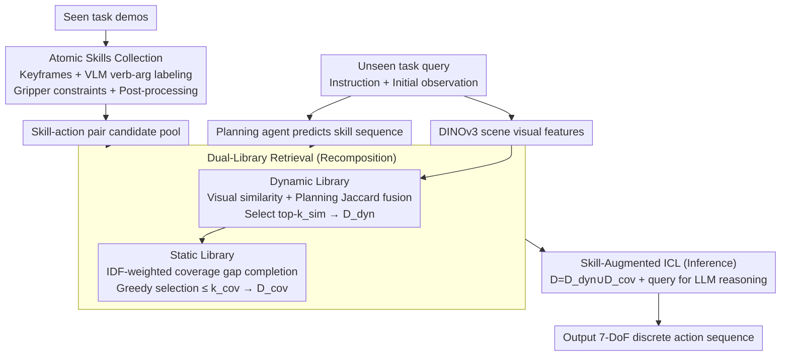

# Decompose and Recompose: Reasoning New Skills from Existing Abilities for Cross-Task Robotic Manipulation

**Conference**: ICML 2026  
**arXiv**: [2605.01448](https://arxiv.org/abs/2605.01448)  
**Code**: None (Not declared in paper)  
**Area**: Robotics / Cross-Task Generalization / Vision-Language-Action Models  
**Keywords**: Atomic Skills, In-Context Learning, Zero-Shot Cross-Task, Dynamic/Static Dual-Library, Skill Coverage

## TL;DR
For zero-shot robotic manipulation transferring from trained tasks to entirely new tasks, the authors decompose demonstrations into "atomic skill-action" pairs as intermediate representations. They utilize a dual-library (dynamic library retrieving by visual/planning similarity + static library completing missing skill tokens via IDF weighting) to provide LLMs with skill-comprehensive in-context demonstrations, upgrading "trajectory imitation" to "compositional skill reasoning."

## Background & Motivation

**Background**: VLA models (RT-2, OpenVLA, π0, RDT) achieve robustness against visual perturbations on known tasks through large-scale robotic data training. Recently, X-ICM introduced in-context learning (ICL) into cross-task zero-shot robotic settings, using dynamics-guided retrieval to select similar demos from training sets to feed into LLMs for direct action prediction.

**Limitations of Prior Work**: (a) X-ICM requires **training a** dynamics retriever on specific task distributions, weakening cross-domain transferability; (b) demonstrations fed to LLMs contain only low-level numerical action sequences, lacking causal and process information such as "what is this step doing/why/relation to the next step"; (c) consequently, LLMs degrade into "trajectory pattern matching," failing to reason when encountering new skill combinations.

**Key Challenge**: Cross-task requirements necessitate skills to be composable and reason-able. However, existing demo representations only provide low-level continuous actions without exposing skill structures; meanwhile, demo retrieval based solely on visual/dynamic similarity may miss critical skill patterns needed for new tasks.

**Goal**: (1) Deconstruct opaque continuous action sequences into "atomic skill label + action" pairs as intermediate representations; (2) ensure demo sets are both "task-relevant" and "skill-comprehensive"; (3) remain completely training-free (using general pre-trained vision encoders + planning agents + LLMs).

**Key Insight**: Elevate cross-task transfer from "trajectory shape similarity" to the "composable skill structure" level—in-context demos for LLMs must explicitly label verb-arg atomized skills to stimulate compositional reasoning.

**Core Idea**: Decompose (break demos into atomic skill-action pairs) + Recompose (assemble a skill-complete demo set for new tasks using dynamic + static dual libraries).

## Method

### Overall Architecture
The paper summarizes the method into three tightly coupled components (with the retrieval further divided into dynamic and static libraries), forming a training-free pipeline: (1) **Atomic Skills Collection**: Extract keyframes from seen demos + label verb-arg tags using VLM + gripper constraints + rule-based post-processing to obtain skill-action pairs $\{(s_k,a_k)\}$; (2) **Dual-Library Retrieval**: The dynamic library uses DINOv3 for scene visual similarity + Jaccard similarity of skill sequences predicted by a planner (verb sets + bigram chains), fused to select top-$k_\mathrm{sim}$ demos $\mathcal D_\mathrm{dyn}$; the static library extracts object-agnostic tokens (V:verb + B:bigram) for each demo and uses IDF weighting to fill the coverage gap of $\mathcal D_\mathrm{dyn}$, obtaining $\mathcal D_\mathrm{cov}$; (3) **Skill-Augmented ICL**: Feed $\mathcal D=\mathcal D_\mathrm{dyn}\cup\mathcal D_\mathrm{cov}$ and the query to an LLM for compositional skill reasoning, outputting 7-DoF discrete action sequences.

### Key Designs

**1. Atomic Skills Collection: Decomposing demos into composable skill-action pairs**

Low-level numerical action sequences lack semantics and cannot be reused across tasks; LLMs providing these merely imitate patterns. This step transforms each demo into labeled atomic skills. Keyframes are extracted via three rules—gripper state changes, joint velocity thresholds, and episode termination; each segment is labeled by a VLM as $\mathrm{Verb}[\mathrm{obj}]$ or $\mathrm{Verb}[\mathrm{obj}_1,\mathrm{obj}_2]$ (where $\mathrm{Verb} \in \{\text{Reach, Move, Grasp, Release, ...}\}$). Critical engineering involves gripper hard constraints: open $\to$ closed is forced as Grasp, closed $\to$ open as Release, using physical common sense to minimize VLM labeling errors. Rules also enforce (movable, target) argument order and downgrade relational actions to Move when the gripper is open. With verb-arg labels, LLMs can treat demos as "sentence fragments" to combine rather than meaningless numbers.

**2. Dual-Library Demonstration Retrieval: Satisfying task relevance and skill coverage**

Retrieval based solely on visual/dynamic similarity might miss key skills essential for new tasks (e.g., when solving "open microwave $\to$ place food $\to$ close door," similar demos might all be "open-place" but miss "close"). Two complementary libraries are used. The dynamic library handles "task relevance" with a ranking score $s_i=\alpha\tilde s_i^\mathrm{vis}+(1-\alpha)s_i^\mathrm{plan}$, where visual similarity $s_i^\mathrm{vis}$ uses DINOv3 cosine similarity and planning similarity $s_i^\mathrm{plan}=\lambda J(\mathcal V(\hat{\mathcal S}),\mathcal V(\mathcal S_i))+(1-\lambda)J(\mathcal B(\hat{\mathcal S}),\mathcal B(\mathcal S_i))$ uses Jaccard similarity of verb sets and verb-bigram sets. The static library ensures "skill coverage," where each demo is described by object-agnostic tokens $\mathcal T(d)=\{\mathrm{V:}v\}\cup\{\mathrm{B:}v_1\to v_2\}$. Token weights follow IDF $w_t=(\log\frac{N+1}{\mathrm{df}(t)+1}+1)^\beta$, and selection is based on coverage gain divided by length penalty $\sum_{t\in \mathcal T(d)\setminus\mathcal C}w_t / (1+\gamma|\mathcal S_d|)$. During inference, the coverage gap $\mathcal G=\mathcal T(\hat{\mathcal S})\setminus \cup_{d\in\mathcal D_\mathrm{dyn}}\mathcal T(d)$ is calculated, and the static library greedily complements $\le k_\mathrm{cov}$ demos. IDF ensures that "rare but critical" skills (e.g., Close, Insert) are prioritized, while length penalties prevent long demos from crowding the context.

**3. Skill-Augmented In-Context Learning: Compositional reasoning on skill scaffolds**

With semanticized demos, LLMs can perform true composition instead of pattern matching. Each demo is formatted as an (instruction, atomic skill sequence, action sequence) triplet for context. The LLM receives the query instruction, initial observations (discretized object coordinates + gripper state), and the planner's predicted skill sequence. Following the "decompose query $\to$ recompose from existing skills" paradigm, it outputs $\{a_1^q,\ldots,a_T^q\}$, where each $a_t$ is a 3D voxel index + Euler bin + gripper bit. By explicitly presenting causal chains like "Reach[knife] $\to$ Grasp[knife] $\to$ Move[knife, board]," the LLM triggers reasoning: "I can combine known Reach+Grasp+Move to solve new tasks," rather than blindly fitting known trajectory shapes. The entire pipeline uses pre-trained weights (DINOv3 / planner / VLM / LLM) without updating parameters, minimizing cross-domain transfer resistance.

### Loss & Training
**Entirely training-free**: DINOv3, planning agent, VLM, and LLM all utilize pre-trained weights without parameter updates. Hyperparameters $\alpha,\lambda, \beta, \gamma, k_\mathrm{sim}, k_\mathrm{cov}$ are selected empirically.

## Key Experimental Results

### Main Results (AGNOSTOS benchmark zero-shot cross-task, Success Rate %)

Summary of Table 1 from the paper, comparing Ours vs. X-ICM for select Level-1/Level-2 tasks:

| Task | X-ICM | Ours | Gain |
|---|---|---|---|
| Micro. (open microwave) | 45.3 | **62.7** | +17.4 |
| Seat | 48.0 | **72.0** | +24.0 |
| LampOff | 58.7 | **67.0** | +8.3 |
| LampOn | 50.7 | **52.3** | +1.6 |
| Fridge | 22.7 | **34.7** | +12.0 |
| Knife | **26.7** | 21.3 | -5.4 |
| Phone | **57.3** | 42.7 | -14.6 |
| Most Level-2 Tasks | Mostly 0 | Some Improvement | Slight |

Overall conclusion: On 23 unseen tasks (13 Level-1 + 10 Level-2), Ours shows competitive or superior performance to the typical ICL baseline X-ICM, especially in multi-step compositional tasks (e.g., Micro., Seat, Fridge). Foundation VLAs (OpenVLA, RDT, π0) and In-Domain methods (PerAct, RVT, Sigma-Agent) were generally outperformed.

### Ablation Study

| Configuration | Observation | Explanation |
|---|---|---|
| Full (Dynamic + Static + atomic skill labels) | Best | Synergy of the three modules |
| Dynamic Library Only (No Static completion) | Drops in multi-step tasks | Coverage gaps were not mitigated |
| Static Library Only (No Dynamic retrieval) | Weak task relevance | demos didn't match query visual/planning |
| Remove Atomic Skill Labels (Degrade to pure action) | Significant drop | LLM reverts to trajectory imitation without reasoning |
| VLM labeling without gripper constraints | Increased label noise | Physical consistency was violated |

### Key Findings
- The intermediate representation of "atomic skill labels + action pairs" is the most critical leap—exposing this layer to the LLM immediately activates cross-task compositional reasoning. Without it, even perfect retrieval is just more precise "copy-pasting."
- The synergy of the Dual-Library (Dynamic + Static) outperforms either single library, validating that "task relevance" and "skill coverage" are orthogonal requirements.
- IDF weighting prioritizes rare but critical verbs (e.g., Close, Insert) during static library selection, which is vital for completing Level-2 multi-step tasks.

## Highlights & Insights
- **Training-free yet Effective**: Does not depend on training a dynamics retriever; all components are pre-trained or rule-based, providing minimal resistance for cross-domain transfer. This is a significant advantage for industrial deployment.
- **Semanticizing the ICL Paradigm**: Unlike previous ICL-for-robot approaches that used numerical actions, this paper insists on semantic tokens, correctly leveraging the LLM's strength in symbolic compositional reasoning.
- **Gripper Constraints + Post-processing**: These engineering details enable VLM labeling to be practical, serving as a reusable paradigm for Labeler-LLM collaboration.
- **Object-agnostic verb tokens + IDF selection**: This provides a clear "few-shot, maximum coverage" signal applicable to any domain requiring in-context demonstration selection.

## Limitations & Future Work
- In certain tasks with simple skills (Knife, Phone), it is outperformed by X-ICM—likely because atomic skill abstraction is too fine-grained, blurring visual similarity signals.
- The atomic skill vocabulary $\mathcal V$ is a manually defined closed set; encountering new action types (e.g., pour, wipe) requires manual expansion, lacking an automatic discovery mechanism.
- Planner prediction errors can contaminate both the dynamic library's plan-similarity and the static library's coverage gap—upstream fragility is not explicitly quantified.
- 7-DoF action discretization (voxel + Euler bin) is relatively coarse and may be insufficient for high-precision operations like threading needles or screwing.
- Real-world experiments are only briefly mentioned; full numerical tables and sim-to-real gap discussions are lacking.

## Related Work & Insights
- **vs X-ICM (Zhou et al. 2025)**: Both focus on ICL for cross-task, but X-ICM requires a trained dynamics retriever and only uses actions; Ours is training-free and uses skill-action pairs, serving as a direct upgrade.
- **vs RoboPrompt / KAT / InCoRo / Instant Policy**: These focus on within-task; Ours is cross-task zero-shot.
- **vs VoxPoser / MOKA / COPA / ReKep**: Modular VLA schemes relying on heavy task-specific prompt engineering; Ours uses a unified atomic-skill schema.
- **vs End-to-End VLAs (OpenVLA, π0, RDT, etc.)**: These rely on data scale for cross-task generalization, but AGNOSTOS shows limited effectiveness; Ours provides a complementary path via ICL and skill abstraction.

## Rating
- Novelty: ⭐⭐⭐⭐ Atomic skill intermediate representation + dual-library signals form a novel and persuasive framework for cross-task ICL.
- Experimental Thoroughness: ⭐⭐⭐ AGNOSTOS 23 tasks + real-world validation; however, ablation and failure case analyses are somewhat shallow.
- Writing Quality: ⭐⭐⭐⭐ Figures 1/2/3 clearly explain concepts; concise formulas; Table 1 is dense but complete.
- Value: ⭐⭐⭐⭐ Provides a strong training-free baseline for the robot manipulation community, with skill abstraction ideas generalizable to agents/workflow automation.

<!-- RELATED:START -->

## Related Papers

- [\[ICML 2026\] TapSampling: Inference-Time Sampling with a Task-Progress-Understanding Verifier for Robotic Manipulation](tapsampling_inference-time_sampling_with_a_task-progress-understanding_verifier_.md)
- [\[CVPR 2026\] Action-Sketcher: From Reasoning to Action via Visual Sketches for Robotic Manipulation](../../CVPR2026/robotics/action-sketcher_from_reasoning_to_action_via_visual_sketches_for_robotic_manipul.md)
- [\[CVPR 2026\] Learning to See and Act: Task-Aware Virtual View Exploration for Robotic Manipulation](../../CVPR2026/robotics/learning_to_see_and_act_task-aware_virtual_view_exploration_for_robotic_manipula.md)
- [\[CVPR 2026\] Cross-Domain Demo-to-Code via Neurosymbolic Counterfactual Reasoning](../../CVPR2026/robotics/cross-domain_demo-to-code_via_neurosymbolic_counterfactual_reasoning.md)
- [\[CVPR 2026\] Obstruction Reasoning for Robotic Grasping](../../CVPR2026/robotics/obstruction_reasoning_for_robotic_grasping.md)

<!-- RELATED:END -->
