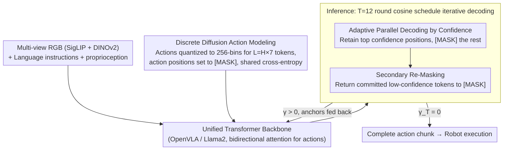

# Discrete Diffusion VLA: Bringing Discrete Diffusion to Action Decoding in Vision-Language-Action Policies

**Conference**: ICML 2026  
**arXiv**: [2508.20072](https://arxiv.org/abs/2508.20072)  
**Code**: To be confirmed  
**Area**: Robotics / Embodied AI / VLA  
**Keywords**: VLA, Discrete Diffusion, Action Decoding, Autoregressive Alternative, Vision-Language Preservation

## TL;DR
This paper shifts VLA action decoding from Autoregressive (AR) or external continuous diffusion heads to "masked diffusion on discrete action tokens within a unified Transformer." Combined with adaptive parallel decoding ranked by confidence and secondary re-masking for error correction, it achieves a 96.4% average success rate on LIBERO and a 64.1% total mean score on SimplerEnv-Fractal. Notably, performance degrades by only 0.8% / 20.4% under OOD language/visual perturbations, significantly outperforming continuous diffusion and parallel decoding baselines while preserving the multimodal priors of the pre-trained VLM.

## Background & Motivation

**Background**: Modern VLAs attach an "action generation head" to a large VLM backbone to map to robotic actions. Two main paths exist: (1) AR routes (OpenVLA, π0-FAST) discretize actions into tokens and generate them bit-by-bit from left to right in a GPT style; (2) External continuous diffusion/flow-matching heads (π0, SmolVLA) feed latent variables from the VLM into an independent diffusion head to output continuous trajectories. Works like Transfusion attempt to integrate diffusion into the same architecture but still maintain diffusion-specific training objectives.

**Limitations of Prior Work**: AR suffers from compound errors due to forced left-to-right generation, low inference efficiency (one forward pass per token), and the inability to use information from subsequent tokens in the same chunk. While continuous diffusion has strong modeling capabilities, its gradient signals often conflict with the VLM backbone's LM objective, complicating training. More importantly, it tends to erode the VLM's pre-trained vision-language capabilities, making the model over-reliant on vision and less robust to language perturbations.

**Key Challenge**: Action generation requires parallelism, error correction, and high precision, while the VLM backbone needs to retain multimodal priors and a consistent optimization objective. AR sacrifices parallelism, and continuous diffusion sacrifices objective consistency; prior methods failed to achieve both simultaneously.

**Goal**: To unify action generation within the VLM backbone using the same cross-entropy objective, simultaneously gaining parallel decoding, arbitrary-order generation, and error-correction capabilities.

**Key Insight**: The authors note that recent discrete diffusion research (D3PM, MaskGIT, LLaDA, MMaDA) has shown that "mask-and-unmask" token-level generation can compete with AR in quality while being naturally compatible with LM cross-entropy objectives. If action chunks are also discretized into tokens, can this mechanism be directly ported to VLA?

**Core Idea**: Treat action tokens as "masked language tokens" within the VLM backbone for masked diffusion. By designing an adaptive confidence schedule and secondary re-masking, the model generates actions from easy to difficult and allows for error correction, thereby unifying perception, instruction understanding, and action decoding without introducing new losses or modules.

## Method

### Overall Architecture
Model input: Multi-view RGB (one third-person head camera + optional two wrist cameras, encoded by SigLIP and DINOv2) + language instructions + optional proprioception. All vision/language tokens and "masked action tokens" are fed into a unified Transformer (Prismatic-7B / Llama2 backbone, derived from OpenVLA). The backbone uses bidirectional attention at action positions. During inference, all action positions are initialized as [MASK], and an iterative "unmask + secondary re-mask" process is performed over T=12 rounds following a cosine schedule to obtain the full action chunk.

### Key Designs

**1. Discrete Diffusion Action Modeling within a Unified Backbone: Treating action tokens as "masked language tokens" and sharing a cross-entropy objective with the VLM**

AR sacrifices parallelism, while external continuous diffusion dilutes VLM priors with independent training objectives. This paper solves this by embedding action generation back into the VLM backbone, utilizing the cross-entropy objective familiar to LMs. Specifically, each control dimension is quantized into 256 bins based on 1%-99% quantiles (gripper is binary). A single timestep yields 7 tokens (3 translation + 3 rotation + 1 gripper), and $H$ timesteps form a chunk of $L=H\times 7$. Forward noise follows a Markov chain $\mathbf{Q}_t \mathbf{e}_{a_{t,i}} = (1-\beta_t)\mathbf{e}_{a_{t,i}} + \beta_t \mathbf{e}_M$, where each token is independently replaced by [MASK] with probability $\beta_t$. Training collapses into single-step mask prediction: sample a mask ratio $\gamma_t$, apply [MASK] to $\gamma_t L$ positions, and minimize the cross-entropy at masked positions:

$$\mathcal{L}_{CE} = -\sum_{i \in \mathcal{M}_{\gamma_t}} \log p_\theta(a_{0,i} \mid \tilde{\mathbf{a}}_t, \mathbf{c}),$$

Vision and language tokens participate in attention but are not included in the loss. Shared token space and loss mean the action head does not wash out pre-trained priors; meanwhile, training on exponentially many infilling tasks grants the model the ability to decode in any order—a flexibility AR lacks.

**2. Adaptive Parallel Decoding by Confidence: Generating easy positions first to help anchors disambiguate difficult ones**

BERT-style parallel decoding (like OpenVLA-OFT), which takes the argmax at all positions simultaneously, lacks iterative refinement. This paper starts from $\mathbf{a}_1=\mathrm{M}^L$ (all masks) and follows a monotonically decreasing cosine schedule $\gamma_{t+1}<\gamma_t$. Each step uses Max Confidence $s_{t,i}=\max_k p_\theta(k\mid \mathbf{a}_t,\mathbf{c})$ or Confidence Gap to score masked positions, retaining the top $(1-\gamma_{t+1})L$ positions via Gumbel-Max sampling with temperature annealing, while keeping the rest as [MASK] until $\gamma_T=0$.

This creates a structural advantage: "determine high-confidence anchors → feed anchors back to the backbone → help resolve ambiguity for difficult positions." Compared to AR, this avoids being locked into a left-to-right order and utilizes statistical information from tokens later in the chunk. Visualizations show that the model learns interpretable decoding orders, such as "determining gripper state before refining translation/rotation."

**3. Secondary Re-Masking: Opening a self-correction channel for the reverse process**

Pure monotonic revelation (where once committed, a token cannot be changed) has a hidden risk—if a position near the middle of a chunk is wrong early on, the error will be amplified by attention in subsequent tokens. Secondary re-masking adds a threshold check after selecting the retention set $\mathcal{K}_t$ according to $\gamma_{t+1}$: if the confidence $s_{t,i}$ of a committed token is lower than a threshold $\eta_t^{\mathrm{abs}}$ (which increases monotonically with steps), it is returned to [MASK], i.e., $\mathcal{R}_t^{\mathrm{abs}} = \{ i \in \mathcal{K}_t : s_{t,i} < \eta_t^{\mathrm{abs}} \}$, and regenerated in the next round.

This mechanism remains consistent with the Bayesian reverse kernel while adding a consistency constraint to the sampling rule. It essentially provides a self-correction channel for the "easy-to-hard" revelation process, empirically preventing error accumulation with negligible computational overhead.

### Loss & Training
Single loss: Hard-label cross-entropy on masked positions (one-stage end-to-end training, no auxiliary objectives). Initialized from OpenVLA backbone, images resized to $224 \times 224$; a separate policy is trained for each LIBERO suite after filtering failed episodes; SimplerEnv is fine-tuned on Fractal and BridgeData-V2 respectively; chunk size is 8 (LIBERO/Fractal) or 3 (Bridge); inference uses $T = 12$ rounds of cosine schedule. All parameters (VLM backbone + action projection head) are updated together.

## Key Experimental Results

### Main Results

| Dataset / Metric | Ours | OpenVLA-OFT (L1) Continuous SOTA | OpenVLA-OFT (Discrete) | π0-FAST | OpenVLA | Gap |
|---------------|------|----------------------------|------------------------|---------|---------|------|
| LIBERO Avg Success Rate | **96.4%** | 97.1% | 95.5% | 85.5% | 76.5% | -0.7% vs Cont. SOTA / +0.9% vs Disc. SOTA |
| LIBERO-Long | **92.2%** | 94.5% | 92.0% | 60.2% | 53.7% | Best among discrete methods |
| SimplerEnv-Fractal Visual Matching | **71.2%** | – | – | 61.9% | 27.7% | Overall SOTA |
| SimplerEnv-Fractal Total Mean | **64.1%** | – | – | 60.5% | 33.8% | Overall SOTA |
| SimplerEnv-Bridge Total Mean | **54.2%** | – | – | – | 7.8% | +14.7 vs π0, +6.4 vs π0-FAST |
| Real Robot Cobot Magic (9.69 Hz) | Better than baselines | – | – | – | – | Two tabletop tasks |

### Ablation Study (LIBERO-Goal OOD, 500 rollouts / suite)

| Method | Original | Lang Aug | Vision Aug |
|------|----------|----------|------------|
| OpenVLA-OFT (Discrete, Parallel Decoding) | 95.6% | 87.6% (↓8.0%) | 73.0% (↓22.6%) |
| OpenVLA-OFT (Diffusion, Continuous Diffusion) | 96.0% | 93.6% (↓2.4%) | 67.0% (↓29.0%) |
| OpenVLA-OFT (L1) | 97.9% | 94.7% (↓3.2%) | 74.7% (↓23.2%) |
| **Discrete Diffusion VLA** | 96.8% | **96.0% (↓0.8%)** | **76.4% (↓20.4%)** |

LIBERO-Spatial OOD shows a similar trend of "best absolute value + minimum degradation" (vision degradation only ↓0.8%, compared to ↓5.8% for continuous diffusion).

### Key Findings
- The OOD robustness of the discrete diffusion paradigm is significantly superior: degradation under language augmentation is 0.8% vs 8.0% for parallel decoding, and under visual augmentation is 20.4% vs 29.0% for continuous diffusion. This validates the protection of VLM priors by "shared cross-entropy objective + shared token space."
- While slightly behind the continuous SOTA (OpenVLA-OFT L1) by 0.7% on ID tasks, this gap is primarily due to the quantization ceiling. On SimplerEnv, it outperforms all continuous/discrete methods, indicating better engineering generality for discrete diffusion in cross-domain and cross-robot scenarios.
- Secondary re-masking, the cosine schedule, and $T=12$ inference rounds represent the current optimal combination. Visualizations show the model learns interpretable decoding orders (e.g., determining gripper state first), empirically supporting the value of adaptive rather than fixed sequences.

## Highlights & Insights
- The idea of "generating action tokens like language tokens using masked diffusion" resolves the objective consistency issue between VLA training and inference. It is a rare work that cleanly migrates the latest NLP advancements (mask diffusion / LLaDA) to robotics, eliminating the need for independent scheduling and losses in continuous diffusion.
- The combination of adaptive decoding order and secondary re-masking is highly transferable beyond VLA: any task requiring "chunk-wise discrete output + high precision" (e.g., code generation, chemical/molecular sequences, multi-robot scheduling) can reuse this approach.
- Using "OOD degradation magnitude" as a proxy for "VLM prior preservation" is a clever benchmarking strategy. It transforms the subjective impression of "preserved language capability" into a quantifiable comparison, providing a standardized robustness metric for future VLA work.

## Limitations & Future Work
- The 256-bin quantization ceiling causes the method to lag behind L1 regression by 0.7% on LIBERO; this might be more pronounced in ultra-fine manipulation (e.g., peg-in-hole). Dynamic binning or residual refinement could be explored to compensate for quantization errors.
- The scheduling of the secondary re-masking threshold $\eta_t^{\mathrm{abs}}$ and temperature $\tau_t$ are manual; end-to-end learning of these schedules might prove more robust across different tasks and platforms.
- Inference requires 12 forward passes, which is sufficient for 9.69 Hz real-robot control but may need T-compression or KV-cache reuse for higher-frequency tasks (contact-rich force control, catching flying objects).
- Validation was limited to a 7B backbone; whether this preserves priors at smaller scales (for edge deployment) or larger scales (10B+) remains to be seen.

## Related Work & Insights
- **vs OpenVLA / π0-FAST (AR Discrete)**: Both use discrete tokens, but this paper replaces AR with bidirectional attention + parallel diffusion decoding. This eliminates left-to-right compound errors and speeds up inference. The 10.9-point lead over π0-FAST on LIBERO proves that AR is not the only paradigm for discrete action tokens.
- **vs π0 / OpenVLA-OFT (Diffusion) (External Continuous Diffusion)**: Continuous diffusion is better at modeling smooth trajectories but requires independent heads and objectives, diluting VLM priors. This paper nearly matches it on ID and significantly leads on OOD (especially language perturbations), validating the value of a "unified objective" in VLA.
- **vs OpenVLA-OFT (Discrete, Parallel Decoding)**: It performs a one-shot argmax on all tokens, lacking iterative refinement. This paper upgrades it with confidence scheduling + secondary re-masking ("easy-to-hard + self-correction"), yielding a +0.9% gain on LIBERO and reducing Goal OOD Lang degradation from 8.0% to 0.8%.
- **vs MaskGIT / LLaDA / MMaDA (Discrete Diffusion Mainline)**: This paper extends this line of work to the action modality and proves that the "action chunk + cosine schedule + adaptive order" recipe works for robot control, adding a piece to the puzzle of a "unified discrete diffusion foundation + multimodal generation."

## Rating
- Novelty: ⭐⭐⭐⭐ First to fully integrate discrete diffusion into VLA; the combination of adaptive decoding and secondary re-masking is engineering-sound.
- Experimental Thoroughness: ⭐⭐⭐⭐⭐ Includes full LIBERO suites + SimplerEnv dual robots + real Cobot Magic + OOD language/vision perturbations + complete baseline matrix.
- Writing Quality: ⭐⭐⭐⭐ Clear derivations from D3PM formalization to implementation; some tables are slightly cluttered.
- Value: ⭐⭐⭐⭐⭐ Provides a strong baseline for "action generation within a unified VLM backbone"; the OOD robustness gains are directly relevant for real robot deployment.

<!-- RELATED:START -->

## Related Papers

- [\[ICLR 2026\] Unified Diffusion VLA: Vision-Language-Action Model via Joint Discrete Denoising Diffusion Process](../../ICLR2026/robotics/unified_diffusion_vla_vision-language-action_model_via_joint_discrete_denosing_d.md)
- [\[ICML 2026\] Neural Implicit Action Fields: From Discrete Waypoints to Continuous Functions for Vision-Language-Action Models](neural_implicit_action_fields_from_discrete_waypoints_to_continuous_functions_fo.md)
- [\[ICML 2026\] Dual-Stream Diffusion for World-Model Augmented Vision-Language-Action Model](dual-stream_diffusion_for_world-model_augmented_vision-language-action_model.md)
- [\[ICML 2026\] Latent Reasoning VLA: Latent Thinking and Prediction for Vision-Language-Action Models](latent_reasoning_vla_latent_thinking_and_prediction_for_vision-language-action_m.md)
- [\[ICML 2026\] LangForce: Bayesian Decomposition of Vision-Language-Action Models via Latent Action Queries](langforce_bayesian_decomposition_of_vision_language_action_models_via_latent_act.md)

<!-- RELATED:END -->
