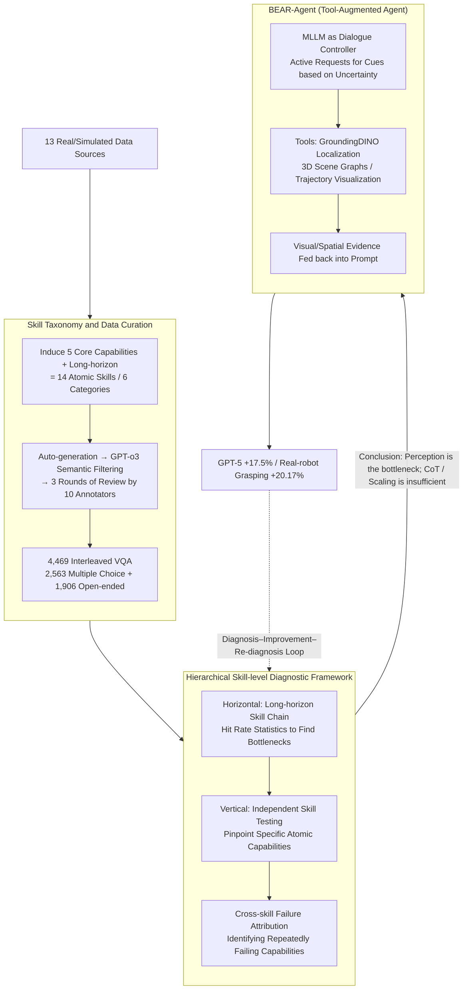

# BEAR: Dissecting Embodied Abilities in Multimodal Language Models through Skill-level Evaluation and Diagnosis

**Conference**: ICML 2026  
**arXiv**: [2510.08759](https://arxiv.org/abs/2510.08759)  
**Code**: https://bear-official66.github.io/ (Available, project homepage + evaluation data)  
**Area**: Multimodal VLM / Embodied Intelligence / Evaluation Benchmark  
**Keywords**: Embodied evaluation, MLLM diagnosis, Skill-level evaluation, Tool-augmented Agent, Long-horizon tasks

## TL;DR
BEAR decomposes embodied tasks into 14 atomic skills and constructs 4,469 interleaved image-video-text VQA pairs. By performing horizontal and vertical skill-level diagnosis on 20 MLLMs, it discovers that perception (rather than reasoning) is the primary bottleneck. Consequently, BEAR-Agent is developed using external visual/spatial tools—such as GroundingDINO, 3D scene graphs, and trajectory visualization—improving GPT-5 performance by 17.5% relative to the baseline and increasing real-robot grasping success by 20.17%.

## Background & Motivation

**Background**: MLLMs are increasingly deployed as embodied agents in simulation and real-world robotics, outputting actions from perception to planning in an end-to-end manner. Existing embodied evaluation benchmarks (e.g., EmbodiedBench, Embodied-Agent-Interface, ALFRED) mostly utilize "overall task success rate" as the sole signal, focusing either on single sub-domains (pointing, spatial) or high-level modular divisions (goal interpretation / subgoal decomposition).

**Limitations of Prior Work**: Task-level evaluations conflate "perception failures" and "planning failures" into a single binary success label. When a model succeeds or fails, it is unclear "at which step" or "why" it occurred, offering little actionable guidance for model improvement. While modular decomposition approaches provide phase-wise success rates, the boundaries remain too coarse to pinpoint specific "perception vs. reasoning" atomic abilities.

**Key Challenge**: A natural misalignment exists between the evaluation granularity (task-level) and the granularity required for improvement (capability-level). Failure attribution must reach the level of underlying atomic skills to inform researchers whether to enhance perception or reasoning.

**Goal**: (1) Evaluate at the atomic skill level; (2) attribute failures explainably to specific capabilities; (3) translate diagnostic conclusions directly into actionable improvement methods.

**Key Insight**: The authors induce five "main lines" of embodied task execution from cognitive science and BEHAVIOR-1K/ALFRED activity trajectories—task planning, spatial reasoning, bounding box localization, pointing interaction, and trajectory movement—plus a long-horizon category to link them. Each step corresponds to an "atomic skill" that covers the human cognitive chain for task execution and can be automatically verified in simulation episodes.

**Core Idea**: To redefine "embodied evaluation" from "task success rate" to "14 atomic skills $\times$ horizontal/vertical diagnosis." This diagnosis is used to derive the improvement path of "augmenting MLLMs with external visual/spatial tools," which is then re-validated on the benchmark, forming a "diagnosis-improvement-re-diagnosis" closed loop.

## Method

### Overall Architecture
BEAR consists of three components: (1) An evaluation dataset with 14 skills across 6 categories, comprising 4,469 interleaved image-video-text VQA pairs from 13 real/simulated sources; (2) A hierarchical diagnostic framework including horizontal long-horizon bottleneck identification, vertical independent skill fine-grained assessment, and cross-skill failure attribution; (3) BEAR-Agent, which utilizes the MLLM as a dialogue controller to invoke Python tools for additional visual/spatial cues.

### Key Designs

**1. Skill Taxonomy and Data Curation: Decomposing Any Embodied Task into 14 Atomic Skills**
Single data sources often lack broad coverage or suffer from data leakage relative to model pre-training. BEAR induces 5 core capabilities—pointing (GEN/SPA/PRT), bounding box (GEN/SPA/PRT), trajectory (gripper/hand/object), task planning (TPR/NAP), and spatial reasoning (LOC/PTH/DIR)—plus long-horizon tasks, totaling 14 atomic skills. Data is sourced specifically for each category: pointing from OpenImages, trajectory from Open-X-Embodiment, and 35 AI2-THOR episodes manually segmented into skill chains. Automated generation is followed by GPT-o3 semantic filtering and at least three rounds of 10-person annotation review, resulting in 2,563 multiple-choice and 1,906 open-ended questions. 

**2. Hierarchical Skill-level Diagnostic Framework: Accurate Failure Attribution**
Task-level evaluations lack granularity. BEAR uses three layers for attribution: **Horizontal** analysis utilizes long-horizon categories where 35 episodes are expanded into chains (e.g., "Put apple in sink" = Planning $\rightarrow$ Searching $\rightarrow$ Path Planning $\rightarrow$ Relative Direction $\rightarrow$ Perception $\rightarrow$ Trajectory) to identify bottlenecks. **Vertical** analysis uses independent tests for single skills to locate failures. Finally, **Cross-skill failure attribution** identifies capabilities that fail repeatedly across different contexts.

**3. BEAR-Agent: Translating Diagnosis into Tool-Augmented Proxies**
Diagnosis indicates that gains from CoT and test-time compute scaling are generally <10%, suggesting the issue is "insufficient perception" rather than "insufficient reasoning." BEAR-Agent implements modular Python functions: GroundingDINO for localization, 3D Scene Graphs for spatial relationships, and Trajectory Visualization to aid motion understanding. The MLLM acts as the controller, requesting specific tool outputs (e.g., "I need the 3D scene graph") during multi-turn interactions. This design requires no weight updates and is plug-and-play for any conversational MLLM.

### Loss & Training
BEAR is an evaluation and agent framework and does not involve model re-training. BEAR-Agent requires no fine-tuning and relies on in-context tool calling. The evaluation protocol follows VLMEvalKit default settings, using Merged or Sequential frame inputs. Success rate is used for pointing/spatial/planning/long-horizon, IoU for bounding box, and an episode is successful only if all steps are correct.

## Key Experimental Results

### Main Results
20 representative MLLMs (including GPT-5, Gemini-2.5-Pro, Claude-4-Sonnet, InternVL3, Qwen2.5-VL) were evaluated. BEAR-mini (40 questions per skill) was used to evaluate 5 human volunteers as a reference.

| Model | Type | Pointing-GEN | Spatial-LOC | Long-horizon | Avg Score |
|------|------|--------------|-------------|--------------|--------|
| Human | Human | 95.50 | 94.50 | 92.50 | 89.40 |
| GPT-5 | Closed | 70.00 | – | – | 52.2 |
| Gemini-2.5-Pro | Closed | 55.00 | – | – | – |
| Claude-4-Sonnet | Closed | 39.12 | 46.25 | – | – |
| InternVL3-8B | Open | 52.65 | 50.16 | 8.57 | 33.32 |
| Qwen2.5-VL-32B | Open | 27.35 | 47.23 | 20.00 | 28.33 |
| Random | Baseline | – | – | 25 | – |

Closed-source models averaged 39.2% (13.4 points higher than open-source), yet even GPT-5 (52.2%) leaves a 37-point gap compared to human performance (89.40%).

### Ablation Study

| Configuration | Key Metric | Description |
|------|---------|------|
| GPT-5 baseline | 52.2% | Direct evaluation |
| GPT-5 + CoT prompt | Gain <10% | Chain-of-Thought typically yields minor improvements |
| GPT-5 + test-time scaling | Gain <10% | Scaling inference compute is equally ineffective |
| GPT-5 + BEAR-Agent | 61.3% (+9.12 abs, +17.5% rel) | Tool augmentation is the only path for significant gains |
| Real-robot grasping + BEAR-Agent | +20.17% | Validated on Cobot Magic tabletop manipulation |

### Key Findings
- Perception (pointing, bbox, trajectory) is the root of most failures; even reasoning-heavy tasks like planning often fail due to the perception layer.
- Spatio-temporal modeling is consistently weak in cross-skill attribution, especially trajectory reasoning for hands, grippers, and objects.
- The gains of BEAR-Agent stem from "providing cues" rather than "enhancing reasoning," confirming the diagnostic conclusion that perception is the primary bottleneck.

## Highlights & Insights
- Upgrades embodied evaluation from binary labels to an explainable capability "radar" via atomic skills and three-layer diagnosis, providing a complete "evaluation-attribution-improvement" paradigm.
- The insight that "perception is the bottleneck while CoT is not a panacea" provides a clear direction: researchers should supplement visual/spatial tools rather than solely stacking reasoning compute.
- The zero-training modification path of BEAR-Agent is highly transferable, guiding actual deployment beyond static benchmarks.

## Limitations & Future Work
- The 14 skills, while broad, do not yet cover complex embodied abilities such as dual-arm coordination, haptics, or social navigation.
- BEAR-Agent tools (GroundingDINO, etc.) are primarily for static vision; dynamic environments or online perception may require further tool development.
- Despite GPT-o3 filtering and human review, ambiguity in embodied video tasks and OOD generalization remain areas for future audit.

## Related Work & Insights
- **vs EmbodiedBench / Embodied-Agent-Interface**: These focus on task or high-level module success, whereas BEAR advances the granularity to the atomic capability level.
- **vs Single-domain benchmarks**: BEAR prevents models from using "tricks" to score high in one area by enforcing a cross-skill evaluation and long-horizon linking.
- **vs OpenVLA / RT-2**: While those focus on "how to act," BEAR focuses on "at which step models fail to understand the world," providing diagnostic insights that can guide data augmentation for VLA training.

## Rating
- Novelty: ⭐⭐⭐⭐ Composes atomic skills, three-layer diagnosis, and tool-augmented Agents into a closed loop.
- Experimental Thoroughness: ⭐⭐⭐⭐⭐ Comprehensive coverage across 20 models, 14 skills, and sim-to-real validation.
- Writing Quality: ⭐⭐⭐⭐ Clear structure and layered diagnostic logic.
- Value: ⭐⭐⭐⭐⭐ Provides the first operational diagnostic benchmark and improvement paradigm for embodied MLLMs.

<!-- RELATED:START -->

## Related Papers

- [\[ICML 2026\] Efficient Skill Grounding via Code Refactoring with Small Language Models](efficient_skill_grounding_via_code_refactoring_with_small_language_models.md)
- [\[ICML 2026\] Embodied Interpretability: Linking Causal Understanding to Generalization in Vision-Language-Action Models](embodied_interpretability_linking_causal_understanding_to_generalization_in_visi.md)
- [\[ICML 2026\] Embodied Task Planning via Graph-Informed Action Generation with Large Language Models](embodied_task_planning_via_graph-informed_action_generation_with_large_language_.md)
- [\[ICML 2026\] Decompose and Recompose: Reasoning New Skills from Existing Abilities for Cross-Task Robotic Manipulation](decompose_and_recompose_reasoning_new_skills_from_existing_abilities_for_cross-t.md)
- [\[CVPR 2026\] HiF-VLA: Hindsight, Insight and Foresight through Motion Representation for Vision-Language-Action Models](../../CVPR2026/robotics/hif-vla_hindsight_insight_and_foresight_through_motion_representation_for_vision.md)

<!-- RELATED:END -->
