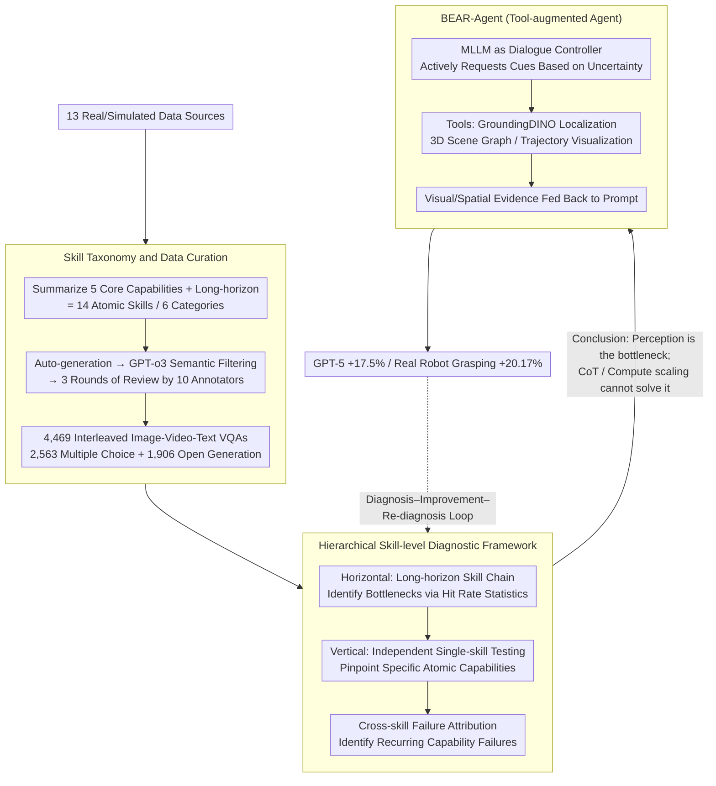

# BEAR: Dissecting Embodied Abilities in Multimodal Language Models through Skill-level Evaluation and Diagnosis

**Conference**: ICML 2026  
**arXiv**: [2510.08759](https://arxiv.org/abs/2510.08759)  
**Code**: https://bear-official66.github.io/ (Available, project homepage + evaluation data)  
**Area**: Multimodal VLM / Embodied AI / Benchmarking  
**Keywords**: Embodied Evaluation, MLLM Diagnosis, Skill-level Assessment, Tool-augmented Agent, Long-horizon Tasks

## TL;DR
BEAR decomposes embodied tasks into 14 atomic skills and constructs 4,469 interleaved image-video-text VQAs. By performing skill-level horizontal and vertical diagnoses on 20 MLLMs, it identifies perception (rather than reasoning) as the primary bottleneck. Based on this, BEAR-Agent is developed using external visual/spatial tools such as GroundingDINO, 3D scene graphs, and trajectory visualization, achieving a 17.5% relative improvement for GPT-5 on the benchmark and a 20.17% gain in real-world robot grasping.

## Background & Motivation

**Background**: MLLMs are increasingly deployed as embodied agents in simulation and real-world robotics, providing a pipeline from perception to planning and action output. Existing embodied benchmarks (e.g., EmbodiedBench, Embodied-Agent-Interface, ALFRED) mostly rely on "overall task success rate" as the sole signal, focusing either on single sub-domains (pointing, spatial) or high-level modules (goal interpretation / subgoal decomposition).

**Limitations of Prior Work**: Task-level evaluation conflates "perception failure" with "planning failure" into a binary success label. When a model succeeds or fails, it is unclear "at which step and why" it failed, making these evaluations nearly unactionable for model improvement. While modular decomposition provides stage-wise success rates, the module boundaries remain too coarse to pinpoint specific "perception/reasoning" atomic capabilities.

**Key Challenge**: There is an inherent mismatch between the evaluation granularity (task-level) and the granularity required for improvement (capability-level). Only by attributing failures to underlying atomic capabilities can researchers determine whether to "complement perception" or "strengthen reasoning."

**Goal**: (1) Evaluate at the atomic skill level; (2) Attribute failures to specific capabilities in an interpretable manner; (3) Directly translate diagnostic conclusions into actionable improvement methods.

**Key Insight**: The authors summarize five "main threads" of embodied task execution from cognitive science and household activity trajectories in BEHAVIOR-1K/ALFRED: task planning, spatial reasoning, bounding box coarse localization, pointing fine interaction, and trajectory movement—plus a long-horizon component to link them. Each step corresponds to an "atomic skill," covering the cognitive chain of human task execution while allowing for automatic verification on simulation episodes.

**Core Idea**: Rewrite "embodied evaluation" from "task success rate" to "14 atomic skills × horizontal/vertical diagnosis." Use the diagnostic findings to derive an improvement path of "plugging external visual/spatial tools into MLLMs," and validate these improvements back on the benchmark at the skill level, forming a "diagnosis–improvement–re-diagnosis" closed loop.

## Method

### Overall Architecture
BEAR consists of three parts: (1) An evaluation dataset of 14 skills across 6 categories, featuring 4,469 interleaved image-video-text VQAs from 13 real/simulated sources; (2) A hierarchical diagnostic framework comprising "horizontal long-horizon bottleneck identification + vertical independent skill fine-grained assessment + cross-skill failure attribution"; (3) BEAR-Agent, which uses the MLLM as a dialogue controller to call a set of Python tools on demand, feeding additional visual/spatial cues back into the prompt. These components form a loop: "data curation → skill-level diagnosis → tool augmentation → re-diagnosis on benchmark."

### Key Designs

**1. Skill Taxonomy and Data Curation: Decomposing Any Embodied Task into 14 Atomic Skills**
Single data sources often cover only one capability and are prone to data leakage from pre-training distributions. BEAR summarizes 5 core capabilities from cognitive science and BEHAVIOR-1K/ALFRED: pointing (GEN/SPA/PRT levels), bounding box (GEN/SPA/PRT), trajectory (gripper/human hand/object), task planning (TPR/NAP), and spatial reasoning (LOC/PTH/DIR)—plus long-horizon tasks, totaling 14 atomic skills. Data is sourced specifically for each category: pointing uses OpenImages, trajectory uses Open-X-Embodiment, and long-horizon tasks collect 35 episodes from AI2-THOR, manually sliced into skill chains. A total of 13 sources are used. After auto-generation, GPT-o3 performs semantic filtering, followed by three rounds of review by 10 annotators, resulting in 2,563 multiple-choice and 1,906 open-ended questions. Multi-source and multi-modal (image/video/interleaved) data forces models to follow authentic "perception-reasoning" paths.

**2. Hierarchical Skill-level Diagnostic Framework: Precise Failure Attribution**
Task-level evaluations mix perception and planning errors into a 0/1 label. BEAR uses three layers for attribution: **Horizontal** diagnosis uses the long-horizon category, unfolding 35 episodes as chains of 5 core skills (e.g., "put apple in sink" = planning → search → path planning → relative direction → visual perception → trajectory placement) to find bottleneck skills. **Vertical** diagnosis uses independent single-skill tests to pinpoint failure to a specific capability. Finally, **Cross-skill failure attribution** identifies capabilities that fail repeatedly across different contexts. This tells the researcher whether "spatial reasoning" fails in long-range tasks, if the failure is specifically "path planning" or "relative direction," and if it stems from underlying issues like depth perception.

**3. BEAR-Agent: Translating Diagnostics into Tool-Augmented Proxies**
Diagnostics reveal that CoT and test-time compute scaling gains are generally $<10\%$, indicating the problem is "poor vision" rather than "insufficient thinking." BEAR-Agent implements tools as modular Python functions: GroundingDINO for object localization, a 3D scene graph for spatial relationships, and trajectory visualization to overlay actions on images. The MLLM acts as a controller, requesting cues like "I want to see the 3D scene graph" or "I need a bbox" based on its uncertainty. The results are fed back into the next prompt. This design requires no weight updates and is plug-and-play for any conversational MLLM.

### Loss & Training
BEAR is an evaluation and agent framework and does not involve model retraining. BEAR-Agent is based on in-context tool calling without fine-tuning. Evaluation protocols follow VLMEvalKit defaults, choosing Merged (stitching frames into one image) or Sequential (per-frame) inputs. Success rate is used for pointing/spatial/planning/long-horizon; IoU is used for bounding box. Long-horizon success requires all steps in an episode to be correct.

## Key Experimental Results

### Main Results
20 representative MLLMs (including GPT-5, Gemini-2.5-Pro, Claude-4-Sonnet, InternVL3, Qwen2.5-VL) were evaluated. BEAR-mini (40 questions per skill) was used for 5 human volunteers as a reference.

| Model | Type | Pointing-GEN | Spatial-LOC | Long-horizon | Total Avg |
| :--- | :--- | :--- | :--- | :--- | :--- |
| Human | Human | 95.50 | 94.50 | 92.50 | 89.40 |
| GPT-5 | Closed | 70.00 | – | – | 52.2 |
| Gemini-2.5-Pro | Closed | 55.00 | – | – | – |
| Claude-4-Sonnet| Closed | 39.12 | 46.25 | – | – |
| InternVL3-8B | Open | 52.65 | 50.16 | 8.57 | 33.32 |
| Qwen2.5-VL-32B | Open | 27.35 | 47.23 | 20.00 | 28.33 |
| Random | Baseline | – | – | 25 | – |

Closed-source models averaged 39.2%, outperforming open-source by 13.4 points. The strongest model, GPT-5, achieved 52.2%, still 37 points behind the human score of 89.40%.

### Ablation Study
| Configuration | Key Metric | Description |
| :--- | :--- | :--- |
| GPT-5 baseline | 52.2% | Direct evaluation |
| GPT-5 + CoT prompt | Gain <10% | CoT generally provides minimal improvement |
| GPT-5 + test-time scaling | Gain <10% | Increasing inference compute also shows little effect |
| GPT-5 + BEAR-Agent | 61.3% (+9.12 abs, +17.5% rel) | Tool augmentation is the only path for major gains |
| Real robot + BEAR-Agent | +20.17% | Verified on Cobot Magic for tabletop manipulation |

### Key Findings
- Perception (pointing, bbox, trajectory) is the root cause of most failures. Even "reasoning-heavy" tasks like planning and spatial reasoning fail primarily at the perception layer.
- Spatio-temporal modeling fails repeatedly in cross-skill attribution, particularly trajectory reasoning (hand/gripper/object). CoT and scaling cannot mitigate these errors.
- BEAR-Agent gains come from "restoring cues" rather than "improving reasoning," closing the loop with diagnostic findings.

## Highlights & Insights
- Decouples embodied evaluation into an interpretable capability radar via "atomic skills × three-layer diagnosis," providing a missing "evaluate-attribute-improve" paradigm.
- Diagnostic findings ("perception is the bottleneck, CoT cannot help") are counter-intuitive but data-backed, falsifying the assumption that "more reasoning" is the solution for embodied tasks.
- The BEAR-Agent zero-shot transformation path is highly practical: identify weaknesses via fine-grained evaluation, hook up target tools, and quantify improvement—an engineering-friendly closed loop.

## Limitations & Future Work
- While 14 skills are broad, they reflect the "authors' summarized cognitive chain" and lack support for dual-arm coordination, force/tactile sensing, or social navigation. Real-robot validation is limited to tabletop manipulation.
- BEAR-Agent tools (GroundingDINO, etc.) are mostly for static vision and may not suffice for dynamic or online perception. Tool scheduling relies on the MLLM's internal judgment without explicit tool-planning loss.
- Despite human review, ambiguity in embodied video tasks remains high, and OOD generalization requires further auditing.

## Related Work & Insights
- **vs EmbodiedBench / Embodied-Agent-Interface**: These focus on task-level or module-level success. BEAR advances the granularity to the atomic capability level.
- **vs Single-domain benchmarks (pointing/spatial)**: These allow models to exploit local tricks. BEAR's 14-skill coverage forces models to expose all weaknesses in a unified framework.
- **vs OpenVLA / RT-2**: While VLA models focus on "how to act," BEAR focuses on "at which step the model fails to understand the world." BEAR's diagnostics can guide data augmentation for VLA training.

## Rating
- Novelty: ⭐⭐⭐⭐ Combination of "atomic skills × three-layer diagnosis × tool-augmented Agent" is a rare diagnosis-driven improvement approach.
- Experimental Thoroughness: ⭐⭐⭐⭐⭐ 20 models × 14 skills × sim/real robot validation is very solid.
- Writing Quality: ⭐⭐⭐⭐ Clear structure and layered diagnostic logic.
- Value: ⭐⭐⭐⭐⭐ Provides the first actionable diagnostic benchmark and improvement paradigm for embodied MLLMs.

<!-- RELATED:START -->

## Related Papers

- [\[ICML 2026\] Embodied Interpretability: Linking Causal Understanding to Generalization in Vision-Language-Action Models](embodied_interpretability_linking_causal_understanding_to_generalization_in_visi.md)
- [\[ICML 2026\] Embodied Task Planning via Graph-Informed Action Generation with Large Language Models](embodied_task_planning_via_graph-informed_action_generation_with_large_language_.md)
- [\[ICML 2026\] Decompose and Recompose: Reasoning New Skills from Existing Abilities for Cross-Task Robotic Manipulation](decompose_and_recompose_reasoning_new_skills_from_existing_abilities_for_cross-t.md)
- [\[CVPR 2026\] HiF-VLA: Hindsight, Insight and Foresight through Motion Representation for Vision-Language-Action Models](../../CVPR2026/robotics/hif-vla_hindsight_insight_and_foresight_through_motion_representation_for_vision.md)
- [\[ICML 2026\] Contrastive Representation Regularization for Vision-Language-Action Models](contrastive_representation_regularization_for_vision-language-action_models.md)

<!-- RELATED:END -->
